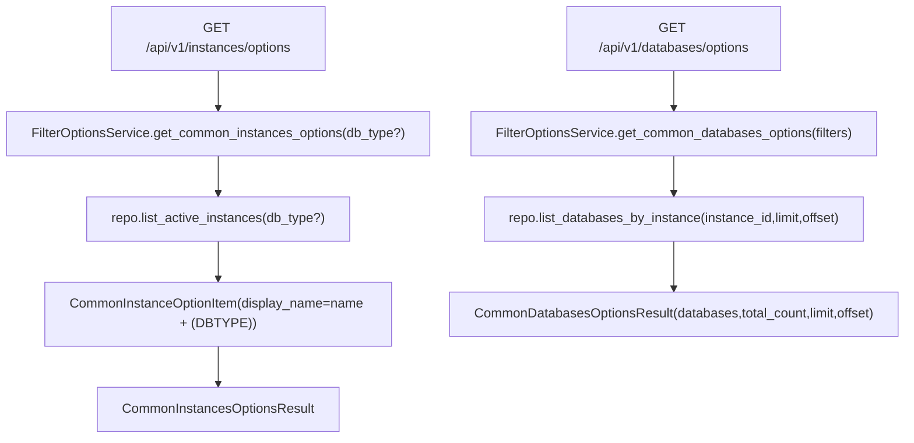

# Filter Options Service(通用筛选器选项)

> [!note] 本文目标
> 说明 `FilterOptionsService` 如何统一各页面复用的下拉/筛选 options, 以及 common options endpoints 的输出 schema.

## 1. 概览(Overview)

覆盖文件:

- `app/services/common/filter_options_service.py`
- repository: `app/repositories/filter_options_repository.py`
- builder utils: `app/utils/query_filter_utils.py` (build_*_options)

核心入口:

- Tag/classification options:
  - `list_active_tag_options()`
  - `list_tag_categories()`
  - `list_classification_options()`
- Select options:
  - `list_instance_select_options(db_type?)`
  - `list_database_select_options(instance_id)`
- Common APIs:
  - `get_common_instances_options(db_type?)`
  - `get_common_databases_options(filters)`
  - `get_common_database_types_options()`

## 2. 依赖与边界(Dependencies)

| 类型 | 组件 | 用途 | 失败语义(摘要) |
| --- | --- | --- | --- |
| Repo | `FilterOptionsRepository` | 只读查询(active tags/instances/databases/classifications) | DB 异常由 repo 抛出 |
| Builders | `build_*_options` | 将 ORM rows 转为 `{value,text}` 等结构 | - |
| Const | `DatabaseType.RELATIONAL` | db_type options | - |

## 3. 事务与失败语义(Transaction + Failure Semantics)

- 读服务, 不做 commit.
- service 不捕获异常; 依赖 route/repo 统一处理.

## 4. 主流程图(Flow)

## 5. 决策表/规则表(Decision Table)

### 5.1 instances.options display_name

| 字段 | 规则 |
| --- | --- |
| display_name | `f\"{name} ({db_type.upper()})\"` |

实现位置: `app/services/common/filter_options_service.py:78`.

## 6. 兼容/防御/回退/适配逻辑

| 位置(文件:行号) | 类型 | 描述 | 触发条件 | 清理条件/期限 |
| --- | --- | --- | --- | --- |
| `app/services/common/filter_options_service.py:36` | 防御 | `repository or FilterOptionsRepository()` 兜底 | 调用方未注入 | 若统一 DI, 改为强制注入 |
| `app/services/common/filter_options_service.py:111` | 兼容 | `int(getattr(...,0) or 0)` 兜底 | ORM row 字段缺失/None | 若 repo 输出 schema 固定, 可收敛 |

## 7. 测试与验证(Tests)

最小验证命令:

- `uv run pytest -m unit tests/unit/routes/test_api_v1_common_options_contract.py`
