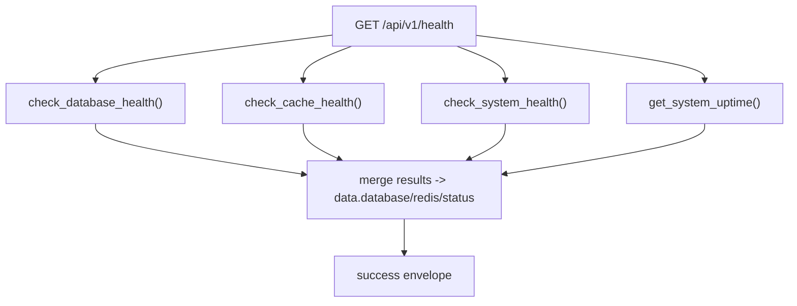

# Health Checks Service(基础探活/基础设施健康)

> [!note] 本文目标
> 说明 health endpoints 使用的探活实现: ping/basic/health, 以及 DB/cache/system 检查失败时的降级返回结构.

## 1. 概览(Overview)

覆盖文件:

- `app/services/health/health_checks_service.py`

核心入口(均返回 dict, 不抛异常到调用方):

- `check_ping() -> {status:"ok"}`
- `get_basic_health(version=APP_VERSION) -> {status,timestamp,version}`
- `check_database_health() -> {healthy,status,response_time_ms,...}`
- `check_cache_health() -> {healthy,status,response_time_ms,...}`
- `check_system_health() -> {healthy,status,cpu_percent,memory_percent,disk_percent,...}`
- `get_system_uptime() -> str`

## 2. 依赖与边界(Dependencies)

| 类型 | 组件 | 用途 | 失败语义(摘要) |
| --- | --- | --- | --- |
| Repo | `HealthRepository.ping_database()` | DB 探活 | 异常 -> healthy=false + error |
| Cache | `cache.set/get` | cache 探活 | 异常 -> healthy=false + error |
| System | `psutil` | CPU/mem/disk | 异常 -> healthy=false + status=error |
| Logs | `log_with_context` | 记录 warning | 不影响返回 |

## 3. 事务与失败语义(Transaction + Failure Semantics)

- 所有检查函数均为 best-effort:
  - 捕获异常并返回 `{healthy: false, error: "...", status: ...}`.
  - 不抛出 AppError/ValidationError.
- `get_system_uptime` 异常 -> 返回 "未知".

## 4. 主流程图(Flow)

## 5. 决策表/规则表(Decision Table)

### 5.1 system health threshold

| 指标 | healthy 条件 |
| --- | --- |
| cpu_percent | `< RESOURCE_USAGE_THRESHOLD` |
| memory_percent | `< RESOURCE_USAGE_THRESHOLD` |
| disk_percent | `< RESOURCE_USAGE_THRESHOLD` |

实现位置: `app/services/health/health_checks_service.py:77`.

## 6. 兼容/防御/回退/适配逻辑

| 位置(文件:行号) | 类型 | 描述 | 触发条件 | 清理条件/期限 |
| --- | --- | --- | --- | --- |
| `app/services/health/health_checks_service.py:36` | 防御 | check_database_health 捕获异常并返回 healthy=false | DB 不可用 | 若要对外区分错误类型, 增加 error_code 并补用例 |
| `app/services/health/health_checks_service.py:57` | 防御 | check_cache_health 捕获异常并返回 healthy=false | cache 不可用 | 同上 |
| `app/services/health/health_checks_service.py:78` | 防御 | check_system_health 捕获异常并返回 status=error | psutil 异常/权限问题 | 若生产环境无法读指标, 可按配置禁用 |
| `app/services/health/health_checks_service.py:115` | 防御 | get_system_uptime 异常返回 "未知" | app_start_time 或 tz 异常 | 若需强一致 uptime, 改为硬失败并补测试 |

## 7. 可观测性(Logs + Metrics)

- DB/cache/system 失败均输出 warning log, action 分别为:
  - `check_database_health`
  - `check_cache_health`
  - `check_system_health`

## 8. 测试与验证(Tests)

最小验证命令:

- `uv run pytest -m unit tests/unit/routes/test_api_v1_health_ping_contract.py`
- `uv run pytest -m unit tests/unit/routes/test_api_v1_health_extended_contract.py`
