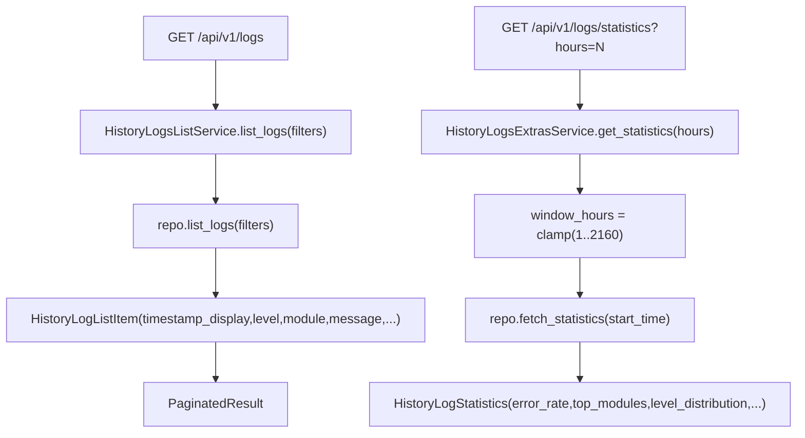

# History Logs Services(日志列表/统计/模块/详情)

> [!note] 本文目标
> 把 unified_logs 的 4 个 read API service 写清: list, statistics, modules, detail, 并明确 hours 参数的 clamp 规则.

## 1. 概览(Overview)

覆盖文件:

- `app/services/history_logs/history_logs_list_service.py`
- `app/services/history_logs/history_logs_extras_service.py`
- repository: `app/repositories/history_logs_repository.py`

核心入口:

- `HistoryLogsListService.list_logs(filters) -> PaginatedResult[HistoryLogListItem]`
- `HistoryLogsExtrasService.list_modules() -> list[str]`
- `HistoryLogsExtrasService.get_statistics(hours) -> HistoryLogStatistics`
- `HistoryLogsExtrasService.get_log_detail(log_id) -> HistoryLogListItem`

## 2. 依赖与边界(Dependencies)

| 类型 | 组件 | 用途 | 失败语义(摘要) |
| --- | --- | --- | --- |
| Repo | `HistoryLogsRepository` | list/log/detail/statistics/modules 查询 | DB 异常由 repo 抛出 |
| Time | `time_utils.to_china/format_china_time` | timestamp 展示 | None -> "-" |

## 3. 事务与失败语义(Transaction + Failure Semantics)

- 读服务, 不做 commit.
- hours 参数:
  - service 内 clamp 为 `1..(24*90)`.

## 4. 主流程图(Flow)

## 5. 决策表/规则表(Decision Table)

### 5.1 hours clamp

| 输入 hours | 输出 window_hours |
| --- | --- |
| < 1 | 1 |
| 1..2160 | int(hours) |
| > 2160 | 2160 |

实现位置: `app/services/history_logs/history_logs_extras_service.py:26`.

## 6. 兼容/防御/回退/适配逻辑

| 位置(文件:行号) | 类型 | 描述 | 触发条件 | 清理条件/期限 |
| --- | --- | --- | --- | --- |
| `app/services/history_logs/history_logs_list_service.py:22` | 防御 | `repository or HistoryLogsRepository()` 兜底 | 调用方未注入 | 若统一 DI, 改为强制注入 |
| `app/services/history_logs/history_logs_list_service.py:30` | 兼容 | timestamp None -> "-" | 历史日志缺 timestamp | 若 schema 强约束, 可收敛 |
| `app/services/history_logs/history_logs_extras_service.py:21` | 防御 | `repository or HistoryLogsRepository()` 兜底 | 调用方未注入 | 同上 |

## 7. 测试与验证(Tests)

最小验证命令:

- `uv run pytest -m unit tests/unit/routes/test_api_v1_history_logs_contract.py`
