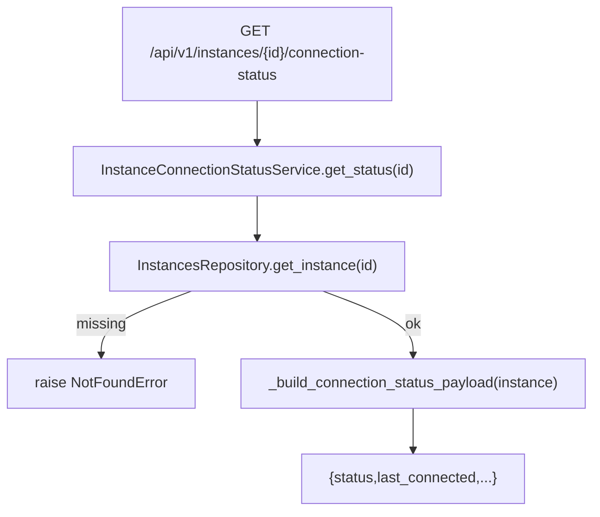

# Instance Connection Status Service(连接状态推断)

> [!note] 本文目标
> 说明 `InstanceConnectionStatusService.get_status` 如何基于 `last_connected` 推断连接健康状态, 以及 last_connected 的兼容处理(datetime/iso str).

## 1. 概览(Overview)

覆盖文件:

- `app/services/connections/instance_connection_status_service.py`
- repository: `app/repositories/instances_repository.py`

核心入口:

- `get_status(instance_id) -> JsonDict`

## 2. 事务与失败语义(Transaction + Failure Semantics)

- 读服务, 不做 commit.
- instance 不存在 -> NotFoundError("实例不存在").

## 3. 主流程图(Flow)

## 4. 决策表/规则表(Decision Table)

### 4.1 status 推断

| last_connected | delta | status |
| --- | --- | --- |
| None/空 | - | unknown |
| < 1 hour | `< 1h` | good |
| < 1 day | `< 24h` | warning |
| 其他 | `>= 24h` | poor |

实现位置: `app/services/connections/instance_connection_status_service.py:46`.

## 5. 兼容/防御/回退/适配逻辑

| 位置(文件:行号) | 类型 | 描述 | 触发条件 | 清理条件/期限 |
| --- | --- | --- | --- | --- |
| `app/services/connections/instance_connection_status_service.py:21` | 防御 | `repository or InstancesRepository()` 兜底 | 调用方未注入 | 若统一 DI, 改为强制注入 |
| `app/services/connections/instance_connection_status_service.py:35` | 兼容 | last_connected 支持 datetime 或 iso str | 历史数据格式不一 | 若统一为 datetime, 可收敛解析分支 |
| `app/services/connections/instance_connection_status_service.py:41` | 兼容 | naive datetime 自动补 tzinfo | tz 丢失 | 若统一存储 tz-aware, 可收敛 |

## 6. 测试与验证(Tests)

最小验证命令:

- `uv run pytest -m unit tests/unit/routes/test_api_v1_connections_contract.py`
