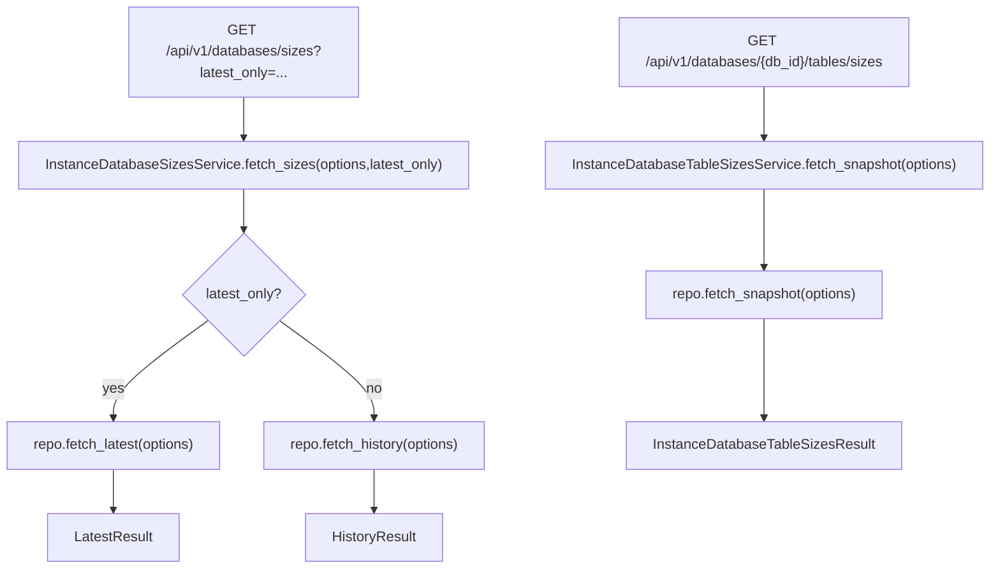

# Instance Database Sizes Services(容量历史/表容量快照查询)

> [!note] 本文目标
> 说明实例详情页相关的容量读接口: database sizes(最新/历史)与 table sizes snapshot.

## 1. 概览(Overview)

覆盖文件:

- `app/services/instances/instance_database_sizes_service.py`
- `app/services/instances/instance_database_table_sizes_service.py`
- repositories:
  - `app/repositories/instance_database_sizes_repository.py`
  - `app/repositories/instance_database_table_sizes_repository.py`

核心入口:

- `InstanceDatabaseSizesService.fetch_sizes(options, latest_only=bool)`
- `InstanceDatabaseTableSizesService.fetch_snapshot(options)`

## 2. 事务与失败语义(Transaction + Failure Semantics)

- 读服务, 不做 commit.
- service 不捕获异常; DB/not found 由 repo/route 层处理.

## 3. 主流程图(Flow)

## 4. 兼容/防御/回退/适配逻辑

| 位置(文件:行号) | 类型 | 描述 | 触发条件 | 清理条件/期限 |
| --- | --- | --- | --- | --- |
| `app/services/instances/instance_database_sizes_service.py:21` | 防御 | `repository or InstanceDatabaseSizesRepository()` 兜底 | 调用方未注入 | 若统一 DI, 改为强制注入 |
| `app/services/instances/instance_database_table_sizes_service.py:21` | 防御 | `repository or InstanceDatabaseTableSizesRepository()` 兜底 | 调用方未注入 | 同上 |

## 5. 测试与验证(Tests)

最小验证命令:

- `uv run pytest -m unit tests/unit/routes/test_api_v1_instances_contract.py`
