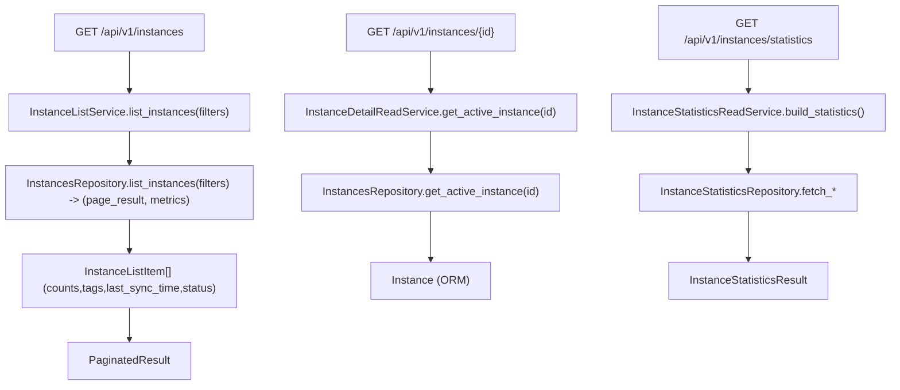

# Instances Read Services(列表/详情/统计)

> [!note] 本文目标
> 说明 instances 读链路 service 如何把 repository/统计查询转换为稳定 DTO, 以及 status/version 的展示规则.

## 1. 概览(Overview)

覆盖文件:

- `app/services/instances/instance_list_service.py`
- `app/services/instances/instance_detail_read_service.py`
- `app/services/instances/instance_statistics_read_service.py`
- repositories:
  - `app/repositories/instances_repository.py`
  - `app/repositories/instance_statistics_repository.py`

核心入口:

- `InstanceListService.list_instances(filters) -> PaginatedResult[InstanceListItem]`
- `InstanceDetailReadService.get_active_instance(instance_id) -> Instance`
- `InstanceStatisticsReadService.build_statistics() -> InstanceStatisticsResult`

## 2. 事务与失败语义(Transaction + Failure Semantics)

- 读服务, 不做 commit.
- service 大多不捕获异常; not found/DB 异常由 repo/route 层统一处理.

## 3. 主流程图(Flow)

## 4. 决策表/规则表(Decision Table)

### 4.1 InstanceListItem.status

| 条件 | status |
| --- | --- |
| `instance.deleted_at` 非空 | deleted |
| 否则且 `instance.is_active=true` | active |
| 否则 | inactive |

实现位置: `app/services/instances/instance_list_service.py:35`.

### 4.2 InstanceStatisticsReadService: version fallback

| main_version | version 展示 |
| --- | --- |
| None/空 | "未知版本" |
| 其他 | 原值 |

实现位置: `app/services/instances/instance_statistics_read_service.py:49`.

## 5. 兼容/防御/回退/适配逻辑

| 位置(文件:行号) | 类型 | 描述 | 触发条件 | 清理条件/期限 |
| --- | --- | --- | --- | --- |
| `app/services/instances/instance_list_service.py:19` | 防御 | `repository or InstancesRepository()` 兜底 | 调用方未注入 | 若统一 DI, 改为强制注入 |
| `app/services/instances/instance_statistics_read_service.py:27` | 防御 | `repository or InstanceStatisticsRepository()` 兜底 | 调用方未注入 | 同上 |
| `app/services/instances/instance_list_service.py:49` | 兼容 | last_sync_time None -> null | 从未同步 | 若要 UI 区分, 保持现状 |

## 6. 测试与验证(Tests)

最小验证命令:

- `uv run pytest -m unit tests/unit/routes/test_api_v1_instances_contract.py`
