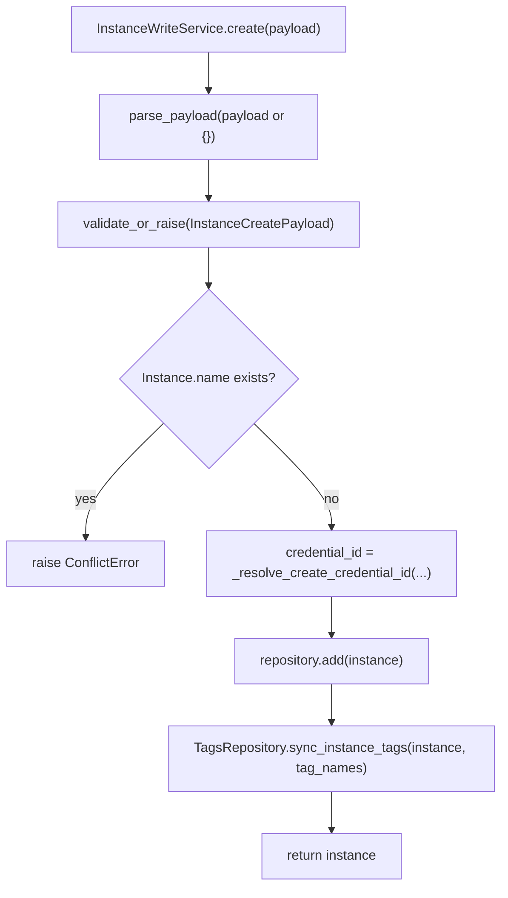
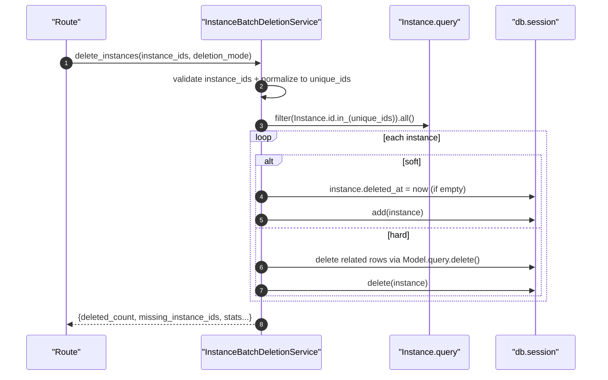

# Instances Write + Batch(实例写操作/批量创建删除)

> [!note] 本文目标
> 覆盖实例写入域的两条链路：单条 CRUD 编排(`InstanceWriteService`)与批量创建/删除(`InstanceBatch*Service`)；明确“无 commit”的事务边界、软/硬删除语义，以及入参兼容/兜底点（特别是 `or` 兜底与 batch 的“继续执行”策略）。

## 1. 概览(Overview)

覆盖文件：

- 单实例写操作：`app/services/instances/instance_write_service.py`
- 批量创建/删除：`app/services/instances/batch_service.py`

核心入口：

- `InstanceWriteService.create(payload, operator_id=None)`（`app/services/instances/instance_write_service.py:51`）
- `InstanceWriteService.update(instance_id, payload, ...)`（`app/services/instances/instance_write_service.py:99`）
- `InstanceWriteService.soft_delete(instance_id, ...)` / `restore(instance_id, ...)`
- `InstanceBatchCreationService.create_instances(instances_data, operator_id=None)`（`app/services/instances/batch_service.py:60`）
- `InstanceBatchDeletionService.delete_instances(instance_ids, deletion_mode="hard")`（`app/services/instances/batch_service.py:226`）

持久化影响（按语义）：

- create/update：写 `instances`，并同步 tag 关联（`TagsRepository.sync_instance_tags`）
- soft delete：写 `instances.deleted_at`
- hard delete：级联清理实例相关的权限/同步/统计/聚合/tag link 等（见 `_delete_single_instance`）

## 2. 依赖与边界(Dependencies)

| 类型 | 组件 | 用途 | 失败语义(摘要) |
| --- | --- | --- | --- |
| Payload | `parse_payload` + `validate_or_raise` | payload 归一化 + schema 校验 | 校验失败 -> `ValidationError` |
| Repo | `InstancesRepository` | get/add/delete 封装 | 找不到 -> NotFound/404（由 repo 决定） |
| Repo | `TagsRepository` | 同步实例 tags | 同步失败由上层异常传播（若发生） |
| DB | `db.session.add/delete/flush` | 写入但不 commit | commit 在 route/task 层 |

## 3. 事务与失败语义(Transaction + Failure Semantics)

- **统一约束**：这些 service 不 commit。`safe_route_call` 或任务层负责 commit/rollback。
- **单实例写操作**：
  - 名称冲突：抛 `ConflictError`（create/update）。`app/services/instances/instance_write_service.py:70`、`app/services/instances/instance_write_service.py:120`
  - 凭据校验：credential 不存在 -> `ValidationError`。`app/services/instances/instance_write_service.py:116`
  - soft delete：如果已删除则不重复写时间戳。`app/services/instances/instance_write_service.py:160`
  - restore：未删除时返回 `restored=False`（不抛）。`app/services/instances/instance_write_service.py:178`
- **批量创建**：
  - 校验失败的 item 进入 `errors[]`，其余继续创建（部分成功）。`app/services/instances/batch_service.py:126`
  - DB 异常：抛 `SystemError`（硬失败）。`app/services/instances/batch_service.py:121`
- **批量删除**：
  - 入参为空/模式非法/ID 不可转换：抛 `ValidationError`（硬失败，未进入删除）。`app/services/instances/batch_service.py:269`
  - soft：仅更新 `deleted_at`（可恢复）；hard：级联删除关联数据（不可恢复）。`app/services/instances/batch_service.py:292`
  - missing_instance_ids：返回结果中透出（不抛）。`app/services/instances/batch_service.py:284`

## 4. 主流程图(Flow)

## 5. 时序图(Sequence)

## 6. 决策表/规则表(Decision Table)

### 6.1 删除模式(deletion_mode)

| deletion_mode | 行为 | 可恢复 | 影响范围 |
| --- | --- | --- | --- |
| `soft` | 仅设置 `instances.deleted_at` | 是 | 不删除关联数据 |
| `hard` | 删除实例及关联数据 | 否 | 删除权限/同步/容量统计/聚合/tag link 等 |

实现位置：`app/services/instances/batch_service.py:292`、`app/services/instances/batch_service.py:337`。

### 6.2 update：字段写入是否“按字段集”生效

| 字段 | 规则 | 说明 |
| --- | --- | --- |
| `credential_id/description/database_name` | 仅当在 `model_fields_set` 中出现才写入 | 支持 PATCH 语义 |

实现位置：`app/services/instances/instance_write_service.py:115`、`app/services/instances/instance_write_service.py:129`。

## 7. 兼容/防御/回退/适配逻辑

| 位置(文件:行号) | 类型 | 描述 | 触发条件 | 清理条件/期限 |
| --- | --- | --- | --- | --- |
| `app/services/instances/instance_write_service.py:49` | 防御 | `repository or InstancesRepository()` 注入兜底 | 未显式注入 repo | 若统一采用依赖注入容器，可移除隐式构造 |
| `app/services/instances/instance_write_service.py:54` | 防御 | `payload or {}` 兜底，避免 None | route 传 None | 若 route 强约束 payload 非空，可简化 |
| `app/services/instances/instance_write_service.py:133` | 兼容 | `instance.description = params.description or ""` 兜底空字符串 | 前端传 null/空 | 若 DB 允许 NULL 且 UI 区分空/无，可改为 None |
| `app/services/instances/instance_write_service.py:150` | 防御 | `str(instance.db_type) if instance.db_type else None` 避免日志字段异常 | db_type 为空 | 强约束 db_type 后可收敛 |
| `app/services/instances/instance_write_service.py:178` | 防御 | restore：未删除直接 `restored=False`（不抛） | 重复恢复 | 若希望提示用户“无需恢复”，可改为业务错误码 |
| `app/services/instances/batch_service.py:199` | 兼容 | `payload.description or None`：把空描述归一为 None | 批量 payload 为空字符串 | 若要保留空字符串，可移除兜底 |
| `app/services/instances/batch_service.py:202` | 防御 | 单条 payload 构造 Instance 失败 -> 记录 errors 并继续 | 个别条目非法 | 若要求批量原子性，改为失败即中断 |
| `app/services/instances/batch_service.py:278` | 防御 | `unique_ids = sorted({int(i) for i in instance_ids})` 归一化并去重 | 输入包含 str/int 混合 | 若 route 强约束为 int 列表，可移除类型兼容 |
| `app/services/instances/batch_service.py:293` | 防御 | soft delete：若已有 `deleted_at` 不重复覆盖 | 多次软删除 | 若需要记录多次操作，改为写审计日志 |
| `app/services/instances/batch_service.py:396` | 防御 | `tag_delete_result.rowcount or 0` 兜底 | rowcount 为 None | 若 DBAPI 总有 rowcount，可简化 |

## 8. 可观测性(Logs + Metrics)

- 单实例：`创建数据库实例` / `更新数据库实例` / `移入回收站`（module=`instances`）`app/services/instances/instance_write_service.py:87`、`app/services/instances/instance_write_service.py:144`
- 批量：`batch_create_instance` / `batch_delete_instance` / `batch_soft_delete_instance` `app/services/instances/batch_service.py:208`、`app/services/instances/batch_service.py:314`

## 9. 测试与验证(Tests)

最小验证命令：

- `uv run pytest -m unit tests/unit/routes/test_api_v1_instances_batch_contract.py`

关键用例：

- batch_create：部分 payload 无效仍返回 created_count + errors[]
- batch_delete：输入 ID 混合类型可归一化；missing_instance_ids 出现在返回结构
- soft vs hard：软删可恢复；硬删级联删除关联表
