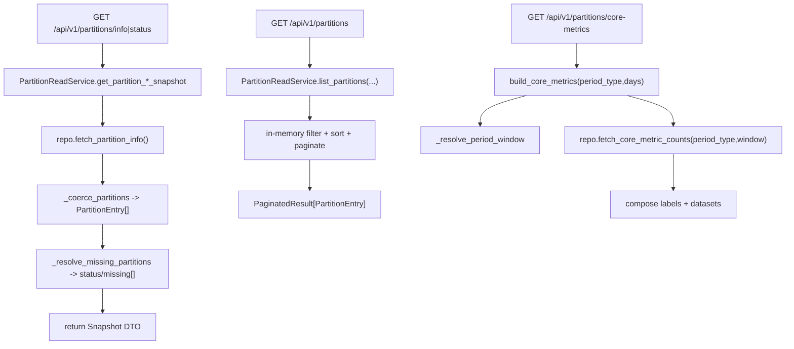

# Partition Read/Statistics Services(分区 info/list/core-metrics)

> [!note] 本文目标
> 覆盖分区 read APIs: info/status/list/core-metrics, 以及 PartitionStatisticsService 的 statistics 输出.

## 1. 概览(Overview)

覆盖文件:

- `app/services/partition/partition_read_service.py`
- `app/services/statistics/partition_statistics_service.py`
- repository: `app/repositories/partition_repository.py`

核心入口:

- `PartitionReadService.get_partition_info_snapshot()`
- `PartitionReadService.get_partition_status_snapshot()`
- `PartitionReadService.list_partitions(search/table_type/status/sort/order/page/limit)`
- `PartitionReadService.build_core_metrics(period_type, days)`
- `PartitionStatisticsService.get_partition_statistics()`

不在本服务组做的事:

- 分区创建/清理写入能力见 `[[reference/service/partition-services]]`.

## 2. 事务与失败语义(Transaction + Failure Semantics)

- 全部为读服务, 不做 commit.
- PartitionReadService:
  - repository 异常统一 `except Exception`:
    - `log_error(...)`
    - raise `SystemError("<中文提示>")`
  - period_type 非法 -> `ValidationError("不支持的周期类型")`.
- PartitionStatisticsService:
  - 继承 `PartitionManagementService`, 复用其 `tables` 配置与 `_get_table_partitions` 等逻辑.

## 3. 主流程图(Flow)

## 4. 决策表/规则表(Decision Table)

### 4.1 period_type valid set

| 输入 | 行为 |
| --- | --- |
| daily/weekly/monthly/quarterly | ok |
| 其他 | ValidationError("不支持的周期类型") |

实现位置: `app/services/partition/partition_read_service.py:175`.

### 4.2 missing partitions 检查范围

| 范围 | 规则 |
| --- | --- |
| 未来 2 个月 | 生成 `database_size_stats_YYYY_MM` 必需分区名并检查存在性 |

实现位置: `app/services/partition/partition_read_service.py:148`.

## 5. 兼容/防御/回退/适配逻辑

| 位置(文件:行号) | 类型 | 描述 | 触发条件 | 清理条件/期限 |
| --- | --- | --- | --- | --- |
| `app/services/partition/partition_read_service.py:33` | 防御 | `repository or PartitionRepository()` 兜底 | 调用方未注入 | 若统一 DI, 改为强制注入 |
| `app/services/partition/partition_read_service.py:40` | 防御 | `except Exception` 转 SystemError | DB/ORM 异常 | 若要细分错误, 收敛异常类型并补单测 |
| `app/services/partition/partition_read_service.py:131` | 兼容 | `_coerce_partitions` 允许 partitions 为 Iterable[dict] 或空 | repository 输出不稳定 | 若 repo 输出 schema 固定, 可收敛 |
| `app/services/statistics/partition_statistics_service.py:9` | 兼容 | 统计 service 继承 management service 以复用 tables 配置 | 代码复用 | 若要更清晰边界, 可组合而非继承 |

## 6. 测试与验证(Tests)

最小验证命令:

- `uv run pytest -m unit tests/unit/routes/test_api_v1_partition_contract.py`
