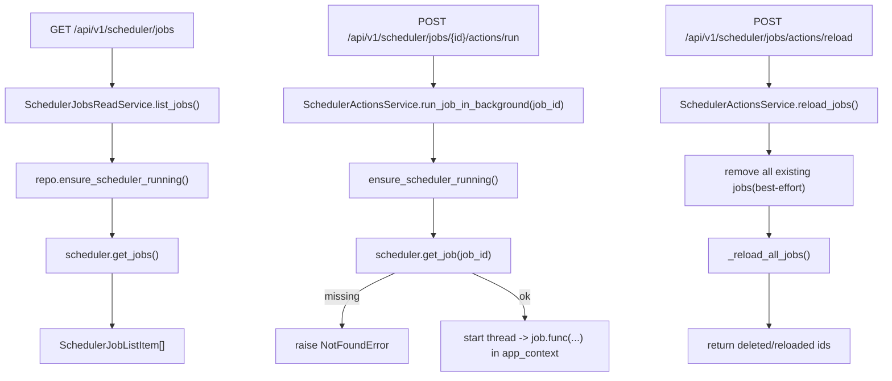

# Scheduler Actions/Read Services(任务列表/详情/运行/重载)

> [!note] 本文目标
> 覆盖 scheduler 的读与动作编排: list/get/pause/resume/run/reload, 并明确后台执行的 app_context 处理与 builtin job 的 manual kwargs 注入规则.

## 1. 概览(Overview)

覆盖文件:

- `app/services/scheduler/scheduler_jobs_read_service.py`
- `app/services/scheduler/scheduler_actions_service.py`
- repository: `app/repositories/scheduler_jobs_repository.py`

核心入口:

- `SchedulerJobsReadService.list_jobs()`
- `SchedulerJobsReadService.get_job(job_id)`
- `SchedulerActionsService.run_job_in_background(job_id, created_by?) -> thread_name`
- `SchedulerActionsService.reload_jobs() -> SchedulerJobsReloadResult`

## 2. 事务与失败语义(Transaction + Failure Semantics)

- 读服务:
  - ensure_scheduler_running/get_jobs/get_job 异常 -> SystemError("获取任务列表/详情失败") 或 NotFoundError("任务不存在").
- 动作服务:
  - scheduler 未启动 -> ConflictError("调度器未启动").
  - run_job_in_background:
    - 后台线程执行异常捕获 `BACKGROUND_EXECUTION_EXCEPTIONS` 并记录 error log (不传播).
    - 若当前无 app_context, 会 `create_app(init_scheduler_on_start=False)` 并进入 `app.app_context()`.
  - reload_jobs:
    - 逐 job remove, 单条 remove 失败仅记录 error log 并继续.
    - 调用 `scheduler_module._reload_all_jobs()` 重新加载任务.

## 3. 主流程图(Flow)

## 4. 决策表/规则表(Decision Table)

### 4.1 builtin job manual kwargs 注入

| job_id | 注入 manual_run/created_by |
| --- | --- |
| sync_accounts | yes |
| calculate_database_size_aggregations | yes |
| 其他 builtin | no |
| 非 builtin | no |

实现位置: `app/services/scheduler/scheduler_actions_service.py:93`.

### 4.2 Cron trigger args 提取

| job.trigger.fields 类型 | 行为 |
| --- | --- |
| dict | 按 key 读取 second/minute/hour/day/month/day_of_week/year |
| list 且 len>=8 | 按 index 读取 cron 字段 |
| 其他 | fallback 到默认字段 |

实现位置: `app/services/scheduler/scheduler_jobs_read_service.py:98`.

## 5. 兼容/防御/回退/适配逻辑

| 位置(文件:行号) | 类型 | 描述 | 触发条件 | 清理条件/期限 |
| --- | --- | --- | --- | --- |
| `app/services/scheduler/scheduler_jobs_read_service.py:49` | 防御 | list/get 捕获 Exception 转 SystemError | scheduler/jobstore 异常 | 若要细分错误, 收敛异常类型并补用例 |
| `app/services/scheduler/scheduler_actions_service.py:66` | 防御 | 后台线程捕获异常仅记录日志 | job.func 失败 | 若要求可观测, 需写入统一日志表或 session |
| `app/services/scheduler/scheduler_actions_service.py:119` | 回退 | reload_jobs 删除单条 job 失败继续 | JobLookupError/ValueError | 若要求强一致, 删除失败即中断并返回 409 |

## 6. 测试与验证(Tests)

最小验证命令:

- `uv run pytest -m unit tests/unit/routes/test_api_v1_scheduler_contract.py`
