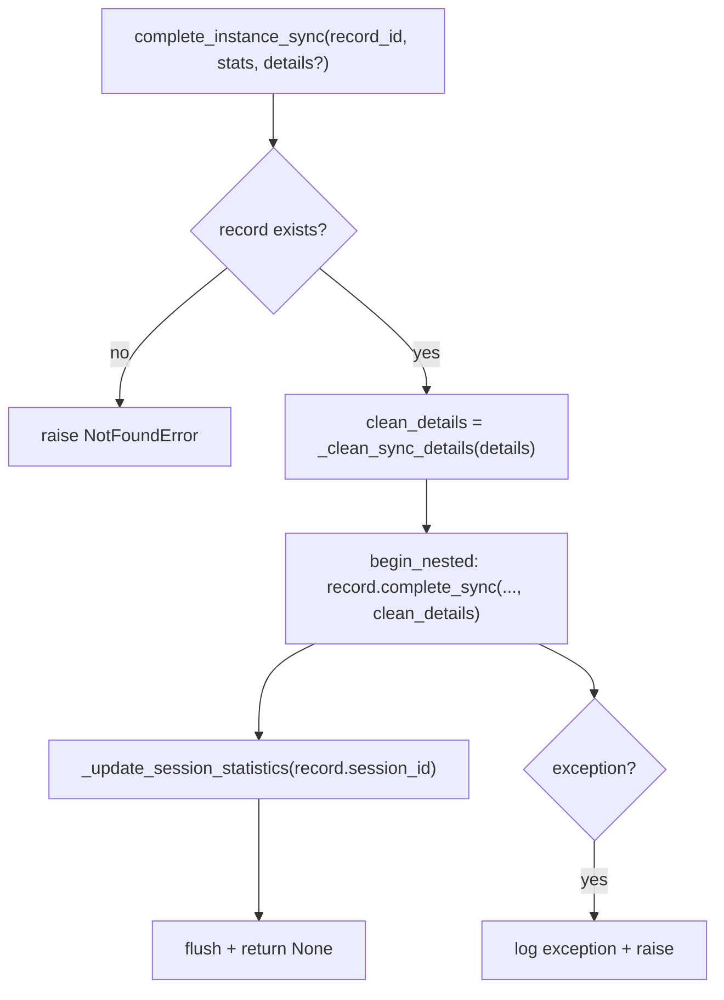
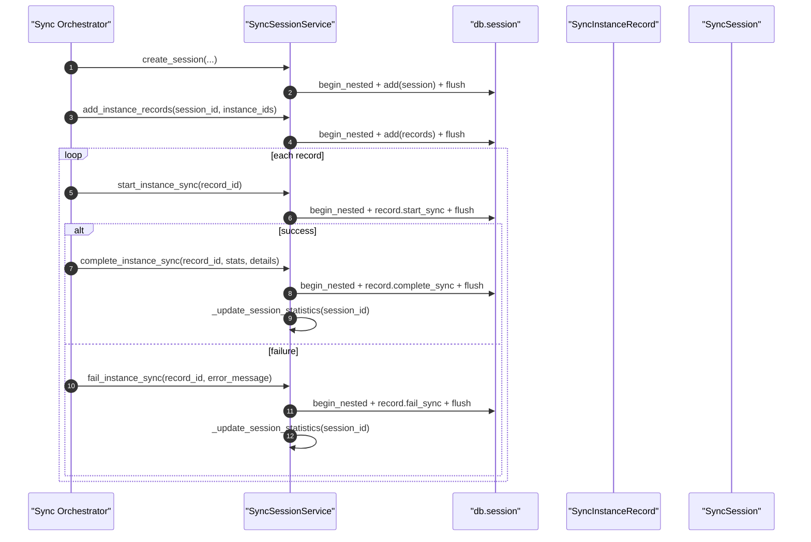

# Sync Session Service(同步会话/实例记录状态机)

> [!note] 本文目标
> 说明同步会话域如何管理：
> - `SyncSession`（会话）创建/取消/统计更新
> - `SyncInstanceRecord`（实例记录）start/complete/fail 状态流转
> - sync_details 的序列化清洗（datetime/date -> isoformat）
>
> 重点：已收敛 start/complete/fail 的“return False”兜底：record 不存在改为抛 `NotFoundError`；start 写入异常不再吞并；查询异常不再吞并。仍保留 cancel_session 的严格语义（非 RUNNING 返回 False），见第 7 节。

## 1. 概览(Overview)

入口：

- `SyncSessionService.create_session(sync_type, sync_category="account", ...)` `app/services/sync_session_service.py:76`
- `SyncSessionService.add_instance_records(session_id, instance_ids, sync_category="account")` `app/services/sync_session_service.py:126`
- `SyncSessionService.start_instance_sync(record_id)` `app/services/sync_session_service.py:193`
- `SyncSessionService.complete_instance_sync(record_id, stats, sync_details?)` `app/services/sync_session_service.py:232`
- `SyncSessionService.fail_instance_sync(record_id, error_message, sync_details?)` `app/services/sync_session_service.py:298`
- `SyncSessionService.cancel_session(session_id)` `app/services/sync_session_service.py:506`

## 2. 依赖与边界(Dependencies)

| 类型 | 组件 | 用途 | 失败语义(摘要) |
| --- | --- | --- | --- |
| Model | `SyncSession/SyncInstanceRecord` | 状态机与字段 | 单条状态更新失败 -> 返回 False（部分方法） |
| DB | `db.session.begin_nested()` | 写入/flush | create/add 失败会抛；部分更新失败吞并 |
| Time | `time_utils` | 时间戳 | 无 |
| JSON | `_clean_sync_details` | 清洗 sync_details 可序列化 | 空/None -> None |

## 3. 事务与失败语义(Transaction + Failure Semantics)

- create_session / add_instance_records：
  - 异常会记录并 **re-raise**（硬失败）。`app/services/sync_session_service.py:105`、`app/services/sync_session_service.py:173`
  - add_instance_records：instance_id 不存在 -> `ValidationError(extra.missing_instance_ids)`（硬失败）。`app/services/sync_session_service.py:155`
- start/complete/fail：
  - record 不存在 -> 抛 `NotFoundError`（不吞）。`app/services/sync_session_service.py:202`、`app/services/sync_session_service.py:246`、`app/services/sync_session_service.py:308`
  - start：DB 异常 -> 记录 exception 并 **re-raise**（硬失败）。`app/services/sync_session_service.py:210`
  - complete/fail：DB 异常 -> 记录 exception 并 **re-raise**（硬失败）。`app/services/sync_session_service.py:269`、`app/services/sync_session_service.py:320`
- complete/fail 会调用 `_update_session_statistics()` 刷新 succeeded/failed 计数（同一 nested 事务中）。`app/services/sync_session_service.py:273`
- cancel_session：
  - session 不存在或非 RUNNING -> False（严格语义）。`app/services/sync_session_service.py:518`
  - DB 异常 -> 记录 exception 并 **re-raise**（硬失败）。`app/services/sync_session_service.py:532`

## 4. 主流程图(Flow)

## 5. 时序图(Sequence)

## 6. 决策表/规则表(Decision Table)

### 6.1 sync_details 清洗规则

| value 类型 | 处理 | 目的 |
| --- | --- | --- |
| `datetime/date` | `isoformat()` | JSON 可序列化 |
| `dict` | 递归清洗 | 深层结构兼容 |
| `list` | 递归清洗 | 同上 |
| 其他 | 原样返回 | 保持信息 |

实现位置：`app/services/sync_session_service.py:49`。

## 7. 兼容/防御/回退/适配逻辑

已清理（2026-01-09）：

- `_clean_sync_details`：仅当 `sync_details is None` 才返回 None，保留空 dict 语义（区分“空详情 vs 无详情”）。
- create_session：移除外部覆盖 `session_id` 能力，统一由模型生成。
- add_instance_records：instance_id 缺失 -> `ValidationError(extra.missing_instance_ids)`（不再 silent skip）。
- complete：`stats` 改为必填；DB 异常不再吞并，改为抛出。
- fail：DB 异常不再吞并，改为抛出。
- `_update_session_statistics`：移除 `scalar() or 0` 兜底。
- get_session_records/get_session_by_id：查询异常不再吞并，改为抛出。
- cancel_session：session 非 RUNNING 返回 False（严格语义）；DB 异常改为抛出。
- start/complete/fail：record 不存在不再 return False，改为抛 `NotFoundError`。
- start：写入异常不再吞并 return False，改为抛出并由上层处理。

| 位置(文件:行号)                                  | 类型  | 描述                                     | 触发条件           | 清理条件/期限                          |
| ------------------------------------------ | --- | -------------------------------------- | -------------- | --------------------------------- |
| `app/services/sync_session_service.py:510` | 防御  | cancel_session：session 不存在/非 RUNNING -> False | session_id 无效/状态已终止 | 若 session_id 来源可强约束，可改为抛错 |

## 8. 可观测性(Logs + Metrics)

- 创建会话/添加记录：`sync_logger.info("创建同步会话"/"添加实例记录")` `app/services/sync_session_service.py:115`、`app/services/sync_session_service.py:183`
- 状态更新失败：`sync_logger.exception("完成实例同步失败"/"标记实例同步失败时出错")` `app/services/sync_session_service.py:276`、`app/services/sync_session_service.py:330`
- 取消会话：`sync_logger.info("取消同步会话")` `app/services/sync_session_service.py:531`

## 9. 测试与验证(Tests)

最小验证命令：

- `uv run pytest -m unit tests/unit/routes/test_api_v1_history_sessions_contract.py`

关键用例：

- record 不存在 -> start/complete/fail 抛 NotFoundError
- sync_details 含 datetime/date -> 清洗为 isoformat
- cancel_session：session 不存在或非 RUNNING 返回 False（当前语义）
