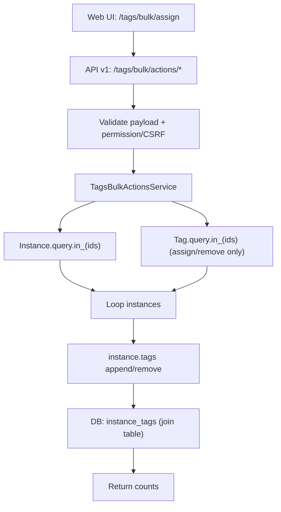
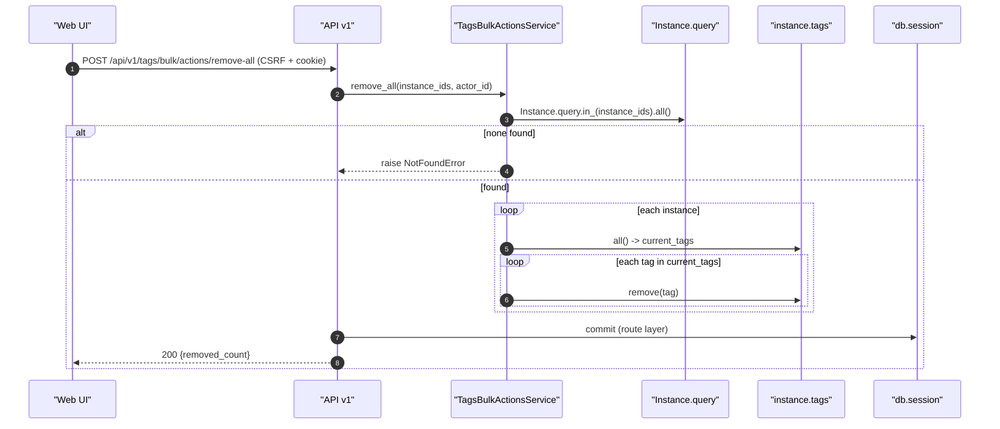

# Tags Bulk Actions Service(实例标签批量分配/移除)

> [!note] 本文目标
> 把 tags bulk 的 4 个核心能力(批量 assign/remove/remove-all + 批量查询 instance-tags 并集)写清楚: 谁调用, 怎么查/改 `instance_tags`, 以及失败语义与幂等规则.

## 1. 概览(Overview)

- 归属 endpoints: `POST /api/v1/tags/bulk/actions/*` + `POST /api/v1/tags/bulk/instance-tags` (见 `[[API/tags-api-contract]]`).
- 主路径(UI 行为): `remove-all` 为主, 语义是"清空选中实例的所有标签"(见 `[[architecture/flows/tags-bulk]]`).
- 核心入口:
  - `TagsBulkActionsService.assign(instance_ids, tag_ids, actor_id) -> TagsBulkAssignResult(assigned_count)`
  - `TagsBulkActionsService.remove(instance_ids, tag_ids, actor_id) -> TagsBulkRemoveResult(removed_count)`
  - `TagsBulkActionsService.remove_all(instance_ids, actor_id) -> TagsBulkRemoveAllResult(removed_count)`
  - `TagsBulkActionsService.list_instance_tags(instance_ids) -> TagsBulkInstanceTagsResult(tags, category_names)`
- 持久化影响:
  - 通过 ORM 关系 `Instance.tags` 维护 join 表 `instance_tags` (append/remove).
  - 不在 service 内 commit; commit/rollback 由 route 层统一处理.

## 2. 依赖与边界(Dependencies)

| 类型 | 组件 | 用途 | 失败语义(摘要) |
| --- | --- | --- | --- |
| Caller | tags API v1 routes | 校验 payload + commit/rollback + error envelope | NotFoundError/DB 异常由 route 处理 |
| ORM | `Instance.query` / `Tag.query` | 批量取实例/标签 | 查不到 -> NotFoundError |
| ORM relation | `instance.tags` | append/remove 标签关系 | DB 约束失败 -> 抛异常 |
| Logs | `log_info` | 记录 bulk 行为(模块 tags_bulk) | 不影响返回 |

## 3. 事务与失败语义(Transaction + Failure Semantics)

- 本 service 不开启显式事务, 由 route 层 `safe_route_call` 统一 commit/rollback.
- `_get_instances/_get_tags`:
  - 如果 `instance_ids`/`tag_ids` 在 DB 中一个都找不到, 抛 `NotFoundError`(带 extra ids).
- 幂等语义:
  - assign: 已有关联的 tag 不会重复 append, `assigned_count` 只统计新增关联.
  - remove: 不存在的关联会跳过, `removed_count` 只统计实际移除的关联.
  - remove_all: 先取当前 tags 列表再逐个 remove, `removed_count` 等于本次实际解除的关联数.
- 可能的性能点:
  - 每个 instance 都会 `instance.tags.all()` 取一次当前集合(存在 N+1 风险). 如果后续需要支持更大 batch, 优先改为 join table 层面的 bulk delete/insert.

## 4. 主流程图(Flow)

## 5. 时序图(Sequence)

以 `remove-all` 为例(当前 UI 主路径):

## 6. 决策表/规则表(Decision Table)

### 6.1 remove vs remove-all

| action | 输入 | 语义 | 计数 | UI 主路径 |
| --- | --- | --- | --- | --- |
| remove | instance_ids + tag_ids | 只移除指定 tag_ids | removed_count=实际移除的关联数 | 否 |
| remove-all | instance_ids | 清空实例所有标签 | removed_count=实际移除的关联数 | 是 |

### 6.2 assign/remove 幂等计数

| 当前是否已有关联 | assign 行为 | assign 计数 | remove 行为 | remove 计数 |
| --- | --- | --- | --- | --- |
| 否 | append | +1 | skip | +0 |
| 是 | skip | +0 | remove | +1 |

## 7. 兼容/防御/回退/适配逻辑

| 位置(文件:行号) | 类型 | 描述 | 触发条件 | 清理条件/期限 |
| --- | --- | --- | --- | --- |
| `app/services/tags/tags_bulk_actions_service.py:54` | 防御 | `_get_instances` 若全都找不到则抛 NotFoundError | instance_ids 全部无效 | 若希望部分成功, 改为返回 found_ids + missing_ids 并补用例 |
| `app/services/tags/tags_bulk_actions_service.py:61` | 防御 | `_get_tags` 若全都找不到则抛 NotFoundError | tag_ids 全部无效 | 同上 |
| `app/services/tags/tags_bulk_actions_service.py:85` | 防御 | assign: 先计算 existing_tag_ids, 避免重复 append | payload 重复/并发点击 | 若改为 bulk insert, 由 DB unique 约束兜底 |
| `app/services/tags/tags_bulk_actions_service.py:110` | 防御 | remove: 仅在存在关联时才 remove | tag_ids 中包含未关联项 | 若改为 bulk delete, 由 delete count 兜底 |
| `app/services/tags/tags_bulk_actions_service.py:134` | 防御 | remove_all: 先 `list(all())` 再 remove, 避免迭代中修改集合 | SQLAlchemy relation iterator 行为不确定 | 若改为 join table bulk delete, 直接删除即可 |

## 8. 可观测性(Logs + Metrics)

- assign:
  - `log_info("开始批量分配标签")`
  - `log_info("批量分配标签成功")`
  - 字段: `module=tags_bulk`, `instance_ids`, `tag_ids`, `assigned_count`, `user_id`
- remove/remove_all:
  - `log_info("批量移除标签成功")` / `log_info("批量移除所有标签成功")`
  - 字段: `module=tags_bulk`, `instance_ids`, `tag_ids?`, `removed_count`, `user_id`

## 9. 测试与验证(Tests)

最小验证命令:

- `uv run pytest -m unit tests/unit/routes/test_api_v1_tags_bulk_contract.py`

关键用例:

- assign/remove/remove-all: response 200, counts 正确
- instance_ids/tag_ids 不存在: 返回 NotFoundError 对应的 error envelope
- instance-tags: 返回 tags 并集 + category_names
