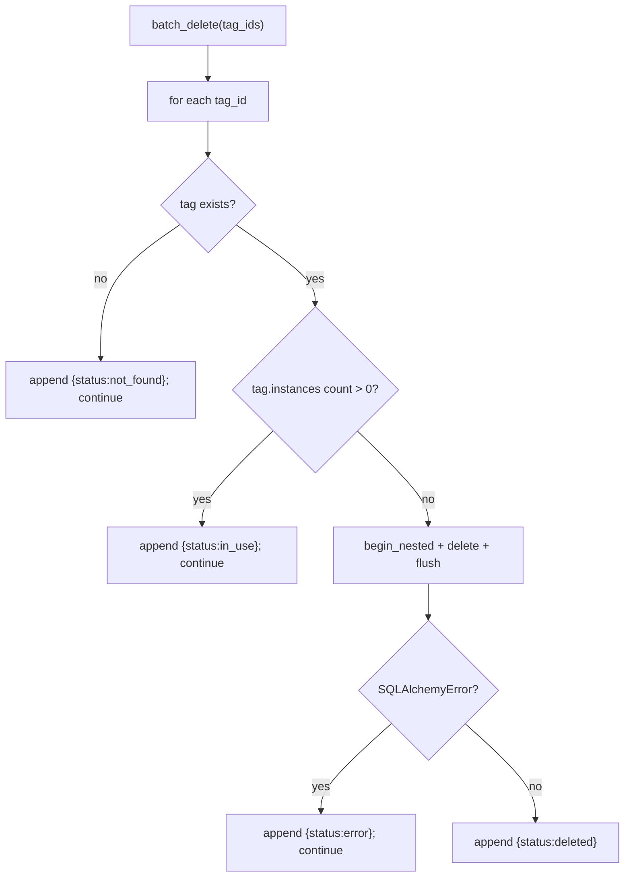
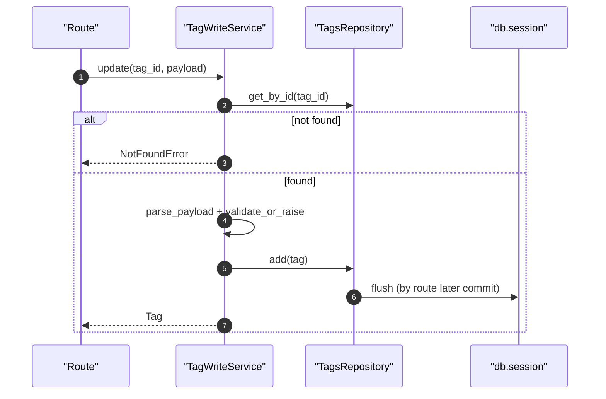

# Tags Write Service(标签写操作/批量删除)

> [!note] 本文目标
> 说明标签写操作的入口、失败语义与“批量逐条继续”的策略；同时显式列出 `begin_nested`、显式 `rollback()` 等兜底点，便于后续收敛数据/删除遗留逻辑。

## 1. 概览(Overview)

核心入口：

- `TagWriteService.create(payload)`（`app/services/tags/tag_write_service.py:58`）
- `TagWriteService.update(tag_id, payload)`（`app/services/tags/tag_write_service.py:84`）
- `TagWriteService.delete(tag_id)`：若标签被实例引用则返回 `in_use`（不抛）。`app/services/tags/tag_write_service.py:114`
- `TagWriteService.batch_delete(tag_ids)`：逐条处理，返回 `results[] + has_failure`。`app/services/tags/tag_write_service.py:138`

持久化影响：

- 写 `tags`；删除时可能影响 tag-instance 关联（由 ORM 关系定义决定）

## 2. 依赖与边界(Dependencies)

| 类型 | 组件 | 用途 | 失败语义(摘要) |
| --- | --- | --- | --- |
| Repo | `TagsRepository` | get/add/delete | 不存在 -> NotFoundError |
| Payload | `parse_payload` + `validate_or_raise` | 归一化 + 校验 | 校验失败 -> ValidationError |
| DB | `db.session.begin_nested()` | batch_delete 逐条事务包裹 | 单条失败不阻断其他 |

## 3. 事务与失败语义(Transaction + Failure Semantics)

- create/update：写入失败会 `rollback()` 并抛 `ValidationError("保存失败")`。`app/services/tags/tag_write_service.py:75`、`app/services/tags/tag_write_service.py:105`
- delete：若 tag.instances 非空，返回 `status=in_use`（业务可恢复）。`app/services/tags/tag_write_service.py:120`
- batch_delete：
  - tag 不存在 -> `status=not_found`，继续。`app/services/tags/tag_write_service.py:147`
  - tag 被引用 -> `status=in_use`，继续。`app/services/tags/tag_write_service.py:153`
  - DB 异常 -> `status=error`，继续。`app/services/tags/tag_write_service.py:170`

## 4. 主流程图(Flow)

## 5. 时序图(Sequence)

## 6. 决策表/规则表(Decision Table)

### 6.1 delete：删除 vs in_use

| 条件 | 行为 | 返回 |
| --- | --- | --- |
| `len(tag.instances) > 0` | 不删除 | `TagDeleteOutcome(status="in_use")` |
| 否则 | 删除 | `TagDeleteOutcome(status="deleted")` |

实现位置：`app/services/tags/tag_write_service.py:120`。

## 7. 兼容/防御/回退/适配逻辑

已清理（2026-01-09）：

- DI 收敛：`TagWriteService` 构造函数不再 `repository or TagsRepository()` 自行创建仓储，由 route/form handler 统一注入。
- payload 收敛：create/update 不再使用 `payload or {}` 兜底，直接 `parse_payload(payload, ...)`。
- 入参收敛：batch_delete 的 `tag_ids` 由 route 强约束为 `int[]`（正整数），service 不再做 bool/float/str 的宽松解析。

| 位置(文件:行号)                                    | 类型  | 描述                                                   | 触发条件              | 清理条件/期限                    |
| -------------------------------------------- | --- | ---------------------------------------------------- | ----------------- | -------------------------- |
| `app/services/tags/tag_write_service.py:78`  | 回退  | SQLAlchemyError 时显式 `rollback()` 并转为 ValidationError | DB 约束/连接异常        | 若需要区分错误类型，细化错误码并加测试        |
| `app/services/tags/tag_write_service.py:120` | 防御  | delete：被引用返回 in_use（不抛）                              | 标签被实例占用           | 若未来支持强制删除/解绑，补新分支并文档化      |
| `app/services/tags/tag_write_service.py:165` | 回退  | batch_delete 逐条 `begin_nested`，单条失败不影响整体             | 批量中出现脏数据/偶发 DB 错误 | 若要求原子性，改为批量事务并失败回滚         |

## 8. 可观测性(Logs + Metrics)

- 创建/更新/删除：`log_info` 事件 `标签创建成功/标签更新成功/标签删除成功` `app/services/tags/tag_write_service.py:187`、`app/services/tags/tag_write_service.py:200`、`app/services/tags/tag_write_service.py:213`
- 批量失败：`log_with_context(... action=batch_delete_tags ...)` `app/services/tags/tag_write_service.py:172`

## 9. 测试与验证(Tests)

最小验证命令：

- `uv run pytest -m unit tests/unit/routes/test_api_v1_tags_contract.py`（如存在）

关键用例：

- delete：被引用返回 in_use
- batch_delete：not_found/in_use/error 多状态混合仍可返回结果列表
