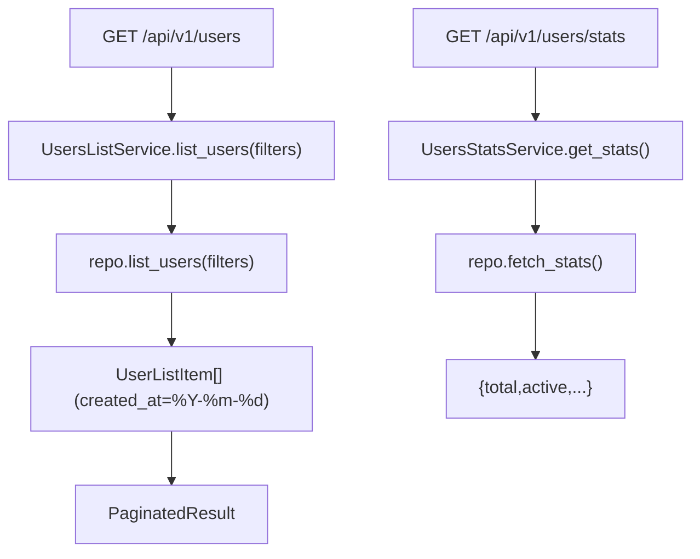

# Users Read Services(用户列表/统计)

> [!note] 本文目标
> 说明 UsersListService/UsersStatsService 的读路径与输出字段口径.

## 1. 概览(Overview)

覆盖文件:

- `app/services/users/users_list_service.py`
- `app/services/users/users_stats_service.py`
- repository: `app/repositories/users_repository.py`

核心入口:

- `UsersListService.list_users(filters) -> PaginatedResult[UserListItem]`
- `UsersStatsService.get_stats() -> dict[str, int]`

## 2. 事务与失败语义(Transaction + Failure Semantics)

- 读服务, 不做 commit.
- service 不捕获异常; DB/not found 由 repo/route 层处理.

## 3. 主流程图(Flow)

## 4. 兼容/防御/回退/适配逻辑

| 位置(文件:行号) | 类型 | 描述 | 触发条件 | 清理条件/期限 |
| --- | --- | --- | --- | --- |
| `app/services/users/users_list_service.py:20` | 防御 | `repository or UsersRepository()` 兜底 | 调用方未注入 | 若统一 DI, 改为强制注入 |
| `app/services/users/users_stats_service.py:17` | 防御 | `repository or UsersRepository()` 兜底 | 调用方未注入 | 同上 |
| `app/services/users/users_list_service.py:30` | 兼容 | created_at None -> null | 历史数据缺 created_at | 若 schema 强约束, 可收敛 |

## 5. 测试与验证(Tests)

最小验证命令:

- `uv run pytest -m unit tests/unit/routes/test_api_v1_users_contract.py`
