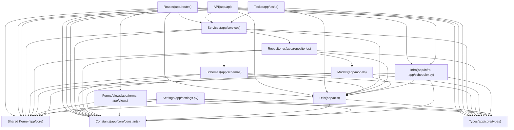

# 后端分层标准

本目录定义后端各层的职责边界, 依赖方向, 命名与组织方式.

## 依赖方向(概览)



> [!info] 依赖图说明（Overview + Exceptions）
> - 该图仅展示主依赖方向（推荐路径），不枚举所有被允许的例外依赖。
> - 例外依赖必须以各层规范中的 MUST/SHOULD/MAY 条款为准；禁止在业务代码里自行“发明例外”。
> - 常见例外（仅列举，具体约束见对应层文档）：
>   - `app.services.*` → `app.models.*`：允许用于类型标注或实例化；数据访问与 Query 组装仍必须通过 `app.repositories.*`。
>   - `app.services.*` → 其他 `app.services.*`：允许跨域编排，但必须在评审中说明原因与替代方案。
>   - `app.infra.*` → `app.services.*` / `app.repositories.*`：优先用回调注入或惰性导入；如确需依赖必须在评审说明理由与循环依赖风险。

> [!note]
> `app/core/**` 为 shared kernel(跨层复用的核心对象),不属于某个业务层; 规范见 [[standards/backend/shared-kernel-standards|Shared Kernel 编写规范]]；异常定义见 `app/core/exceptions.py`, 异常→HTTP status 映射见 `app/infra/error_mapping.py`。

## 关键入口(少量)

- [[standards/backend/layer/api-layer-standards|API 层编写规范]]
- [[standards/backend/layer/services-layer-standards|Services 服务层编写规范]]
- [[standards/backend/layer/repository-layer-standards|Repository 仓储层编写规范]]
- [[standards/backend/layer/tasks-layer-standards|Tasks 任务层编写规范]]

## 全量浏览(不维护手工清单)

```query
path:"standards/backend/layer"
```
