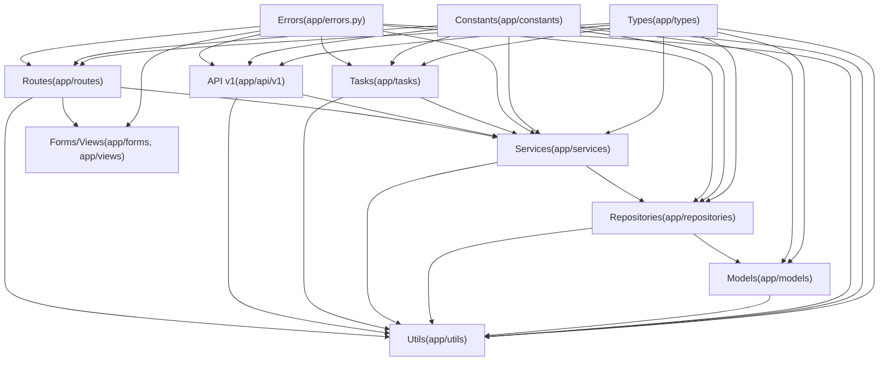

# 后端分层标准

本目录定义后端各层的职责边界, 依赖方向, 命名与组织方式.

## 依赖方向(概览)



## 关键入口(少量)

- [[standards/backend/layer/api-layer-standards|API v1 层编写规范]]
- [[standards/backend/layer/services-layer-standards|Services 服务层编写规范]]
- [[standards/backend/layer/repository-layer-standards|Repository 仓储层编写规范]]
- [[standards/backend/layer/tasks-layer-standards|Tasks 任务层编写规范]]

## 全量浏览(不维护手工清单)

```query
path:"standards/backend/layer"
```
