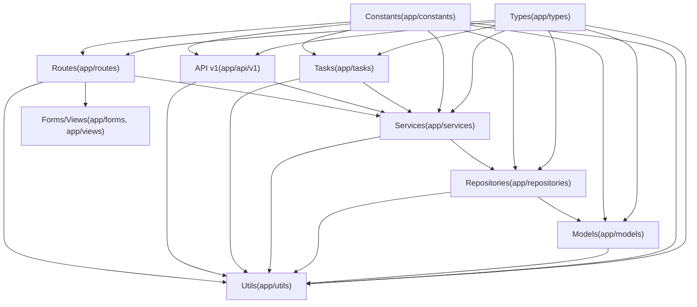

# 后端分层标准

本目录定义后端各层的职责边界, 依赖方向, 命名与组织方式.

## 依赖方向(概览)

## 索引

- [[standards/backend/layer/routes-layer-standards|Routes 路由层编写规范]]
- [[standards/backend/layer/api-layer-standards|API v1 层编写规范]]
- [[standards/backend/layer/services-layer-standards|Services 服务层编写规范]]
- [[standards/backend/layer/repository-layer-standards|Repository 仓储层编写规范]]
- [[standards/backend/layer/models-layer-standards|Models 数据模型层编写规范]]
- [[standards/backend/layer/forms-views-layer-standards|Forms 与 Views 层编写规范]]
- [[standards/backend/layer/tasks-layer-standards|Tasks 任务层编写规范]]
- [[standards/backend/layer/utils-layer-standards|Utils 工具层编写规范]]
- [[standards/backend/layer/types-layer-standards|Types 类型定义层编写规范]]
- [[standards/backend/layer/constants-layer-standards|Constants 常量层编写规范]]

