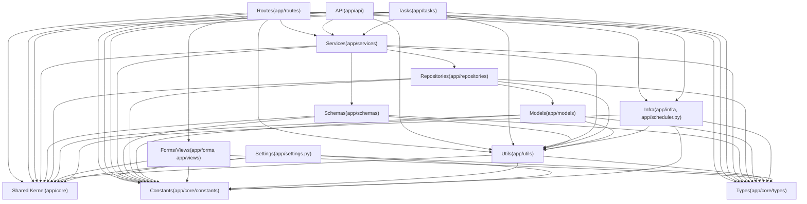

# 后端分层标准

本目录定义后端各层的职责边界, 依赖方向, 命名与组织方式.

## 依赖方向(概览)



> [!note]
> `app/core/**` 为 shared kernel(跨层复用的核心对象),不属于某个业务层; 规范见 [[standards/backend/shared-kernel-standards|Shared Kernel 编写规范]]；异常定义见 `app/core/exceptions.py`, 异常→HTTP status 映射见 `app/infra/error_mapping.py`。

## 关键入口(少量)

- [[standards/backend/layer/api-layer-standards|API 层编写规范]]
- [[standards/backend/layer/services-layer-standards|Services 服务层编写规范]]
- [[standards/backend/layer/repository-layer-standards|Repository 仓储层编写规范]]
- [[standards/backend/layer/tasks-layer-standards|Tasks 任务层编写规范]]

## 全量浏览(不维护手工清单)

```query
path:"standards/backend/layer"
```
