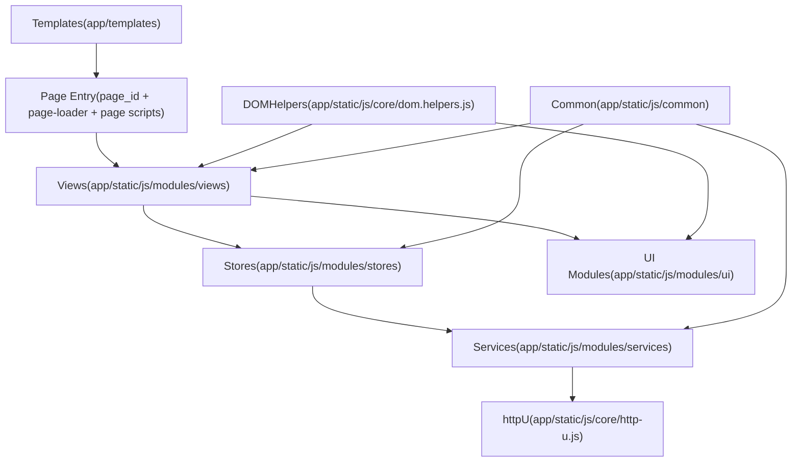

# 前端分层标准

本目录定义前端各层的职责边界, 依赖方向, 命名与组织方式. 它在 [[standards/ui/javascript-module-standards|前端模块化(modules)规范]] 的基础上, 将关键约束按层细化为可审查的标准.

## 与后端分层的对齐(参考)

> [!note] 说明
> 本节用于快速建立心智模型. 前端分层并非 1:1 复刻后端, 但依赖方向与"入口薄, 下沉编排"的原则一致.

| 后端层 | 前端对应层 | 说明 |
|---|---|---|
| Routes/API | Page Entry(模板 + page-loader + 页面脚本) | 入口层负责参数/数据读取与 wiring, 不承载业务实现细节 |
| Services | Stores(actions) | 前端的业务编排更多发生在 store actions 与页面控制器中 |
| Repository/Models | Services(API clients) | 前端 service 主要是 API client 封装, 不承担持久化抽象 |
| Forms/Views | Views/UI modules | 视图渲染与交互, 以及可复用 UI 行为组件 |

## 依赖方向(概览)

约束要点:

- Page Entry 允许读取 allowlist 内的 `window.*` 与 DOM dataset, 负责组合依赖并启动页面.
- Views 负责 DOM 与交互, 业务动作通过 store actions 或 service 方法驱动.
- Stores 负责状态与 actions, 只依赖 services, 不直接触碰 DOM.
- Services 负责 HTTP 调用与参数/响应规整, 不依赖 UI 与 DOM.

## 全局依赖(window.*) 访问规则(SSOT)

> [!info] 原则
> - 仅允许访问 allowlist 内的全局, 避免隐式耦合.
> - 能注入就注入: 新增依赖优先通过参数注入, 或收敛到 UI Modules.
> - 除 allowlist 外, 禁止在下层随意读取 `window.*`.

允许的全局(按层):

- Page Entry:
  - `window.DOMHelpers`, `window.httpU`, `window.UI`, `window.toast`
  - `window.Views`(启动 view skeleton)
  - common globals: `window.timeUtils`, `window.TimeFormats`, `window.NumberFormat`, `window.LodashUtils`, `window.TableQueryParams`, `window.ColorTokens`, `window.FormValidator`, `window.ValidationRules`
  - vendor globals(如 `gridjs`, `Chart`, `bootstrap`)
- Views:
  - `window.DOMHelpers`, `window.UI`, `window.toast`
  - `window.Views`(同层互用)
  - common globals: `window.timeUtils`, `window.TimeFormats`, `window.NumberFormat`, `window.LodashUtils`, `window.TableQueryParams`, `window.ColorTokens`, `window.FormValidator`, `window.ValidationRules`
  - vendor globals(如 `Chart`, `bootstrap`)
- UI Modules:
  - `window.DOMHelpers`, `window.UI`
  - common globals: `window.timeUtils`, `window.TimeFormats`, `window.NumberFormat`, `window.LodashUtils`
  - `window.EventBus`(仅在需要跨组件同步/观测时使用, 禁止做业务编排)
  - vendor globals(如 `bootstrap`)
- Stores:
  - `window.mitt`(仅作为 `emitter` fallback)
  - `window.LodashUtils`(仅在必要时, 且避免在 store 内做复杂业务逻辑)
- Services:
  - `window.httpU`(仅作为 `httpClient` fallback)
  - `window.LodashUtils`(仅在必要时, 且避免在 service 内做复杂业务逻辑)

禁止的全局(统一口径):

- `window.EventBus` 禁止在 Services/Stores 使用.
- `window.toast` 禁止在 Services/Stores 使用.
- `document` 禁止在 Services/Stores 使用(详见对应层标准).

> [!note] 迁移期
> legacy 代码如不满足 allowlist, 必须在评审中说明原因, 并给出迁移计划(例如把依赖上移到 Page Entry 注入).

## 索引

- [[standards/ui/layer/page-entry-layer-standards|Page Entry 页面入口层编写规范]]
- [[standards/ui/layer/services-layer-standards|Services 前端服务层编写规范]]
- [[standards/ui/layer/stores-layer-standards|Stores 前端状态层编写规范]]
- [[standards/ui/layer/views-layer-standards|Views 视图层编写规范]]
- [[standards/ui/layer/ui-layer-standards|UI Modules 工具层编写规范]]
- 长示例(非 SSOT): [[reference/examples/ui-layer-examples|UI 分层示例(长示例)]]
