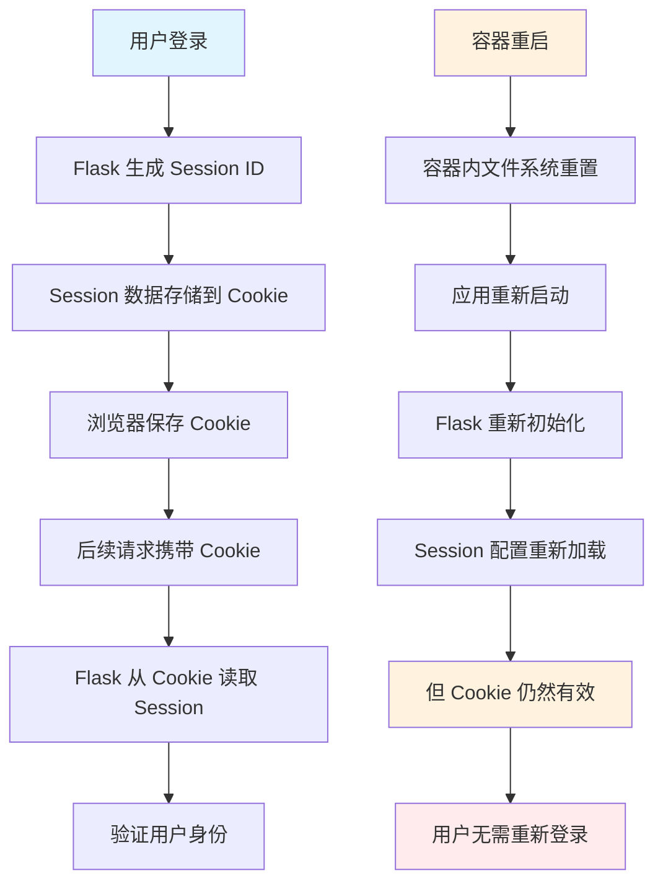
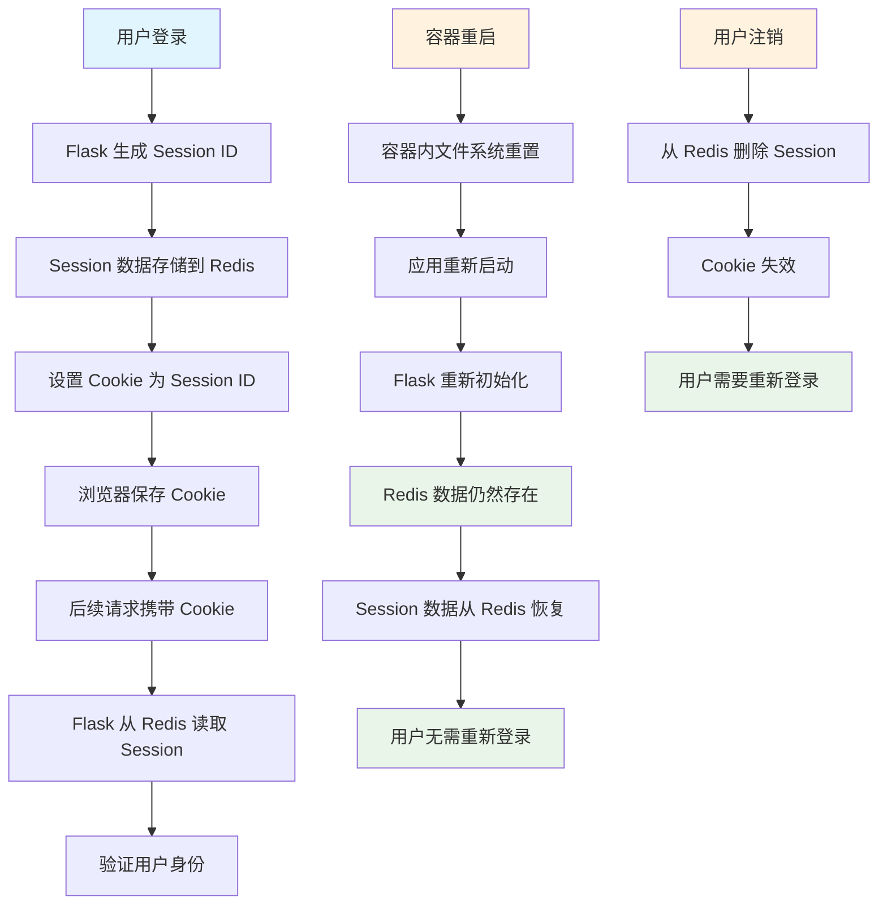
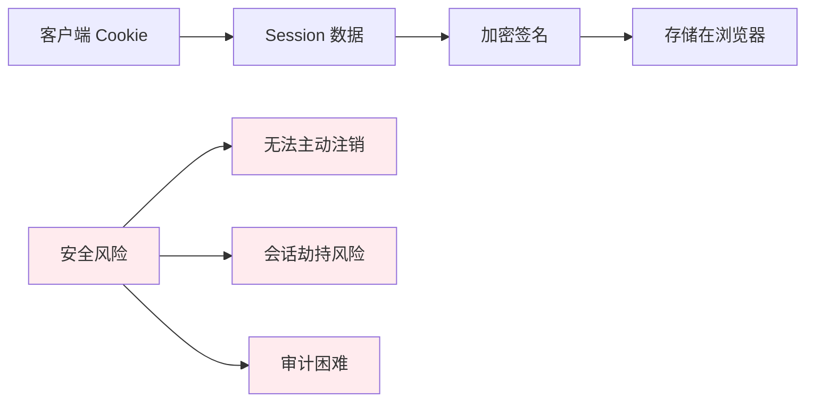
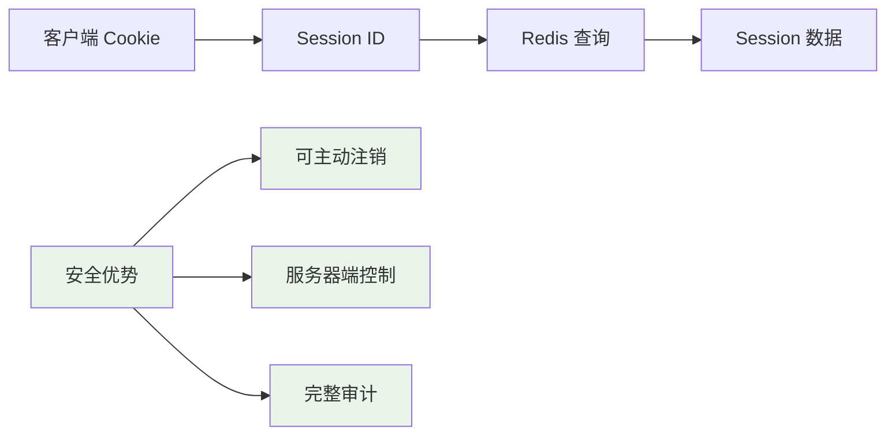

# Flask Session 数据流向图

## 当前问题流程

```mermaid
graph TD
    A[用户登录] --> B[Flask 生成 Session ID]
    B --> C[Session 数据存储到 Cookie]
    C --> D[浏览器保存 Cookie]
    D --> E[后续请求携带 Cookie]
    E --> F[Flask 从 Cookie 读取 Session]
    F --> G[验证用户身份]
    
    H[容器重启] --> I[容器内文件系统重置]
    I --> J[应用重新启动]
    J --> K[Flask 重新初始化]
    K --> L[Session 配置重新加载]
    L --> M[但 Cookie 仍然有效]
    M --> N[用户无需重新登录]
    
    style A fill:#e1f5fe
    style N fill:#ffebee
    style H fill:#fff3e0
    style M fill:#fff3e0
```

## 修复后流程

```mermaid
graph TD
    A[用户登录] --> B[Flask 生成 Session ID]
    B --> C[Session 数据存储到 Redis]
    C --> D[设置 Cookie 为 Session ID]
    D --> E[浏览器保存 Cookie]
    E --> F[后续请求携带 Cookie]
    F --> G[Flask 从 Redis 读取 Session]
    G --> H[验证用户身份]
    
    I[容器重启] --> J[容器内文件系统重置]
    J --> K[应用重新启动]
    K --> L[Flask 重新初始化]
    L --> M[Redis 数据仍然存在]
    M --> N[Session 数据从 Redis 恢复]
    N --> O[用户无需重新登录]
    
    P[用户注销] --> Q[从 Redis 删除 Session]
    Q --> R[Cookie 失效]
    R --> S[用户需要重新登录]
    
    style A fill:#e1f5fe
    style O fill:#e8f5e8
    style P fill:#fff3e0
    style S fill:#e8f5e8
    style I fill:#fff3e0
    style M fill:#e8f5e8
```

## 安全对比

### 当前方案（Cookie 存储）

```mermaid
graph LR
    A[客户端 Cookie] --> B[Session 数据]
    B --> C[加密签名]
    C --> D[存储在浏览器]
    
    E[安全风险] --> F[无法主动注销]
    E --> G[会话劫持风险]
    E --> H[审计困难]
    
    style E fill:#ffebee
    style F fill:#ffebee
    style G fill:#ffebee
    style H fill:#ffebee
```

### 修复方案（Redis 存储）

```mermaid
graph LR
    A[客户端 Cookie] --> B[Session ID]
    B --> C[Redis 查询]
    C --> D[Session 数据]
    
    E[安全优势] --> F[可主动注销]
    E --> G[服务器端控制]
    E --> H[完整审计]
    
    style E fill:#e8f5e8
    style F fill:#e8f5e8
    style G fill:#e8f5e8
    style H fill:#e8f5e8
```
