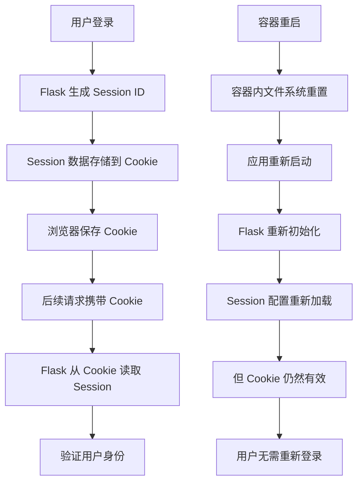

# Flask Session 持久化问题分析报告

## 🔍 问题描述

容器重启后 Flask session 仍然保留，用户无需重新登录即可继续使用系统。

## 🔍 根本原因分析

### 1. **Flask Session 存储机制**

#### 当前配置分析：
```python
# app/__init__.py - 会话安全配置
def configure_session_security(app: Flask) -> None:
    session_lifetime = int(os.getenv("PERMANENT_SESSION_LIFETIME", SystemConstants.SESSION_LIFETIME))
    
    # 会话配置
    app.config["PERMANENT_SESSION_LIFETIME"] = session_lifetime  # 会话超时时间
    app.config["SESSION_COOKIE_SECURE"] = False  # 暂时禁用HTTPS要求，使用HTTP
    app.config["SESSION_COOKIE_HTTPONLY"] = True  # 防止XSS攻击
    app.config["SESSION_COOKIE_SAMESITE"] = "Lax"  # CSRF保护
    app.config["SESSION_COOKIE_NAME"] = "whalefall_session"  # 防止会话固定攻击
```

#### 问题识别：
- **默认存储方式**: Flask 默认使用客户端 Cookie 存储 session 数据
- **无服务器端存储**: 没有配置 `Flask-Session` 或 Redis session 后端
- **Cookie 持久化**: Session 数据存储在客户端浏览器 Cookie 中

### 2. **容器化部署影响**

#### Docker Compose 配置分析：
```yaml
# docker-compose.prod.yml
services:
  whalefall:
    # 移除持久化卷，使用容器内临时存储
    # volumes:
    #   - whalefall_app_data:/app/userdata
```

#### 关键发现：
- **无持久化卷**: Flask 应用容器没有挂载持久化卷
- **临时存储**: 所有数据存储在容器内临时文件系统
- **容器重启**: 容器重启时，容器内文件系统被重置

### 3. **Session 数据流向分析**



## 🔍 技术细节分析

### 1. **Flask Session 默认行为**

#### Cookie 存储机制：
```python
# Flask 默认 session 存储
session['user_id'] = user.id  # 数据存储在客户端 Cookie 中
```

#### 加密和签名：
- Flask 使用 `SECRET_KEY` 对 session 数据进行签名
- 数据经过加密后存储在 Cookie 中
- 客户端无法篡改 session 数据

### 2. **环境变量配置**

#### 当前配置：
```bash
# env.development
SECRET_KEY=bOTS66WQNuq1hliaTEL0EJ2ZguuDdEpu
JWT_SECRET_KEY=bOTS66WQNuq1hliaTEL0EJ2ZguuDdEpu
PERMANENT_SESSION_LIFETIME=3600
```

#### 问题分析：
- **固定 SECRET_KEY**: 开发和生产环境使用相同的 SECRET_KEY
- **Session 签名一致**: 容器重启后，相同的 SECRET_KEY 可以验证现有 Cookie
- **Cookie 有效期**: 浏览器中的 Cookie 在过期前一直有效

### 3. **Redis 缓存配置**

#### 当前配置：
```python
# app/__init__.py
cache_type = os.getenv("CACHE_TYPE", "simple")
app.config["CACHE_TYPE"] = cache_type

if cache_type == "redis":
    app.config["CACHE_REDIS_URL"] = os.getenv("CACHE_REDIS_URL", "redis://localhost:6379/0")
```

#### 关键发现：
- **缓存使用 Redis**: 应用配置了 Redis 作为缓存后端
- **Session 不使用 Redis**: Flask session 仍然使用默认的 Cookie 存储
- **缓存与 Session 分离**: 缓存和 session 是两个独立的存储机制

## 🔍 安全风险评估

### 1. **潜在安全风险**

#### 会话劫持风险：
- **Cookie 泄露**: 如果 Cookie 被窃取，攻击者可以冒充用户
- **跨站脚本攻击**: XSS 攻击可能窃取 session Cookie
- **网络嗅探**: HTTP 环境下 Cookie 可能被截获

#### 会话管理问题：
- **无法主动注销**: 服务器端无法主动使 session 失效
- **并发控制困难**: 难以实现单点登录限制
- **审计困难**: 无法追踪活跃会话

### 2. **合规性问题**

#### 安全标准：
- **OWASP 建议**: 建议使用服务器端 session 存储
- **企业安全**: 大多数企业要求服务器端会话管理
- **审计要求**: 需要能够追踪和监控用户会话

## 🔧 解决方案

### 1. **立即解决方案**

#### 配置 Flask-Session：
```python
# 安装 Flask-Session
pip install Flask-Session

# 配置 Redis session 后端
from flask_session import Session

app.config['SESSION_TYPE'] = 'redis'
app.config['SESSION_REDIS'] = redis.from_url('redis://localhost:6379')
app.config['SESSION_PERMANENT'] = False
app.config['SESSION_USE_SIGNER'] = True
app.config['SESSION_KEY_PREFIX'] = 'whalefall:'
```

### 2. **完整解决方案**

#### 修改应用配置：
```python
# app/__init__.py
def configure_session_storage(app: Flask) -> None:
    """配置服务器端 session 存储"""
    app.config['SESSION_TYPE'] = 'redis'
    app.config['SESSION_REDIS'] = redis.from_url(app.config['CACHE_REDIS_URL'])
    app.config['SESSION_PERMANENT'] = False
    app.config['SESSION_USE_SIGNER'] = True
    app.config['SESSION_KEY_PREFIX'] = 'whalefall:session:'
    app.config['SESSION_COOKIE_NAME'] = 'whalefall_session'
    app.config['SESSION_COOKIE_HTTPONLY'] = True
    app.config['SESSION_COOKIE_SECURE'] = not app.debug
    app.config['SESSION_COOKIE_SAMESITE'] = 'Lax'
    
    # 初始化 Flask-Session
    Session(app)
```

### 3. **Docker 配置优化**

#### 添加 Redis 持久化：
```yaml
# docker-compose.prod.yml
services:
  redis:
    volumes:
      - whalefall_redis_data:/data
    command: redis-server --requirepass ${REDIS_PASSWORD} --appendonly yes
```

## 📊 影响评估

### 1. **当前状态影响**

#### 用户体验：
- ✅ **正面**: 用户无需频繁重新登录
- ❌ **负面**: 安全风险增加，无法主动注销

#### 系统安全：
- ❌ **高风险**: 会话管理不符合安全最佳实践
- ❌ **合规性**: 不符合企业安全标准

### 2. **修复后影响**

#### 用户体验：
- ✅ **改善**: 更安全的会话管理
- ✅ **功能**: 支持主动注销和会话管理

#### 系统安全：
- ✅ **提升**: 符合安全最佳实践
- ✅ **合规**: 满足企业安全要求

## 🚀 实施建议

### 1. **优先级排序**

#### 高优先级：
1. 配置 Flask-Session 使用 Redis 后端
2. 实现服务器端会话管理
3. 添加会话监控和审计

#### 中优先级：
1. 实现单点登录限制
2. 添加会话超时管理
3. 优化会话安全配置

#### 低优先级：
1. 添加会话统计和报告
2. 实现会话迁移功能
3. 优化会话性能

### 2. **实施步骤**

#### 第一步：安装依赖
```bash
pip install Flask-Session
```

#### 第二步：修改配置
- 更新 `app/__init__.py` 添加 Flask-Session 配置
- 修改环境变量配置

#### 第三步：测试验证
- 测试会话持久化
- 验证会话注销功能
- 检查安全配置

#### 第四步：部署更新
- 更新生产环境配置
- 监控会话管理功能
- 验证安全改进

## 📝 总结

### 问题根源：
Flask 应用使用默认的客户端 Cookie 存储 session 数据，容器重启不影响客户端 Cookie，导致用户无需重新登录。

### 安全风险：
当前配置存在会话劫持、无法主动注销、审计困难等安全风险。

### 解决方案：
配置 Flask-Session 使用 Redis 作为服务器端 session 存储，实现更安全和可控的会话管理。

### 实施建议：
优先实施服务器端会话管理，确保系统安全性和合规性。
