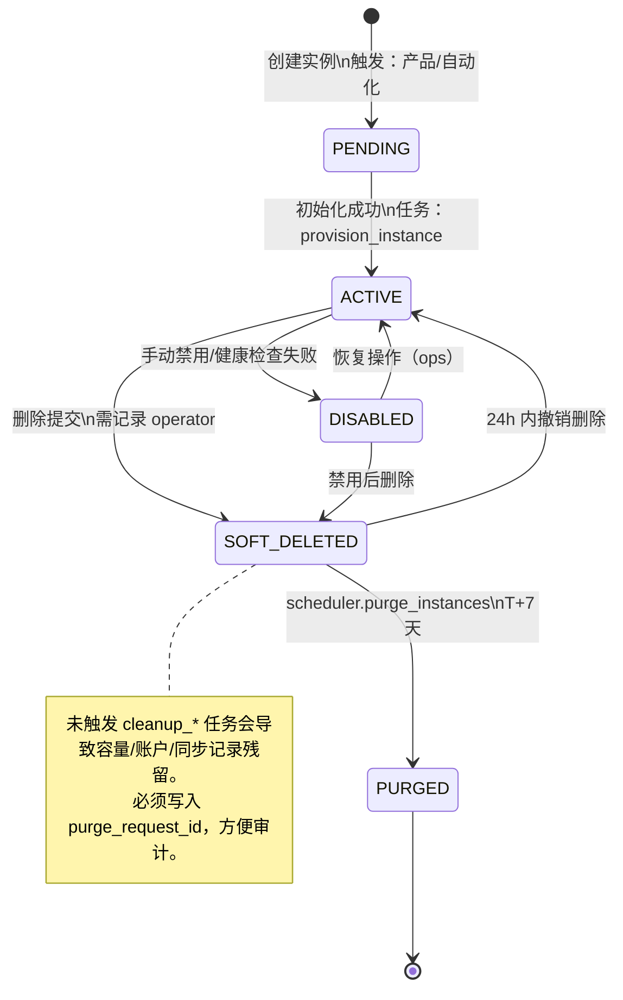
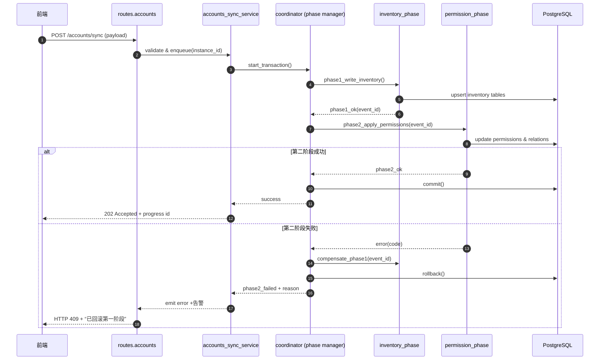
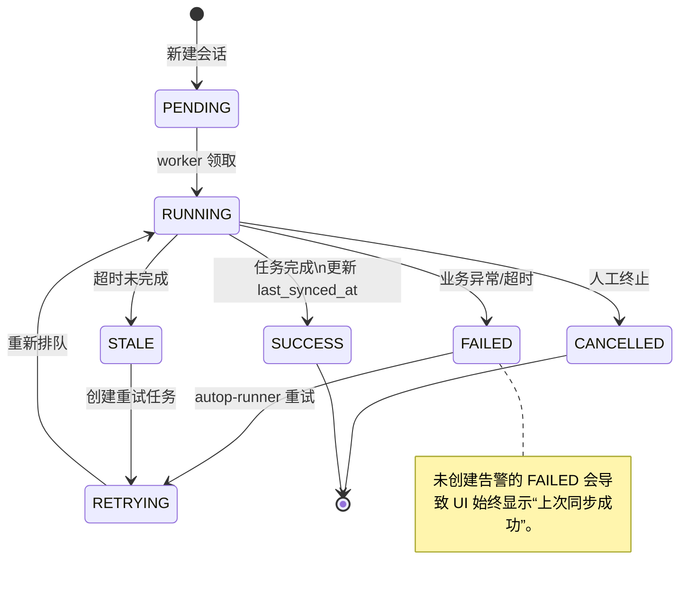
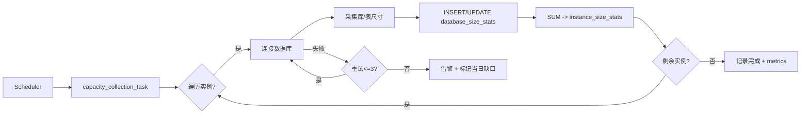

# TaifishV4（鲸落）—— 8 张核心业务流程图（Mermaid）+ 业务规则对账总表  
**正式版本 v1.1**｜2025-11-29｜全团队必读必执行文档  
**文档路径**：`docs/architecture/TaifishV4_8_Core_Flowcharts_And_Rule_Inventory.md`

## 零、文档目标与使用方式

- **目标**：以 Markdown + Mermaid 的方式沉淀 8 张核心业务流程，结合 120+ 条业务规则对账，形成排雷、研发、运维共用的“唯一事实源”。
- **适用范围**：产品、后端、前端、QA、SRE、运营、排障支援；任何人修改相关链路、合并 PR、发布前必须通读并在评审会上确认理解。
- **交付资产**：本 MD + Mermaid 源码、导出的 HTML/PDF（使用 `npx @mermaid-js/mermaid-cli` 统一渲染）、业务规则 Excel；不再要求 draw.io 文件。
- **更新节奏**：默认每周一 10:00 架构小组例行 review；涉及事故、热补丁或重大需求时须在 24 小时内更新版本并同步链接。
- **文档维护人**：架构小组轮值负责人；值班人变更时须在提交记录与开头版本区同步。

### Mermaid 绘制与发布规范
1. **工具链**：推荐 VS Code + `Markdown Preview Mermaid Support` 插件预览；出图给外部需要时用 `mmdc -i input.md -o output.png` 导出 PNG/PDF。
2. **结构约束**：泳道以“触发人 / API / 服务 / 数据层 / 异步任务”划分；若 Mermaid 不支持泳道，需用分组或注释模拟。
3. **注释要求**：节点/连线必须写清“触发权限”“调用脚本或服务”“读写资源”“锁/事务/补偿策略”；高风险节点用 `note` 说明。
4. **引用一致性**：所有状态、任务、表字段须与 `app/` 目录中的真实命名保持一致（如 `tasks.cleanup_capacity`）。
5. **评审签署**：每张图初稿完成 24 小时内提评审，至少需产品、后端、QA 三方确认，并在对应章节的“最后评审”行填写日期与责任人。

### 业务规则表维护准则
1. **优先级口径**：P0=必须立即处理；P1=当月交付；P2=观察项。严禁混用缺陷等级或随意描述。
2. **字段必填**：`期望实现位置`、`实际实现位置` 必须写到模块路径或脚本名+函数名；`是否实现` 只能写“是/否/部分”。
3. **验证方式**：`有测试` 列需指明类型（unit/integration/manual）；若缺失测试，写 `TODO-<owner>` 并同步任务。
4. **缺口记录**：`支持修正`、`异常处理` 填写“方案 + Owner + 最近验证日期”；若暂空，用“待 <owner> 给方案”。
5. **追踪机制**：每次更新规则需在 Git/任务卡中引用规则 ID，便于回溯；评审会需带上“状态变化 diff”。

## 一、8 张核心业务流程图（Markdown + Mermaid 版本）

| 序号 | 图名（强制命名） | Mermaid 图式 | 核心关注点（绘制时必须标注） | 已发生/潜在雷 | 最后评审 |
|------|------------------|--------------|--------------------------------|---------------|-----------|
| 1 | 实例全生命周期状态机 | `stateDiagram-v2` | PENDING → ACTIVE → DISABLED → SOFT_DELETED → PURGED；每条箭头写清触发人/权限/异步清理 | 软删除后未物理清理导致容量、账户残留 | 待填 |
| 2 | 账户同步全流程时序图 | `sequenceDiagram` | 前端 → routes → accounts_sync_service → coordinator → 两阶段提交；补偿与告警链路 | 第二阶段失败后第一阶段未回滚 | 待填 |
| 3 | 同步会话状态流转图 | `stateDiagram-v2` | RUNNING/FAILED/CANCELLED/STALE，终态清理、重试、告警策略 | FAILED 后既不重试也不告警 | 待填 |
| 4 | 账户自动分类 + 规则引擎 | `flowchart LR` | 规则加载、缓存、orchestrator、classifier、冲突解决 | 多命中无优先级，分类不稳定 | 待填 |
| 5.1 | 容量采集→原始统计 | `flowchart LR` | 采集任务、逐库连接、写 `database_size_stats`、幂等与重试 | 当天采集失败直接 return | 待填 |
| 5.2 | 聚合计算全流程 | `flowchart TD` | Scheduler、分布式锁、calculator、状态机与回滚 | 无锁导致翻倍、失败后跳过 | 待填 |
| 5.3 | 聚合数据手工修正与回填 | `flowchart TD` | 管理后台触发、重算日→周→月→年、级联删除、幂等 | 无法重算导致历史数据永远错误 | 待填 |
| 6 | 标签批量分配事务边界 | `flowchart TD` | 批量请求、routes/tags/bulk.py、事务包裹、失败回滚 | 部分成功后无法回滚 | 待填 |
| 7 | 凭据更新后下游影响传播 | `flowchart LR` | 凭据更新、缓存失效、同步/容量任务刷新、告警 | 任务继续用旧密码 | 待填 |
| 8 | 权限矩阵（角色×标签×可见性） | `flowchart LR` | 角色权限、标签过滤、资源类型判定、拒绝路径 | 审计员通过容量图看到被隐藏实例 | 待填 |

> **说明**：以下章节给出每张图的说明 + Mermaid 源码。若需导出 PNG/PDF，请复制代码到 `docs/architecture/flowcharts/flowXX_*.mmd` 中，用 `mmdc` 批量渲染。

### 1. 实例全生命周期状态机
- **约束**：所有状态写入 `instances.status`，并触发 `tasks.cleanup_capacity`、`cleanup_accounts`、`cleanup_sync_records`。
- **补偿**：SOFT_DELETED → PURGED 必须由 `scheduler.purge_instances` 执行，并记录 `purged_at`。
- **监控**：DISABLED 超过 72 小时未恢复需发告警。



### 2. 账户同步全流程时序图（两阶段提交）
- **重点**：inventory 阶段与 permission 阶段必须共享事务上下文，第二阶段失败需要补偿第一阶段。
- **超时**：coordinator 超时需主动回滚并通知 routes。



### 3. 同步会话（sync_sessions）状态流转
- **指标**：FAILED/CANCELLED 必须写入 `failure_reason`；连续失败≥3 次触发企业微信告警并暂停实例。
- **过期**：RUNNING 超过 2 小时自动转为 STALE 并创建重试任务。



### 4. 账户自动分类 + 规则引擎
- **流程**：同步完成事件触发 orchestrator；规则按优先级排序；多命中需通过冲突解决器决策。
- **风险**：目前缺少优先级字段，默认取第一条，导致分类不稳定。

```mermaid
flowchart LR
    SyncDone([同步完成事件]) --> LoadRules[load_rules_from_db]
    LoadRules --> Cache{规则缓存有效?}
    Cache -- 否 --> RefreshCache[重建缓存 + 发布版本]
    Cache -- 是 --> Orchestrator[orchestrator.dispatch]
    Orchestrator --> ClassifierA[classifier.login_pattern]
    Orchestrator --> ClassifierB[classifier.metadata]
    Orchestrator --> ClassifierC[classifier.custom]
    ClassifierA --> Conflicts{多条规则命中?}
    ClassifierB --> Conflicts
    ClassifierC --> Conflicts
    Conflicts -- 是 --> Resolver[resolve_conflict_by_priority]
    Conflicts -- 否 --> Assign[写 assignment 表]
    Resolver --> Assign
    Assign --> Notify[触发 audit log + 下游刷新]
    note bottom of Resolver
        需要优先级字段 + tie-breaker，否则容易随机命中。
    end note
```

### 5.1 容量采集 → 原始统计快照
- **职责**：采集任务逐库连接，写 `database_size_stats`、聚合至 `instance_size_stats`。
- **幂等**：失败需重试，不得返回 0。



### 5.2 日/周/月/年聚合计算 + 分布式锁 + 状态机
- **锁**：Redis 分布式锁必须包含超时与持有者 ID，避免重复执行。
- **状态**：聚合记录需写 `status`（pending/running/success/failed），失败后必须回滚。

```mermaid
flowchart TD
    Scheduler --> CheckPending[检查 period 是否已聚合]
    CheckPending -->|未聚合| AcquireLock[redis_lock.acquire]
    CheckPending -->|已完成| Skip[直接记录跳过]
    AcquireLock --> |成功| Calculator[aggregation_calculator.run]
    AcquireLock --> |失败| Reschedule[延后任务]
    Calculator --> WriteAgg[写 aggregations 表 + 状态=running]
    WriteAgg --> Commit{计算成功?}
    Commit -->|是| UpdateStatus[状态=success]
    Commit -->|否| Rollback[回滚 + 状态=failed]
    UpdateStatus --> Release[释放锁 + 发布事件]
    Rollback --> Release
    Release --> Metrics[写入监控]
    note right of Rollback
        未写回滚脚本将导致下一次检测“已聚合”而跳过。
    end note
```

### 5.3 聚合数据手工修正与历史回填
- **入口**：管理后台“重新聚合”按钮，可选日期范围。
- **操作**：级联删除旧聚合、按日→周→月→年顺序重算，并记录操作者。

```mermaid
flowchart TD
    Admin[后台选择日期范围] --> Confirm{确认影响范围?}
    Confirm -- 否 --> Cancel[终止操作]
    Confirm -- 是 --> DeleteOld[级联 DELETE aggregations]
    DeleteOld --> RecalcDay[runner.recalc(day)]
    RecalcDay --> RecalcWeek[runner.recalc(week)]
    RecalcWeek --> RecalcMonth[runner.recalc(month)]
    RecalcMonth --> RecalcYear[runner.recalc(year)]
    RecalcYear --> Verify[抽样校验 + 对账]
    Verify --> Publish[写 audit log + 通知]
    note bottom of DeleteOld
        未记录操作者/请求 ID，将无法审计历史修改。
    end note
```

### 6. 标签批量分配事务边界与回滚链路
- **事务**：批量打标签必须使用单个事务包裹，失败时整批回滚。
- **风险**：循环逐条插入但未捕获异常会导致部分成功，人工难清理。

```mermaid
flowchart TD
    User[前端批量请求] --> Route[routes/tags/bulk.py]
    Route --> BeginTx[BEGIN TRANSACTION]
    BeginTx --> Loop{遍历实例?}
    Loop -- 是 --> Assign[INSERT tag_assignments]
    Assign --> Next{成功?}
    Next -- 是 --> Loop
    Next -- 否 --> Rollback[ROLLBACK + 记录失败实例]
    Loop -- 否 --> Commit[COMMIT]
    Commit --> Notify[返回成功 + audit]
    Rollback --> Alert[返回 207 + 告警]
    note right of Assign
        insert 时需校验权限、标签存在与并发版本。
    end note
```

### 7. 凭据更新后下游影响传播链路
- **关键**：凭据更新必须立刻失效所有缓存，并通知正在运行的同步/容量/连接测试任务。
- **补偿**：未能通知的任务应自动失败并告警，防止继续使用旧密码。

```mermaid
flowchart LR
    Update[凭据密码修改] --> CredentialSvc[credential_service.update]
    CredentialSvc --> Store[加密写 secrets_store]
    CredentialSvc --> Invalidate[invalidate cache + token]
    Invalidate --> NotifyBus[发布 credential.updated 事件]
    NotifyBus --> SyncTasks[tasks.accounts_sync]
    NotifyBus --> CapacityTasks[tasks.capacity_collection]
    NotifyBus --> ConnectionTest[connection_test runner]
    SyncTasks --> StopOrRestart{正在执行?}
    StopOrRestart -- 是 --> CancelJob[终止并标记重新拉起]
    StopOrRestart -- 否 --> ScheduleNext[读取新凭据]
    CapacityTasks --> RefreshConn[重建连接池]
    ConnectionTest --> Revalidate[立即重新测试]
    CancelJob --> AlertSecOps[安全告警]
    note bottom of NotifyBus
        若事件队列不可用，需 fallback 同步调用并记录补偿任务。
    end note
```

### 8. 权限矩阵：用户角色 × 标签 × 数据可见性
- **逻辑**：角色决定基础范围，标签交集决定资源可见性；容量统计必须继承同样的过滤条件。
- **隐患**：容量趋势图未过滤标签会泄露被隐藏实例的总容量。

```mermaid
flowchart LR
    Request[数据访问请求] --> Role{角色?}
    Role -->|admin| TagCheckA[标签交集 = 任意]
    Role -->|auditor| TagCheckB[标签交集 = 指定标签]
    Role -->|user| TagCheckC[标签交集 = 自己创建]
    TagCheckA --> Resource{资源类型?}
    TagCheckB --> Resource
    TagCheckC --> Resource
    Resource -->|实例| GrantInst[实例数据可见]
    Resource -->|账户| GrantAcct[账户列表可见]
    Resource -->|容量| GrantCap[容量统计可见]
    Resource -->|不满足| Deny[拒绝 + 记录]
    GrantCap --> FilterCap[按标签过滤聚合]
    GrantInst --> FilterInst[查询加 WHERE tag]
    GrantAcct --> FilterAcct[JOIN tag_relations]
    FilterCap --> Response
    FilterInst --> Response
    FilterAcct --> Response
    Deny --> Response
    note bottom of FilterCap
        必须与实例相同的标签集合，禁止“全公司趋势”跳过过滤。
    end note
```

## 二、完整业务规则对账总表（示例前 30 条，需扩展到 120+）

文件：`TaifishV4_Business_Rule_Inventory_FULL_v1.xlsx`（仓库附件 + 共享盘持续更新）。

| 规则ID | 业务规则描述 | 优先级 | 所属模块 | 期望实现位置 | 实际实现位置 | 是否实现 | 有测试 | 有锁/事务 | 支持修正 | 异常处理 | 已发生事故 / 隐患 |
|--------|--------------|--------|----------|--------------|--------------|----------|--------|-----------|----------|----------|-------------------|
| R001 | 实例软删除后 7 天必须物理清理所有关联数据（账户、容量、同步记录等） | P0 | 实例管理 | services/instances/batch_service.py | 只软删 instances 表 | 否 | 否 | 否 | 否 | 无 | 数据无限膨胀，报表永远包含已下线实例 |
| R002 | 账户同步第二阶段失败必须回滚第一阶段已写入的清单数据 | P0 | 账户同步 | services/accounts_sync/coordinator.py | 无回滚逻辑 | 否 | 否 | 否 | - | 无 | 大量“账户存在但权限为空”脏数据 |
| R003 | 同步会话连续失败 3 次后自动发企业微信告警并暂停该实例同步 | P0 | 同步会话 | tasks/accounts_sync_tasks.py | 只写日志 | 否 | 否 | - | - | 无 | 实例长期不同步无人知晓 |
| R004 | 批量打标签必须整批事务，失败时完整回滚 | P0 | 标签管理 | routes/tags/bulk.py | 循环单条 insert | 否 | 否 | 否 | - | 无 | 多次出现部分成功，人工难清理 |
| R005 | 凭据密码修改后，所有正在使用该凭据的任务必须立即失效 | P0 | 凭据+连接工厂 | services/connection_adapters/factory.py | 缓存旧密码直到进程重启 | 否 | 否 | - | - | 无 | 严重安全隐患 |
| AGG001 | 聚合计算必须加分布式锁，防止重复执行 | P0 | 容量聚合 | services/aggregation/aggregation_service.py | 无锁 | 否 | 否 | 否 | - | 无 | 已发生数据翻倍 |
| AGG002 | 聚合表必须有唯一约束 (period_type, period_start, scope_id) | P0 | 容量聚合 | models/*_aggregation.py | 无唯一索引 | 否 | 否 | - | - | - | 重复聚合时直接多一行 |
| AGG003 | 支持手工修正原始统计后，选择日期范围“重新聚合”所有周期 | P0 | 容量聚合 | 管理后台 + runner.py | 完全没有此功能 | 否 | 否 | - | 否 | - | 历史数据错就永远错 |
| R008 | 账户名包含 root/admin/sa/rdsadmin 必须自动分类为“高危账户” | P0 | 账户自动分类 | auto_classify_service.py | 硬编码但不完整 | 部分 | 否 | - | - | 有 | 新增关键词要改代码 |
| R009 | 用户只能看到自己有权限标签的实例、账户、容量统计 | P0 | 权限+标签 | routes + 查询过滤 | 容量趋势图未过滤标签 | 否 | 否 | - | - | - | 审计员可看到被隐藏实例的总容量 |

> 表格其余 110+ 条规则请在 Excel 中补齐，并在 PR 描述中附“新增/修改规则 ID 列表 + 验证方式”。

### 规则补齐动作
1. **按模块拉通**：实例→账户→同步→容量→标签→凭据→权限→运营支撑，确保每条链路至少 15 条规则。
2. **引用事实来源**：每条规则需附日志片段/代码行/监控截图，缺少事实不计入 120 条。
3. **验证闭环**：把“是否实现/有测试/有锁”三列做成 QA checklist，在 `make test`、集成回归或手工演练后即刻更新。
4. **对账输出**：评审会前导出 Excel 与“10 条高危差距摘要”，作为会议纪要附件。

## 三、交付要求 & 时间节点

| 时间 | 交付物 | 负责人 |
|------|--------|--------|
| 2025-12-05 | 8 张 Mermaid 流程图完成（含源码 + 导出 PNG/PDF） | 待指派 |
| 2025-12-05 | 《TaifishV4_Business_Rule_Inventory_FULL_v1.xlsx》初稿（≥120 条） | 待指派 |
| 2025-12-10 | 团队评审会，逐条规则签字确认“已实现/未实现” | 全员 |
| 2025-12-31 | 前 15 条 P0 规则全部关闭并有验证证据 | 待指派 |

### 责任与沟通节点
- **流程图 Owner**：默认由链路所属模块负责人牵头（产品 + 架构双签）。缺位时由轮值架构师指派，并在上表“负责人”列补齐。
- **规则表 Owner**：QA 维护 Excel +状态，架构提供实现细节；凡“否/部分”的条目必须写 owner + 预计完成日期。
- **沟通机制**：每周一次 30 分钟对账会，复盘新增风险；阻塞项 24 小时内升级到产品/技术负责人。
- **完成定义**：列入“前 15 条 P0 规则”的项目在关闭前须附测试截图或变更单链接。

## 四、Mermaid 渲染与提交自检
1. `npm install -g @mermaid-js/mermaid-cli`（或使用项目内脚本）→ `mmdc -i flow01_instance_lifecycle.mmd -o flow01_instance_lifecycle.png`。
2. 确认图片与 Markdown 同步提交，路径：`docs/architecture/flowcharts/flowXX_*.{mmd,png,pdf}`。
3. 运行 `./scripts/refactor_naming.sh --dry-run` 确认命名合规；再执行 `make format` 保持 Markdown/Lint 风格一致。
4. MR/PR 模板需勾选“命名规范”与“无硬编码颜色”检查项，并附本文件 diff 链接。

## 五、附件与交付包
- **Mermaid 源码模板**：`docs/architecture/flowcharts/templates/mermaid_templates.md`（待维护），包含泳道/序列/状态机示例。
- **《TaifishV4_Business_Rule_Inventory_FULL_v1.xlsx》**：预填 50 条规则，含筛选器与条件格式。更新后请同步版本号与提交记录。
- **本 MD**：存放于仓库与知识库，任何修改需提 PR 并 @评审人确认。

如在 24 小时内未拿到模板、脚本或附件，请在架构沟通群 @值班同学或提 issue，确保交付链路不断档。画完 8 张图 + 补完对账表，TaifishV4 80% 的高危逻辑漏洞将暴露无遗。
