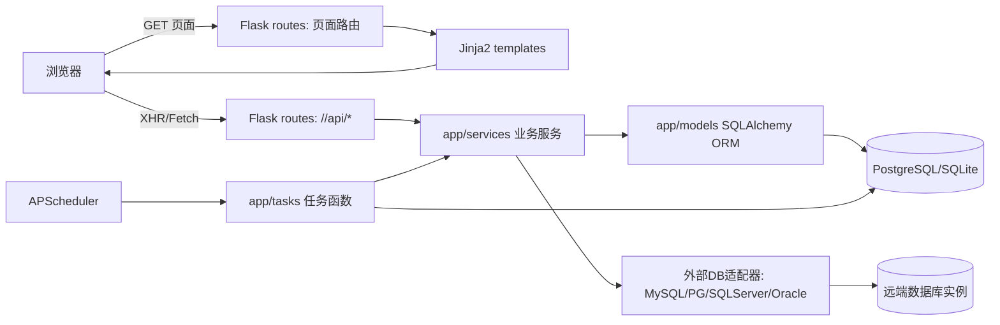

# WhaleFall 架构评审与改进建议（前端/后端）

> 更新时间：2025-12-20  
> 评审范围：仓库代码结构 + 关键入口/模块（不做业务正确性审计）  
> 参考文档：`docs/architecture/PROJECT_STRUCTURE.md`、`docs/api/API_ROUTES_DOCUMENTATION.md`
>
> 补充评审（查漏补缺 + 证据链 + ADR 待办）：`docs/architecture/ARCHITECTURE_REVIEW_SUPPLEMENT_2025-12-20.md`

## 0. 先给结论（TL;DR）

WhaleFall 当前是**典型的“Flask 单体应用（Monolith）+ 服务端模板渲染（Jinja2）+ 渐进式增强（页面内 JS 调用内部 API）”**的架构；后端已经有比较清晰的分层（`routes/` → `services/` → `models/`），并且具备较完善的横切能力（统一错误、结构化日志、缓存、调度任务）。

主要问题集中在：

1. **配置体系此前重复且存在不一致**（已通过 `app/settings.py` 收口，`app/config.py` 仅保留兼容入口）。
2. **“页面路由”和“API 路由”物理上混在一起、路径规范不统一**（多数 API 是 `/<module>/api/*`，需要确保 CORS/CSRF 等横切配置按该结构覆盖）。
3. **调度器与 Web 进程耦合**（多进程/多实例部署下可靠性与可控性风险较高）。
4. **数据访问边界不稳定**（有些场景已做 repository，有些仍在 route 内写复杂查询，未来维护成本会上升）。

如果你是新手，我建议的总体策略是：**先把“边界与一致性”做扎实（配置/接口规范/职责边界），暂时不要追求“把 API 独立成另一个服务”**。单体架构完全能支撑你目前的规模，关键是把它做得“可理解、可演进”。

---

## 1. 当前架构总览（你现在拥有什么）

### 1.1 运行时组件

- **Web 应用**：Flask（`create_app` 工厂）+ SQLAlchemy + Jinja2
- **数据库**：PostgreSQL（主库）；同时出现“SQLite 本地回退/任务 jobstore”使用
- **缓存**：Flask-Caching（可选 Redis / simple）
- **任务调度**：APScheduler（内嵌在应用启动时初始化）
- **前端**：Bootstrap 5 + 传统静态资源（无打包构建，靠模板引入脚本）+ 页面内 JS 调用 JSON API

### 1.2 请求链路（典型）

这张图的要点是：你现在的系统是“同一个 Flask 服务同时负责页面 + API + 定时任务”。这并不天然错误，但会带来一些**边界与部署层面的复杂度**（后面会讲怎么改）。

---

## 2. 后端架构分析（Backend）

### 2.1 现状分层（你已经做对的部分）

从目录结构看，你已经非常接近“经典三层/四层”：

- **表现层 / 控制器层**：`app/routes/`（蓝图 + 路由函数）
- **业务层**：`app/services/`（同步、聚合、表单服务、适配器等）
- **数据层**：`app/models/`（SQLAlchemy ORM）+ `migrations/`（Alembic）
- **横切能力**：`app/utils/`（统一响应、日志、路由安全、校验、限流、缓存等）
- **后台任务层**：`app/tasks/` + `app/scheduler.py`

对新手来说，这个起点是很好的：你已经避免了“所有逻辑都写在 routes 里”的常见陷阱。

### 2.2 合理之处（值得保留/继续强化）

1. **应用工厂模式（Factory）**  
   - `create_app()` 把应用初始化集中管理，后续做测试、做多实例部署都更顺手。

2. **路由安全封装（减少散落 try/except）**  
   - `safe_route_call`（`app/utils/route_safety.py`）把日志与异常转换收口，是可维护性的关键资产。

3. **“服务层 + 适配器”对复杂领域很友好**  
   - 你需要同时支持多数据库类型（PG/MySQL/SQLServer/Oracle），`services/*/adapters/` 的结构非常合理。

4. **类型层（`app/types/`）对长期维护帮助很大**  
   - 这在新手项目里很少见，是质量加分项：能抑制“dict 到处飞”的问题。

5. **任务/调度具备“后台上下文隔离”的意识**  
   - 任务里主动 `create_app(...); with app.app_context()` 的写法，说明你已经在处理 Flask 上下文问题。

### 2.3 不合理/高风险点（建议优先处理）

下面这些问题，会明显影响你后续“加功能/排故/扩展”的成本。

#### 2.3.1 配置体系重复且不一致（高优先级）

状态：已按“方案 B”落地（Single Source of Truth）。

当前口径（推荐你以后都按这个理解）：

- `app/settings.py` 的 `Settings.load()` 负责：读取环境变量 + 默认值 + 校验（非 production 环境可回退 SQLite，production 更严格）。
- `create_app(settings=...)` 只消费 `Settings`，把结果写入 `app.config`，不再散落 `os.getenv`。
- `app/config.py` 仅保留兼容入口 `load_settings()`，避免旧引用在 import 阶段直接崩溃。

你该去哪里看“必填/可选/默认值”：

- 环境变量清单：`docs/deployment/ENVIRONMENT_VARIABLES.md`
- 默认值与校验逻辑：`app/settings.py`

#### 2.3.2 “API 路由”规范不统一，影响 CORS/CSRF/错误约定

现状：

- 大多数 API 实际路径是 `/<module>/api/...`（例如 `/dashboard/api/overview`）。
- CORS 已按 `/*/api/*` 路径结构配置（`app/__init__.py` 中 `cors.init_app` 使用 `^/(?:[^/]+/)*api/.*`），避免只覆盖根路径 `/api/*` 的误判。

影响：

- 未来如果真的做“前后端分离”（不同域名/端口），CORS 会成为隐形坑。
- API 的版本化、错误结构统一也会更难推进。

建议：

- 先做一个决定：**API 的统一根路径要不要是 `/api`？**
  - 如果要：建议逐步把现有 `/<module>/api/*` 迁移到 `/api/v1/<module>/*`（保持可控可回退）。
  - 如果不要：那 CORS/CSRF 等横切逻辑就别写成 `/api/*` 的假设，改成覆盖 `/*/api/*` 或更明确的蓝图级配置。

#### 2.3.3 Web 与 Scheduler 同进程耦合（多进程/多实例风险）

现状：

- `create_app(init_scheduler_on_start=True)` 默认会尝试初始化 scheduler，并且失败时吞掉异常继续启动（`app/__init__.py:135` 附近）。
- APScheduler jobstore 默认用本地 SQLite 文件（`app/scheduler.py` 里 `userdata/scheduler.db`），并通过文件锁控制单实例运行。

影响：

- **Gunicorn 多 worker / 多副本部署**时，你会遇到“谁在跑 scheduler？”、“重复跑/漏跑”之类的问题。
- 文件锁只能解决“同一台机器”上的一部分问题，无法解决“多容器/多节点”的一致性。

建议（仍然适合新手的渐进路线）：

- 第一阶段：把调度器拆成“独立启动命令/独立进程”，与 Web 解耦（但仍在同一仓库同一代码）。
  - 例如增加 `python -m app.scheduler_worker`（仅启动 scheduler，不启动 web）。
  - Web 默认不启动 scheduler；生产用 supervisor/k8s 单独跑一份 worker。
- 第二阶段：jobstore 用 PostgreSQL（或 Redis）而非本地 SQLite，保证多实例可观测与可恢复。

#### 2.3.4 数据访问边界不稳定（route 里写复杂查询 vs repository）

现状：

- 有些场景已有明确的 repository（如分类场景 `app/services/account_classification/repositories.py`）。
- 但也存在 route 内部直接写大量 SQLAlchemy 查询、拼装响应的情况（例如实例管理列表路由）。

影响：

- route 变胖后，会出现：难测、难复用、难做事务一致性、难做缓存等问题。

建议：

- 先定一条团队约定（哪怕团队只有你一个人）：
  - route 只做：参数解析/权限校验/调用 service/返回响应。
  - service 做：业务规则 + 事务边界 + 调用 repository + 调用外部适配器。
  - repository 做：数据库查询与写入（不做业务分支）。
- 按“最胖的 2~3 个 route”开始迁移即可，不要一次全改。

#### 2.3.5 迁移/版本控制习惯（migrations 需要明确策略）

当前仓库并未忽略 `migrations/versions/*.py`（这是一件好事）。仍需要明确迁移策略，否则容易出现：

- 开发机能跑，但换机器/换环境建库会漂移。

建议：

- 明确 Alembic 迁移脚本是否要版本控制（绝大多数项目：要）。
- 把“迁移脚本必须提交、并与模型变更同步”写入规范，并在 CI/评审中形成门禁（避免未来回归到忽略/遗漏）。

---

## 3. 前端架构分析（Frontend）

### 3.1 现状结构（你现在采用的模式）

你当前的前端是典型的“服务端渲染 + JS 增强”：

- 模板：`app/templates/`（有 `base.html`、宏、组件模板）
- 样式：`app/static/css/`（拆分 `components/` 与 `pages/`，并有 `variables.css` 做 token）
- 脚本：
  - `app/static/js/common/`：通用工具（CSRF、toast、时间、校验）
  - `app/static/js/core/`：DOM/HTTP 封装（Umbrella + httpU）
  - `app/static/js/modules/`：服务层/状态层/视图层（这是很好的分层）
  - `app/static/js/bootstrap/page-loader.js`：按 `body[data-page]` 选择页面入口
- 依赖：`app/static/vendor/` 手动管理第三方库（Bootstrap、dayjs、gridjs、tom-select 等）

### 3.2 合理之处（非常适合管理后台）

1. **模板组件化**：`templates/components/*` + macros，让 UI 复用更容易。
2. **CSS 变量（Design Tokens）**：`variables.css` 是“统一视觉”的关键。
3. **前端也做了“服务层/状态层/视图层”**：`modules/services` + `modules/stores` + `modules/views` 这一套对可维护性加分。
4. **httpU 等基础库考虑了防御性编程**：例如对不安全 key 的过滤、response 解析 fallback 等。

### 3.3 不合理/风险点（建议按成本排序处理）

#### 3.3.1 全量脚本在所有页面加载（性能与耦合）

`base.html` 里引入了大量 JS（很多页面并不需要）。短期不影响功能，但会导致：

- 首屏加载更慢
- 脚本间隐式依赖更多（顺序、全局变量）

建议：

- 已落地（最低成本）：把“页面专属脚本”放到 ``，只在对应模板引入；并通过 `app/templates/components/scripts/*.html` 做可复用脚本包（例如标签选择器/权限/连接测试等页面组件）。
- 进阶做法：维持 `page-loader`，但让它动态加载页面脚本（例如基于 `<script type="module">` 或按需插入 `<script src=...>`）。

#### 3.3.2 前后端接口契约存在“路径不一致”的迹象

示例：前端 CSRF manager 的请求路径应与后端一致（后端路由为 `'/auth/api/csrf-token'`），避免出现“前端请求 `/api/csrf-token` 但实际不存在”的契约漂移。

状态：已采用“修正前端路径”的方案（前端统一请求 `'/auth/api/csrf-token'`）。

#### 3.3.3 过度依赖全局命名空间（可控但需约束）

`page-loader` 通过 `window[pageId]` 找入口（`app/static/js/bootstrap/page-loader.js:9`）。这是可用的，但随着页面增多，会出现：

- 命名冲突风险
- 重构时难追踪引用

建议：

- 给所有页面入口统一命名前缀（例如 `WFPages.instancesList`），避免污染 `window` 顶层。
- 或逐步迁移到 ES Modules（配合 Vite/rollup），把“入口发现”改成显式 import。

#### 3.3.4 没有前端测试（可选，但长期很有用）

管理后台前端测试不一定要上来就做，但至少建议：

- 给最核心的“store reducer / 数据转换器（charts transformers 等）”写少量单测（可用 `vitest` 或纯 Node 测试）。

---

## 4. 你提到的“缺少数据层 / API 单独分离”：怎么理解更准确？

### 4.1 “数据层”其实已经存在，但可以更清晰

你已经有：

- `app/models/`（ORM 模型）
- `migrations/`（迁移）
- `sql/`（SQL 脚本）

如果你觉得“缺少数据层”，通常指的是下面两件事之一：

1. **缺少 Repository/DAO 层**：把复杂查询从 route/service 中剥离出来，统一放到 `app/repositories/`（或按领域放在 `services/<domain>/repositories.py`）。
2. **缺少 Domain 层（纯业务模型）**：不让 SQLAlchemy Model 承担所有业务表达，复杂规则用纯 Python dataclass 表达，再由 repository 做持久化映射。

对新手建议：先做第 1 条（Repository），第 2 条等你感觉“模型越来越臃肿”再做。

### 4.2 “API 单独分离”不是必须，但“API 边界清晰”是必须

你现在的 API 本质上是**给同一套页面用的内部 JSON 接口**。在这种情况下：

- 不一定要拆成两个服务（那会引入部署、认证、CORS、版本、监控等一堆新复杂度）。
- 但一定要把“API 的路径规范、错误结构、认证方式、CSRF 策略”统一起来。

当你将来真的需要“外部系统调用 WhaleFall API”时，再考虑：

- 在同一 Flask 服务里新增 `/api/v1/*`（对外 API），与页面 API 分开；
- 或再进一步把 API 单独做成服务（最后一步，不要第一步就做）。

---

## 5. 建议的改进路线图（按优先级/投入产出）

### P0（1~3 天）：把“一致性”做对

- 统一配置策略：明确 `DATABASE_URL`/`CACHE_REDIS_URL` 的必选/可选与默认策略，消除 `Config` 与 `create_app` 冲突。
- 统一 API 前缀策略：决定是否要 `/api/v1`；同步修正 CORS/CSRF/文档。
- 统一“页面 API”与“对外 API”的命名与错误结构（至少做到一条路由看得出它属于哪一类）。

### P1（1~2 周）：瘦身 routes，稳定数据访问边界

- 把最复杂的 2~3 个 route 迁移到“service + repository”组合。
- 明确事务边界：批量/导入/删除等写操作统一 `with db.session.begin()`。
- 给 service/repository 补单测（先从纯函数/数据转换开始）。

### P2（2~4 周）：解耦 scheduler，提升部署弹性

- 增加单独的 scheduler 入口（worker 进程），Web 默认不启动 scheduler。
- jobstore 从本地 SQLite 迁移到 Postgres（或至少可配置）。

### P3（长期可选）：前端工程化与对外 API

- 前端：按需引入脚本、减少全局、逐步迁移到 ES Modules；必要时引入 Vite。
- 后端：为对外 API 引入版本（`/api/v1`）、OpenAPI 文档、DTO（pydantic）与更严格的权限/审计。

---

## 附录 A：防御/兼容/回退/适配逻辑（代表性样例）

> 说明：这里只列“典型模式”，用于帮助你建立架构敏感度，不追求穷举。

- 位置：`app/settings.py:155`  
  类型：防御/回退  
  描述：非 production 环境缺失 `SECRET_KEY`/`JWT_SECRET_KEY` 时生成随机 key，production 缺失则直接失败。  
  建议：生产环境通过 Secret 注入并固定；开发环境允许随机但避免依赖“重启后仍有效”的会话。

- 位置：`app/settings.py:192`  
  类型：回退/兼容  
  描述：缺失 `DATABASE_URL` 时回退到本地 SQLite（非 production 环境，dev 体验友好）。  
  建议：生产环境强制配置 `DATABASE_URL`；如需完全禁用回退，在 `Settings` 中收紧策略。

- 位置：`app/__init__.py:122`  
  类型：防御/优雅降级  
  描述：scheduler 初始化失败不阻断 Web 启动（`try/except` + 记录异常）。  
  建议：生产环境建议“web 与 scheduler 解耦”，避免隐性“任务没跑但站点正常”的情况。

- 位置：`app/settings.py:190`  
  类型：防御/强约束  
  描述：production 环境缺失 `DATABASE_URL` 会直接抛错阻止启动。  
  建议：将关键环境变量纳入启动前校验（CI/部署脚本），减少“线上启动后才发现缺配置”。

- 位置：`wsgi.py:13`  
  类型：兼容/回退  
  描述：`gevent` 为可选依赖，未安装则跳过 monkey patch。  
  建议：将 WSGI worker 类型与依赖清单绑定到部署文档，避免运行时“静默不同”。

- 位置：`app/scheduler.py:84`  
  类型：适配/回退  
  描述：任务函数通过字符串路径延迟加载（lazy import），避免循环依赖并支持任务注册的“可配置化”。  
  建议：为 `TASK_FUNCTIONS` 做一致的注册/校验入口，减少运行时发现缺失函数。

- 位置：`app/tasks/accounts_sync_tasks.py:90`  
  类型：兼容/回退  
  描述：对同步结果字典使用 `get(..., {}) or {}` 做结构兜底，避免缺字段导致任务中断。  
  建议：逐步把“sync 结果结构”固化为 TypedDict/DTO，并在生产日志里统计缺失字段频率。

- 位置：`app/routes/instances/manage.py:71`  
  类型：防御/回退  
  描述：对查询参数使用 `args.get(...) or <default>` 兜底，并对排序字段做白名单限制。  
  建议：把“参数解析/校验”沉淀为通用 helper（你已经在多个路由开始这样做了，继续推进）。

- 位置：`app/static/js/bootstrap/page-loader.js:9`  
  类型：回退/适配  
  描述：页面入口 mount 方法名允许通过 `data-page-mount` 覆盖，否则默认 `mount`。  
  建议：统一页面入口注册方式，避免全局对象命名冲突。

- 位置：`app/static/js/core/http-u.js:221`  
  类型：兼容/回退  
  描述：错误消息解析使用 `body.message || body.error || <fallback>` 兼容不同后端返回格式。  
  建议：后端统一错误 schema 后，逐步移除 `message/error` 互兜底，避免长期漂移。

- 位置：`app/static/js/common/csrf-utils.js:69`  
  类型：兼容  
  描述：同时支持 `data.csrf_token` 与 `data.data.csrf_token` 两种返回形态（`??` 兜底）。  
  建议：后端把 CSRF token 响应结构固定为一种，并在文档中声明。
