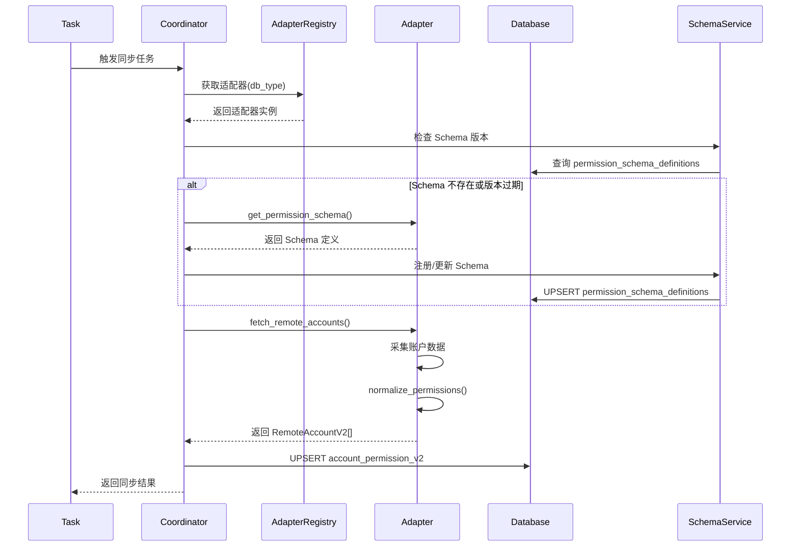
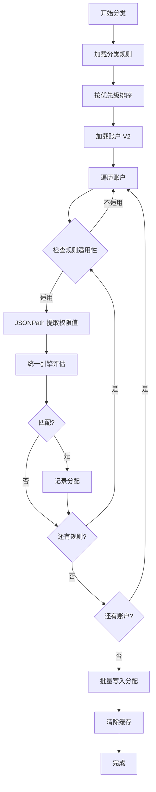

# 账户分类管理 V2 架构设计

> 版本: 2.0 | 状态: 设计中 | 作者: Kiro | 日期: 2024-12-30

## 1. 背景与问题分析

### 1.1 现有架构痛点

当前账户分类管理存在以下核心问题:

| 问题领域 | 具体问题 | 影响 |
|---------|---------|------|
| 数据存储 | `AccountPermission` 模型硬编码了 MySQL/PostgreSQL/SQLServer/Oracle 四种数据库的权限字段 | 新增数据库类型需要修改模型、迁移脚本、所有相关服务 |
| 权限配置 | `PermissionConfig` 仅支持预定义的权限类型 | 无法动态扩展权限维度 |
| 分类器 | 每种数据库类型需要独立的分类器实现 | 代码重复、维护成本高 |
| 规则引擎 | 规则表达式与数据库类型强耦合 | 规则复用性差 |
| 同步适配器 | 适配器返回的权限结构与模型字段一一对应 | 扩展性受限 |

### 1.2 现有数据模型分析

```python
# 当前 AccountPermission 模型 - 硬编码字段
class AccountPermission(BaseSyncData):
    # MySQL 权限字段
    global_privileges = db.Column(db.JSON)
    database_privileges = db.Column(db.JSON)
    
    # PostgreSQL 权限字段
    predefined_roles = db.Column(db.JSON)
    role_attributes = db.Column(db.JSON)
    database_privileges_pg = db.Column(db.JSON)
    tablespace_privileges = db.Column(db.JSON)
    
    # SQL Server 权限字段
    server_roles = db.Column(db.JSON)
    server_permissions = db.Column(db.JSON)
    database_roles = db.Column(db.JSON)
    database_permissions = db.Column(db.JSON)
    
    # Oracle 权限字段
    oracle_roles = db.Column(db.JSON)
    system_privileges = db.Column(db.JSON)
    tablespace_privileges_oracle = db.Column(db.JSON)
```

**问题**: 新增数据库类型(如 MongoDB、Redis、ClickHouse)需要:
1. 修改 `AccountPermission` 模型添加新字段
2. 创建数据库迁移脚本
3. 修改 `get_permissions_by_db_type()` 方法
4. 新增同步适配器
5. 新增分类器
6. 修改所有相关的 Repository/Service

---

## 2. V2 架构设计目标

### 2.1 核心目标

1. **可扩展性**: 新增数据库类型无需修改核心模型和迁移脚本
2. **配置驱动**: 权限结构、分类规则通过配置定义,非硬编码
3. **插件化**: 同步适配器、分类器支持插件式注册
4. **向后兼容**: 平滑迁移现有数据,不影响业务连续性

### 2.2 设计原则

- **Schema-less 权限存储**: 使用 JSON 存储动态权限结构
- **元数据驱动**: 权限维度、分类规则通过元数据配置
- **策略模式**: 分类逻辑与数据库类型解耦
- **适配器模式**: 统一的同步接口,可插拔的实现

---

## 3. 数据库存储架构 V2

### 3.1 核心模型重构


#### 3.1.1 账户权限快照表 (重构)

```sql
-- 新表: account_permission_v2
-- 核心思路: 权限数据统一存储在 JSON 字段,通过 permission_schema_id 关联元数据定义

CREATE TABLE account_permission_v2 (
    id SERIAL PRIMARY KEY,
    instance_id INTEGER NOT NULL REFERENCES instances(id),
    instance_account_id INTEGER NOT NULL REFERENCES instance_accounts(id),
    db_type VARCHAR(50) NOT NULL,
    username VARCHAR(255) NOT NULL,
    
    -- 通用属性
    is_superuser BOOLEAN DEFAULT FALSE,
    is_locked BOOLEAN DEFAULT FALSE,
    
    -- 统一权限存储 (Schema-less)
    permissions JSONB NOT NULL DEFAULT '{}',
    
    -- 权限快照版本 (用于变更追踪)
    permission_hash VARCHAR(64),
    
    -- 元数据
    last_sync_time TIMESTAMPTZ DEFAULT NOW(),
    last_change_type VARCHAR(20) DEFAULT 'add',
    last_change_time TIMESTAMPTZ DEFAULT NOW(),
    is_active BOOLEAN DEFAULT TRUE,
    created_at TIMESTAMPTZ DEFAULT NOW(),
    updated_at TIMESTAMPTZ DEFAULT NOW(),
    
    CONSTRAINT uq_account_permission_v2 UNIQUE (instance_id, db_type, username)
);

-- 索引优化
CREATE INDEX idx_ap_v2_instance_dbtype ON account_permission_v2(instance_id, db_type);
CREATE INDEX idx_ap_v2_username ON account_permission_v2(username);
CREATE INDEX idx_ap_v2_permissions ON account_permission_v2 USING GIN (permissions);
```

#### 3.1.2 权限结构元数据表 (新增)

```sql
-- 定义每种数据库类型的权限结构 schema
CREATE TABLE permission_schema_definitions (
    id SERIAL PRIMARY KEY,
    db_type VARCHAR(50) NOT NULL,
    schema_version VARCHAR(20) NOT NULL DEFAULT '1.0',
    
    -- 权限维度定义 (JSON Schema 格式)
    permission_dimensions JSONB NOT NULL,
    
    -- 示例:
    -- {
    --   "global_privileges": {"type": "object", "description": "全局权限"},
    --   "database_privileges": {"type": "object", "description": "数据库级权限"},
    --   "custom_dimension": {"type": "array", "description": "自定义维度"}
    -- }
    
    -- 权限值枚举定义
    permission_enums JSONB,
    
    -- 分类规则可用字段
    classifiable_fields JSONB,
    
    is_active BOOLEAN DEFAULT TRUE,
    created_at TIMESTAMPTZ DEFAULT NOW(),
    updated_at TIMESTAMPTZ DEFAULT NOW(),
    
    CONSTRAINT uq_permission_schema UNIQUE (db_type, schema_version)
);
```

#### 3.1.3 权限维度配置表 (新增)

```sql
-- 细粒度权限维度配置,替代硬编码的 PermissionConfig
CREATE TABLE permission_dimension_configs (
    id SERIAL PRIMARY KEY,
    schema_id INTEGER NOT NULL REFERENCES permission_schema_definitions(id),
    
    dimension_key VARCHAR(100) NOT NULL,  -- 如 'global_privileges', 'server_roles'
    dimension_name VARCHAR(200) NOT NULL, -- 显示名称
    dimension_type VARCHAR(50) NOT NULL,  -- 'list', 'object', 'nested_object'
    
    -- 该维度下的权限项定义
    permission_items JSONB NOT NULL,
    -- 示例:
    -- [
    --   {"name": "SELECT", "description": "查询权限", "risk_level": "low"},
    --   {"name": "SUPER", "description": "超级权限", "risk_level": "critical"}
    -- ]
    
    -- UI 展示配置
    display_config JSONB,
    
    sort_order INTEGER DEFAULT 0,
    is_active BOOLEAN DEFAULT TRUE,
    created_at TIMESTAMPTZ DEFAULT NOW(),
    updated_at TIMESTAMPTZ DEFAULT NOW(),
    
    CONSTRAINT uq_dimension_config UNIQUE (schema_id, dimension_key)
);
```

### 3.2 权限数据结构示例


#### MySQL 权限数据示例

```json
{
  "global_privileges": {
    "SELECT": true,
    "INSERT": true,
    "UPDATE": true,
    "DELETE": true,
    "SUPER": false,
    "GRANT": false
  },
  "database_privileges": {
    "mydb": {
      "SELECT": true,
      "INSERT": true,
      "CREATE": false
    },
    "testdb": {
      "ALL": true
    }
  },
  "table_privileges": {
    "mydb.users": {
      "SELECT": true,
      "UPDATE": true
    }
  },
  "roles": ["read_only", "app_user"]
}
```

#### MongoDB 权限数据示例 (新增类型)

```json
{
  "built_in_roles": ["read", "readWrite"],
  "database_roles": {
    "admin": ["userAdminAnyDatabase"],
    "mydb": ["dbOwner", "readWrite"]
  },
  "custom_roles": [
    {
      "role": "appRole",
      "db": "mydb",
      "privileges": [
        {"resource": {"db": "mydb", "collection": ""}, "actions": ["find", "insert"]}
      ]
    }
  ],
  "authentication_restrictions": []
}
```

#### ClickHouse 权限数据示例 (新增类型)

```json
{
  "grants": [
    {"privilege": "SELECT", "database": "*", "table": "*"},
    {"privilege": "INSERT", "database": "logs", "table": "*"}
  ],
  "roles": ["readonly", "analyst"],
  "settings_profile": "default",
  "quota": "default"
}
```

### 3.3 数据迁移策略

```sql
-- 迁移脚本: 将 V1 数据迁移到 V2 结构

-- Step 1: 创建 V2 表 (见上文)

-- Step 2: 迁移 MySQL 账户
INSERT INTO account_permission_v2 (
    instance_id, instance_account_id, db_type, username,
    is_superuser, is_locked, permissions, last_sync_time
)
SELECT 
    instance_id, instance_account_id, db_type, username,
    is_superuser, is_locked,
    jsonb_build_object(
        'global_privileges', COALESCE(global_privileges, '{}'),
        'database_privileges', COALESCE(database_privileges, '{}')
    ),
    last_sync_time
FROM account_permission
WHERE db_type = 'mysql';

-- Step 3: 迁移 PostgreSQL 账户
INSERT INTO account_permission_v2 (...)
SELECT 
    ...,
    jsonb_build_object(
        'predefined_roles', COALESCE(predefined_roles, '[]'),
        'role_attributes', COALESCE(role_attributes, '{}'),
        'database_privileges', COALESCE(database_privileges_pg, '{}'),
        'tablespace_privileges', COALESCE(tablespace_privileges, '{}')
    ),
    ...
FROM account_permission
WHERE db_type = 'postgresql';

-- Step 4: 类似处理 SQL Server 和 Oracle

-- Step 5: 验证数据完整性后,重命名表
-- ALTER TABLE account_permission RENAME TO account_permission_v1_backup;
-- ALTER TABLE account_permission_v2 RENAME TO account_permission;
```

---

## 4. 采集同步架构 V2

### 4.1 适配器接口重构


```python
# app/services/accounts_sync/adapters/base_adapter_v2.py

from abc import ABC, abstractmethod
from typing import Any, TypedDict

class PermissionSnapshot(TypedDict):
    """统一的权限快照结构"""
    dimensions: dict[str, Any]  # 权限维度数据
    metadata: dict[str, Any]    # 元数据 (采集时间、版本等)

class RemoteAccountV2(TypedDict):
    """V2 版本的远程账户结构"""
    username: str
    display_name: str | None
    is_superuser: bool
    is_locked: bool
    attributes: dict[str, Any]
    permissions: PermissionSnapshot  # 统一的权限结构

class BaseAccountAdapterV2(ABC):
    """V2 账户同步适配器基类"""
    
    # 适配器元数据
    db_type: str
    version: str = "2.0"
    
    @abstractmethod
    def get_permission_schema(self) -> dict[str, Any]:
        """返回该数据库类型的权限结构定义
        
        Returns:
            权限 schema 定义,用于:
            1. 验证采集到的权限数据
            2. 自动注册到 permission_schema_definitions 表
            3. 生成分类规则可用字段
        """
    
    @abstractmethod
    def fetch_remote_accounts(
        self, 
        instance: "Instance", 
        connection: object
    ) -> list[RemoteAccountV2]:
        """拉取远端账户信息 (统一返回 V2 结构)"""
    
    def normalize_permissions(
        self, 
        raw_permissions: dict[str, Any]
    ) -> PermissionSnapshot:
        """将原始权限数据标准化为统一结构
        
        子类可重写此方法处理特殊情况
        """
        return {
            "dimensions": raw_permissions,
            "metadata": {
                "adapter_version": self.version,
                "collected_at": datetime.now().isoformat()
            }
        }
```

### 4.2 适配器注册机制

```python
# app/services/accounts_sync/adapters/registry.py

from typing import Type
from .base_adapter_v2 import BaseAccountAdapterV2

class AdapterRegistry:
    """适配器注册中心 - 支持动态注册新数据库类型"""
    
    _adapters: dict[str, Type[BaseAccountAdapterV2]] = {}
    
    @classmethod
    def register(cls, db_type: str):
        """装饰器: 注册适配器"""
        def decorator(adapter_class: Type[BaseAccountAdapterV2]):
            cls._adapters[db_type.lower()] = adapter_class
            return adapter_class
        return decorator
    
    @classmethod
    def get(cls, db_type: str) -> BaseAccountAdapterV2 | None:
        """获取指定类型的适配器实例"""
        adapter_class = cls._adapters.get(db_type.lower())
        return adapter_class() if adapter_class else None
    
    @classmethod
    def list_supported_types(cls) -> list[str]:
        """列出所有支持的数据库类型"""
        return list(cls._adapters.keys())
    
    @classmethod
    def register_schema(cls, db_type: str) -> None:
        """将适配器的权限 schema 注册到数据库"""
        adapter = cls.get(db_type)
        if adapter:
            schema = adapter.get_permission_schema()
            # 写入 permission_schema_definitions 表
            PermissionSchemaDefinition.upsert(db_type, schema)


# 使用示例
@AdapterRegistry.register("mongodb")
class MongoDBAccountAdapter(BaseAccountAdapterV2):
    db_type = "mongodb"
    
    def get_permission_schema(self) -> dict[str, Any]:
        return {
            "dimensions": {
                "built_in_roles": {"type": "array", "items": {"type": "string"}},
                "database_roles": {"type": "object"},
                "custom_roles": {"type": "array"},
                "authentication_restrictions": {"type": "array"}
            },
            "classifiable_fields": [
                "built_in_roles",
                "database_roles.*",
                "custom_roles[].role"
            ]
        }
    
    def fetch_remote_accounts(self, instance, connection) -> list[RemoteAccountV2]:
        # MongoDB 特定的账户采集逻辑
        ...
```

### 4.3 同步流程 V2



---

## 5. 规则配置架构 V2

### 5.1 规则模型重构


```sql
-- 分类规则表 V2
CREATE TABLE classification_rules_v2 (
    id SERIAL PRIMARY KEY,
    classification_id INTEGER NOT NULL REFERENCES account_classifications(id),
    
    -- 规则基础信息
    rule_name VARCHAR(100) NOT NULL,
    description TEXT,
    
    -- 适用范围 (支持多数据库类型)
    applicable_db_types VARCHAR(255)[] NOT NULL,  -- ['mysql', 'postgresql'] 或 ['*'] 表示全部
    
    -- 规则表达式 V2 (统一格式)
    rule_expression JSONB NOT NULL,
    
    -- 规则元数据
    priority INTEGER DEFAULT 0,
    is_active BOOLEAN DEFAULT TRUE,
    created_at TIMESTAMPTZ DEFAULT NOW(),
    updated_at TIMESTAMPTZ DEFAULT NOW()
);

-- 规则表达式索引
CREATE INDEX idx_rules_v2_expression ON classification_rules_v2 USING GIN (rule_expression);
CREATE INDEX idx_rules_v2_db_types ON classification_rules_v2 USING GIN (applicable_db_types);
```

### 5.2 统一规则表达式格式

```typescript
// 规则表达式 JSON Schema

interface RuleExpressionV2 {
  // 逻辑运算符
  operator: "AND" | "OR";
  
  // 条件列表
  conditions: RuleCondition[];
  
  // 嵌套规则组 (支持复杂逻辑)
  groups?: RuleExpressionV2[];
}

interface RuleCondition {
  // 权限维度路径 (支持 JSONPath 语法)
  field: string;  // 如 "global_privileges.SELECT", "roles[*]", "database_roles.mydb"
  
  // 比较操作符
  operator: 
    | "equals"           // 精确匹配
    | "not_equals"       // 不等于
    | "contains"         // 包含 (用于数组/字符串)
    | "not_contains"     // 不包含
    | "in"               // 在列表中
    | "not_in"           // 不在列表中
    | "exists"           // 字段存在
    | "not_exists"       // 字段不存在
    | "greater_than"     // 大于 (用于数值)
    | "less_than"        // 小于
    | "regex"            // 正则匹配
    | "has_any"          // 数组包含任一
    | "has_all";         // 数组包含全部
  
  // 比较值
  value: any;
  
  // 是否取反
  negate?: boolean;
}
```

### 5.3 规则表达式示例

#### 示例 1: 特权账户规则 (跨数据库类型)

```json
{
  "operator": "OR",
  "conditions": [
    {
      "field": "is_superuser",
      "operator": "equals",
      "value": true
    },
    {
      "field": "global_privileges.SUPER",
      "operator": "equals",
      "value": true
    },
    {
      "field": "server_roles",
      "operator": "contains",
      "value": "sysadmin"
    },
    {
      "field": "built_in_roles",
      "operator": "has_any",
      "value": ["root", "dbOwner", "userAdminAnyDatabase"]
    }
  ]
}
```

#### 示例 2: 只读账户规则

```json
{
  "operator": "AND",
  "conditions": [
    {
      "field": "global_privileges.SELECT",
      "operator": "equals",
      "value": true
    },
    {
      "field": "global_privileges.INSERT",
      "operator": "not_equals",
      "value": true
    },
    {
      "field": "global_privileges.UPDATE",
      "operator": "not_equals",
      "value": true
    },
    {
      "field": "global_privileges.DELETE",
      "operator": "not_equals",
      "value": true
    }
  ]
}
```

#### 示例 3: 复杂嵌套规则

```json
{
  "operator": "AND",
  "conditions": [
    {
      "field": "is_locked",
      "operator": "equals",
      "value": false
    }
  ],
  "groups": [
    {
      "operator": "OR",
      "conditions": [
        {
          "field": "roles",
          "operator": "has_any",
          "value": ["admin", "dba"]
        },
        {
          "field": "database_privileges.*.ALL",
          "operator": "equals",
          "value": true
        }
      ]
    }
  ]
}
```

### 5.4 规则字段自动发现

```python
# app/services/account_classification/field_discovery.py

class RuleFieldDiscoveryService:
    """根据权限 Schema 自动发现可用的规则字段"""
    
    def discover_fields(self, db_type: str) -> list[FieldDefinition]:
        """发现指定数据库类型的可用规则字段"""
        schema = PermissionSchemaDefinition.get_by_db_type(db_type)
        if not schema:
            return []
        
        fields = []
        for dimension_key, dimension_def in schema.permission_dimensions.items():
            fields.extend(self._extract_fields(dimension_key, dimension_def))
        
        return fields
    
    def _extract_fields(
        self, 
        prefix: str, 
        definition: dict
    ) -> list[FieldDefinition]:
        """递归提取字段定义"""
        fields = []
        field_type = definition.get("type")
        
        if field_type == "object":
            # 对象类型: 添加通配符路径
            fields.append(FieldDefinition(
                path=f"{prefix}.*",
                type="wildcard",
                description=f"{prefix} 下的任意键"
            ))
            # 递归处理子属性
            for key, sub_def in definition.get("properties", {}).items():
                fields.extend(self._extract_fields(f"{prefix}.{key}", sub_def))
        
        elif field_type == "array":
            fields.append(FieldDefinition(
                path=f"{prefix}[*]",
                type="array_item",
                description=f"{prefix} 数组中的任意元素"
            ))
        
        else:
            fields.append(FieldDefinition(
                path=prefix,
                type=field_type,
                description=definition.get("description", "")
            ))
        
        return fields
```

---

## 6. 分类引擎架构 V2

### 6.1 统一分类器


```python
# app/services/account_classification/engine_v2.py

from typing import Any
import jsonpath_ng
from jsonpath_ng.ext import parse as jsonpath_parse

class UnifiedClassificationEngine:
    """统一分类引擎 - 不再需要为每种数据库类型编写分类器"""
    
    def evaluate(
        self, 
        permissions: dict[str, Any], 
        rule_expression: dict[str, Any]
    ) -> bool:
        """评估账户权限是否满足规则表达式
        
        Args:
            permissions: 账户的权限数据 (统一 JSON 结构)
            rule_expression: V2 格式的规则表达式
            
        Returns:
            是否满足规则
        """
        operator = rule_expression.get("operator", "AND")
        conditions = rule_expression.get("conditions", [])
        groups = rule_expression.get("groups", [])
        
        # 评估所有条件
        condition_results = [
            self._evaluate_condition(permissions, cond) 
            for cond in conditions
        ]
        
        # 评估嵌套规则组
        group_results = [
            self.evaluate(permissions, group) 
            for group in groups
        ]
        
        all_results = condition_results + group_results
        
        if not all_results:
            return True  # 空规则默认匹配
        
        if operator == "AND":
            return all(all_results)
        else:  # OR
            return any(all_results)
    
    def _evaluate_condition(
        self, 
        permissions: dict[str, Any], 
        condition: dict[str, Any]
    ) -> bool:
        """评估单个条件"""
        field = condition.get("field", "")
        op = condition.get("operator", "equals")
        value = condition.get("value")
        negate = condition.get("negate", False)
        
        # 使用 JSONPath 提取字段值
        actual_values = self._extract_field_values(permissions, field)
        
        # 执行比较
        result = self._compare(actual_values, op, value)
        
        return not result if negate else result
    
    def _extract_field_values(
        self, 
        data: dict[str, Any], 
        field_path: str
    ) -> list[Any]:
        """使用 JSONPath 提取字段值"""
        # 转换简化路径为 JSONPath
        jsonpath_expr = self._to_jsonpath(field_path)
        
        try:
            matches = jsonpath_parse(jsonpath_expr).find(data)
            return [match.value for match in matches]
        except Exception:
            return []
    
    def _to_jsonpath(self, field_path: str) -> str:
        """将简化路径转换为 JSONPath 表达式
        
        Examples:
            "global_privileges.SELECT" -> "$.global_privileges.SELECT"
            "roles[*]" -> "$.roles[*]"
            "database_privileges.*.ALL" -> "$.database_privileges.*.ALL"
        """
        if not field_path.startswith("$"):
            field_path = f"$.{field_path}"
        return field_path
    
    def _compare(
        self, 
        actual_values: list[Any], 
        operator: str, 
        expected: Any
    ) -> bool:
        """执行比较操作"""
        if operator == "exists":
            return len(actual_values) > 0
        
        if operator == "not_exists":
            return len(actual_values) == 0
        
        if not actual_values:
            return False
        
        # 对于单值比较,取第一个匹配值
        actual = actual_values[0] if len(actual_values) == 1 else actual_values
        
        comparators = {
            "equals": lambda a, e: a == e,
            "not_equals": lambda a, e: a != e,
            "contains": lambda a, e: e in a if isinstance(a, (list, str)) else False,
            "not_contains": lambda a, e: e not in a if isinstance(a, (list, str)) else True,
            "in": lambda a, e: a in e if isinstance(e, list) else False,
            "not_in": lambda a, e: a not in e if isinstance(e, list) else True,
            "greater_than": lambda a, e: a > e,
            "less_than": lambda a, e: a < e,
            "regex": lambda a, e: bool(re.match(e, str(a))),
            "has_any": lambda a, e: bool(set(a) & set(e)) if isinstance(a, list) else False,
            "has_all": lambda a, e: set(e).issubset(set(a)) if isinstance(a, list) else False,
        }
        
        comparator = comparators.get(operator, lambda a, e: False)
        
        # 如果有多个匹配值,任一满足即可
        if isinstance(actual, list) and operator not in ("has_any", "has_all", "contains"):
            return any(comparator(v, expected) for v in actual)
        
        return comparator(actual, expected)
```

### 6.2 分类编排器 V2

```python
# app/services/account_classification/orchestrator_v2.py

class AccountClassificationServiceV2:
    """V2 分类编排服务"""
    
    def __init__(self):
        self.engine = UnifiedClassificationEngine()
        self.repository = ClassificationRepositoryV2()
        self.cache = ClassificationCache()
    
    def auto_classify_accounts(
        self,
        instance_id: int | None = None,
        db_types: list[str] | None = None
    ) -> ClassificationResult:
        """执行自动分类
        
        Args:
            instance_id: 限定实例 ID
            db_types: 限定数据库类型列表
        """
        # 1. 加载规则 (按优先级排序)
        rules = self._load_rules(db_types)
        
        # 2. 加载账户 (使用 V2 表)
        accounts = self.repository.fetch_accounts_v2(instance_id, db_types)
        
        # 3. 清理旧分配
        self.repository.cleanup_assignments(instance_id, db_types)
        
        # 4. 执行分类
        assignments = []
        for account in accounts:
            matched_rules = self._find_matching_rules(account, rules)
            for rule in matched_rules:
                assignments.append({
                    "account_id": account.id,
                    "classification_id": rule.classification_id,
                    "rule_id": rule.id,
                    "confidence_score": 1.0
                })
        
        # 5. 批量写入分配
        self.repository.bulk_upsert_assignments(assignments)
        
        return ClassificationResult(
            total_accounts=len(accounts),
            total_rules=len(rules),
            total_assignments=len(assignments)
        )
    
    def _find_matching_rules(
        self, 
        account: AccountPermissionV2, 
        rules: list[ClassificationRuleV2]
    ) -> list[ClassificationRuleV2]:
        """找出账户匹配的所有规则"""
        matched = []
        permissions = account.permissions.get("dimensions", {})
        
        for rule in rules:
            # 检查规则是否适用于该数据库类型
            if not self._rule_applies_to_db_type(rule, account.db_type):
                continue
            
            # 评估规则
            if self.engine.evaluate(permissions, rule.rule_expression):
                matched.append(rule)
        
        return matched
    
    def _rule_applies_to_db_type(
        self, 
        rule: ClassificationRuleV2, 
        db_type: str
    ) -> bool:
        """检查规则是否适用于指定数据库类型"""
        applicable = rule.applicable_db_types
        return "*" in applicable or db_type.lower() in [t.lower() for t in applicable]
```

### 6.3 分类流程 V2



---

## 7. 新增数据库类型流程

### 7.1 扩展步骤 (V2 vs V1 对比)


| 步骤 | V1 架构 | V2 架构 |
|-----|---------|---------|
| 1. 数据模型 | 修改 `AccountPermission` 添加新字段 | ❌ 无需修改 |
| 2. 数据库迁移 | 创建迁移脚本添加列 | ❌ 无需迁移 |
| 3. 权限配置 | 修改 `PermissionConfig` 或 SQL 初始化 | ✅ 适配器自动注册 Schema |
| 4. 同步适配器 | 新增适配器 + 修改工厂 | ✅ 新增适配器 + 装饰器注册 |
| 5. 分类器 | 新增分类器 + 修改工厂 | ❌ 无需新增 (统一引擎) |
| 6. 规则配置 | 新增数据库类型专用规则 | ✅ 可复用跨类型规则 |
| 7. UI 适配 | 修改多处模板/组件 | ✅ 自动根据 Schema 渲染 |

### 7.2 新增 MongoDB 支持示例

```python
# app/services/accounts_sync/adapters/mongodb_adapter.py

from .registry import AdapterRegistry
from .base_adapter_v2 import BaseAccountAdapterV2, RemoteAccountV2

@AdapterRegistry.register("mongodb")
class MongoDBAccountAdapter(BaseAccountAdapterV2):
    """MongoDB 账户同步适配器"""
    
    db_type = "mongodb"
    
    def get_permission_schema(self) -> dict:
        return {
            "schema_version": "1.0",
            "permission_dimensions": {
                "built_in_roles": {
                    "type": "array",
                    "items": {"type": "string"},
                    "description": "内置角色列表"
                },
                "database_roles": {
                    "type": "object",
                    "additionalProperties": {
                        "type": "array",
                        "items": {"type": "string"}
                    },
                    "description": "数据库级角色"
                },
                "custom_roles": {
                    "type": "array",
                    "items": {
                        "type": "object",
                        "properties": {
                            "role": {"type": "string"},
                            "db": {"type": "string"},
                            "privileges": {"type": "array"}
                        }
                    },
                    "description": "自定义角色"
                }
            },
            "classifiable_fields": [
                "built_in_roles",
                "database_roles.*",
                "custom_roles[*].role"
            ],
            "permission_enums": {
                "built_in_roles": [
                    "read", "readWrite", "dbAdmin", "dbOwner",
                    "userAdmin", "clusterAdmin", "root"
                ]
            }
        }
    
    def fetch_remote_accounts(
        self, 
        instance: "Instance", 
        connection
    ) -> list[RemoteAccountV2]:
        """采集 MongoDB 用户"""
        db = connection.admin
        users = db.command("usersInfo")["users"]
        
        return [
            self._normalize_user(instance, user) 
            for user in users
        ]
    
    def _normalize_user(
        self, 
        instance: "Instance", 
        user: dict
    ) -> RemoteAccountV2:
        """标准化 MongoDB 用户数据"""
        roles = user.get("roles", [])
        
        # 分离内置角色和数据库角色
        built_in = []
        db_roles = {}
        for role in roles:
            role_name = role.get("role")
            role_db = role.get("db", "admin")
            
            if role_db == "admin" and role_name in self._BUILTIN_ROLES:
                built_in.append(role_name)
            else:
                db_roles.setdefault(role_db, []).append(role_name)
        
        return {
            "username": user["user"],
            "display_name": user.get("customData", {}).get("displayName"),
            "is_superuser": "root" in built_in,
            "is_locked": False,  # MongoDB 无锁定概念
            "attributes": {
                "auth_db": user.get("db", "admin"),
                "mechanisms": user.get("mechanisms", [])
            },
            "permissions": self.normalize_permissions({
                "built_in_roles": built_in,
                "database_roles": db_roles,
                "custom_roles": user.get("customData", {}).get("customRoles", [])
            })
        }
    
    _BUILTIN_ROLES = {
        "read", "readWrite", "dbAdmin", "dbOwner", "userAdmin",
        "clusterAdmin", "clusterManager", "clusterMonitor",
        "hostManager", "backup", "restore", "root"
    }
```

### 7.3 新增 ClickHouse 支持示例

```python
# app/services/accounts_sync/adapters/clickhouse_adapter.py

@AdapterRegistry.register("clickhouse")
class ClickHouseAccountAdapter(BaseAccountAdapterV2):
    """ClickHouse 账户同步适配器"""
    
    db_type = "clickhouse"
    
    def get_permission_schema(self) -> dict:
        return {
            "schema_version": "1.0",
            "permission_dimensions": {
                "grants": {
                    "type": "array",
                    "items": {
                        "type": "object",
                        "properties": {
                            "privilege": {"type": "string"},
                            "database": {"type": "string"},
                            "table": {"type": "string"}
                        }
                    },
                    "description": "权限授予列表"
                },
                "roles": {
                    "type": "array",
                    "items": {"type": "string"},
                    "description": "角色列表"
                },
                "settings_profile": {
                    "type": "string",
                    "description": "设置配置文件"
                },
                "quota": {
                    "type": "string",
                    "description": "配额名称"
                }
            },
            "classifiable_fields": [
                "grants[*].privilege",
                "grants[*].database",
                "roles",
                "settings_profile"
            ]
        }
    
    def fetch_remote_accounts(
        self, 
        instance: "Instance", 
        connection
    ) -> list[RemoteAccountV2]:
        """采集 ClickHouse 用户"""
        cursor = connection.cursor()
        
        # 查询用户列表
        cursor.execute("SELECT name FROM system.users")
        users = cursor.fetchall()
        
        result = []
        for (username,) in users:
            grants = self._fetch_grants(cursor, username)
            roles = self._fetch_roles(cursor, username)
            
            result.append({
                "username": username,
                "display_name": None,
                "is_superuser": self._is_superuser(grants),
                "is_locked": False,
                "attributes": {},
                "permissions": self.normalize_permissions({
                    "grants": grants,
                    "roles": roles,
                    "settings_profile": self._get_profile(cursor, username),
                    "quota": self._get_quota(cursor, username)
                })
            })
        
        return result
```

---

## 8. API 接口设计 V2

### 8.1 权限 Schema 管理 API


```http
# 获取所有权限 Schema
GET /api/v2/permission-schemas
Response:
{
  "success": true,
  "data": [
    {
      "db_type": "mysql",
      "schema_version": "1.0",
      "permission_dimensions": {...},
      "classifiable_fields": [...]
    },
    {
      "db_type": "mongodb",
      "schema_version": "1.0",
      ...
    }
  ]
}

# 获取指定类型的可用规则字段
GET /api/v2/permission-schemas/{db_type}/fields
Response:
{
  "success": true,
  "data": {
    "fields": [
      {"path": "global_privileges.*", "type": "wildcard", "description": "全局权限"},
      {"path": "database_privileges.*.SELECT", "type": "boolean", "description": "数据库SELECT权限"},
      {"path": "roles", "type": "array", "description": "角色列表"}
    ]
  }
}
```

### 8.2 分类规则 API V2

```http
# 创建跨数据库类型规则
POST /api/v2/classification-rules
Content-Type: application/json
{
  "classification_id": 1,
  "rule_name": "特权账户识别",
  "applicable_db_types": ["mysql", "postgresql", "mongodb"],
  "rule_expression": {
    "operator": "OR",
    "conditions": [
      {"field": "is_superuser", "operator": "equals", "value": true},
      {"field": "global_privileges.SUPER", "operator": "equals", "value": true},
      {"field": "built_in_roles", "operator": "has_any", "value": ["root", "dbOwner"]}
    ]
  },
  "priority": 100
}

# 验证规则表达式
POST /api/v2/classification-rules/validate
Content-Type: application/json
{
  "db_type": "mysql",
  "rule_expression": {...},
  "sample_permissions": {...}  // 可选: 用于测试
}
Response:
{
  "success": true,
  "data": {
    "valid": true,
    "field_coverage": ["global_privileges.SUPER", "is_superuser"],
    "test_result": true  // 如果提供了 sample_permissions
  }
}
```

### 8.3 账户权限查询 API V2

```http
# 查询账户权限 (统一结构)
GET /api/v2/accounts/{account_id}/permissions
Response:
{
  "success": true,
  "data": {
    "account_id": 123,
    "username": "app_user",
    "db_type": "mysql",
    "permissions": {
      "dimensions": {
        "global_privileges": {"SELECT": true, "INSERT": true},
        "database_privileges": {...}
      },
      "metadata": {
        "collected_at": "2024-12-30T10:00:00Z",
        "adapter_version": "2.0"
      }
    },
    "classifications": [
      {"id": 1, "name": "应用账户", "rule_name": "应用账户识别"}
    ]
  }
}

# 批量查询账户权限
POST /api/v2/accounts/permissions/batch
Content-Type: application/json
{
  "account_ids": [123, 456, 789],
  "include_classifications": true
}
```

---

## 9. 前端适配方案

### 9.1 动态表单生成

```typescript
// 根据权限 Schema 动态生成规则配置表单

interface FieldOption {
  path: string;
  type: string;
  description: string;
  enumValues?: string[];
}

async function loadRuleFieldOptions(dbType: string): Promise<FieldOption[]> {
  const response = await fetch(`/api/v2/permission-schemas/${dbType}/fields`);
  const data = await response.json();
  return data.data.fields;
}

// 规则条件编辑器组件
function RuleConditionEditor({ dbTypes, onChange }) {
  const [fields, setFields] = useState<FieldOption[]>([]);
  
  useEffect(() => {
    // 合并多个数据库类型的字段
    const loadFields = async () => {
      const allFields = await Promise.all(
        dbTypes.map(t => loadRuleFieldOptions(t))
      );
      // 去重并标记通用字段
      setFields(mergeFields(allFields));
    };
    loadFields();
  }, [dbTypes]);
  
  return (
    <div className="rule-condition-editor">
      <Select 
        options={fields.map(f => ({ value: f.path, label: f.description }))}
        onChange={handleFieldChange}
      />
      <Select options={OPERATORS} onChange={handleOperatorChange} />
      <ValueInput field={selectedField} onChange={handleValueChange} />
    </div>
  );
}
```

### 9.2 权限展示组件

```typescript
// 通用权限展示组件 - 根据 Schema 动态渲染

function PermissionViewer({ dbType, permissions }) {
  const [schema, setSchema] = useState(null);
  
  useEffect(() => {
    fetch(`/api/v2/permission-schemas/${dbType}`)
      .then(r => r.json())
      .then(data => setSchema(data.data));
  }, [dbType]);
  
  if (!schema) return <Loading />;
  
  return (
    <div className="permission-viewer">
      {Object.entries(schema.permission_dimensions).map(([key, def]) => (
        <PermissionDimension
          key={key}
          dimensionKey={key}
          definition={def}
          value={permissions.dimensions[key]}
        />
      ))}
    </div>
  );
}

function PermissionDimension({ dimensionKey, definition, value }) {
  const { type, description } = definition;
  
  if (type === 'object') {
    return <ObjectPermissionView data={value} />;
  }
  if (type === 'array') {
    return <ArrayPermissionView items={value} />;
  }
  return <SimplePermissionView value={value} />;
}
```

---

## 10. 迁移计划

### 10.1 阶段划分


| 阶段 | 内容 | 预计周期 | 风险等级 |
|-----|------|---------|---------|
| Phase 1 | 数据模型 V2 + 迁移脚本 | 1 周 | 中 |
| Phase 2 | 适配器注册机制 + 现有适配器改造 | 1 周 | 低 |
| Phase 3 | 统一分类引擎 + 规则迁移 | 1 周 | 中 |
| Phase 4 | API V2 + 前端适配 | 1 周 | 低 |
| Phase 5 | 灰度发布 + 数据验证 | 1 周 | 中 |
| Phase 6 | 全量切换 + V1 下线 | 1 周 | 高 |

### 10.2 Phase 1: 数据模型迁移

```python
# migrations/versions/xxx_add_account_permission_v2.py

def upgrade():
    # 1. 创建 V2 表
    op.create_table(
        'account_permission_v2',
        sa.Column('id', sa.Integer(), primary_key=True),
        sa.Column('instance_id', sa.Integer(), nullable=False),
        sa.Column('instance_account_id', sa.Integer(), nullable=False),
        sa.Column('db_type', sa.String(50), nullable=False),
        sa.Column('username', sa.String(255), nullable=False),
        sa.Column('is_superuser', sa.Boolean(), default=False),
        sa.Column('is_locked', sa.Boolean(), default=False),
        sa.Column('permissions', JSONB(), nullable=False, server_default='{}'),
        sa.Column('permission_hash', sa.String(64)),
        sa.Column('last_sync_time', sa.DateTime(timezone=True)),
        sa.Column('is_active', sa.Boolean(), default=True),
        sa.Column('created_at', sa.DateTime(timezone=True)),
        sa.Column('updated_at', sa.DateTime(timezone=True)),
    )
    
    # 2. 创建 Schema 定义表
    op.create_table(
        'permission_schema_definitions',
        sa.Column('id', sa.Integer(), primary_key=True),
        sa.Column('db_type', sa.String(50), nullable=False),
        sa.Column('schema_version', sa.String(20), nullable=False),
        sa.Column('permission_dimensions', JSONB(), nullable=False),
        sa.Column('permission_enums', JSONB()),
        sa.Column('classifiable_fields', JSONB()),
        sa.Column('is_active', sa.Boolean(), default=True),
        sa.Column('created_at', sa.DateTime(timezone=True)),
        sa.Column('updated_at', sa.DateTime(timezone=True)),
    )
    
    # 3. 创建索引
    op.create_index('idx_ap_v2_instance_dbtype', 'account_permission_v2', 
                    ['instance_id', 'db_type'])
    op.create_index('idx_ap_v2_permissions', 'account_permission_v2', 
                    ['permissions'], postgresql_using='gin')

def downgrade():
    op.drop_table('permission_schema_definitions')
    op.drop_table('account_permission_v2')
```

### 10.3 Phase 2: 双写策略

```python
# app/services/accounts_sync/dual_write_service.py

class DualWriteService:
    """双写服务 - 同时写入 V1 和 V2 表"""
    
    def __init__(self):
        self.v1_repo = AccountPermissionRepository()
        self.v2_repo = AccountPermissionV2Repository()
        self.feature_flag = FeatureFlags.get("account_permission_v2")
    
    def save_account_permission(
        self, 
        account_data: dict, 
        db_type: str
    ) -> None:
        """保存账户权限 (双写)"""
        # 始终写入 V1
        self.v1_repo.save(account_data, db_type)
        
        # 如果启用 V2,同时写入
        if self.feature_flag.is_enabled():
            v2_data = self._convert_to_v2(account_data, db_type)
            self.v2_repo.save(v2_data)
    
    def _convert_to_v2(self, v1_data: dict, db_type: str) -> dict:
        """将 V1 数据转换为 V2 格式"""
        permissions = {}
        
        if db_type == "mysql":
            permissions = {
                "global_privileges": v1_data.get("global_privileges", {}),
                "database_privileges": v1_data.get("database_privileges", {})
            }
        elif db_type == "postgresql":
            permissions = {
                "predefined_roles": v1_data.get("predefined_roles", []),
                "role_attributes": v1_data.get("role_attributes", {}),
                "database_privileges": v1_data.get("database_privileges_pg", {}),
                "tablespace_privileges": v1_data.get("tablespace_privileges", {})
            }
        # ... 其他类型
        
        return {
            "instance_id": v1_data["instance_id"],
            "username": v1_data["username"],
            "db_type": db_type,
            "is_superuser": v1_data.get("is_superuser", False),
            "is_locked": v1_data.get("is_locked", False),
            "permissions": {
                "dimensions": permissions,
                "metadata": {"migrated_from": "v1"}
            }
        }
```

### 10.4 Phase 5: 数据一致性验证

```python
# scripts/verify_v2_migration.py

def verify_data_consistency():
    """验证 V1 和 V2 数据一致性"""
    v1_accounts = AccountPermission.query.all()
    v2_accounts = {
        (a.instance_id, a.username): a 
        for a in AccountPermissionV2.query.all()
    }
    
    mismatches = []
    for v1 in v1_accounts:
        key = (v1.instance_id, v1.username)
        v2 = v2_accounts.get(key)
        
        if not v2:
            mismatches.append({"type": "missing", "v1_id": v1.id})
            continue
        
        # 比较权限数据
        v1_perms = v1.get_permissions_by_db_type()
        v2_perms = v2.permissions.get("dimensions", {})
        
        if not permissions_equal(v1_perms, v2_perms):
            mismatches.append({
                "type": "mismatch",
                "v1_id": v1.id,
                "v2_id": v2.id,
                "diff": compute_diff(v1_perms, v2_perms)
            })
    
    return {
        "total_v1": len(v1_accounts),
        "total_v2": len(v2_accounts),
        "mismatches": mismatches,
        "consistency_rate": 1 - len(mismatches) / len(v1_accounts)
    }
```

---

## 11. 性能优化

### 11.1 索引策略

```sql
-- JSONB GIN 索引优化查询
CREATE INDEX idx_ap_v2_permissions_path ON account_permission_v2 
    USING GIN ((permissions -> 'dimensions'));

-- 常用查询路径的表达式索引
CREATE INDEX idx_ap_v2_superuser ON account_permission_v2 
    ((permissions -> 'dimensions' ->> 'is_superuser'));

-- 规则表达式索引
CREATE INDEX idx_rules_v2_conditions ON classification_rules_v2 
    USING GIN ((rule_expression -> 'conditions'));
```

### 11.2 缓存策略

```python
# 权限 Schema 缓存
SCHEMA_CACHE_TTL = 3600  # 1 小时

# 规则缓存 (按数据库类型分片)
RULES_CACHE_KEY = "classification:rules:v2:{db_type}"
RULES_CACHE_TTL = 300  # 5 分钟

# 字段发现结果缓存
FIELDS_CACHE_KEY = "classification:fields:{db_type}"
FIELDS_CACHE_TTL = 3600
```

---

## 12. 总结

### 12.1 V2 架构优势

1. **零迁移扩展**: 新增数据库类型无需数据库迁移
2. **配置驱动**: 权限结构通过 Schema 定义,非硬编码
3. **统一引擎**: 一套分类引擎支持所有数据库类型
4. **规则复用**: 跨数据库类型的通用规则
5. **动态 UI**: 前端根据 Schema 自动渲染

### 12.2 风险与缓解

| 风险 | 缓解措施 |
|-----|---------|
| JSONB 查询性能 | GIN 索引 + 表达式索引 |
| 数据迁移失败 | 双写策略 + 一致性验证 |
| 规则兼容性 | 规则表达式验证 API |
| 前端适配工作量 | 通用组件 + Schema 驱动渲染 |

### 12.3 后续演进方向

- 支持规则版本管理和回滚
- 引入机器学习辅助分类
- 支持自定义分类维度
- 跨实例的权限对比分析
