# 账户与权限域(Accounts + Permissions) 研发图表包

> 状态: Draft
> 负责人: WhaleFall Team
> 创建: 2026-01-06
> 更新: 2026-01-06
> 范围: 研发视角, accounts/permissions 写入与读取链路
> 关联: ./spec.md; ./flows/whalefall-data-sync-flows.md; ../plans/2025-12-30-account-permissions-refactor-v4.md

## 1. 目标

- 让研发在 10 分钟内回答: "账户从外部 DB 进来后, 如何落库, 如何被读取, 失败怎么定位".
- 图表与代码落点一一对应, 用于 code review, 拆域重构, 排障.

## 2. 域边界

### 2.1 In scope

- Inventory(清单阶段): 维护 `instance_accounts`(账户存在性, is_active 生命周期).
- Permissions(权限阶段): 写 `account_permission.permission_snapshot(version=4)` 与 `account_permission.permission_facts`.
- Change log: 写 `account_change_log`(差异日志, 仅 change_type != "none").
- Sessions(批量/任务模式): 写 `sync_sessions`/`sync_instance_records` 追踪进度与结果.

### 2.2 Out of scope(但有依赖)

- 账户分类: 读取 `permission_facts` 作为规则输入(见 `docs/architecture/account-classification-v2-design.md`).
- 标签: 台账读取会关联 instance tags(见 `app/repositories/ledgers/accounts_ledger_repository.py`).

## 3. 组件与依赖(代码落点)

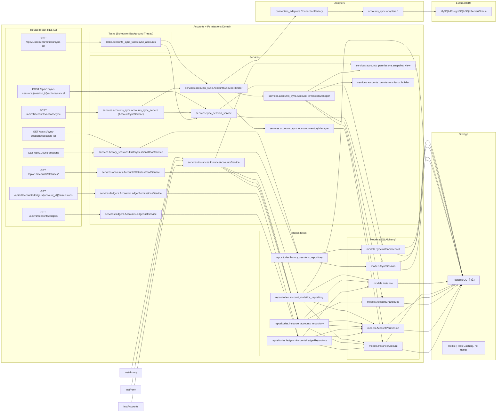

代码入口参考:

- 单实例同步: `app/api/v1/namespaces/accounts.py` -> `AccountsSyncInstanceActionResource.post` -> `AccountSyncService.sync_accounts`.
- 全量批量同步: `app/api/v1/namespaces/accounts.py` -> `AccountsSyncAllResource.post` -> background thread -> `app/tasks/accounts_sync_tasks.py::sync_accounts`.
- 台账读取: `app/api/v1/namespaces/accounts.py` -> `AccountsLedgersListResource.get` / `AccountsLedgersPermissionsResource.get`.

## 4. 数据模型(ERD)

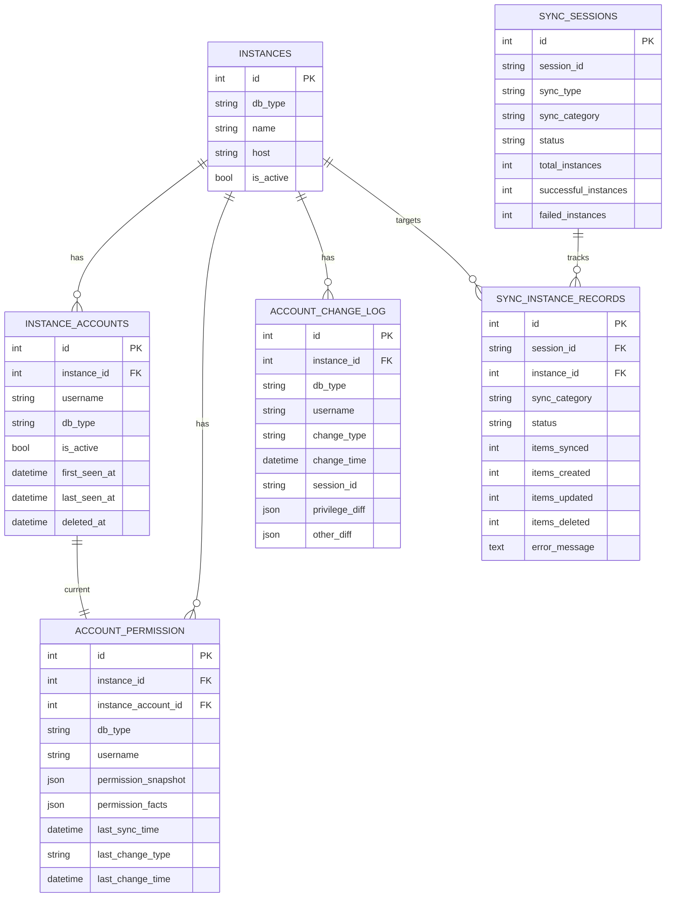

关键约束(落库一致性):

- `instance_accounts` 唯一约束: `(instance_id, db_type, username)`.
- `account_permission` 唯一约束: `(instance_id, db_type, username)`, 且必须关联 `instance_account_id`.
- `account_change_log` 不做 `account_permission` 外键, 通过 `(instance_id, db_type, username)` 逻辑关联.
- `sync_sessions` 唯一约束: `session_id`.
- `sync_instance_records.session_id` 外键指向 `sync_sessions.session_id`(注意不是 `sync_sessions.id`).
- `permission_snapshot` 仅支持 `version = 4`, 读取端不做 legacy fallback(见 `app/services/accounts_permissions/snapshot_view.py`).

## 5. 写入链路: 账户同步(Inventory + Permissions)

### 5.1 主流程(概览)

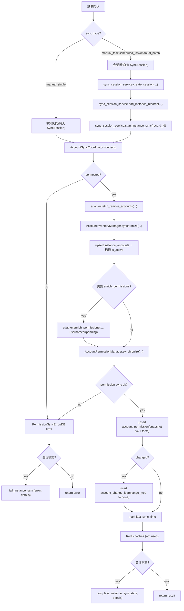

事务边界(研发需要知道):

- API 路由通过 `safe_route_call` 统一 `commit/rollback`(见 `app/utils/route_safety.py::safe_route_call`).
- `AccountInventoryManager` 与 `AccountPermissionManager` 内部使用 `db.session.begin_nested()` 形成 savepoint, 但不负责最终 `commit`.
- `tasks.accounts_sync_tasks.sync_accounts` 在每个实例执行前后显式 `db.session.commit()`.

### 5.2 时序图: 单实例同步(manual_single)

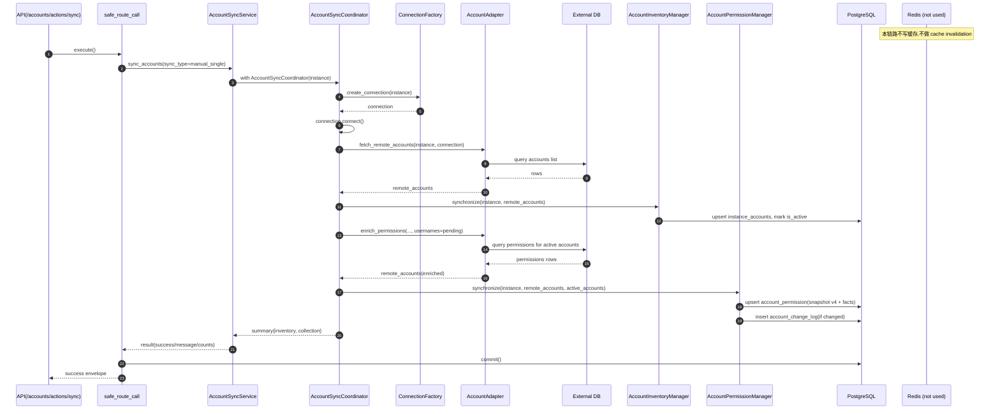

### 5.3 时序图: 全量批量同步(sync-all -> background -> task)

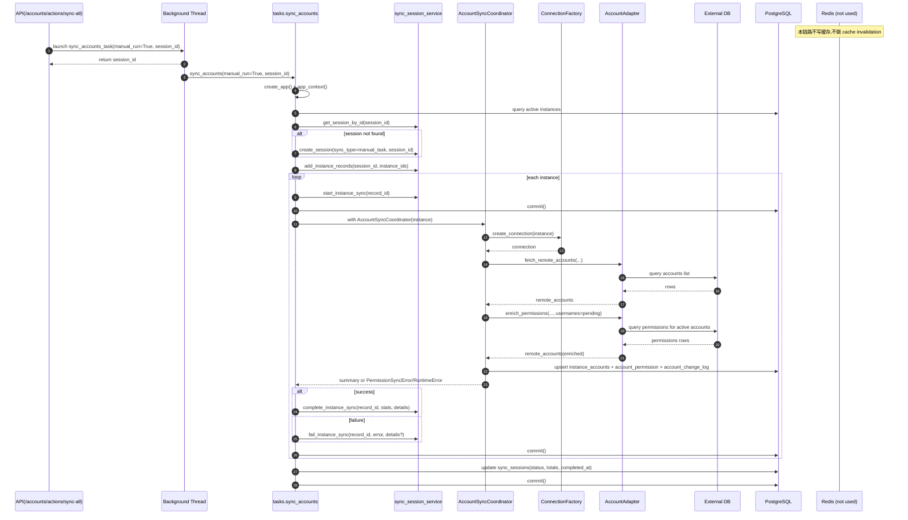

## 6. 读取链路: 账户台账与权限详情

### 6.1 台账列表(GET /accounts/ledgers)

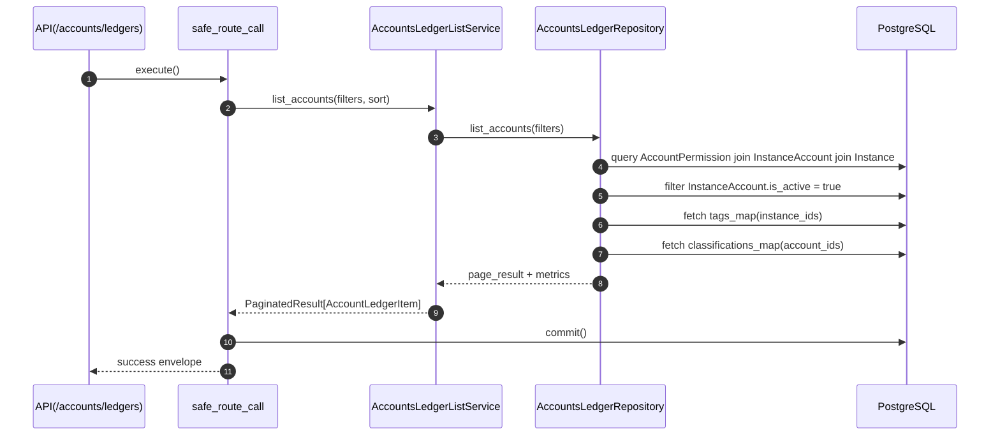

### 6.2 权限详情(GET /accounts/ledgers/{account_id}/permissions)

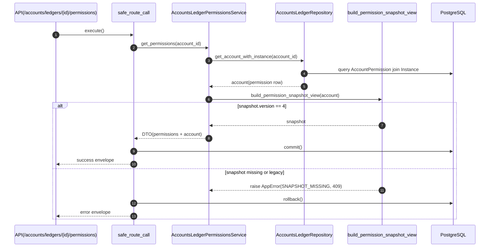

## 7. 状态机与关键约束

### 7.1 SyncSession 状态机(会话级)

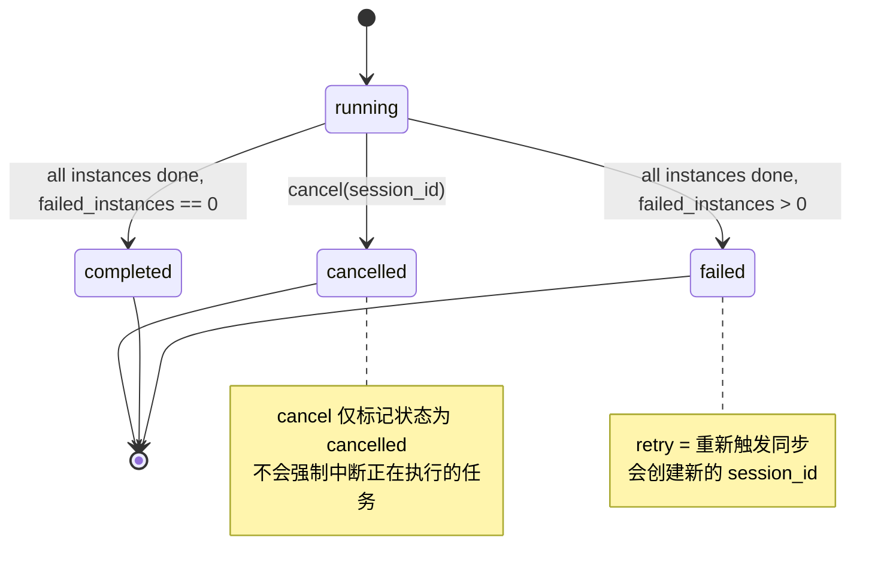

实现参考: `app/models/sync_session.py::update_statistics`, `app/services/sync_session_service.py`.

### 7.2 SyncInstanceRecord 状态机(实例级)

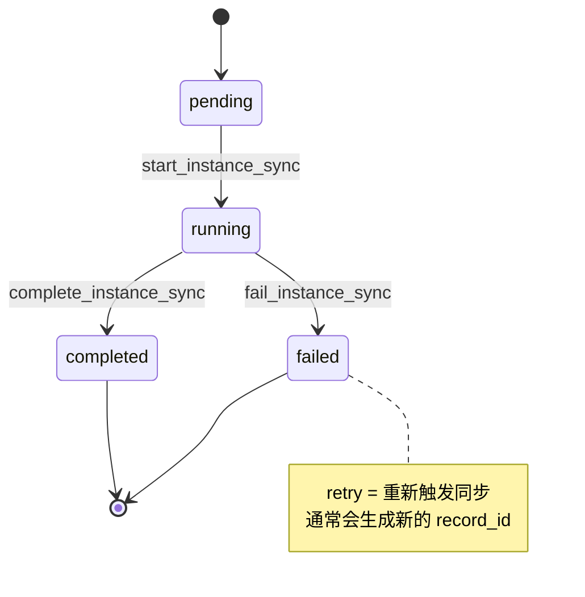

### 7.3 权限快照契约(强约束, 无 fallback)

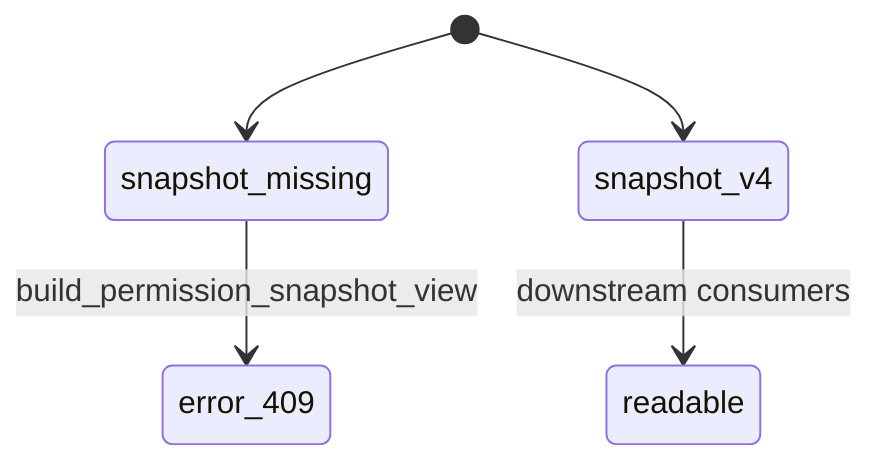

约束点:

- 写入端统一生成 `permission_snapshot.version = 4`(见 `app/services/accounts_sync/permission_manager.py::_build_permission_snapshot`).
- 读取端只接受 v4, 否则直接抛 `SNAPSHOT_MISSING`(见 `app/services/accounts_permissions/snapshot_view.py`).

### 7.4 InstanceAccount 生命周期(清单阶段)

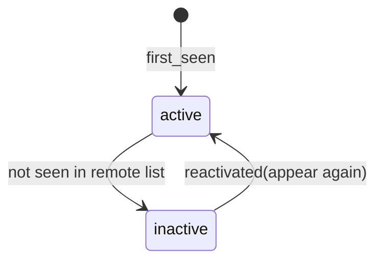

实现参考: `app/services/accounts_sync/inventory_manager.py::synchronize`.

## 8. 失败模式与排查线索(研发版)

| 现象 | 常见原因 | 关键日志/事件(event) | 落点 |
| --- | --- | --- | --- |
| 单实例同步报 "数据库连接问题" | 凭据错误, 网络不可达, 超时 | `accounts_sync_connection_init_failed` / `accounts_sync_connection_exception` | `app/services/accounts_sync/coordinator.py::connect` |
| 权限阶段失败(PermissionSyncError) | diff 日志写入失败, snapshot 构建异常, DB flush/commit 失败 | `account_permission_sync_failed` / `account_permission_change_log_failed` | `app/services/accounts_sync/permission_manager.py` |
| 权限阶段被跳过 | 无活跃账户(active_accounts 为空) | `accounts_sync_collection_skipped_no_active_accounts` | `app/services/accounts_sync/coordinator.py::synchronize_permissions` |
| 权限详情接口返回 409 | snapshot 缺失或不是 v4 | `SNAPSHOT_MISSING` | `app/services/accounts_permissions/snapshot_view.py` |
| 台账列表看不到账户 | instance_account.is_active = false | (查询过滤) | `app/repositories/ledgers/accounts_ledger_repository.py::_build_account_query` |

## 9. API 契约(Optional)

说明:

- response envelope: 所有 endpoints 通过 `BaseResource.success`/`safe_call` 返回统一封套.
- error envelope: 业务异常透传, 未捕获异常会被包装为统一 `public_error`.
- idempotency: 无显式 idempotency-key; 读取类 endpoints 具备幂等语义, 写入/触发类不保证幂等.

| Method | Path | Purpose | Idempotency | Pagination | Notes |
| --- | --- | --- | --- | --- | --- |
| POST | /api/v1/accounts/actions/sync-all | trigger background full sync | no | - | returns `session_id`; runs `tasks.accounts_sync_tasks.sync_accounts` |
| POST | /api/v1/accounts/actions/sync | sync one instance | no | - | payload: `instance_id`; connects External DB and writes `instance_accounts` + `account_permission` |
| GET | /api/v1/accounts/ledgers | list accounts ledger | yes (read) | page/limit | filters: search/db_type/instance_id/is_locked/is_superuser/tags/classification/sort/order |
| GET | /api/v1/accounts/ledgers/{account_id}/permissions | account permissions detail | yes (read) | - | requires `permission_snapshot.version == 4`, else 409 `SNAPSHOT_MISSING` |
| GET | /api/v1/accounts/statistics | accounts statistics | yes (read) | - | aggregated counts + db_type/classification breakdown |
| GET | /api/v1/accounts/statistics/summary | accounts summary | yes (read) | - | query: `instance_id`, `db_type` |
| GET | /api/v1/accounts/statistics/db-types | db_type stats | yes (read) | - | uses `account_permission` + `instance_accounts` |
| GET | /api/v1/accounts/statistics/classifications | classification stats | yes (read) | - | depends on classification assignments |
| GET | /api/v1/sync-sessions | list sync sessions | yes (read) | page/limit | filters: `sync_type`, `sync_category`, `status`, sort/order |
| GET | /api/v1/sync-sessions/{session_id} | session detail + records | yes (read) | - | reads `sync_sessions` + `sync_instance_records` |
| GET | /api/v1/sync-sessions/{session_id}/error-logs | session error records | yes (read) | - | subset of records where `status == failed` |
| POST | /api/v1/sync-sessions/{session_id}/actions/cancel | cancel session | yes-ish | - | best-effort: marks status `cancelled`, does not stop running task thread |
