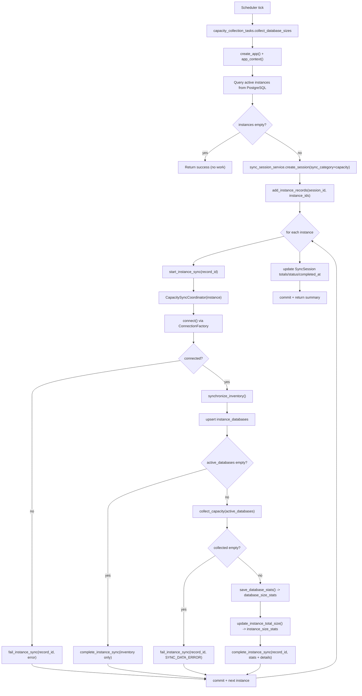
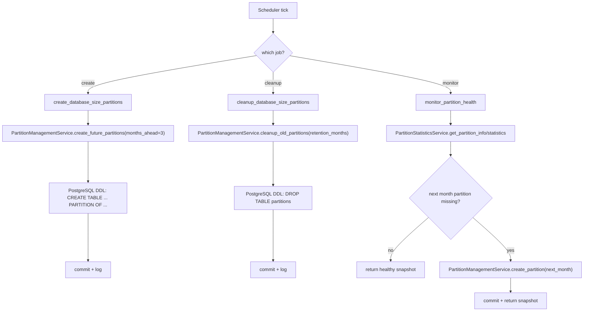
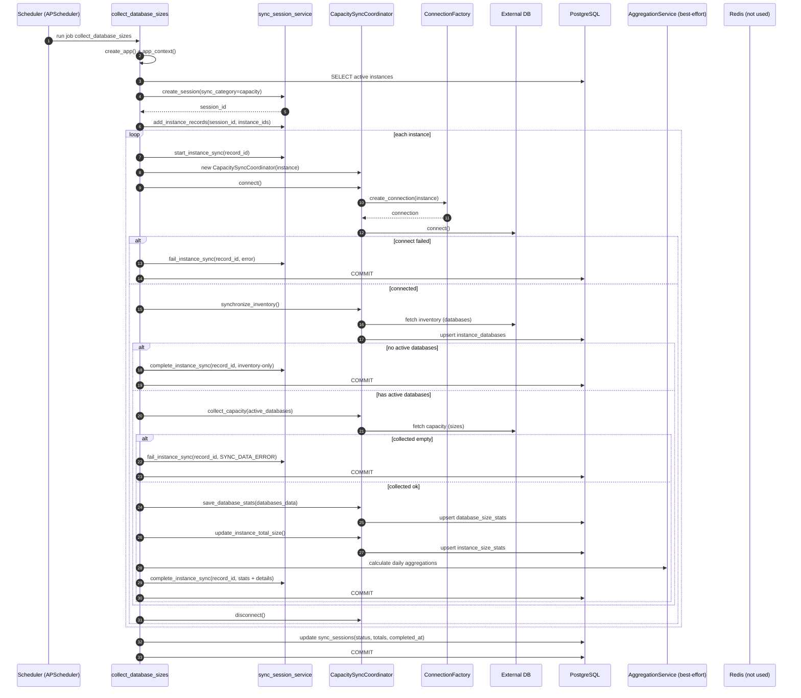
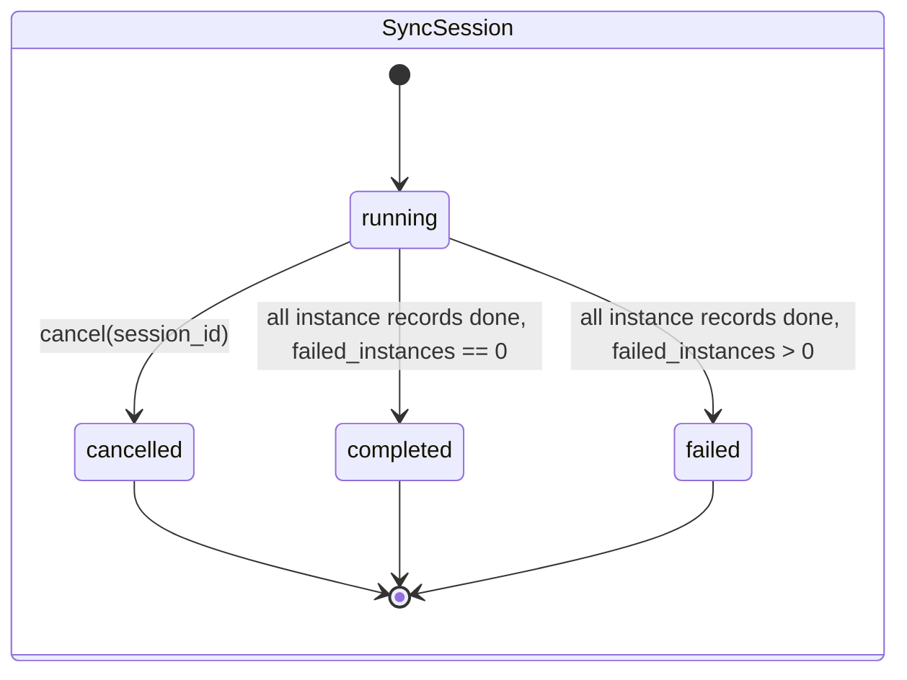
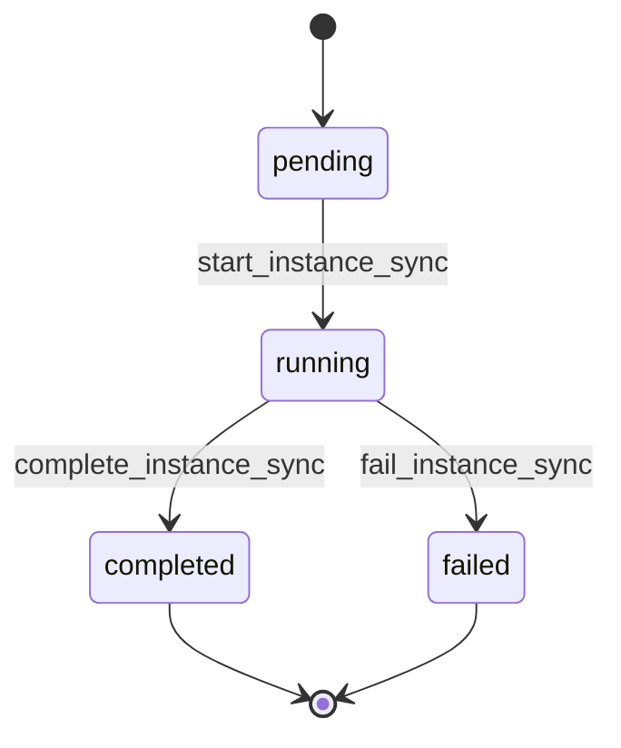
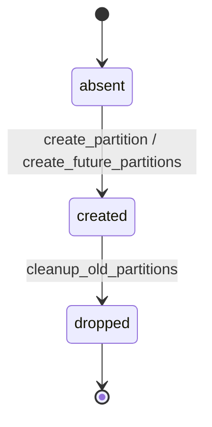

# 容量与分区域(Capacity + Partitions)研发图表包

> 状态: Draft
> 负责人: WhaleFall Team
> 创建: 2026-01-06
> 更新: 2026-01-06
> 范围: capacity collection/aggregation + postgres partitions
> 关联: ./instances-domain.md; ./spec.md; ./flows/whalefall-data-sync-flows.md

## 1. 主流程图(Flow)

### 1.1 Scheduled pipeline: collect -> aggregate

场景: 定时任务采集所有实例容量并落库,随后触发聚合.

入口: scheduler job `collect_database_sizes` -> `app/tasks/capacity_collection_tasks.py::collect_database_sizes`

补充入口(同域,但不走 SyncSession):

- 单实例手动触发: `POST /api/v1/instances/{id}/actions/sync-capacity` (见 `docs/architecture/instances-domain.md`).

### 1.2 Partition management: create/cleanup/monitor

场景: 为容量相关分区表按月创建分区,清理旧分区,并监控缺失分区.

入口: scheduler jobs -> `app/tasks/partition_management_tasks.py`

## 2. 主时序图(Sequence)

场景: 定时采集容量(`collect_database_sizes`)的单轮执行.

## 3. 状态机(Optional but valuable)

### 3.1 SyncSession + SyncInstanceRecord

容量采集/聚合任务的可观测性主要依赖会话中心模型:

- session: `sync_sessions` (running/completed/failed/cancelled)
- record: `sync_instance_records` (pending/running/completed/failed)

### 3.2 Partition lifecycle (per month, per table)

## 4. API 契约(Optional)

说明:

- read APIs: capacity/partition endpoints mostly read-only, return unified success envelope.
- write APIs: partition create/cleanup endpoints execute PostgreSQL DDL and must be permission-gated.
- cross-domain entrypoints: instance action sync-capacity and table-size refresh live under instances API.

| Method | Path | Purpose | Idempotency | Pagination | Notes |
| --- | --- | --- | --- | --- | --- |
| POST | /api/v1/capacity/aggregations/current | trigger current-period aggregation | no (writes aggregations) | - | scope defaults to all |
| GET | /api/v1/capacity/databases | list database aggregations | yes (read) | page/limit | supports start_date/end_date |
| GET | /api/v1/capacity/databases/summary | summary of database aggregations | yes (read) | - | supports time_range or start/end |
| GET | /api/v1/capacity/instances | list instance aggregations | yes (read) | page/limit | supports start_date/end_date |
| GET | /api/v1/capacity/instances/summary | summary of instance aggregations | yes (read) | - | supports time_range or start/end |
| GET | /api/v1/partitions/info | partition info snapshot | yes (read) | - | joins pg metadata via services |
| GET | /api/v1/partitions/status | partition health snapshot | yes (read) | - | warns when missing partitions |
| GET | /api/v1/partitions | list partitions | yes (read) | page/limit | supports search/sort/status filters |
| POST | /api/v1/partitions | create partitions | no | - | runs DDL, permission required |
| POST | /api/v1/partitions/actions/cleanup | cleanup old partitions | no | - | runs DDL, permission required |
| GET | /api/v1/partitions/statistics | partition statistics | yes (read) | - | used for dashboard |
| GET | /api/v1/partitions/aggregations/core-metrics | core metrics series | yes (read) | - | chart-focused payload |
