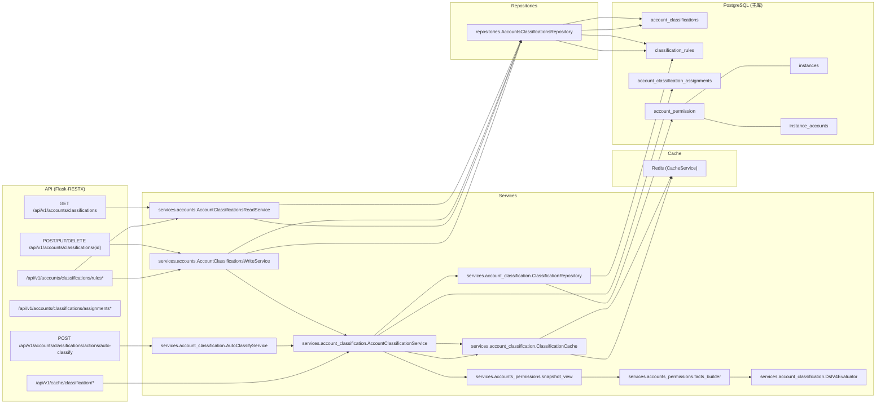
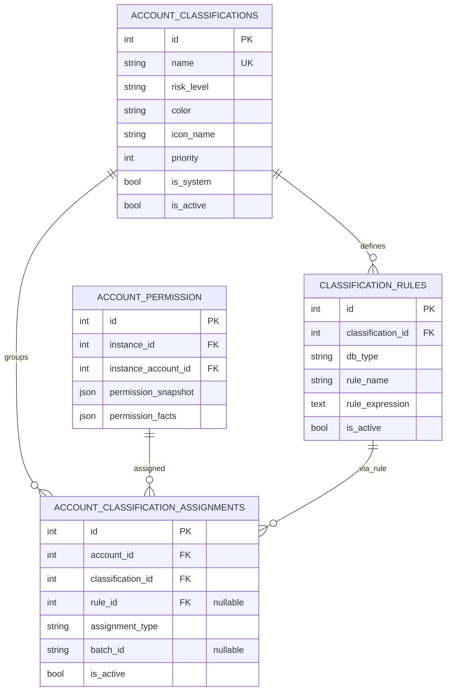
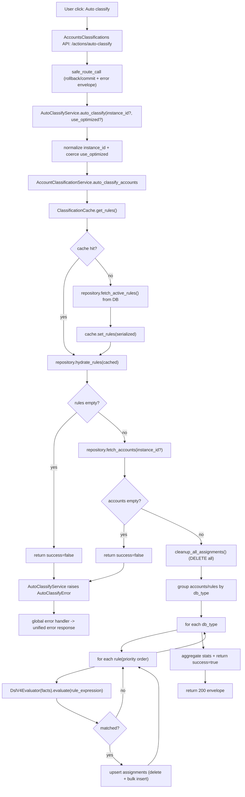
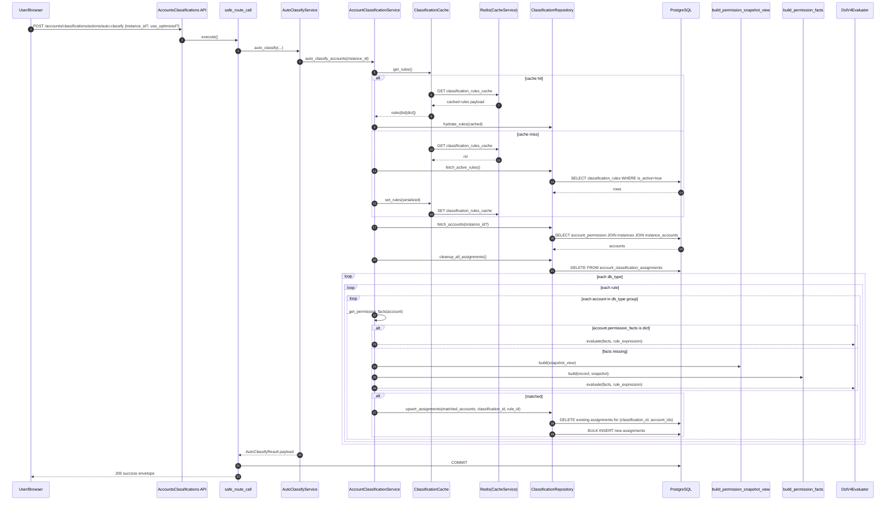
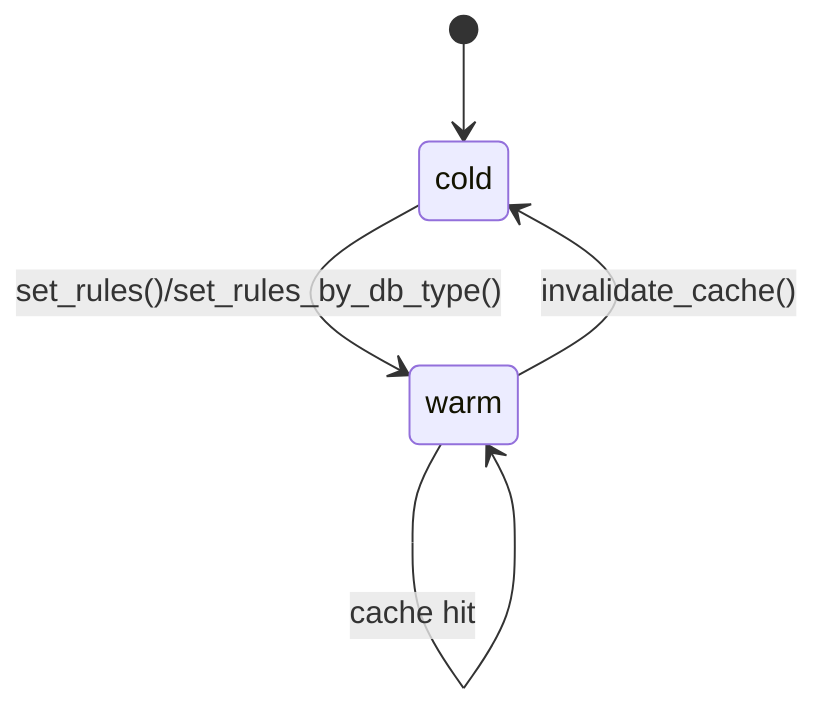

# 账户分类域(Classification) 研发图表包

> 状态: Draft
> 负责人: WhaleFall Team
> 创建: 2026-01-06
> 更新: 2026-01-06
> 范围: classifications + rules + assignments + auto-classify + cache
> 关联: ./accounts-permissions-domain.md; ./spec.md; ./account-classification-v2-design.md

## 1. 目标

- 让研发快速回答: "规则怎么生效, 会改哪些表, 缓存怎么参与, 失败怎么定位".
- 图表与代码落点一一对应, 用于 code review, 拆域重构, 排障.

## 2. 域边界

### 2.1 In scope

- 分类元数据: `account_classifications`
- 分类规则: `classification_rules`(DSL v4)
- 分类分配: `account_classification_assignments`(auto/manual, is_active)
- 自动分类: 以 `account_permission.permission_facts` 作为事实输入, 规则匹配后 upsert 分配
- 缓存: Redis 缓存分类规则(全量 + 按 db_type)

### 2.2 Out of scope(但有依赖)

- 权限同步写入: `account_permission.permission_snapshot(version=4)` 与 `permission_facts`(见 `docs/architecture/accounts-permissions-domain.md`)
- facts 构建: 当 `permission_facts` 缺失或格式无效时, 使用 `build_permission_snapshot_view` + `build_permission_facts`
- 缓存运维入口: `app/api/v1/namespaces/cache.py` 的 classification clear/stats endpoints

## 3. 组件与依赖(代码落点)

代码入口参考:

- 自动分类: `app/api/v1/namespaces/accounts_classifications.py` -> `AccountClassificationAutoClassifyActionResource.post` -> `AutoClassifyService.auto_classify` -> `AccountClassificationService.auto_classify_accounts`.
- 规则 CRUD: `app/api/v1/namespaces/accounts_classifications.py` -> `AccountClassificationsWriteService`(create/update/delete rule) -> `_invalidate_cache` -> `AccountClassificationService.invalidate_cache`.
- 缓存清理/统计: `app/api/v1/namespaces/cache.py` -> `AccountClassificationService.invalidate_cache`/`CacheService.get_classification_rules_by_db_type_cache`.

## 4. 数据模型(ERD)

关键约束(落库一致性):

- `account_classifications.name` 唯一.
- `account_classification_assignments` 唯一约束: `(account_id, classification_id, batch_id)`(见 `AccountClassificationAssignment.__table_args__`).
- 规则表达式契约: `classification_rules.rule_expression` 仅支持 DSL v4(对象 JSON, version=4), 且写入前会 canonicalize(ensure_ascii=False, sort_keys=True).

## 5. 主流程图(Flow)

场景: "点一次按钮"触发全量或单实例自动分类.

入口: `POST /api/v1/accounts/classifications/actions/auto-classify`

关键分支:

- cache miss: 从 DB 加载启用规则并写入 Redis 缓存.
- rules/accounts empty: 编排器返回 success=false, 服务层抛 `AutoClassifyError`, 整体请求回滚.
- 单条规则异常: 在 db_type 循环内 catch, 记录错误并计入 failed_count, 不中断其他 db_type.

## 6. 主时序图(Sequence)

场景: `POST /accounts/classifications/actions/auto-classify` 的完整链路.

说明: 本链路不访问 External DB, 仅使用 PostgreSQL + Redis(规则缓存). `permission_facts` 缺失时会走本地 facts 构建(基于快照).

## 7. 状态机(Optional but valuable)

### 7.1 Classification rules cache lifecycle

## 8. API 契约(Optional)

说明:

- response envelope: 所有 endpoints 通过 `BaseResource.success`/`safe_call` 返回统一封套.
- csrf: 写接口通常要求 `@require_csrf`.
- auto-classify: 同步执行, 可能耗时较长, 默认全量会清理并重建全部分配.

| Method | Path | Purpose | Idempotency | Notes |
| --- | --- | --- | --- | --- |
| GET | /api/v1/accounts/classifications/colors | list color options | yes (read) | ThemeColors |
| GET | /api/v1/accounts/classifications | list classifications | yes (read) | sorted by priority desc |
| POST | /api/v1/accounts/classifications | create classification | no | csrf required |
| GET | /api/v1/accounts/classifications/{id} | classification detail | yes (read) | - |
| PUT | /api/v1/accounts/classifications/{id} | update classification | no | csrf required |
| DELETE | /api/v1/accounts/classifications/{id} | delete classification | no | csrf required, may 409 CLASSIFICATION_IN_USE |
| GET | /api/v1/accounts/classifications/rules | list rules | yes (read) | grouped by db_type |
| POST | /api/v1/accounts/classifications/rules | create rule | no | csrf required, invalidates cache |
| GET | /api/v1/accounts/classifications/rules/filter | filter rules | yes (read) | query: classification_id, db_type |
| POST | /api/v1/accounts/classifications/rules/actions/validate-expression | validate rule expression | no | csrf required |
| GET | /api/v1/accounts/classifications/rules/stats | rules match stats | yes (read) | query: rule_ids=1,2,3 |
| GET | /api/v1/accounts/classifications/rules/{id} | rule detail | yes (read) | parse_expression=true |
| PUT | /api/v1/accounts/classifications/rules/{id} | update rule | no | csrf required, invalidates cache |
| DELETE | /api/v1/accounts/classifications/rules/{id} | delete rule | no | csrf required |
| GET | /api/v1/accounts/classifications/assignments | list assignments | yes (read) | only is_active=true |
| DELETE | /api/v1/accounts/classifications/assignments/{id} | deactivate assignment | no | csrf required, sets is_active=false |
| GET | /api/v1/accounts/classifications/permissions/{db_type} | permissions options | yes (read) | backed by PermissionConfig |
| POST | /api/v1/accounts/classifications/actions/auto-classify | run auto classify | no | csrf required, heavy write |

## 9. 失败模式与排查线索(研发版)

| 现象 | 常见原因 | 关键日志/事件(event) | 落点 |
| --- | --- | --- | --- |
| auto-classify 返回错误 | rules 为空, accounts 为空, instance_id/use_optimized 非法 | `auto_classify_failed` / `auto_classify_service_failed` | `app/services/account_classification/auto_classify_service.py` |
| 规则更新后自动分类仍使用旧规则 | Redis 不可用导致 invalidate 失败, 或缓存未清 | `清除分类缓存失败` | `app/services/accounts/account_classifications_write_service.py::_invalidate_cache` |
| validate-expression 返回 400 | rule_expression 缺失, JSON 解析失败, 非 DSL v4 | `validate_rule_expression执行失败` | `app/api/v1/namespaces/accounts_classifications.py::AccountClassificationRuleExpressionValidateResource` |
| 删除分类返回 409 | 分类仍被规则/分配引用, 或是系统分类 | message_key: `CLASSIFICATION_IN_USE` / `SYSTEM_CLASSIFICATION` | `app/api/v1/namespaces/accounts_classifications.py::AccountClassificationDetailResource.delete` |
