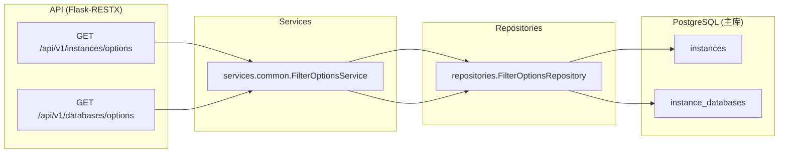

# 通用选项与筛选(Common Options)

> 状态: Draft
> 负责人: WhaleFall Team
> 创建: 2026-01-06
> 更新: 2026-01-08
> 范围: API v1 options endpoints
> 关联: ./instances-domain.md; ./databases-ledger-domain.md; ./tags-domain.md

## 1. 目标

- 让研发快速回答: 哪些页面需要 common options, options 数据从哪里来, 参数怎么传.

## 2. 域边界

### 2.1 In scope

- 实例 options: 用于下拉选择 instance, 可按 db_type 过滤.
- 数据库 options: 基于 instance_id 列出该实例下的数据库清单(支持分页).

### 2.2 Out of scope(但有依赖)

- 实例与数据库的写入/同步: `Instance` 与 `InstanceDatabase` 的来源见 `docs/architecture/instances-domain.md`.
- 台账与聚合: common options 只提供筛选器数据, 不提供 ledger/aggregation 主数据.

## 3. 组件与依赖(代码落点)

## 4. API 契约(Optional)

说明:

- endpoints 均返回统一 success/error envelope.
- endpoints 需要登录(session) + `view` 权限.

| Method | Path | Query | Notes |
| --- | --- | --- | --- |
| GET | `/api/v1/instances/options` | `db_type` optional | 返回 instances options, `display_name` 会拼接 `name (DBTYPE)`. |
| GET | `/api/v1/databases/options` | `instance_id` required, `page` default 1, `limit` default 100 | 返回 databases options, 支持分页与 total_count. |
