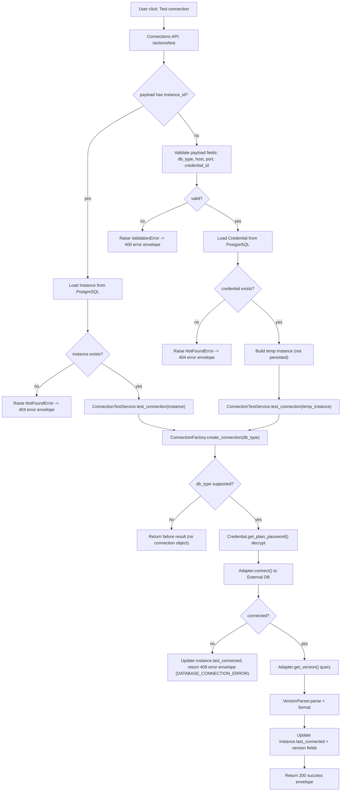
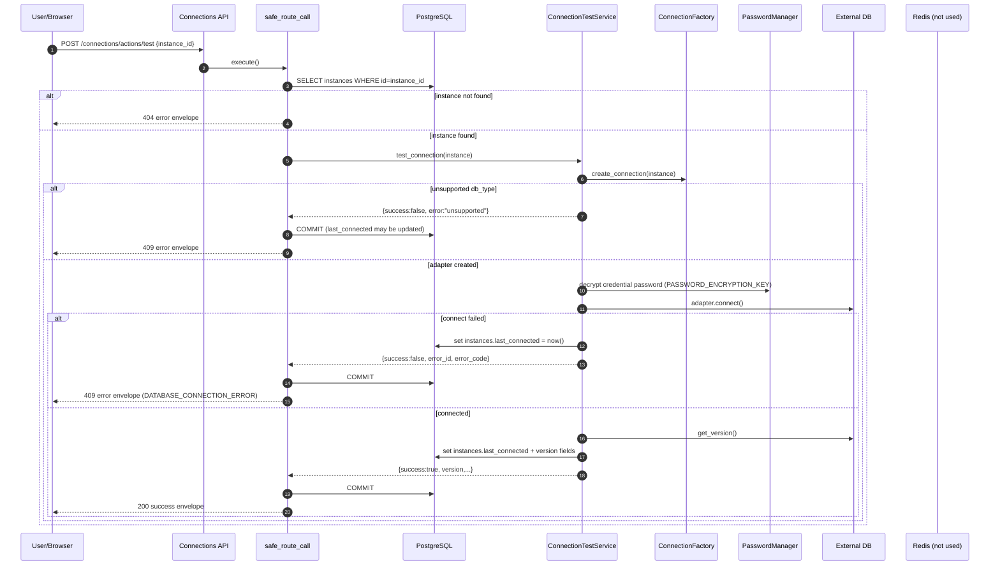
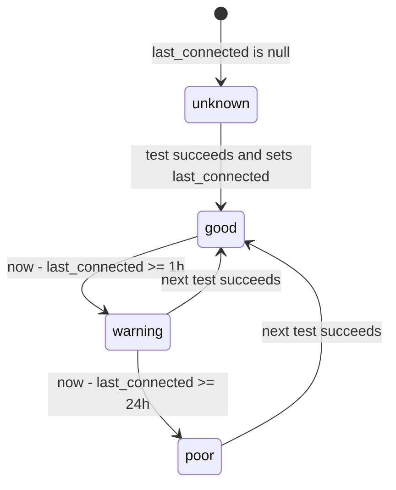

# 凭据与连接适配域(Credentials + Connections)研发图表包

> 状态: Draft
> 负责人: WhaleFall Team
> 创建: 2026-01-06
> 更新: 2026-01-06
> 范围: credentials CRUD, connections test/status, ConnectionFactory adapters
> 关联: ./instances-domain.md; ./spec.md

## 1. 主流程图(Flow)

场景: "点一次按钮"执行连接测试.

入口: `POST /api/v1/connections/actions/test`

关键分支:

- payload mode: `instance_id` -> 测试已存在实例; 无 `instance_id` -> 测试新连接参数(临时实例,不落库).
- connect failed: 返回 409 错误封套,但仍会更新 `instances.last_connected`(用于诊断).
- details exposure: 仅在 debug 或管理员场景下返回 `details`(见 `ConnectionTestService._should_expose_details`).

## 2. 主时序图(Sequence)

场景: 测试已存在实例连接(`instance_id` mode).

## 3. 状态机(Optional but valuable)

### 3.1 Instance connection health (derived)

连接状态不落库,由 `InstanceConnectionStatusService` 基于 `instances.last_connected` 计算:

- last_connected missing: unknown
- delta < 1 hour: good
- delta < 1 day: warning
- else: poor

## 4. API 契约(Optional)

说明:

- response envelope: 通过 `BaseResource.success`/`safe_call` 返回统一成功封套.
- error envelope: 校验错误/NotFoundError 等会透传; 其他异常会包装为 `public_error`.
- secrets: credential password 默认 masked, 不直接返回明文.

| Method | Path | Purpose | Idempotency | Pagination | Notes |
| --- | --- | --- | --- | --- | --- |
| GET | /api/v1/credentials | list credentials | yes (read) | page/limit | search + filters in query string |
| POST | /api/v1/credentials | create credential | no | - | password encrypted before write |
| GET | /api/v1/credentials/{id} | credential detail | yes (read) | - | password masked in response |
| PUT | /api/v1/credentials/{id} | update credential | no | - | password optional; if provided re-encrypt |
| DELETE | /api/v1/credentials/{id} | delete credential | no | - | physical delete; may fail if referenced |
| POST | /api/v1/connections/actions/test | test connection | no (updates last_connected) | - | supports instance_id or temp params |
| POST | /api/v1/connections/actions/validate-params | validate db_type/port/credential_id | yes | - | no external DB access |
| POST | /api/v1/connections/actions/batch-test | batch test connections | no (updates last_connected per instance) | - | max 50 instances per request |
| GET | /api/v1/connections/status/{instance_id} | derived connection status | yes (read) | - | uses last_connected to compute status |
