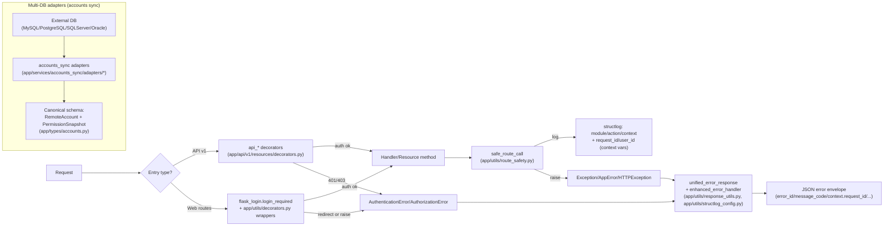

# 横切能力(Cross-cutting Capabilities)

> 状态: Draft
> 负责人: WhaleFall Team
> 创建: 2026-01-06
> 更新: 2026-01-06
> 范围: Auth/RBAC, observability, error envelope, multi-DB adapter canonical schema
> 关联: ./developer-entrypoint.md; ./module-dependency-graph.md; ./accounts-permissions-domain.md; ./credentials-connections-domain.md; ../standards/backend/api-response-envelope.md; ../standards/backend/error-message-schema-unification.md; ../Obsidian/canvas/cross-cutting-capabilities.canvas

目标:

- 给所有 domain 图提供一份"跨域共用"的横切能力图,避免每个 domain canvas 重复画 auth/错误/adapter 约束.
- 明确"请求进来如何鉴权,失败如何返回",以及日志与错误封套的统一口径.
- 固化 4 种 DB 的 accounts sync adapter 归一化 schema,指出哪些字段是 canonical,哪些字段必须收敛到 type-specific.

## 1. 横切图(跨域共用)

## 2. 认证授权与 RBAC

### 2.1 API v1: 鉴权/授权

- 入口: `app/api/v1/resources/decorators.py`
  - `api_login_required`: 未登录直接抛 `AuthenticationError`.
  - `api_permission_required(permission)`: 未登录抛 `AuthenticationError`,无权限抛 `AuthorizationError`.
  - `api_admin_required`: 非 admin 抛 `AuthorizationError`.
- 失败返回:
  - 错误抛出后由全局错误处理器输出统一错误封套:
    - Flask global: `app/__init__.py::handle_global_exception`
    - RestX: `app/api/v1/api.py::WhaleFallApi.handle_error`
  - 状态码: `AuthenticationError` -> 401, `AuthorizationError` -> 403 (见 `app/errors/__init__.py`).

### 2.2 Web routes: 兼容 HTML/JSON

- 入口: `app/routes/**` 可能使用:
  - `flask_login.login_required`
  - `app/utils/decorators.py` 的 `login_required/view_required/create_required/update_required/delete_required/admin_required`
- 失败返回:
  - `request.is_json` 为 true 时,抛 `AuthenticationError/AuthorizationError` 走统一错误封套.
  - 否则走 flash + redirect (HTML 交互).

### 2.3 RBAC: role -> permission

- 当前权限判定集中在 `app/utils/decorators.py::has_permission`.
- 约束: 下游业务逻辑不要散落 role 判断,优先通过装饰器在入口层完成授权.

## 3. 观测与错误口径

### 3.1 safe_route_call: 请求级事务边界 + 统一日志

- 位置: `app/utils/route_safety.py::safe_route_call`
- 行为:
  - 执行业务闭包.
  - 捕获 "期望异常" (默认 `AppError`, `HTTPException`): rollback + warning log + re-raise.
  - 捕获 "非期望异常": rollback + error log + raise `SystemError(public_error)`.
  - 成功返回前统一 commit; commit 失败同样会包装为 `SystemError(public_error)`.
- 配合: API v1 可通过 `app/api/v1/resources/base.py::BaseResource.safe_call` 复用该事务边界.

### 3.2 结构化日志: module/action/context

- 入口 helper: `app/utils/route_safety.py::log_with_context`
- 字段约定:
  - `module`, `action`: 用于检索与聚合.
  - `context`: 业务上下文,建议放可定位的资源标识(例如 instance_id).
  - `extra`: 诊断字段(例如 error_type/error_message/unexpected/commit_failed).
  - `actor_id`: 默认尝试从 `current_user.id` 注入(可通过 `include_actor` 关闭).
- 全局注入字段:
  - `request_id`, `user_id`: `app/utils/structlog_config.py` 读取 context vars(`app/utils/logging/context_vars.py`)并写入日志事件.

### 3.3 错误封套与追踪字段

- 生成入口: `app/utils/response_utils.py::unified_error_response`
- 核心构造: `app/utils/structlog_config.py::enhanced_error_handler`
- 公共上下文: `app/utils/logging/error_adapter.py::build_public_context`
  - `context.request_id`, `context.user_id`
  - `context.url`, `context.method`
  - `context.meta.ip_address`, `context.meta.user_agent`
- 对外字段约束见:
  - `docs/standards/backend/api-response-envelope.md`
  - `docs/standards/backend/error-message-schema-unification.md`

## 4. 多数据库适配: 4 种 DB 的 canonical schema

范围: accounts sync 的 remote accounts 与 permission snapshot 归一化.

### 4.1 Canonical: RemoteAccount

- 类型: `app/types/accounts.py::RemoteAccount`
- 必填字段(canonical):
  - `username`: 唯一标识.
  - `db_type`: 数据库类型(例如 mysql/postgresql/sqlserver/oracle).
  - `is_superuser`, `is_active`, `is_locked`: 跨库通用状态.
  - `permissions`: `PermissionSnapshot`.
- 可选字段(非 canonical,但允许):
  - `display_name`, `attributes`, `metadata`

### 4.2 Canonical: PermissionSnapshot

- 类型: `app/types/accounts.py::PermissionSnapshot` (total=False)
- 约束:
  - DB 特有字段必须收敛到 `permissions.type_specific` 或明确的 per-db 字段,避免下游出现兼容兜底链.
  - 下游读取侧只依赖已约定的 canonical keys,不要写 `data.get("new") or data.get("old")` 一类兜底.
- per-db 字段示例(由 adapter 负责填充):
  - MySQL: `global_privileges`, `database_privileges`
  - PostgreSQL: `predefined_roles`, `role_attributes`, `database_privileges_pg`, `system_privileges`
  - SQL Server: `server_roles`, `server_permissions`, `database_roles`, `database_permissions`
  - Oracle: `oracle_roles`, `system_privileges`

### 4.3 Adapter 落点

- 统一抽象: `app/services/accounts_sync/adapters/base_adapter.py`
- 4 种 DB 实现:
  - `app/services/accounts_sync/adapters/mysql_adapter.py`
  - `app/services/accounts_sync/adapters/postgresql_adapter.py`
  - `app/services/accounts_sync/adapters/sqlserver_adapter.py` (含 `enrich_permissions`)
  - `app/services/accounts_sync/adapters/oracle_adapter.py`
- 域图参考: `docs/architecture/accounts-permissions-domain.md`

