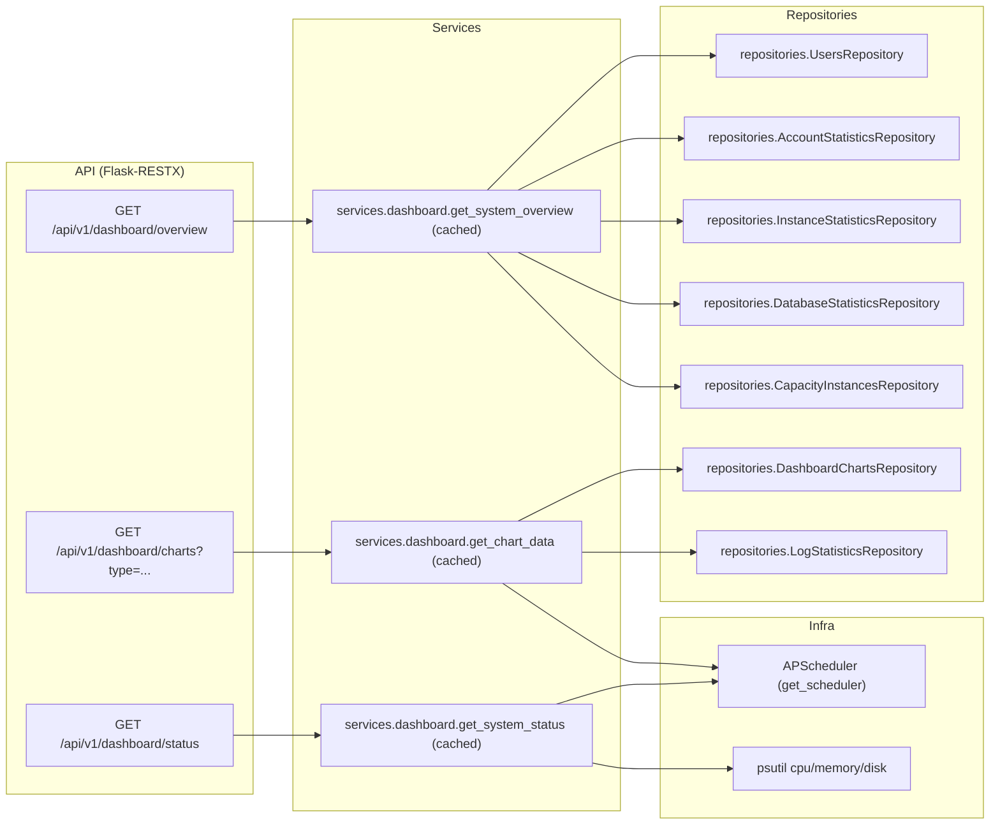

# 仪表板域(Dashboard)研发图表包

> 状态: Draft
> 负责人: WhaleFall Team
> 创建: 2026-01-06
> 更新: 2026-01-06
> 范围: dashboard overview/status/charts read APIs, cache, fallback behavior
> 关联: ./observability-ops.md; ./scheduler-domain.md; ./accounts-permissions-domain.md; ./capacity-partitions-domain.md

## 1. 目标

- 让研发快速回答: Dashboard API 返回什么数据, 来自哪些表/仓库, 哪些数据有缓存与兜底.

## 2. 域边界

- In scope: `/api/v1/dashboard/*` 只读聚合接口.
- Out of scope: 各域写入链路(账号同步/容量采集/日志写入/调度器运行), Dashboard 仅做汇总展示.

## 3. 组件与依赖(代码落点)

## 4. 缓存与兜底

### 4.1 缓存

Dashboard 使用 `dashboard_cache` 做函数级缓存, 典型 TTL:

- overview: 300s
- charts: 180s(子项各自有 60-300s 缓存)
- status: 30s

落点: `app/utils/cache_utils.py`, `app/services/dashboard/*`.

### 4.2 兜底行为

- overview 中的 capacity 汇总:
  - 调用 `CapacityInstancesRepository.summarize_latest_stats`.
  - 若抛 SQLAlchemyError, 会 rollback 并记录 warning, 然后使用兜底值(0MB).
  - 落点: `app/services/dashboard/dashboard_overview_service.py`.
- charts 中的 task_status:
  - 若 scheduler 未初始化, 返回空列表.
  - 落点: `app/services/dashboard/dashboard_charts_service.py`.

## 5. API 契约(Optional)

说明:

- 所有 endpoints 需要登录(session), 由 `api_login_required` 控制.

| Method | Path | Query | Notes |
| --- | --- | --- | --- |
| GET | `/api/v1/dashboard/overview` | - | 聚合 users/instances/accounts/classification/capacity/databases 概览. |
| GET | `/api/v1/dashboard/charts` | `type=all|logs|tasks|syncs` | 返回对应图表数据子集. |
| GET | `/api/v1/dashboard/status` | - | 返回 cpu/memory/disk + services health + uptime. |
| GET | `/api/v1/dashboard/activities` | - | 当前实现返回空数组. |

