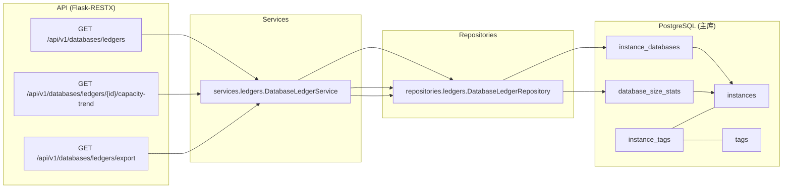

# 数据库台账域(Databases Ledger)研发图表包

> 状态: Draft
> 负责人: WhaleFall Team
> 创建: 2026-01-06
> 更新: 2026-01-07
> 范围: databases ledger read APIs, capacity trend, tags filter, export support
> 关联: ./capacity-partitions-domain.md; ./instances-domain.md; ./tags-domain.md; ./files-exports.md

## 1. 目标

- 让研发快速回答: 数据库台账的数据来自哪里, 如何拿到最新容量, 如何做 tags/db_type/search 过滤.
- 明确该域是读模型(read APIs)为主, 写入由容量采集链路提供(见 `docs/architecture/capacity-partitions-domain.md`).

## 2. 域边界

### 2.1 In scope

- 数据库台账列表: `GET /api/v1/databases/ledgers`.
- 数据库容量趋势: `GET /api/v1/databases/ledgers/{database_id}/capacity-trend`.
- 台账导出: `GET /api/v1/databases/ledgers/export`(数据源与本域一致, 支持 `instance_id` scope 过滤).

### 2.2 Out of scope(但有依赖)

- Inventory 写入: `InstanceDatabase` 的 upsert 来自 capacity sync/inventory(见 `docs/architecture/instances-domain.md`).
- Capacity 写入: `DatabaseSizeStat` 的写入来自 capacity collection(见 `docs/architecture/capacity-partitions-domain.md`).

## 3. 组件与依赖(代码落点)

## 4. 关键逻辑

### 4.1 "最新容量"的定义

列表接口并不直接取最新一条 `DatabaseSizeStat`, 而是通过一个子查询按 `(instance_id, database_name)` 聚合得到最新 `collected_at`, 再 join 回 `DatabaseSizeStat` 拿到对应 `size_mb`.

落点: `app/repositories/ledgers/database_ledger_repository.py::_with_latest_stats`.

### 4.2 同步状态(sync_status)推断

同步状态来自 `DatabaseLedgerService._resolve_sync_status(collected_at)`:

- 无采集记录: `pending`/`待采集`.
- 最近 6 小时内: `completed`/`已更新`.
- 6-48 小时: `running`/`待刷新`.
- 超过 48 小时: `failed`/`超时`.

该状态仅用于 UI 展示, 不写回 DB.

### 4.3 tags 过滤语义

`tags` 查询参数是 "tag name 列表"(不是 tag_id).

过滤实现: join `instance_tags` + `tags`, 取 `Tag.name in tags` 且 `Tag.is_active == true`, 并 `distinct()` 去重.

落点: `app/repositories/ledgers/database_ledger_repository.py::_apply_filters`.

## 5. API 契约(Optional)

### 5.1 `/api/v1/databases`

| Method | Path | Permission | Notes |
| --- | --- | --- | --- |
| GET | `/api/v1/databases/ledgers` | `database_ledger.view` | query: `search`, `db_type`(default all), `instance_id`(optional), `tags`(repeatable), `page`, `limit`. |
| GET | `/api/v1/databases/ledgers/{database_id}/capacity-trend` | `database_ledger.view` | query: `days`(default 30, max 90). |

### 5.2 Export

| Method | Path | Permission | Notes |
| --- | --- | --- | --- |
| GET | `/api/v1/databases/ledgers/export` | `database_ledger.view` | export CSV, query: `search`, `db_type`, `instance_id`(optional), `tags`. |
