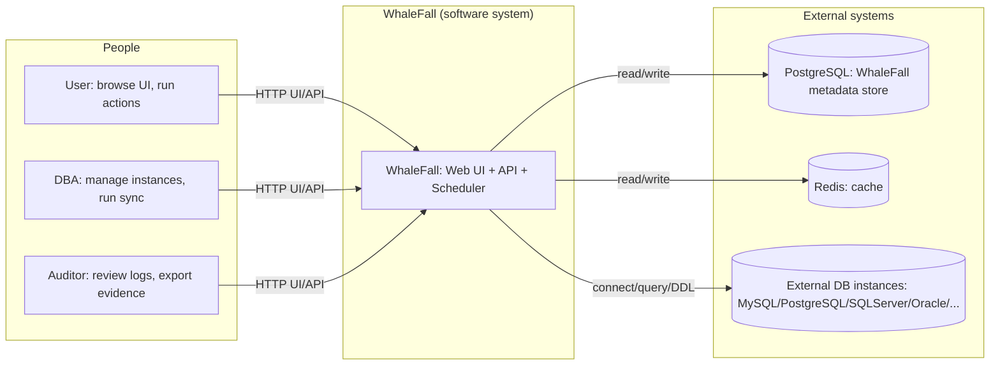
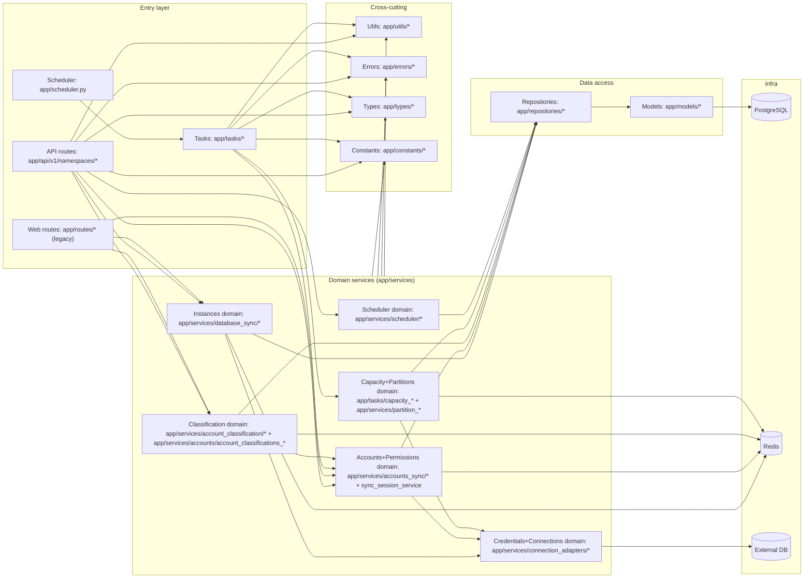

# 全局研发入口(Global) 图表包

> 状态: Draft
> 负责人: WhaleFall Team
> 创建: 2026-01-06
> 更新: 2026-01-06
> 范围: C4-L1/L2/L3 研发视角全局图
> 关联: ./spec.md; ./module-dependency-graph.md; ./README.md

目标:

- 给研发提供 3 张"全局必备"图,用于快速建立系统边界,运行拓扑,以及代码分层心智模型
- 图表默认使用 Mermaid flowchart,以保证渲染兼容性

## 1. 系统上下文图(C4-L1)

场景: 用户/DBA/审计通过 WhaleFall 管理数据库资产,并与外部数据库与缓存/主库交互.



## 2. 运行拓扑/容器图(C4-L2)

场景: Browser 访问 Flask Web/API, 任务由 APScheduler 在后台线程池执行,落库到 Postgres,缓存写 Redis,并按需连接外部数据库.

说明:

- Scheduler 默认随应用进程启动,并通过 `userdata/scheduler.lock` 保证"单实例"执行.
- 在 gunicorn 多 worker 场景下,只有获得锁的 worker 会启动 scheduler,其余 worker 仅提供 Web/API.

```mermaid
flowchart TB
  Browser["Browser"] -->|HTTP(S)| WSGI["WSGI server (gunicorn/flask dev server)"]

  subgraph ProcA["Worker A: Web/API only"]
    WebA["Flask app (routes + RESTX)"]
  end

  subgraph ProcB["Worker B: Web/API + Scheduler owner (lock holder)"]
    WebB["Flask app (routes + RESTX)"]
    APS["APScheduler BackgroundScheduler"]
    Pool["ThreadPoolExecutor (job.func)"]
    WebB --> APS --> Pool
  end

  WSGI --> WebA
  WSGI --> WebB

  PG[(PostgreSQL)]
  R[(Redis)]
  X[(External DB)]
  SQLite[(SQLite jobstore: userdata/scheduler.db)]
  Lock[(scheduler lock: userdata/scheduler.lock)]

  WebA -->|read/write| PG
  WebA -->|read/write| R

  WebB -->|read/write| PG
  WebB -->|read/write| R

  APS -->|persist jobs| SQLite
  APS -->|file lock| Lock

  Pool -->|tasks write/read| PG
  Pool -->|cache| R
  Pool -->|connect/query/DDL| X
```

## 3. 组件/分层图(C4-L3)

场景: 研发快速定位"从入口到落点",并在重构时判断依赖是否越界.



推荐阅读顺序(从全局到域):

- 本文: 全局 C4-L1/L2/L3
- 域图: `docs/architecture/accounts-permissions-domain.md`, `docs/architecture/instances-domain.md`, `docs/architecture/credentials-connections-domain.md`, `docs/architecture/capacity-partitions-domain.md`, `docs/architecture/scheduler-domain.md`, `docs/architecture/classification-domain.md`

