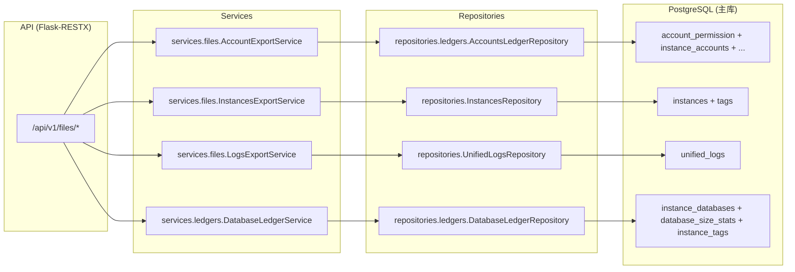

# 文件导出与模板(Files Exports)

> 状态: Draft
> 负责人: WhaleFall Team
> 创建: 2026-01-06
> 更新: 2026-01-06
> 范围: /api/v1/files exports, csv/json serialization, formula injection safety
> 关联: ./accounts-permissions-domain.md; ./instances-domain.md; ./databases-ledger-domain.md; ./observability-ops.md

## 1. 目标

- 让研发快速回答: files namespace 暴露哪些导出能力, 各自数据源在哪里, 有哪些安全约束(尤其是 CSV).

## 2. 总览

files namespace 是 "导出/下载" 专用入口, 大部分为只读 GET endpoints, 通过 `Content-Disposition: attachment` 返回文件.

安全约束:

- CSV 写入前会调用 `sanitize_csv_row` 做 Spreadsheet Formula Injection 防护(见 `app/utils/spreadsheet_formula_safety.py`).

## 3. 组件与依赖(代码落点)

## 4. API 契约(Optional)

说明:

- endpoints 均返回文件内容(非 JSON envelope).
- 鉴权与权限仍由 API v1 decorators 控制.

| Method | Path | Permission | Notes |
| --- | --- | --- | --- |
| GET | `/api/v1/files/account-export` | `view` | accounts ledger export CSV, query supports `db_type`, `instance_id`, `search`, `tags`. |
| GET | `/api/v1/files/instance-export` | `view` | instances export CSV, query supports `search`, `db_type`. |
| GET | `/api/v1/files/database-ledger-export` | `database_ledger.view` | databases ledger export CSV, query supports `search`, `db_type`, `tags`. |
| GET | `/api/v1/files/log-export` | admin-only | logs export, query supports `format=json|csv`, `start_time`, `end_time`, `level`, `module`, `limit`. |
| GET | `/api/v1/files/template-download` | `view` | instances import template CSV. |

## 5. 关键实现细节

### 5.1 Accounts export: username 展示规则

`AccountExportService` 在导出时对 username 做了 DB 类型差异化展示:

- SQL Server/Oracle/PostgreSQL: 直接展示 `username`.
- 其他类型: 展示 `username@host`.

落点: `app/services/files/account_export_service.py`.

### 5.2 Logs export: format 与 limit

- `format=json|csv` 控制返回文件格式.
- `limit` 会被限制在 1..100000.

落点: `app/services/files/logs_export_service.py`, `app/repositories/unified_logs_repository.py`.

