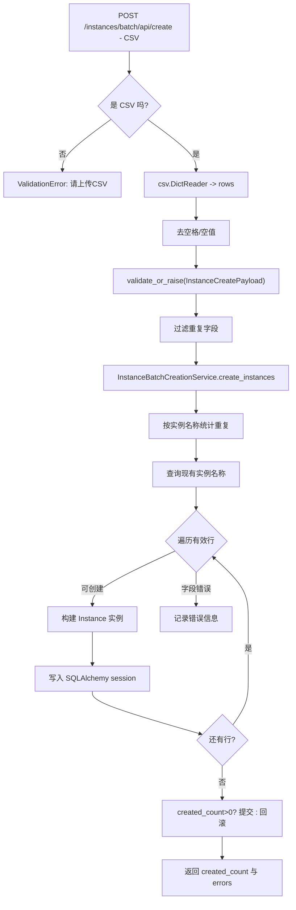
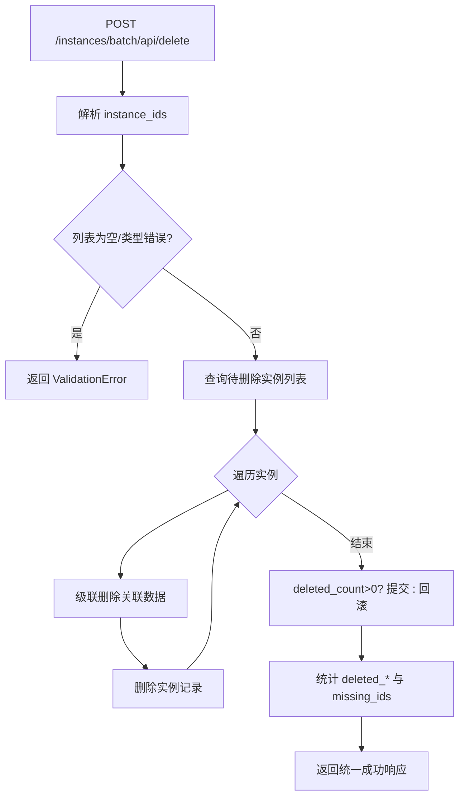

# WhaleFall CRUD 与批量操作流程（Mermaid）

> 状态：Active
> 负责人：WhaleFall Team
> 创建：2025-11-29
> 更新：2025-12-26
> 范围：高风险批量链路（标签/实例）
> 关联：./README.md；../project-structure.md

目的：梳理易出错的批量操作（标签分配、实例导入/删除），为审核与自动化测试提供标准流程。

## 目录
1. [标签批量分配 / 移除](#1-标签批量分配--移除)
2. [实例批量创建（CSV 导入）](#2-实例批量创建csv-导入)
3. [实例批量删除（级联清理）](#3-实例批量删除级联清理)

---

## 1. 标签批量分配 / 移除
### 1.1 代码路径与职责
- `app/routes/tags/bulk.py::batch_assign_tags` / `batch_remove_tags`：解析 JSON、校验 ID、查询实例和标签列表、循环处理。
- `app/models/tag.py`、`instance_tags` 关联表：通过 SQLAlchemy 关系维护多对多。
- 没有单独的服务层，所有逻辑在路由内完成。

### 1.2 流程图
```mermaid
flowchart TD
    Client[前端批量操作] --> API[/POST /tags/bulk/api/assign]
    API --> Validate[校验 JSON + ID 列表]
    Validate --> QueryInst[查询 Instance 列表]
    Validate --> QueryTag[查询 Tag 列表]
    QueryInst --> Loop{遍历实例}
    Loop --> ForTag{遍历标签}
    ForTag --> Exists{标签已绑定?}
    Exists -->|否| Append[新增实例与标签关联]
    Exists -->|是| Skip[跳过]
    Append --> Count[assigned_count+=1]
    Skip --> Count
    Count --> NextTag{更多标签?}
    NextTag -->|是| ForTag
    NextTag -->|否| NextInst{更多实例?}
    NextInst -->|是| Loop
    NextInst -->|否| Commit[db.session.commit]
    Commit --> Success[返回 assigned_count]
    Commit -->|异常| Rollback[db.session.rollback + log_error]
```

### 1.3 关键控制与风险
- **事务范围**：使用 SQLAlchemy 默认事务，只有一次 `db.session.commit()`；任意插入异常会触发 rollback 并中断后续实例，未实现“部分成功后补偿”。
- **冲突处理**：`if tag not in instance.tags` 通过内存判断避免重复，但在高并发环境下仍可能出现并发写入冲突，需要依赖数据库唯一约束。
- **审计**：成功与失败都会写结构化日志 `module="tags_bulk"`，但接口 response 没有列出失败条目，若前端需要详细差异需另行扩展。

### 当前逻辑缺陷（需修复）
- **无分批/回执**：一次请求覆盖所有实例×标签，失败就整批回滚且只返回通用错误，调用方无法得知哪条出错。
- **缺少并发保护**：无论分配还是移除都未加行锁/重试，两个相邻请求可能导致重复插入或删除失败。

---

## 2. 实例批量创建（CSV 导入）
### 2.1 代码路径与职责
- `app/routes/instances/batch.py::create_instances_batch`：校验上传文件、解析 CSV、调用 `_create_instances`。
- `app/services/instances/batch_service.py::InstanceBatchCreationService`：字段归一化、重复/存在性校验、构建 `Instance` 并批量插入。
- `app/schemas/instances.py` + `app/schemas/validation.py`: 批量校验与错误映射, 返回 typed payload 与 errors.

### 2.2 流程图


### 2.3 关键控制与风险
- **数据质量**: 使用 `InstanceCreatePayload` schema 做字段校验与 canonicalization, `db_type` 会 normalize 并走 allowlist, `tag_names` 形状固定为 list.
- **重复策略**：仅按名称去重，忽略 host+port 组合；若允许同名不同集群，应在 CSV 模板中增加唯一键。
- **事务粒度**：所有插入共享一个事务。若 100 行里有 1 行失败，其余 99 行仍会提交，但 `errors` 里只描述失败原因，调用方必须自行处理日志。

---

## 3. 实例批量删除（级联清理）
### 3.1 代码路径与职责
- `app/routes/instances/batch.py::delete_instances_batch`：解析 `instance_ids`，调用删除服务。
- `app/services/instances/batch_service.py::InstanceBatchDeletionService`：逐个实例调用 `_delete_single_instance`，级联删除权限、同步记录、容量数据、标签关系。
- `app/routes/instances/manage.py::delete`：单实例删除重用批量服务，保证入口一致。

### 3.2 流程图


### 3.3 关键控制与风险
- **级联完备性**：新增依赖（如外部任务表）若未加入 `_delete_single_instance` 会遗留数据，需配合 checklist 审核。
- **大事务风险**：一次删除大量实例会触发长事务，建议路由层限制批量大小并提示分批执行。
- **缺乏软删除**：直接物理删除不可逆，若需审计应引入“导出确认”或异步队列。
