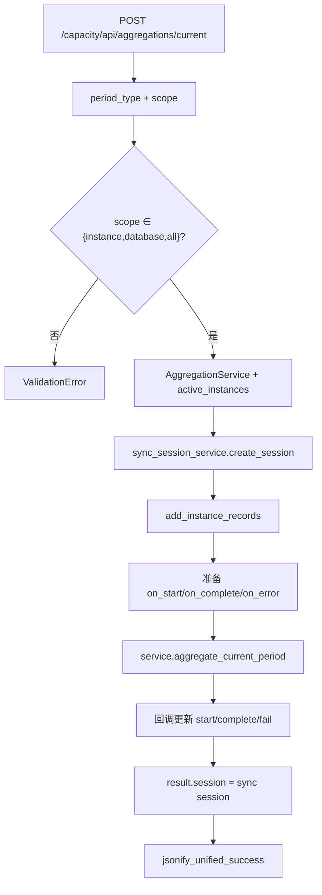
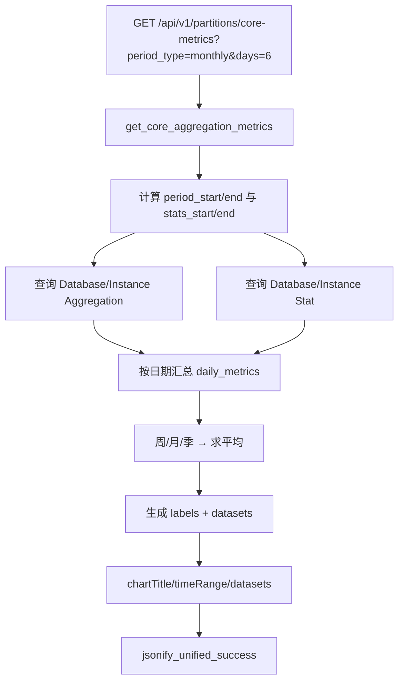

# WhaleFall 前端展示数据链路（Mermaid）

> 状态：Active
> 负责人：WhaleFall Team
> 创建：2025-11-29
> 更新：2025-12-26
> 范围：UI 关键视图的数据来源与风险点
> 关联：./README.md；../project-structure.md；../../standards/backend/api-response-envelope.md；../../standards/backend/error-message-schema-unification.md

目的：记录实例列表、容量统计、分区指标等前端页面的数据来源与风险，确保“看到的 = 查到的”。

## 目录

1. [容量统计图表（实例/数据库趋势）](#1-容量统计图表实例数据库趋势)
2. [分区页面核心指标](#2-分区页面核心指标)

---

## 1. 容量统计图表（实例/数据库趋势）

### 1.1 代码路径与职责

- `app/routes/capacity/aggregations.py::aggregate_current`：手动触发当前周期聚合，使用 `AggregationService.aggregate_current_period` 并接入 `sync_session_service`。
- `app/services/aggregation/aggregation_service.py`：封装聚合逻辑、实例/数据库 Runner。
- `app/services/sync_session_service.py`：为聚合任务创建会话与实例记录，供 UI 展示执行进度。

### 1.2 流程图

### 1.3 关键控制与风险

- **周期语义**：接口始终聚合“当前自然周期”（含今日/本周），若 Dashboard 需要“上一周期”必须改用 `calculate_*_aggregations`。
- **会话清理**：异常时要遍历 `records_by_instance` 填充 `fail_instance_sync`，否则前端的进度条会卡住。
- **回调风暴**：实例与数据库同时聚合会导致大量日志与回调，必要时添加节流。

---

## 2. 分区页面核心指标

### 2.1 代码路径与职责

- `app/routes/partition.py::get_core_aggregation_metrics`：根据 `period_type` 和 `days` 计算窗口，查询聚合/原始统计表，构建 Chart.js 数据。
- `DatabaseSizeAggregation`、`InstanceSizeAggregation`、`DatabaseSizeStat`、`InstanceSizeStat`：提供数据来源。
- `PartitionStatisticsService`：提供分区概览、健康检查（在其它 API 复用）。

### 2.2 流程图

### 2.3 关键控制与风险

- **周期窗口**：`period_start_date`/`stats_start_date` 的计算复杂且易错，尤其季度回溯；需通过单元测试覆盖并在日志中输出窗口。
- **查询体量**：`days` 较大时会拉取海量 `DatabaseSizeStat` 行，需考虑 LIMIT 或离线缓存。
- **展示文案**：Chart.js `labels` 使用周期结束日，需配合 `timeRange` 提示用户真实区间。

---

> 所有展示类页面在 PR 前必须附“抓包 + API JSON + SQL”对账；接口契约遵守：
> - [API 响应封套](../../standards/backend/api-response-envelope.md)
> - [错误消息字段统一](../../standards/backend/error-message-schema-unification.md)
