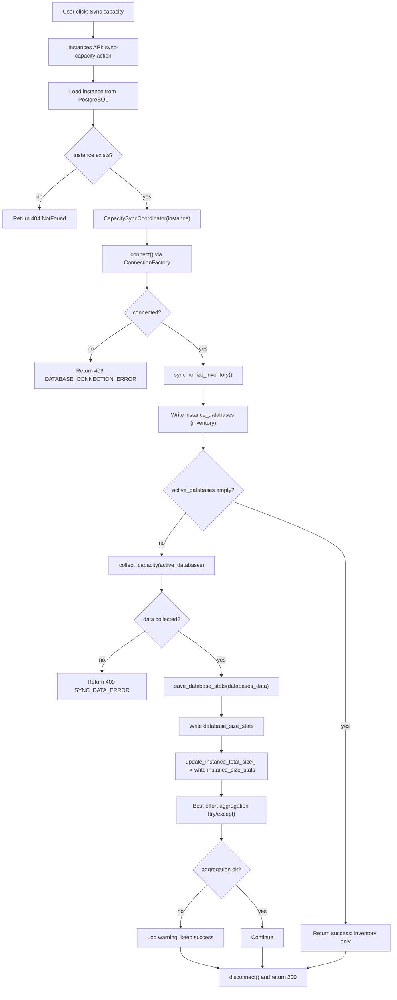
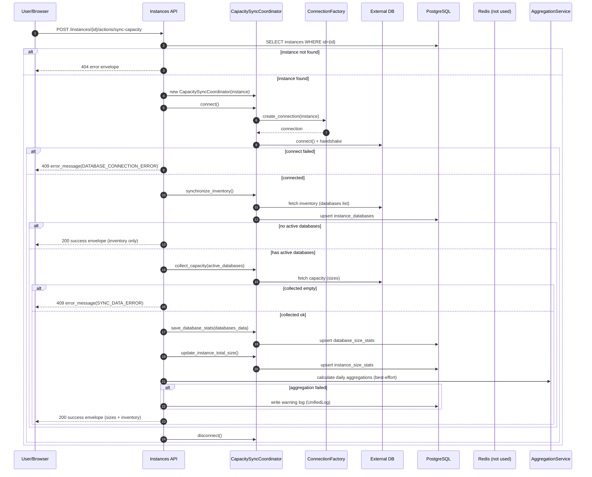
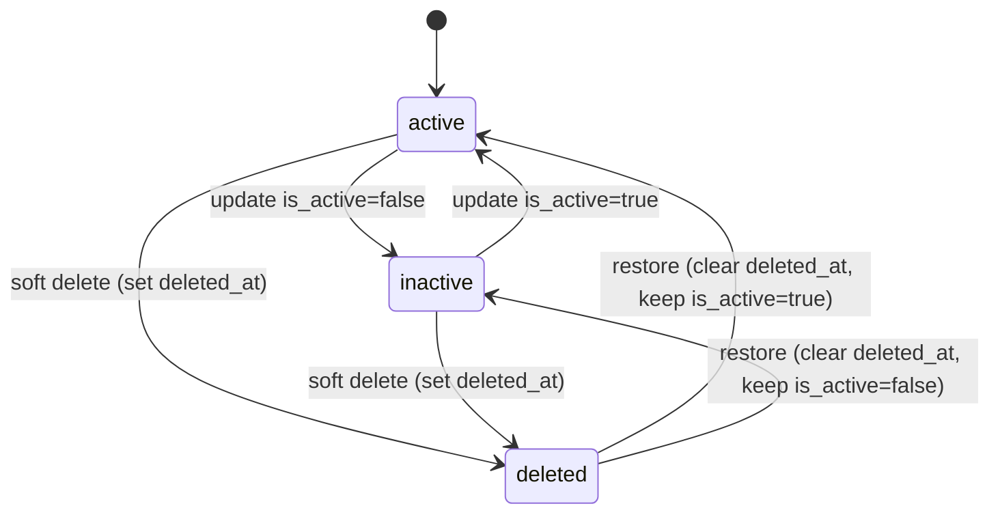

# 实例域(Instances) 研发图表包

> 状态: Draft
> 负责人: WhaleFall Team
> 创建: 2026-01-06
> 更新: 2026-01-06
> 范围: 研发视角, instances CRUD + instance actions
> 关联: ./spec.md; ./accounts-permissions-domain.md

## 1. 主流程图(Flow)

场景: "点一次按钮"触发实例容量同步.

入口: `POST /api/v1/instances/{instance_id}/actions/sync-capacity`

关键分支:

- connect failed: 返回 409, 不进入 inventory/collect.
- no active databases: 返回 200, 仅落 `instance_databases`.
- aggregation: best-effort, 失败只记录日志不影响本次成功返回.

## 2. 主时序图(Sequence)

场景: `POST /instances/{id}/actions/sync-capacity` 的完整链路.

说明: 本链路涉及 External DB + PostgreSQL. Redis 在该链路中不参与(不写缓存, 不做 cache invalidation), 但按模板保留为显式参与方.

## 3. 状态机(Optional but valuable)

### 3.1 Instance lifecycle

实例状态由 `instances.is_active` 与 `instances.deleted_at` 共同表达.

## 4. API 契约(Optional)

说明:

- response envelope: 所有 endpoints 通过 `BaseResource.success`/`safe_call` 返回统一封套.
- error envelope: 业务异常透传, 未捕获异常会被包装为统一 `public_error`.
- idempotency: 无显式 idempotency-key, 仅部分 endpoints 具备幂等语义(例如 restore/delete).

| Method | Path | Purpose | Idempotency | Pagination | Notes |
| --- | --- | --- | --- | --- | --- |
| GET | /api/v1/instances | list instances | yes (read) | page/limit | supports filters/sort (see query params parsing in code) |
| POST | /api/v1/instances | create instance | no | - | unique by `instances.name`, conflicts return 409 |
| GET | /api/v1/instances/{id} | instance detail | yes (read) | - | includes tags/credential (masked) |
| PUT | /api/v1/instances/{id} | update instance | no | - | rename conflicts return 409 |
| POST | /api/v1/instances/{id}/delete | soft delete | yes-ish | - | sets `deleted_at` if not set |
| POST | /api/v1/instances/{id}/restore | restore | yes-ish | - | if not deleted, returns success with `restored=false` |
| POST | /api/v1/instances/{id}/actions/sync-capacity | sync capacity for one instance | no | - | connects External DB, writes stats, best-effort aggregation |
| GET | /api/v1/instances/{id}/accounts | list instance accounts | yes (read) | page/limit | reads `account_permission` join `instance_accounts` |
| GET | /api/v1/instances/{id}/accounts/{account_id}/permissions | get account permissions | yes (read) | - | requires snapshot v4, otherwise 409 SNAPSHOT_MISSING |
| GET | /api/v1/instances/{id}/accounts/{account_id}/change-history | get permission change history | yes (read) | - | reads `account_change_log` |
| GET | /api/v1/instances/{id}/databases/sizes | list database size stats | yes (read) | page/limit | reads `database_size_stats` |
| GET | /api/v1/instances/{id}/databases/{db}/tables/sizes | list table size snapshot | yes (read) | limit/offset | reads `database_table_size_stats` |
| POST | /api/v1/instances/{id}/databases/{db}/tables/sizes/actions/refresh | refresh table size snapshot | no | limit/offset | connects External DB, writes `database_table_size_stats` |
| POST | /api/v1/instances/batch-create | batch create (CSV) | no | - | validates payloads, skips duplicates/existing names |
| POST | /api/v1/instances/batch-delete | batch delete (soft/hard) | depends | - | hard mode cascades delete of instance related data |
| GET | /api/v1/instances/statistics | instances statistics | yes (read) | - | summary metrics for dashboard |

