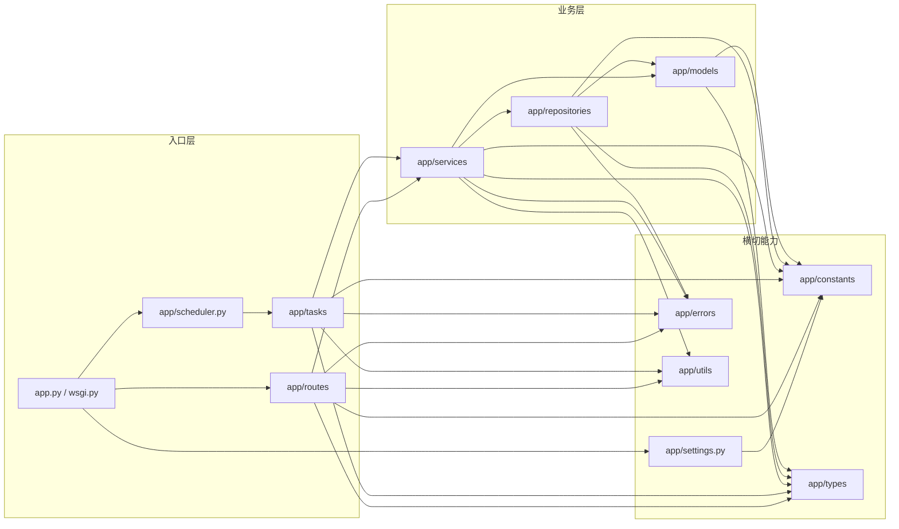

# 模块依赖图

> 状态：Draft
> 负责人：WhaleFall Team
> 创建：2025-12-26
> 更新：2025-12-26
> 范围：后端 Python 分层（routes/services/repositories/models/tasks）
> 关联：./spec.md；./project-structure.md；../standards/backend/api-response-envelope.md；../standards/backend/error-message-schema-unification.md

本文档用于给出**高层依赖方向**与**分层边界**，帮助评审与重构时快速判断“依赖是否越界”。

## 1. 依赖方向（约束）

- MUST：`routes` / `tasks` 只能依赖 `services`（以及必要的 `types/utils/errors/constants/settings`）。
- MUST：`services` 可依赖 `repositories` 与 `models`，不应反向依赖 `routes`。
- MUST：`repositories` 只做数据访问与查询组合，不应依赖 `routes` 或页面渲染。
- MUST NOT：`models` 依赖 `routes/services/repositories`（避免形成环）。

## 2. 高层依赖图（Mermaid）

## 3. 例外与说明

- 个别“页面聚合类”服务会同时读多个仓储/模型，允许存在，但应保持为 **read-only**（不写 DB、不产生副作用）。
