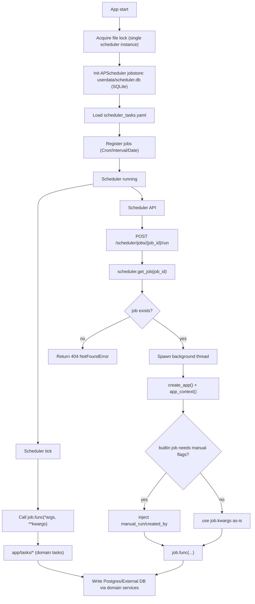
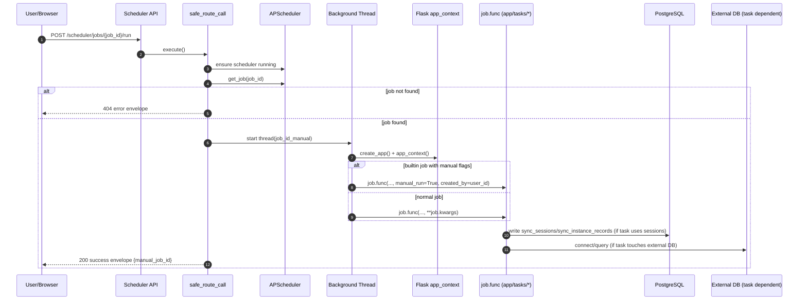
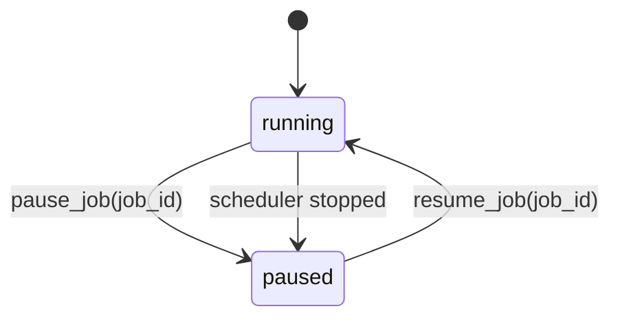
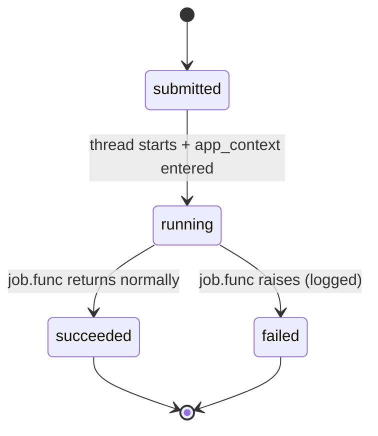

# 调度与执行域(Scheduler)研发图表包

> 状态: Draft
> 负责人: WhaleFall Team
> 创建: 2026-01-06
> 更新: 2026-01-06
> 范围: APScheduler jobstore + job lifecycle + manual run
> 关联: ./capacity-partitions-domain.md; ./accounts-permissions-domain.md; ./spec.md

## 1. 主流程图(Flow)

场景: 调度器加载任务配置并执行,以及通过 API 手动触发一次任务.

入口:

- boot: `app/scheduler.py` load `app/config/scheduler_tasks.yaml`
- manual run: `POST /api/v1/scheduler/jobs/{job_id}/run`

关键点:

- jobstore: APScheduler uses SQLite at `userdata/scheduler.db` to persist job definitions.
- lock: file lock prevents multiple scheduler instances in the same environment.
- manual run: API only submits a background thread, task execution is async.

## 2. 主时序图(Sequence)

场景: 手动触发内置任务立即执行.

入口: `POST /api/v1/scheduler/jobs/{job_id}/run`

## 3. 状态机(Optional but valuable)

### 3.1 Job state (API visible)

Job state is observed via `next_run_time` and scheduler running status:

- running: scheduler running and job has next_run_time
- paused: job paused or scheduler stopped

### 3.2 Manual run lifecycle

Manual run creates a background thread and returns immediately:

## 4. API 契约(Optional)

说明:

- `/run` is async: returns `manual_job_id` immediately, execution details must be checked via logs and/or SyncSession (if the task writes sessions).
- `/jobs/{job_id}` update only supports builtin tasks trigger changes.

| Method | Path | Purpose | Idempotency | Notes |
| --- | --- | --- | --- | --- |
| GET | /api/v1/scheduler/jobs | list jobs | yes (read) | requires scheduler running |
| GET | /api/v1/scheduler/jobs/{job_id} | job detail | yes (read) | includes trigger + next_run_time |
| PUT | /api/v1/scheduler/jobs/{job_id} | update trigger | no | only builtin jobs; csrf required |
| POST | /api/v1/scheduler/jobs/{job_id}/pause | pause job | yes-ish | csrf required |
| POST | /api/v1/scheduler/jobs/{job_id}/resume | resume job | yes-ish | csrf required |
| POST | /api/v1/scheduler/jobs/{job_id}/run | run job now | no | returns manual_job_id; runs in background |
| POST | /api/v1/scheduler/jobs/reload | reload all jobs | no | deletes existing jobs then reloads from config |

