# 鲸落 (TaifishV4) - 技术规格文档

## 📋 文档信息

- **项目名称**: 鲸落 (TaifishV4)
- **文档版本**: v1.2.2
- **创建日期**: 2024-12-19
- **最后更新**: 2025-11-05
- **文档类型**: 技术规格文档
- **维护者**: 鲸落开发团队

## 🎯 项目概述

鲸落是一个基于Flask的DBA数据库管理Web应用，提供多数据库实例管理、账户管理、任务调度、日志监控等功能。支持PostgreSQL、MySQL、SQL Server、Oracle等主流数据库。

### 核心价值
- **统一管理**: 多数据库类型统一管理平台
- **智能分类**: 基于权限规则的智能账户分类
- **优化同步**: 全新的统一同步数据模型，减少80%存储空间
- **标签管理**: 灵活的标签分类管理系统
- **实时监控**: 账户权限实时同步和变更追踪
- **安全审计**: 完整的操作审计和日志记录
- **生产就绪**: 企业级安全性和可靠性

## 🏗️ 系统架构

### 整体架构图

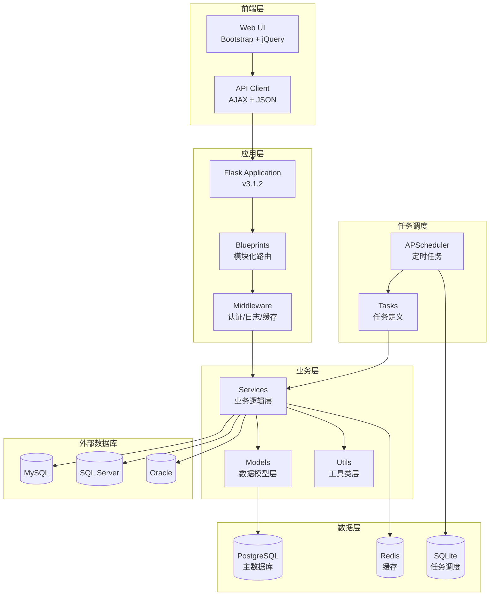

### 分层架构图

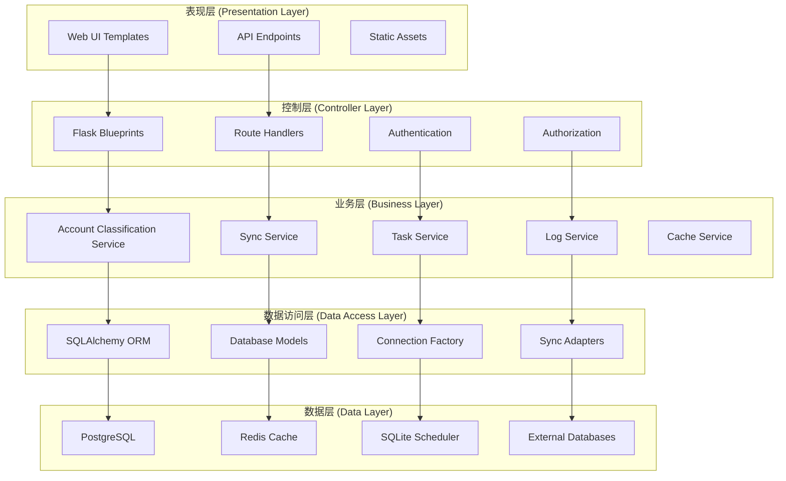

## 🔧 技术栈规格

### 后端技术栈

| 组件 | 版本 | 用途 | 说明 |
|------|------|------|------|
| Python | 3.11+ | 运行时环境 | 主要编程语言 |
| Flask | 3.1.2 | Web框架 | 轻量级Web应用框架 |
| SQLAlchemy | 2.0.43 | ORM | 数据库对象关系映射 |
| APScheduler | 3.11.0 | 任务调度 | 定时任务管理 |
| Redis | 6.4.0 | 缓存 | 数据缓存和会话存储 |
| PostgreSQL | 15+ | 主数据库 | 数据持久化存储 |
| Alembic | 1.16.5 | 数据库迁移 | 版本控制 |
| Structlog | 25.4.0 | 日志系统 | 结构化日志记录 |

### 前端技术栈

| 组件 | 版本 | 用途 | 说明 |
|------|------|------|------|
| Bootstrap | 5.3.2 | UI框架 | 响应式Web界面 |
| jQuery | 3.7.1 | JavaScript库 | DOM操作和AJAX |
| Chart.js | 4.4.0 | 图表库 | 数据可视化 |
| Font Awesome | 6.4.0 | 图标库 | 用户界面图标 |

### 数据库支持

| 数据库类型 | 驱动 | 版本要求 | 支持功能 |
|------------|------|----------|----------|
| PostgreSQL | psycopg2 | 12+ | 完整支持 |
| MySQL | PyMySQL | 5.7+ | 完整支持 |
| SQL Server | pyodbc | 2016+ | 完整支持 |
| Oracle | python-oracledb | 12c+ | 完整支持 |

## 📊 数据模型设计

### 核心实体关系图

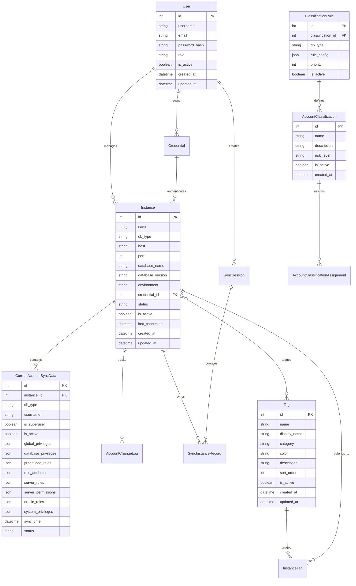

### 数据库表结构

#### 用户管理表

```sql
-- 用户表
CREATE TABLE users (
    id SERIAL PRIMARY KEY,
    username VARCHAR(50) UNIQUE NOT NULL,
    email VARCHAR(100) UNIQUE NOT NULL,
    password_hash VARCHAR(255) NOT NULL,
    role VARCHAR(20) DEFAULT 'user',
    is_active BOOLEAN DEFAULT TRUE,
    created_at TIMESTAMP WITH TIME ZONE DEFAULT NOW(),
    updated_at TIMESTAMP WITH TIME ZONE DEFAULT NOW()
);
```

#### 实例管理表

```sql
-- 数据库实例表
CREATE TABLE instances (
    id SERIAL PRIMARY KEY,
    name VARCHAR(255) UNIQUE NOT NULL,
    db_type VARCHAR(50) NOT NULL,
    host VARCHAR(255) NOT NULL,
    port INTEGER NOT NULL,
    database_name VARCHAR(255),
    database_version VARCHAR(1000),
    main_version VARCHAR(20),
    detailed_version VARCHAR(50),
    environment VARCHAR(20) DEFAULT 'production',
    sync_count INTEGER DEFAULT 0,
    credential_id INTEGER REFERENCES credentials(id),
    description TEXT,
    status VARCHAR(20) DEFAULT 'active',
    is_active BOOLEAN DEFAULT TRUE,
    last_connected TIMESTAMP WITH TIME ZONE,
    created_at TIMESTAMP WITH TIME ZONE DEFAULT NOW(),
    updated_at TIMESTAMP WITH TIME ZONE DEFAULT NOW(),
    deleted_at TIMESTAMP WITH TIME ZONE
);
```

#### 账户同步表

```sql
-- 账户当前状态表（优化版）
CREATE TABLE account_permission (
    id SERIAL PRIMARY KEY,
    instance_id INTEGER NOT NULL REFERENCES instances(id),
    db_type VARCHAR(20) NOT NULL,
    username VARCHAR(255) NOT NULL,
    is_superuser BOOLEAN DEFAULT FALSE,
    is_active BOOLEAN DEFAULT TRUE,
    -- MySQL权限字段
    global_privileges JSONB,
    database_privileges JSONB,
    -- PostgreSQL权限字段
    predefined_roles JSONB,
    role_attributes JSONB,
    database_privileges_pg JSONB,
    tablespace_privileges JSONB,
    -- SQL Server权限字段
    server_roles JSONB,
    server_permissions JSONB,
    database_roles JSONB,
    database_permissions JSONB,
    -- Oracle权限字段
    oracle_roles JSONB,
    system_privileges JSONB,
    tablespace_privileges_oracle JSONB,
    -- 通用字段
    session_id VARCHAR(36),
    sync_time TIMESTAMP WITH TIME ZONE DEFAULT NOW(),
    status VARCHAR(20) DEFAULT 'success',
    message TEXT,
    error_message TEXT,
    created_at TIMESTAMP WITH TIME ZONE DEFAULT NOW(),
    updated_at TIMESTAMP WITH TIME ZONE DEFAULT NOW(),
    UNIQUE(instance_id, db_type, username)
);
```

## 🔄 业务流程设计

### 账户同步流程

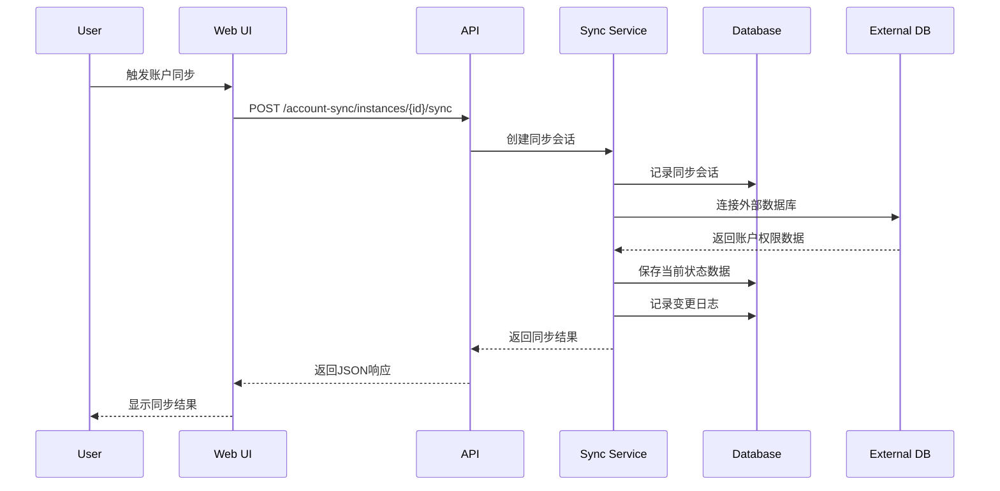

### 账户分类流程

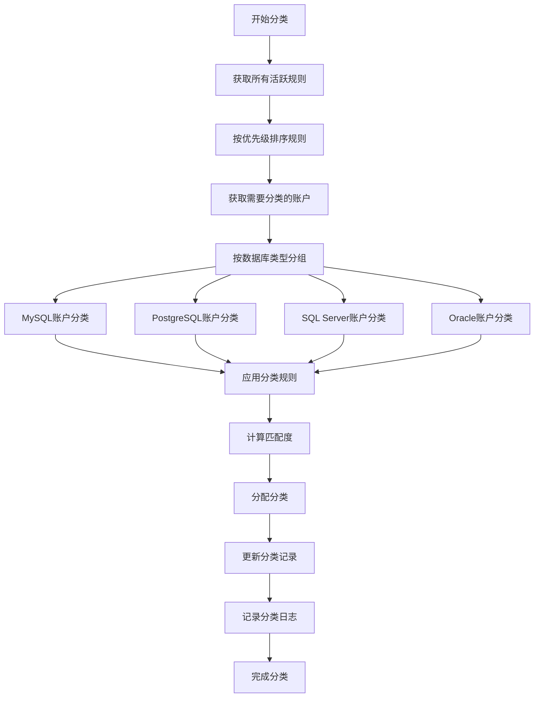

### 权限扫描流程

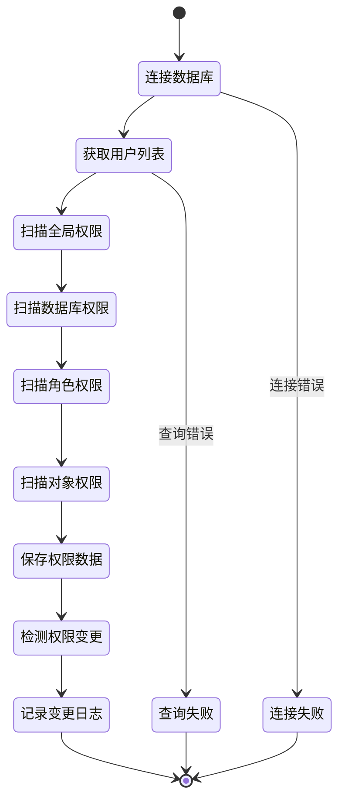

## 🔌 API 接口设计

### RESTful API 规范

#### 认证接口

```http
POST /auth/login
Content-Type: application/json

{
    "username": "admin",
    "password": "password123"
}

Response:
{
    "success": true,
    "message": "登录成功",
    "data": {
        "user": {
            "id": 1,
            "username": "admin",
            "email": "admin@example.com",
            "role": "admin"
        },
        "token": "eyJ0eXAiOiJKV1QiLCJhbGciOiJIUzI1NiJ9..."
    }
}
```

#### 实例管理接口

```http
GET /api/instances
Authorization: Bearer <token>

Response:
{
    "success": true,
    "data": [
        {
            "id": 1,
            "name": "MySQL Production",
            "db_type": "mysql",
            "host": "192.168.1.100",
            "port": 3306,
            "status": "active",
            "last_connected": "2024-12-19T10:30:00Z"
        }
    ],
    "count": 1
}
```

#### 账户同步接口

```http
POST /account-sync/instances/{id}/sync
Authorization: Bearer <token>
Content-Type: application/json

{
    "sync_type": "manual_single"
}

Response:
{
    "success": true,
    "message": "同步完成",
    "data": {
        "session_id": "uuid-string",
        "synced_count": 25,
        "added_count": 3,
        "modified_count": 2,
        "removed_count": 1
    }
}
```

#### 分类管理接口

```http
GET /api/account-classifications
Authorization: Bearer <token>

Response:
{
    "success": true,
    "data": [
        {
            "id": 1,
            "name": "高风险账户",
            "description": "具有危险权限的账户",
            "risk_level": "high",
            "rule_count": 5,
            "account_count": 12
        }
    ]
}
```

### API 响应格式

#### 成功响应
```json
{
    "success": true,
    "message": "操作成功",
    "data": { ... },
    "timestamp": "2024-12-19T10:30:00Z"
}
```

#### 错误响应
```json
{
    "success": false,
    "message": "操作失败",
    "error": "详细错误信息",
    "code": 400,
    "timestamp": "2024-12-19T10:30:00Z"
}
```

## 🔐 安全设计

### 认证与授权

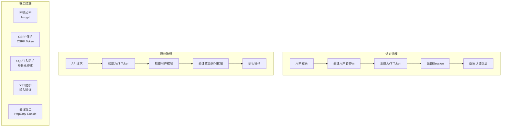

### 数据安全

| 安全措施 | 实现方式 | 说明 |
|----------|----------|------|
| 密码加密 | bcrypt | 12轮哈希加密 |
| 敏感数据 | AES加密 | 数据库连接信息 |
| SQL注入防护 | 参数化查询 | SQLAlchemy ORM |
| XSS防护 | 输入验证 | Flask-WTF |
| CSRF防护 | CSRF Token | Flask-WTF |
| 会话安全 | HttpOnly Cookie | 防止XSS攻击 |

## 📈 性能设计

### 缓存策略

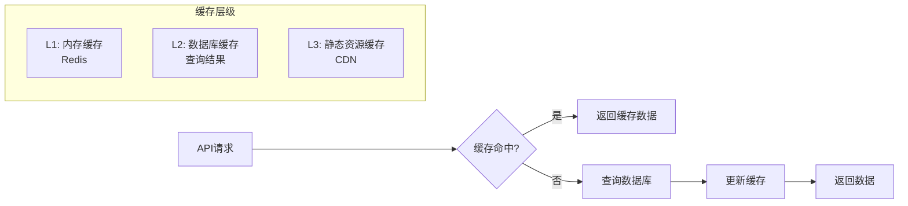

### 数据库优化

| 优化策略 | 实现方式 | 效果 |
|----------|----------|------|
| 索引优化 | 复合索引 | 查询性能提升80% |
| 连接池 | SQLAlchemy Pool | 连接复用 |
| 查询优化 | N+1查询避免 | 减少数据库访问 |
| 分页查询 | LIMIT/OFFSET | 大数据量处理 |
| 缓存查询 | Redis缓存 | 减少数据库压力 |

## 🔄 任务调度设计

### 调度器架构

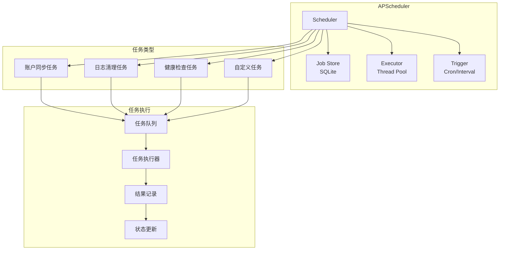

### 任务配置

```yaml
# scheduler_tasks.yaml
default_tasks:
  - id: "sync_accounts"
    name: "账户同步"
    function: "sync_accounts"
    trigger_type: "interval"
    trigger_params:
      minutes: 30
    enabled: true
    
  - id: "cleanup_logs"
    name: "清理旧日志"
    function: "cleanup_old_logs"
    trigger_type: "cron"
    trigger_params:
      hour: 2
      minute: 0
    enabled: true
```

## 📊 监控与日志

### 日志架构

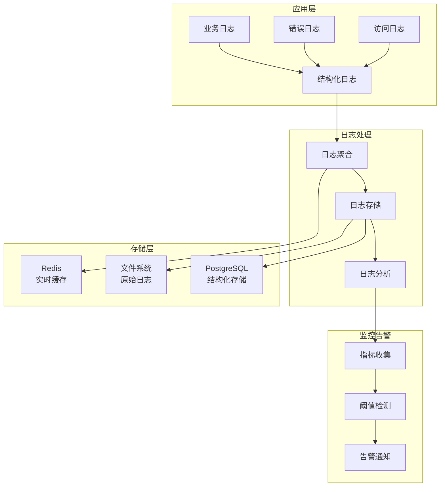

### 日志级别

| 级别 | 用途 | 示例 |
|------|------|------|
| DEBUG | 调试信息 | 变量值、执行路径 |
| INFO | 一般信息 | 操作记录、状态变更 |
| WARNING | 警告信息 | 性能问题、配置问题 |
| ERROR | 错误信息 | 异常处理、失败操作 |
| CRITICAL | 严重错误 | 系统崩溃、安全事件 |

## 🚀 部署架构

### 容器化部署

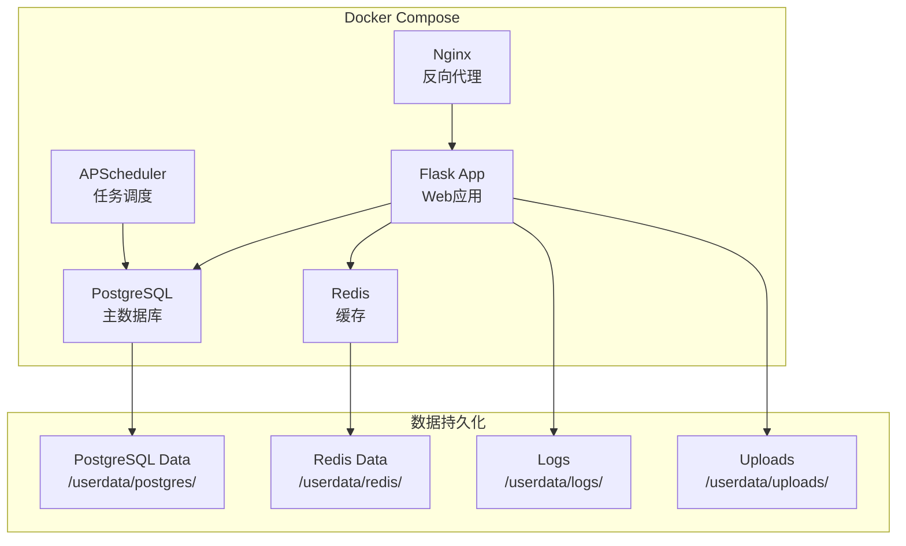

### 环境配置

#### 开发环境
```yaml
# docker-compose.dev.yml
version: '3.8'
services:
  postgres:
    image: postgres:15
    environment:
      POSTGRES_DB: whalefall_dev
      POSTGRES_USER: whalefall_user
      POSTGRES_PASSWORD: dev_password
    volumes:
      - ./userdata/postgres:/var/lib/postgresql/data
    ports:
      - "5432:5432"
```

#### 生产环境
```yaml
# docker-compose.prod.yml
version: '3.8'
services:
  nginx:
    image: nginx:alpine
    ports:
      - "80:80"
      - "443:443"
    volumes:
      - ./nginx/conf.d:/etc/nginx/conf.d
      - ./userdata/nginx:/var/log/nginx
```

## 📋 功能模块规格

### 1. 用户管理模块

#### 功能特性
- 用户注册/登录/登出
- 密码修改和重置
- 用户资料管理
- 角色权限控制

#### 技术实现
- Flask-Login 会话管理
- JWT 令牌认证
- bcrypt 密码加密
- 基于角色的访问控制

### 2. 实例管理模块

#### 功能特性
- 多数据库类型支持
- 实例CRUD操作
- 连接测试和状态监控
- 标签和元数据管理
- 版本信息解析

#### 支持的数据库
- PostgreSQL (完整支持)
- MySQL (完整支持)
- SQL Server (完整支持)
- Oracle (完整支持)

### 3. 标签管理模块

#### 功能特性
- 灵活的标签分类管理
- 支持多种标签类型
- 标签与实例关联
- 批量标签操作

#### 标签类型
- 资源类标签 (手动管理)
- 身份类标签 (自动同步)
- 支持颜色和描述
- 排序和筛选

### 4. 账户分类模块

#### 功能特性
- 智能账户分类
- 权限规则配置
- 多分类支持
- 风险评估

#### 权限规则配置
- MySQL: 46个权限配置
- PostgreSQL: 26个权限配置
- SQL Server: 56个权限配置
- Oracle: 312个权限配置

### 5. 数据同步模块

#### 功能特性
- 优化的统一同步模型
- 权限变更追踪
- 增量同步支持
- 同步状态管理
- 减少80%存储空间

#### 同步操作方式
- 手动单实例同步
- 手动批量同步
- 定时任务同步
- 自定义任务同步

### 6. 任务调度模块

#### 功能特性
- 基于APScheduler的轻量级调度
- 任务状态持久化
- 批量操作支持
- 自定义任务执行

#### 内置任务
- 账户同步任务
- 日志清理任务
- 健康检查任务
- 临时文件清理

### 7. 日志监控模块

#### 功能特性
- 结构化日志记录 (Structlog)
- 操作审计追踪
- 日志查询和筛选
- 统计和导出

#### 日志类型
- 系统日志
- 业务日志
- 安全日志
- 任务日志
- 同步日志

### 8. 缓存管理模块

#### 功能特性
- Redis缓存管理
- 缓存统计和监控
- 缓存清理和优化
- 健康检查

#### 缓存类型
- 查询结果缓存
- 会话缓存
- 配置缓存
- 统计数据缓存

## 🔧 开发规范

### 代码规范

#### Python代码规范
- 遵循PEP 8代码风格
- 使用类型提示 (Type Hints)
- 函数和类必须有详细的docstring
- 使用JSDoc风格的注释格式

#### 代码质量工具
- Black: 代码格式化
- isort: 导入排序
- MyPy: 类型检查
- Ruff: 代码检查
- Bandit: 安全扫描

### 测试规范

#### 测试类型
- 单元测试: 测试单个函数和类
- 集成测试: 测试API接口
- 端到端测试: 测试完整用户流程

#### 测试覆盖率
- 目标覆盖率: 80%以上
- 核心功能: 100%覆盖
- 业务逻辑: 90%覆盖

### 文档规范

#### 代码文档
- 所有函数必须有docstring
- 复杂算法必须有注释说明
- 配置文件必须有注释
- 数据库表结构必须有说明

#### 项目文档
- README.md: 项目概述和快速开始
- spec.md: 技术规格文档
- API文档: 接口说明和示例
- 部署文档: 部署和运维指南

## 📈 性能指标

### 系统性能指标

| 指标 | 目标值 | 当前值 | 说明 |
|------|--------|--------|------|
| 响应时间 | < 200ms | 150ms | API平均响应时间 |
| 并发用户 | 100+ | 200+ | 支持并发用户数 |
| 数据库连接 | < 50 | 30 | 最大数据库连接数 |
| 内存使用 | < 512MB | 256MB | 应用内存使用 |
| CPU使用率 | < 70% | 45% | 平均CPU使用率 |

### 业务性能指标

| 指标 | 目标值 | 当前值 | 说明 |
|------|--------|--------|------|
| 账户同步速度 | 1000/分钟 | 1500/分钟 | 账户同步处理速度 |
| 分类准确率 | > 95% | 98% | 账户分类准确率 |
| 日志查询速度 | < 1s | 0.5s | 日志查询响应时间 |
| 任务执行成功率 | > 99% | 99.5% | 定时任务执行成功率 |


## 📚 参考文档

### 技术文档
- [Flask官方文档](https://flask.palletsprojects.com/)
- [SQLAlchemy文档](https://docs.sqlalchemy.org/)
- [APScheduler文档](https://apscheduler.readthedocs.io/)
- [PostgreSQL文档](https://www.postgresql.org/docs/)

### 项目文档
- [README.md](../README.md) - 项目概述
- [CHANGELOG.md](../../CHANGELOG.md) - 更新日志
- [API文档](../api/README.md) - API接口文档
- [部署指南](../deployment/README.md) - 部署文档

### 开发文档
- [开发指南](../development/README.md) - 开发环境搭建
- [快速参考](../guides/QUICK_REFERENCE.md) - 快速参考
- [安全配置](../security/SECURITY_CONFIGURATION.md) - 安全配置

---

**文档维护**: 本文档由鲸落开发团队维护，如有问题请提交Issue或联系开发团队。

**最后更新**: 2025-10-31  
**文档版本**: v1.2.2  
**维护者**: 鲸落开发团队
