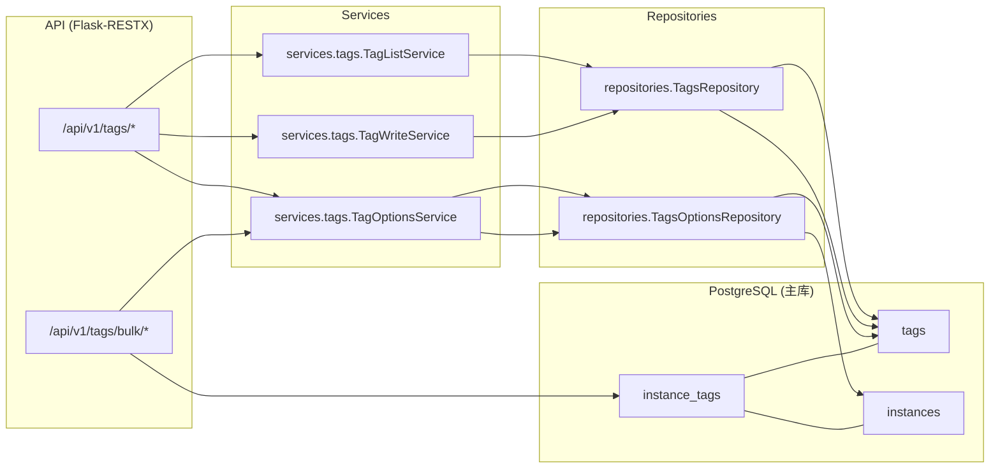

# 标签域(Tags)研发图表包

> 状态: Draft
> 负责人: WhaleFall Team
> 创建: 2026-01-06
> 更新: 2026-01-06
> 范围: tags CRUD, tags bulk assign/remove, instance_tags relation
> 关联: ./instances-domain.md; ./accounts-permissions-domain.md; ./databases-ledger-domain.md

## 1. 目标

- 让研发快速回答: 标签怎么建/改/删, 怎么批量给实例打标签, 删除失败如何定位.
- 明确 tags 是实例维度的横切元数据: 会影响 accounts ledger 与 databases ledger 的筛选.

## 2. 域边界

### 2.1 In scope

- 标签 CRUD: `Tag` 表的创建/更新/删除/列表.
- 标签批量操作: 对实例与标签的多对多关系进行批量 assign/remove/remove-all.
- 选项 API: tags 下拉选项, 分类列表, 可打标签实例列表.

### 2.2 Out of scope(但有依赖)

- 实例 CRUD: tags 是实例的附属元数据, 实例本体见 `docs/architecture/instances-domain.md`.
- 台账读取:
  - accounts ledger 以 instance tags 作为过滤条件之一.
  - databases ledger 以 instance tags 作为过滤条件之一(见 `docs/architecture/databases-ledger-domain.md`).

## 3. 组件与依赖(代码落点)

权限入口:

- 登录校验: `app/api/v1/resources/decorators.py::api_login_required`
- 权限校验: `app/api/v1/resources/decorators.py::api_permission_required`

## 4. 关键流程

### 4.1 创建/更新标签

1. route: `app/api/v1/namespaces/tags.py` 接收 payload.
2. service: `TagWriteService` 解析 payload 并做校验:
   - `name` 唯一性检查(按 Tag.name).
3. repo: `TagsRepository.add(tag)` -> `db.session.flush()`.
4. `safe_call` 统一 commit/rollback + error envelope.

### 4.2 删除标签(含 in_use 分支)

- `DELETE /api/v1/tags/{tag_id}`:
  - 若 `tag.instances` 非空, service 返回 `in_use`, route 抛 `ConflictError` 并返回 409, message_key: `TAG_IN_USE`.
  - 否则删除 `instance_tags` 关联行后删除 tag 记录.

### 4.3 批量分配/移除标签

- routes: `app/api/v1/namespaces/tags_bulk.py`.
- 行为: 读取 instance_ids/tag_ids, 加载 `Instance` 与 `Tag`, 然后对 `instance.tags` 关系做 append/remove.
- 持久化: 依赖 `safe_call` 在请求结束时统一 commit.

注意: `POST /api/v1/tags/bulk/instance-tags` 虽然是查询语义, 但当前实现仍要求 CSRF(`@require_csrf`).

## 5. API 契约(Optional)

说明:

- 所有 endpoints 返回统一 success/error envelope.
- 写接口通常要求 CSRF, 由 `app/utils/decorators.py::require_csrf` 校验.

### 5.1 `/api/v1/tags`

| Method | Path | Permission | CSRF | Notes |
| --- | --- | --- | --- | --- |
| GET | `/api/v1/tags` | `view` | no | query: `search`, `category`, `status`, `page`, `limit`. |
| POST | `/api/v1/tags` | `create` | yes | create tag. |
| GET | `/api/v1/tags/options` | `view` | no | query: `category` optional. |
| GET | `/api/v1/tags/categories` | `view` | no | category choices. |
| GET | `/api/v1/tags/by-name/{tag_name}` | `view` | no | lookup by Tag.name. |
| GET | `/api/v1/tags/{tag_id}` | `view` | no | detail. |
| PUT | `/api/v1/tags/{tag_id}` | `update` | yes | update. |
| DELETE | `/api/v1/tags/{tag_id}` | `delete` | yes | 409 when in use. |
| POST | `/api/v1/tags/batch-delete` | `delete` | yes | returns 200 or 207, per-item status. |

### 5.2 `/api/v1/tags/bulk`

| Method | Path | Permission | CSRF | Notes |
| --- | --- | --- | --- | --- |
| GET | `/api/v1/tags/bulk/instances` | `view` | no | taggable instances options. |
| GET | `/api/v1/tags/bulk/tags` | `view` | no | all tags options + category names. |
| POST | `/api/v1/tags/bulk/actions/assign` | `create` | yes | payload: `instance_ids`, `tag_ids`. |
| POST | `/api/v1/tags/bulk/actions/remove` | `create` | yes | payload: `instance_ids`, `tag_ids`. |
| POST | `/api/v1/tags/bulk/instance-tags` | `view` | yes | payload: `instance_ids`, returns union tags. |
| POST | `/api/v1/tags/bulk/actions/remove-all` | `create` | yes | payload: `instance_ids`. |
