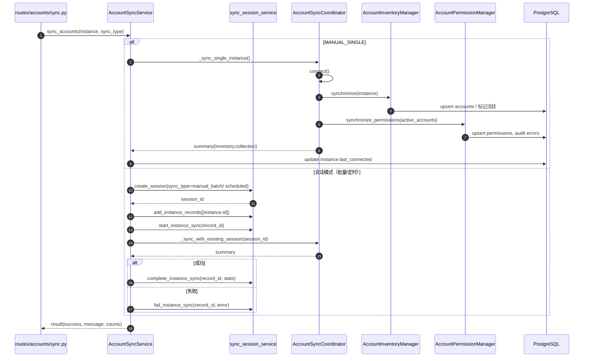
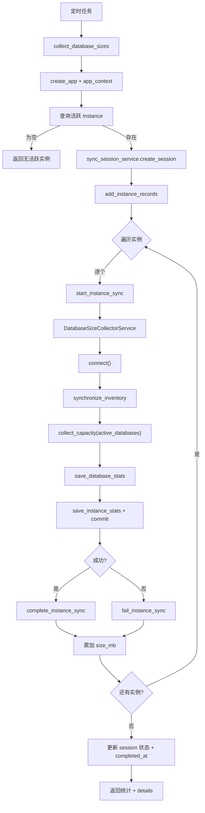
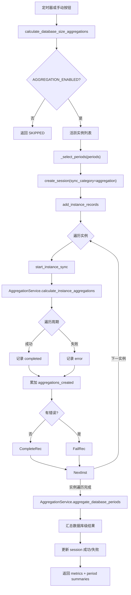

# Taifish 数据采集与同步流程（Mermaid 版）
**版本**：v0.1｜2025-11-29｜覆盖账户、容量、聚合、分类等高危链路  
**目的**：沉淀后端“采集/同步/聚合”类流程的真实实现，辅助排查数据缺口与回滚策略。

## 目录
1. [账户同步双阶段（Inventory + Permission）](#1-账户同步双阶段inventory--permission)
2. [容量采集与保存](#2-容量采集与保存)
3. [容量聚合（实例级 + 数据库级）](#3-容量聚合实例级--数据库级)
4. [账户自动分类编排](#4-账户自动分类编排)

---

## 1. 账户同步双阶段（Inventory + Permission）
### 1.1 代码路径与职责
- `app/routes/accounts/sync.py::sync_instance_accounts`：校验实例、记录日志、调用 `accounts_sync_service`。
- `app/services/accounts_sync/accounts_sync_service.py`：根据 `SyncOperationType` 决定是否创建会话，封装 `_sync_single_instance`、`_sync_with_session`。
- `app/services/accounts_sync/coordinator.py`：维护数据库连接，串联 `AccountInventoryManager` 与 `AccountPermissionManager`。
- `app/services/accounts_sync/inventory_manager.py`、`permission_manager.py`：分别落地账户清单、权限详情。
- `app/services/sync_session_service.py`：MANUAL_BATCH/SCHEDULED_TASK/任务触发时写入 `sync_sessions`、`sync_instance_records` 并统计成功/失败。

### 1.2 流程图


### 1.3 关键控制与风险
- **连接复用**：`AccountSyncCoordinator.connect()` 会缓存连接，失败会设置 `_connection_failed`，再次进入直接中止；需要观察连接恢复策略。
- **缓存回填**：权限阶段依赖 `_active_accounts_cache` 和 `_cached_accounts`，若 inventory 被跳过将重新同步，日志标记 `accounts_sync_inventory_rehydrated`。
- **失败补偿**：MANUAL_SINGLE 只写日志；批量模式通过 `sync_session_service.fail_instance_sync` 记录错误，但没有自动回滚第一阶段写入（代码层面只是在数据库上标记 deactivated/reactivated）。
- **指标上报**：`_build_result` 把 `inventory` 与 `collection` 的新增、更新、删除数量合并为 message，便于 UI 展示，但不会主动触发告警。

### 当前逻辑缺陷（需修复）
- **缺少跨阶段补偿**：`_sync_with_session()` 先执行清单再执行权限，若第二阶段失败，只返回 `success=False`，不会撤销第一阶段对账户状态的更改。
- **异常未回收同步记录**：`except` 分支只 `_emit_completion_log`，未调用 `sync_session_service.fail_instance_sync`，导致 `sync_instance_record` 可能卡在 RUNNING 状态。

---

## 2. 容量采集与保存
### 2.1 代码路径与职责
- `app/tasks/capacity_collection_tasks.py::collect_database_sizes`：每天 03:00 调度，创建 Flask 应用上下文并驱动全量同步，写 `sync_sessions`。
- `app/services/database_sync/database_sync_service.py::DatabaseSizeCollectorService`：兼容层，内部调用 `CapacitySyncCoordinator`。
- `app/services/database_sync/coordinator.py::CapacitySyncCoordinator`：连接数据库 → 拉库表清单（InventoryManager）→ 采集容量（适配器）→ `CapacityPersistence` 落表。
- `app/services/database_sync/inventory_manager.py`、`database_filters.py`、`persistence.py`：负责筛选数据库、同步 `instance_databases`、写 `database_size_stats` 与 `instance_size_stats`。

### 2.2 流程图


### 2.3 关键控制与风险
- **实例粒度事务**：每个实例的 `collect_and_save` 在内部 `db.session.commit()`，失败会 rollback 但不会重新排队；调度层只计数失败，无自动重试。
- **过滤策略**：`database_sync_filter_manager` 同时过滤入口目标库与采集结果，遇到被过滤的数据库仅记录日志，不会持久化。
- **连接生命周期**：`DatabaseSizeCollectorService` 利用上下文管理器确保 `disconnect()` 调用，但若 `connect()` 返回 False 只是在任务层面记失败实例。

### 当前逻辑缺陷（需修复）
- **失败实例无补偿**：每个实例失败后只调用 `fail_instance_sync`，不会将实例加入重试队列，导致该实例当天数据缺失。
- **部分写入不可回滚**：`save_database_stats` 成功、`update_instance_total_size` 失败时，数据库统计已提交但实例聚合回滚，造成不一致。
- **会话统计失真**：无活跃数据库的实例也标记为成功，`instances_processed` 与真实写入数存在偏差。

---

## 3. 容量聚合（实例级 + 数据库级）
### 3.1 代码路径与职责
- `app/tasks/capacity_aggregation_tasks.py::calculate_database_size_aggregations`：允许手动/定时执行，创建 `sync_sessions`，遍历活跃实例。
- `app/services/aggregation/aggregation_service.py`：提供 `calculate_instance_aggregations`、`aggregate_database_periods`、`calculate_*_aggregations` 等接口，封装 `InstanceAggregationRunner`、`DatabaseAggregationRunner`。
- `app/services/aggregation/calculator.py`、`instance_aggregation_runner.py`、`database_aggregation_runner.py`：根据周期计算起止日期、写 `*_aggregation` 表。

### 3.2 流程图


### 3.3 关键控制与风险
- **周期选择**：`_select_periods` 只接受 `daily/weekly/monthly/quarterly`，传入其他值会返回空并直接 SKIP，需要上层在调用前校验。
- **失败标记**：实例任意周期失败即调用 `fail_instance_sync`，但不会中断剩余实例；数据库级聚合失败仅写日志与 `errors`，没有自动重试。
- **数据一致性**：`_commit_with_partition_retry` 只做一次提交，不含锁；若唯一约束冲突会抛 `DatabaseError` 并在任务层 catch。

### 当前逻辑缺陷（需修复）
- **日聚合使用“当前日”**：`calculate_daily_aggregations()` 默认 `use_current_period=True`，凌晨执行时聚合尚未完成的“今天”，与采集数据错位。
- **入口混淆**：`aggregate_current_period()` 始终使用当前周期，若外部服务想聚合“上一完整季度”却调用该接口，会导致指标偏移。
- **实例失败不阻断数据库聚合**：实例循环失败后仍执行 `aggregate_database_periods`，数据库级表可能包含缺失实例。

---

## 4. 账户自动分类编排
### 4.1 代码路径与职责
- `app/routes/accounts/classifications.py::auto_classify`：解析请求、校验权限、调用 `_auto_classify_service` 并返回标准化 payload。
- `app/services/account_classification/auto_classify_service.py::AutoClassifyService`：负责参数归一化、日志、错误转换，并调度 `AccountClassificationService`。
- `app/services/account_classification/orchestrator.py::AccountClassificationService`：加载规则、分组账户、调用 `ClassifierFactory`、批量写入 `AccountClassificationAssignment`。
- `app/services/account_classification/cache.py` / `repositories.py` / `classifiers/`：分别提供缓存、数据库访问和表达式求值。

### 4.2 流程图
```mermaid
flowchart TD
    Trigger["POST /accounts_classifications/api/auto-classify"] --> Service["AutoClassifyService.auto_classify"]
    Service --> Normalize["normalize instance_id + use_optimized"]
    Normalize --> Orchestrator["AccountClassificationService.auto_classify_accounts"]
    Orchestrator --> LoadRules["ClassificationCache.get_rules -> fallback fetch_active_rules"]
    Orchestrator --> FetchAccounts["ClassificationRepository.fetch_accounts(instance_id)"]
    FetchAccounts --> Cleanup[cleanup_all_assignments()]
    LoadRules --> GroupRules["group_rules_by_db_type()"]
    FetchAccounts --> GroupAccounts["group_accounts_by_db_type()"]
    GroupAccounts --> ForDb{遍历 db_type}
    GroupRules --> ForDb
    ForDb --> EvalRule["ClassifierFactory.evaluate(rule, account)"]
    EvalRule --> Upsert["ClassificationRepository.upsert_assignments()"]
    Upsert --> Collect["累计 total_matches + errors"]
    Collect --> NextDb{还有 db_type?}
    NextDb -->|是| ForDb
    NextDb -->|否| Stats["汇总 total_accounts/rules/matches"]
    Stats --> Orchestrator
    Orchestrator --> Service
    Service --> Payload["AutoClassifyResult.to_payload()"]
```

### 4.3 关键控制与风险
- **清理策略**：`cleanup_all_assignments()` 会在每次运行前清空分配记录，即使后续分类失败也不会自动回滚，需要配合任务追踪。
- **缓存一致性**：规则优先读缓存，命中后依赖 `repository.hydrate_rules`；若缓存过期未及时失效，可能使用旧规则，需要在规则管理处调用 `invalidate_cache`。
- **分类器覆盖**：`ClassifierFactory.get(rule.db_type)` 返回 None 时直接跳过规则，未记录额外告警；如缺少新数据库类型的分类器会悄然失败。
- **错误汇总**：按 db_type 聚合的 `errors` 仅存字符串，未绑定具体账户，定位具体受影响账户需另查 `AccountClassificationAssignment` 以及日志。

---
> 若需要其它采集/同步流程，请继续在本文件追加章节，并同步审核“前后端数据一致性手册”。
