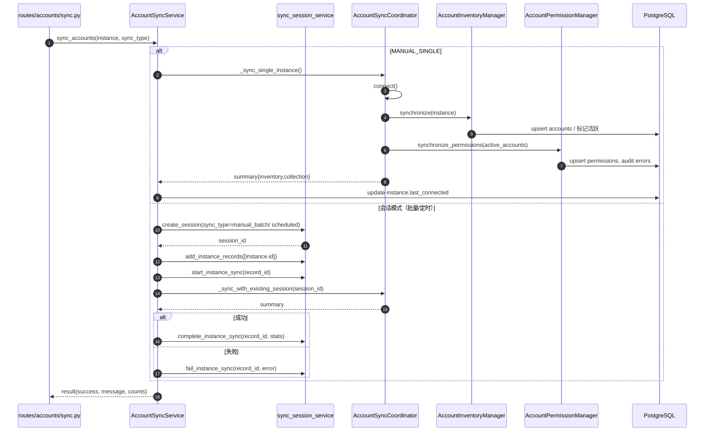
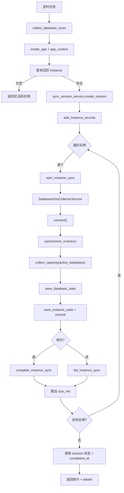
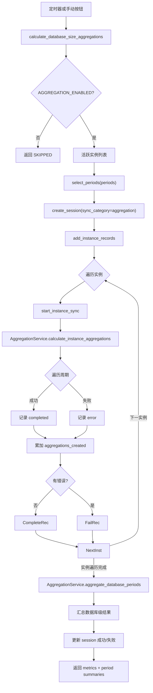
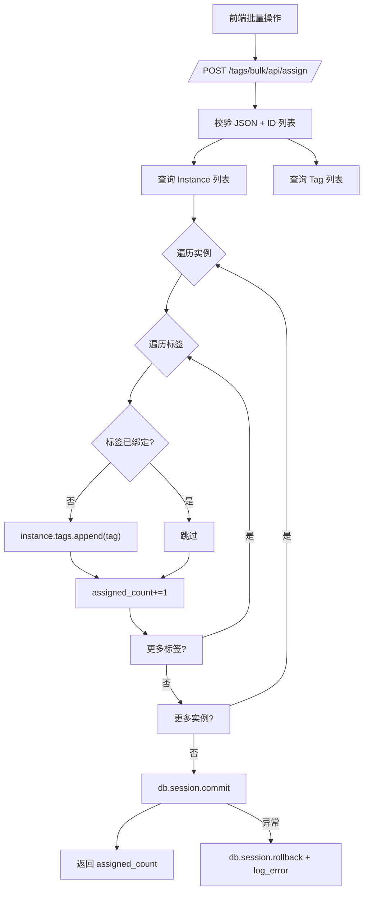
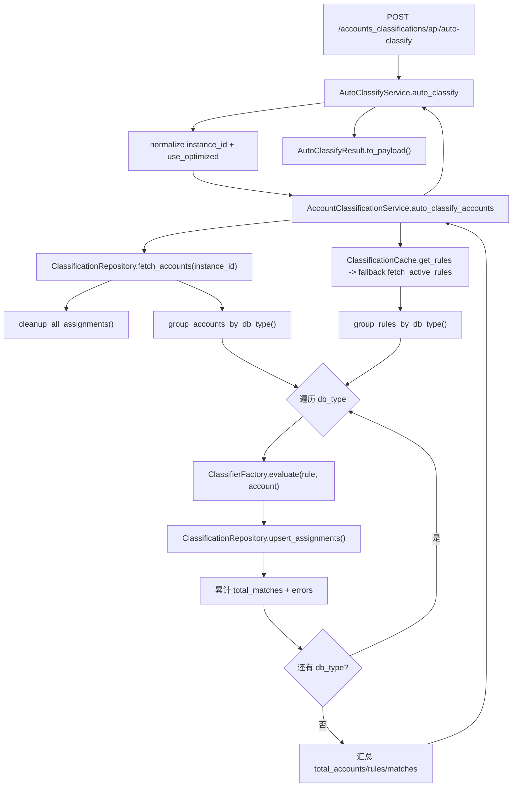

# Taifish 运行流转图（Mermaid 版）
**版本**：v0.1｜2025-11-29｜依据 `app/routes`、`app/services`、`app/tasks` 当前实现梳理  
**目的**：把真实代码路径中的账户同步、容量采集、容量聚合、标签批量操作等关键链路可视化，辅助排查缺口。

## 0. 阅读指引
- **取数来源**：所有流程均来自现有 Python 代码（例如 `app/routes/accounts/sync.py`、`app/services/accounts_sync/accounts_sync_service.py`、`app/tasks/capacity_collection_tasks.py` 等），未采用伪流程。
- **Mermaid 预览**：可在 VS Code + Mermaid 插件中预览，或将每个代码块保存为 `docs/architecture/flowcharts/flowXX_xxx.mmd` 后运行 `npx @mermaid-js/mermaid-cli -i flow.mmd -o flow.png` 导出。
- **字段对齐**：图中节点名称尽量与代码函数、模型字段一致（例如 `sync_session_service.start_instance_sync`、`DatabaseSizeCollectorService.collect_and_save`）。
- **扩展方式**：如需新增链路，请先在对应模块内查证函数调用，再复制章节模板补充。

## 1. 账户同步双阶段（Inventory + Permission）
### 1.1 代码路径与职责
- `app/routes/accounts/sync.py::sync_instance_accounts`：校验实例、记录日志、调用 `accounts_sync_service`。
- `app/services/accounts_sync/accounts_sync_service.py`：根据 `SyncOperationType` 决定是否创建会话，封装 `_sync_single_instance`、`_sync_with_session`。
- `app/services/accounts_sync/coordinator.py`：维护数据库连接，串联 `AccountInventoryManager` 与 `AccountPermissionManager`。
- `app/services/accounts_sync/inventory_manager.py`、`permission_manager.py`：分别落地账户清单、权限详情。
- `app/services/sync_session_service.py`：MANUAL_BATCH/SCHEDULED_TASK/任务触发时写入 `sync_sessions`、`sync_instance_records` 并统计成功/失败。

### 1.2 流程图

### 1.3 关键控制与风险
- **连接复用**：`AccountSyncCoordinator.connect()` 会缓存连接，失败会设置 `_connection_failed`，再次进入直接中止；需要观察连接恢复策略。
- **缓存回填**：权限阶段依赖 `_active_accounts_cache` 和 `_cached_accounts`，若 inventory 被跳过将重新同步，日志标记 `accounts_sync_inventory_rehydrated`。
- **失败补偿**：MANUAL_SINGLE 只写日志；批量模式通过 `sync_session_service.fail_instance_sync` 记录错误，但没有自动回滚第一阶段写入（代码层面只是在数据库上标记 deactivated/reactivated）。
- **指标上报**：`_build_result` 把 `inventory` 与 `collection` 的新增、更新、删除数量合并为 message，便于 UI 展示，但不会主动触发告警。

### 当前逻辑缺陷（需修复）
- **缺少跨阶段补偿**：`app/services/accounts_sync/accounts_sync_service.py` 的 `_sync_with_session()` 先调用 `AccountInventoryManager.synchronize` 写入账户状态，再执行 `AccountPermissionManager.synchronize_permissions`。当第二阶段抛错时仅返回 `{"success": False}`，没有把清单阶段的增删状态回滚，真实数据会停留在“账户存在但权限为空”的脏状态。
- **异常未回收同步记录**：同一函数的 `except` 分支只 `_emit_completion_log`，没有调用 `sync_session_service.fail_instance_sync`。一旦 `AccountSyncCoordinator` 在执行中抛异常，对应的 `sync_instance_record` 会一直停留在 RUNNING，阻塞后续任务领取。

## 2. 容量采集与保存
### 2.1 代码路径与职责
- `app/tasks/capacity_collection_tasks.py::collect_database_sizes`：每天 03:00 被调度，创建 Flask 应用上下文并驱动全量同步，写 `sync_sessions` 记录。
- `app/services/database_sync/database_sync_service.py::DatabaseSizeCollectorService`：兼容层，内部调用 `CapacitySyncCoordinator`。
- `app/services/database_sync/coordinator.py::CapacitySyncCoordinator`：连接数据库 → 拉库表清单（InventoryManager）→ 采集容量（适配器）→ `CapacityPersistence` 落表。
- `app/services/database_sync/inventory_manager.py`、`database_filters.py`、`persistence.py`：负责筛选数据库、同步 `instance_databases`、写 `database_size_stats` 与 `instance_size_stats`。

### 2.2 流程图

### 2.3 关键控制与风险
- **实例粒度事务**：每个实例的 `collect_and_save` 在内部 `db.session.commit()`，失败会 rollback 但不会重新排队；调度层只计数失败，无自动重试。
- **过滤策略**：`database_sync_filter_manager` 同时过滤入口目标库与采集结果，遇到被过滤的数据库仅记录日志，不会持久化。
- **连接生命周期**：`DatabaseSizeCollectorService` 利用上下文管理器确保 `disconnect()` 调用，但若 `connect()` 返回 False 只是在任务层面记失败实例。

### 当前逻辑缺陷（需修复）
- **失败实例没有补偿/重试**：`app/tasks/capacity_collection_tasks.py:150-246` 中每个实例失败仅调用 `sync_session_service.fail_instance_sync` 后 `continue`，不会把实例重新排队或生成补偿任务，导致该实例当日容量数据永久缺口。
- **部分写入不可回滚**：成功路径里 `collector.save_collected_data()` 写入 `database_size_stats` 后立即 `collector.update_instance_total_size()`；如果更新实例总容量失败，会被外层 `except` 捕获为“实例同步异常”，但之前的数据库级数据已经提交，出现“数据库有当日容量、实例汇总却没有”的不一致。
- **会话统计失真**：当实例没有活跃数据库时，代码直接 `complete_instance_sync` 且 `total_synced += 1`，最终返回值 `instances_processed` 只包含“成功写库或纯 inventory”的实例，无法区分“真实成功”与“被跳过”，为后续报表排查带来困难。

## 3. 容量聚合（实例级 + 数据库级）
### 3.1 代码路径与职责
- `app/tasks/capacity_aggregation_tasks.py::calculate_database_size_aggregations`：允许手动/定时执行，创建 `sync_sessions`，遍历活跃实例。
- `app/services/aggregation/aggregation_service.py`：提供 `calculate_instance_aggregations`、`aggregate_database_periods`、`calculate_*_aggregations` 等接口，封装 `InstanceAggregationRunner`、`DatabaseAggregationRunner`。
- `app/services/aggregation/calculator.py`、`instance_aggregation_runner.py`、`database_aggregation_runner.py`：根据周期计算起止日期、写 `*_aggregation` 表，状态值来自 `AggregationStatus`。

### 3.2 流程图

### 3.3 关键控制与风险
- **周期选择**：`_select_periods` 只接受 `daily/weekly/monthly/quarterly`，传入其他值会返回空并直接 SKIP，需要上层在调用前校验。
- **失败标记**：实例任意周期失败即调用 `fail_instance_sync`，但不会中断剩余实例；数据库级聚合失败仅写日志与 `errors`，没有自动重试。
- **数据一致性**：`AggregationService._commit_with_partition_retry` 只做一次提交，不含锁；若唯一约束冲突会抛 `DatabaseError` 并在任务层 catch 组装失败信息，需要人工清理重复数据。

### 当前逻辑缺陷（需修复）
- **日聚合使用“当前日”**：`app/services/aggregation/aggregation_service.py:389-398` 在日粒度调用 `_aggregate_period(..., use_current_period=True)`，凌晨执行定时任务时会聚合“今天”的半截数据，而不是昨日完整数据，导致指标与容量采集错位。
- **入口混淆导致季度区间错误**：同文件的 `aggregate_current_period()`（第 400 行起）始终使用 `get_current_period`，如果外部系统误用该入口去算 `weekly/monthly/quarterly`，得到的是正在进行的周期而非上一周期，这也是“季度聚合看起来不对”的常见原因。
- **实例失败不会阻断数据库聚合**：`app/tasks/capacity_aggregation_tasks.py:312-387` 在实例循环里即便某个实例所有周期都失败，仍会无条件调用 `service.aggregate_database_periods()`，导致数据库级表写入“全量聚合结果”，却缺失部分实例，统计口径失真。

## 4. 标签批量分配 / 移除
### 4.1 代码路径与职责
- `app/routes/tags/bulk.py::batch_assign_tags` / `batch_remove_tags`：解析 JSON、校验 ID、查询实例和标签列表、循环处理。
- `app/models/tag.py`、`instance_tags` 关联表：通过 SQLAlchemy 关系维护多对多。
- 没有单独的服务层，所有逻辑在路由内完成。

### 4.2 流程图

### 4.3 关键控制与风险
- **事务范围**：使用 SQLAlchemy 默认事务，只有一次 `db.session.commit()`；任意插入异常会触发 rollback 并中断后续实例，未实现“部分成功后补偿”。
- **冲突处理**：`if tag not in instance.tags` 通过内存判断避免重复，但在高并发环境下仍可能出现并发写入冲突，需要依赖数据库唯一约束。
- **审计**：成功与失败都会写结构化日志 `module="tags_bulk"`，但接口 response 没有列出失败条目，若前端需要详细差异需另行扩展。

### 当前逻辑缺陷（需修复）
- **无分批/回执机制**：`app/routes/tags/bulk.py:34-118` 在一次事务里遍历所有实例×标签，失败就整批回滚并只返回通用错误，调用方无法得知哪一条出错、也无法继续处理剩余任务，应拆分为批次并返回明细。
- **缺少并发保护**：循环仅依赖 `if tag not in instance.tags` 的内存判断，未加行锁或唯一约束重试，两个请求并行批量分配同一标签时仍可能重复插入或抛异常。

## 5. 账户自动分类编排
### 5.1 代码路径与职责
- `app/routes/accounts/classifications.py::auto_classify`：解析请求、校验权限、调用 `_auto_classify_service` 并返回标准化 payload。
- `app/services/account_classification/auto_classify_service.py::AutoClassifyService`：负责参数归一化、日志、错误转换，并调度 `AccountClassificationService`。
- `app/services/account_classification/orchestrator.py::AccountClassificationService`：加载规则、分组账户、调用 `ClassifierFactory`、批量写入 `AccountClassificationAssignment`。
- `app/services/account_classification/cache.py` / `repositories.py` / `classifiers/`：分别提供缓存、数据库访问和表达式求值。

### 5.2 流程图

### 5.3 关键控制与风险
- **清理策略**：`cleanup_all_assignments()` 会在每次运行前清空分配记录，即使后续分类失败也不会自动回滚，需要配合任务追踪。
- **缓存一致性**：规则优先读缓存，命中后依赖 `repository.hydrate_rules`；若缓存过期未及时失效，可能使用旧规则，需要在规则管理处调用 `invalidate_cache`。
- **分类器覆盖**：`ClassifierFactory.get(rule.db_type)` 返回 None 时直接跳过规则，未记录额外告警；如缺少新数据库类型的分类器会悄然失败。
- **错误汇总**：按 db_type 聚合的 `errors` 仅存字符串，未绑定具体账户，定位具体受影响账户需另查 `AccountClassificationAssignment` 以及日志。

---
以上内容可直接复制到其他文档或任务描述中；若代码发生变更，请以对应模块的最新实现更新本文件，再运行命名规范脚本 `./scripts/refactor_naming.sh --dry-run` 确认合规。
