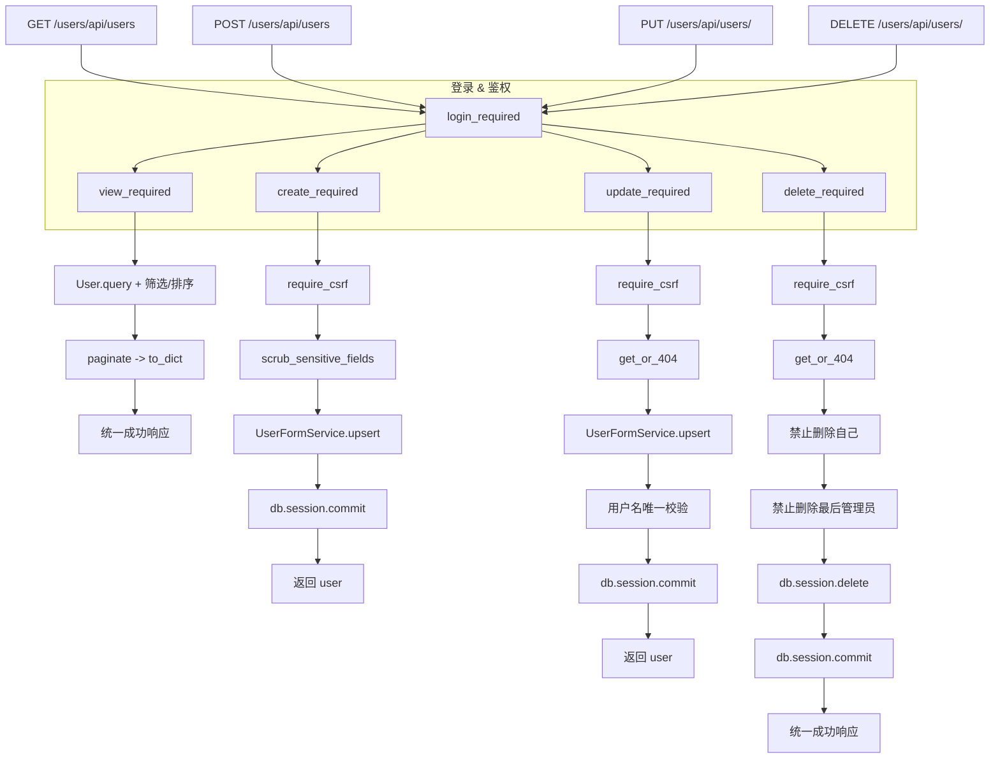
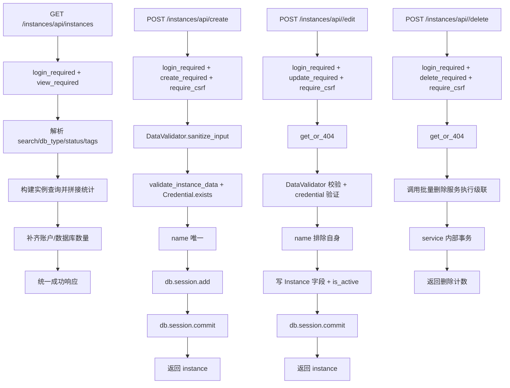
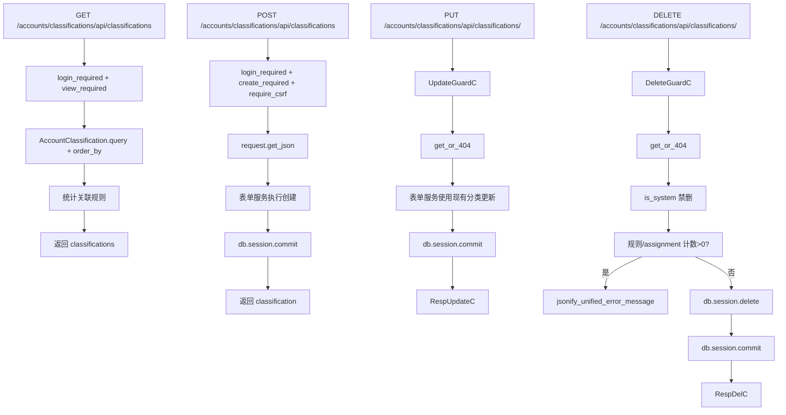
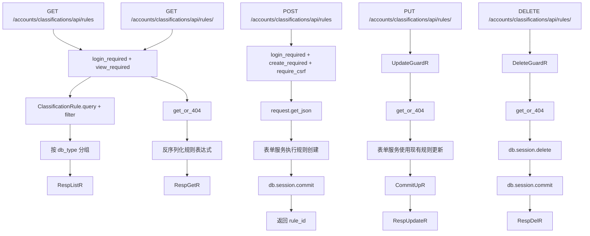
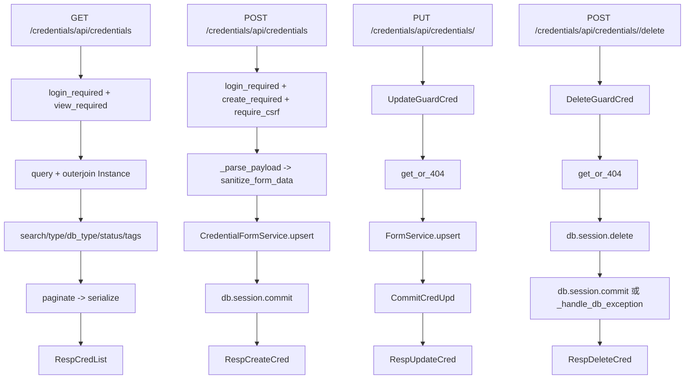
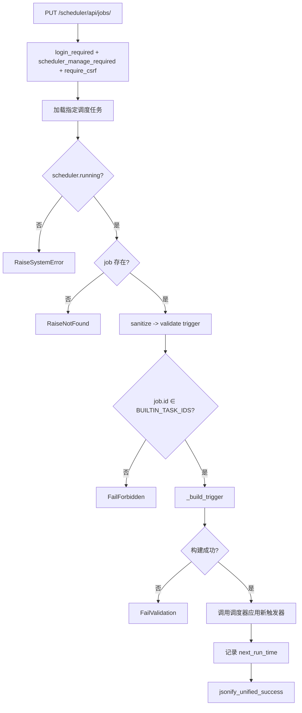
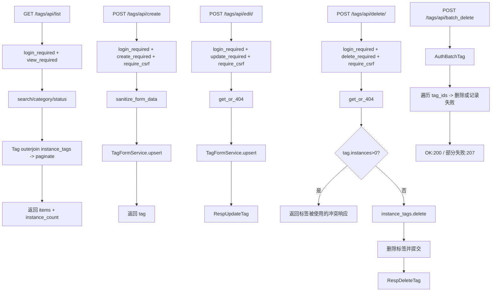

# WhaleFall 标准 CRUD 流程（Mermaid 版）
**版本**：v0.1｜2025-12-01｜补充常规模块的增删改查链路，方便与批量流程文档对照。  
**目的**：梳理后台最常被调用的 CRUD 入口，明确代码落点、鉴权/审计节点以及常见失误点，供新同事与测试同学快速定位问题。

## 目录
1. [用户管理 CRUD](#1-用户管理-crud)
2. [实例管理 CRUD](#2-实例管理-crud)
3. [账户分类 CRUD](#3-账户分类-crud)
4. [分类规则 CRUD](#4-分类规则-crud)
5. [凭据 CRUD](#5-凭据-crud)
6. [分区管理（创建 / 清理）](#6-分区管理创建--清理)
7. [定时任务触发器编辑](#7-定时任务触发器编辑)
8. [标签增删改查](#8-标签增删改查)

> “连接测试 / 批量测试 / 自动分类”等验证流程已迁移至 `docs/architecture/whalefall_testing_classification_flows.md`，请前往新文档查看。

---

## 1. 用户管理 CRUD
### 1.1 代码路径与职责
- `app/routes/users.py` + 蓝图 `users_bp`（注册到 `/users`）：暴露列表、单条查询及 RESTful 写操作。
- `UserFormService`（`app/services/users.py`）负责创建/更新入参校验与落库，路由仅做权限/日志封装。
- `app/models/user.py` 提供 `.to_dict()` 用于统一 JSON 序列化。

### 1.2 流程图

### 1.3 控制点与风险
- 用户名唯一性通过 `UserFormService.MESSAGE_USERNAME_EXISTS` 控制，需确保表层路由正确映射冲突错误到 409。
- 写操作依赖 CSRF 令牌，集成测试应调用 `/auth/api/csrf-token` 夹具或使用客户端宏，避免 400。
- 删除接口在 `UserRole.ADMIN` 场景有额外约束，冒烟用例需覆盖“删除最后一个管理员被拒绝”分支。

---

## 2. 实例管理 CRUD
### 2.1 代码路径与职责
- 列表、创建、删除位于 `app/routes/instances/manage.py`（`instances_bp` → `/instances`）。
- 详情与更新由 `app/routes/instances/detail.py` 的 `instances_detail_bp` 接管，同样挂在 `/instances` 前缀下。
- 校验集中在 `app/utils/data_validator.py::DataValidator`，删除操作复用 `batch_deletion_service`，可以级联清理关联表。

### 2.2 流程图

### 2.3 控制点与风险
- `DataValidator.validate_instance_data` 需要持续更新字段白名单（host、port、db_type），否则容易放过无效值。
- 删除接口直接调用批量服务，默认会删除权限、同步记录、日志等，调用前请确认是否需要软删除或归档。
- 更新接口沿用 POST + `require_csrf`（非 REST PUT），前端脚本走 `/instances/api/<id>/edit`；如要开放 API Client，需新增真正的 PUT 端点。

---

## 3. 账户分类 CRUD
### 3.1 代码路径与职责
- `app/routes/accounts/classifications.py`（`accounts_classifications_bp` → `/accounts/classifications`）管理分类主体。
- `ClassificationFormService` 负责 upsert 校验，依赖 `AccountClassification` 模型及 `ClassificationRule` 计数检查。
- 删除前检查关联规则与账户分配，统一走 `jsonify_unified_error_message` 给出冲突详情。

### 3.2 流程图

### 3.3 控制点与风险
- 分类颜色依赖 `ThemeColors.COLOR_MAP`，新增 token 时需同步前端 `ColorTokens` 组件，否则 UI 会 fallback 默认色。
- 删除路径通过 `ClassificationRule`、`AccountClassificationAssignment` 计数保护，测试需要拼出“仍被引用”用例验证提示。
- 系统内置分类（`is_system=True`）不可删，如需编辑仅允许更新描述/颜色，不得开放删除按钮。

---

## 4. 分类规则 CRUD
### 4.1 代码路径与职责
- 与分类同文件，使用 `_classification_rule_service` 承载 JSON Schema 校验、表达式解析与保存。
- `ClassificationRule` 模型持久化 `rule_expression`（JSON 字符串），查询时需 `json.loads` 反序列化。
- 统计接口 `/api/rules/stats` 依赖 `account_statistics_service` 聚合命中数。

### 4.2 流程图

### 4.3 控制点与风险
- `rule_expression` 存为字符串，任何非 JSON 可解析输入都会导致取详情时报错，路由内已 try/catch；编写浮点/日期比较时建议在前端引导标准 DSL。
    
- 自定义规则可能引用数据库类型/字段，保存前必须确保 `db_type` 与现有实例类型一致，否则自动分类任务会跳过。
- 删除操作没有额外依赖校验，如需防呆可在服务层添加“命中账户数大于 0 时禁止删除”开关。

---

## 5. 凭据 CRUD
### 5.1 代码路径与职责
- `app/routes/credentials.py`（`credentials_bp` → `/credentials`）集中所有页面/API，含 RESTful `/api/credentials` 套件，兼容旧的 `/api/<id>/edit`。
- `_credential_form_service`（`CredentialFormService`）封装表单校验与存储，`_handle_db_exception` 负责统一数据库错误翻译。
- 列表接口通过 `db.session.query(Credential, func.count(Instance.id))` 统计引用数量，便于 UI 显示引用实例数。

### 5.2 流程图

### 5.3 控制点与风险
- `_normalize_db_error` 目前仅覆盖常见唯一约束/非空错误，遇到其他数据库异常时会抛出笼统提示，建议将错误关键字补充到映射表。
- 删除接口仍允许 form POST（非 JSON），当 `request.is_json` 为 False 时会以闪存提示 + 重定向形式响应，自动化脚本需要带上 `Accept: application/json`。
- 列表接口的标签过滤依赖 `FilterOptionsService.list_active_tag_options`，若标签体系迁移需同步更新 Credential 标签的多对多关系。

---

> 若后续还要补充任务、调度或前端交互流程，请继续拆分独立文档，避免本文件内容过长；新增命名必须符合仓库“命名规范守卫”。

---

## 6. 分区管理（创建 / 清理）
### 6.1 代码路径与职责
- `app/routes/partition.py::partition_bp`（挂载 `/partition`）负责页面与 API，所有操作需登录且具备 view 权限。
- `PartitionManagementService`（`app/services/partition_management_service.py`）实现真正的表创建、索引补齐与旧分区清理逻辑。
- `PartitionStatisticsService` 提供 `get_partition_info`/`get_partition_statistics`，为页面列表与健康状态卡片供数。

### 6.2 流程图

```mermaid
flowchart TD
    subgraph CreateFlow[创建分区]
        CreateReq[POST /partition/api/create]
        CreateReq --> AuthCreate[login_required + view_required + require_csrf]
        AuthCreate --> ParseDate[request.json.date -> time_utils.to_china]
        ParseDate --> RangeCheck[日期>=当月1号?]
        RangeCheck -->|否| RaisePast[ValidationError: 只能创建当月及未来]
        RangeCheck -->|是| ServiceCreate[PartitionManagementService.create_partition]
        ServiceCreate --> PayloadCreate[组装 result + timestamp]
        PayloadCreate --> RespCreate[jsonify_unified_success]
    end

    subgraph CleanupFlow[清理旧分区]
        CleanupReq[POST /partition/api/cleanup]
        CleanupReq --> AuthCleanup[login_required + view_required + require_csrf]
    AuthCleanup --> ParseRetention[解析保留月数参数]
        ParseRetention --> ServiceCleanup[PartitionManagementService.cleanup_old_partitions]
        ServiceCleanup --> PayloadCleanup[result + timestamp]
        PayloadCleanup --> RespCleanup[jsonify_unified_success]
    end
```

### 6.3 控制点与风险
- 创建接口限定“当前及未来月份”，若想补数据需通过数据库脚本，使用者需知晓此约束避免误判为 bug。
- `PartitionManagementService._partition_exists` 只检查当前会话 schema，部署多 schema 时需传入前缀或切换 search_path。
- 清理逻辑依赖 `retention_months`，默认 12；若运维误填 0 可能短时间删除大量历史表，需要在前端加最小值校验或在服务端再做下限保护。

---

## 7. 定时任务触发器编辑
### 7.1 代码路径与职责
- `app/routes/scheduler.py` 将 `PUT /scheduler/api/jobs/<job_id>` 绑定到 `SchedulerJobFormView`，并用 `login_required + scheduler_manage_required + require_csrf` 保护。
- `SchedulerJobFormView` 继承 `ResourceFormView`，所有逻辑委托给 `SchedulerJobFormService`，仅支持 PUT。
- `SchedulerJobFormService` 使用 APScheduler 的 `modify_job` 更新触发器，支持 Cron/Interval/Date，且只允许编辑 `BUILTIN_TASK_IDS` 列表中的任务。

### 7.2 流程图

### 7.3 控制点与风险
- `SchedulerJobFormService` 支持 cron 表达式与显式字段混用，若传 5 位表达式会把前两位默认到分钟/小时；调用方必须在表单层约束输入格式。
- 触发器仅能编辑内置任务，若需要用户自定义任务需新增 service 或提供任务注册 API，避免误修改内核任务。
- APScheduler 返回的 `next_run_time` 基于 UTC，日志统一写字符串，若需要展示本地时间应在前端转为上海时区。

---

## 8. 标签增删改查
### 9.1 代码路径与职责
- `app/routes/tags/manage.py::tags_bp` 暴露所有标签 API（`/tags` 前缀），与批量操作共用 `TagFormService`。
- `TagFormService` 负责去重、白名单校验和排序逻辑；删除前需要通过 `instance_tags` 关系检查是否仍被实例使用。
- `FilterOptionsService` 负责为前端筛选卡片提供标签分类/标签等动态选项，`query_filter_utils` 仅保留纯格式化函数。

### 9.2 流程图

### 9.3 控制点与风险
- 标签删除视图支持 HTML 和 JSON 两种响应，通过 `_prefers_json_response` 判断；自动化脚本需设置 `X-Requested-With` 或 `Accept: application/json` 避免被重定向。
- 批量删除一旦某个标签使用中会直接跳过，且返回 `status: in_use`，前端需解析结果逐条提示，不要误判为整体失败。
- 列表 API 的排序字段可传 `instance_count`，该字段由 `COUNT(instance_tags.instance_id)` 计算，若存在软删除需求需在查询中排除 `instances.is_active=False`。
