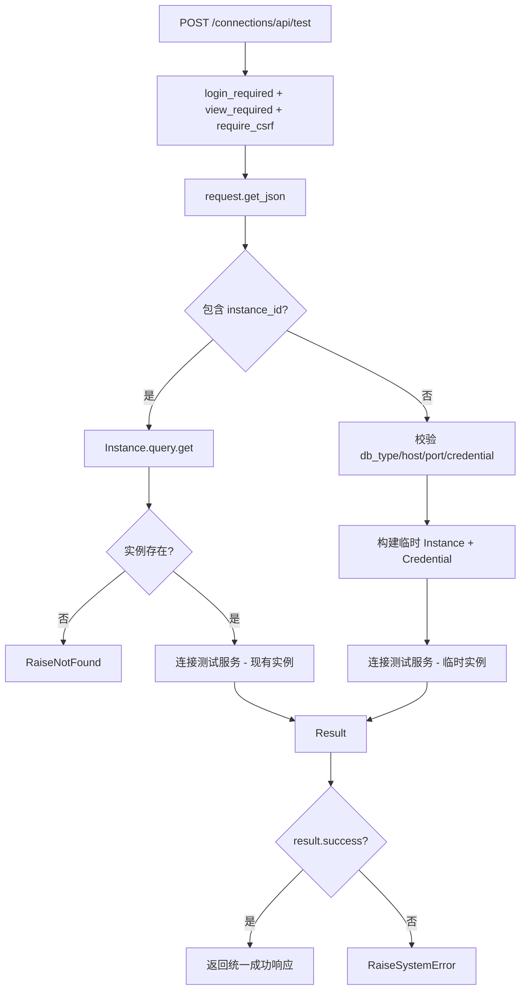
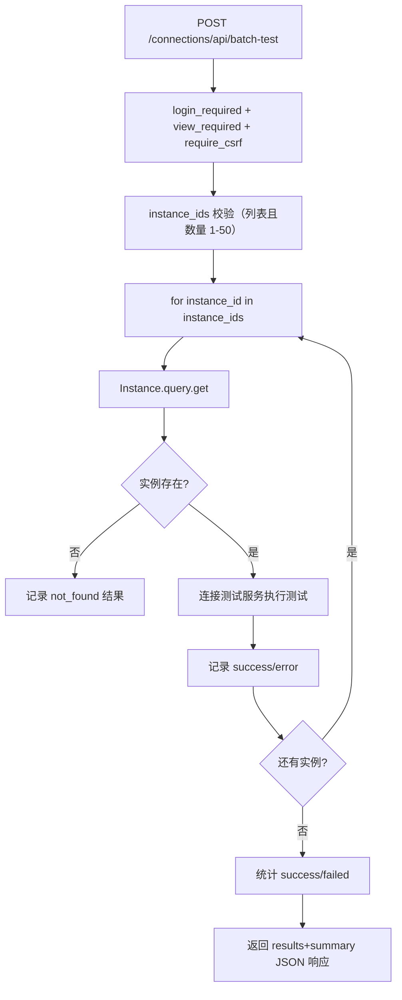
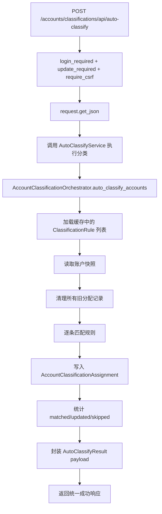

# WhaleFall 测试与账户自动分类流程（Mermaid 版）
**版本**：v0.1｜2025-12-01｜聚焦连接测试、批量测试及账户自动分类链路。  
**目的**：记录所有“测试/校验”类入口及自动分类任务，协助排查权限、校验与任务调度问题。

## 目录
1. [实例连接测试](#1-实例连接测试)
2. [批量连接测试](#2-批量连接测试)
3. [账户自动分类](#3-账户自动分类)

---

## 1. 实例连接测试
### 1.1 代码路径与职责
- `app/routes/connections.py::test_connection`（`connections_bp` → `/connections/api/test`）提供统一测试入口。
- `_test_existing_instance`：根据 `instance_id` 读取 `Instance`，调用 `ConnectionTestService.test_connection`。
- `_test_new_connection`：根据传入参数构造临时 `Instance` 与凭据对象，用于测试未落库连接。

### 1.2 流程图

### 1.3 控制点与风险
- 仅登录且具备视图权限的用户可调用；若要开放给 API Token，需要新增轻量权限或排除 CSRF。
- `_test_new_connection` 会创建内存实例并引用凭据对象，若凭据被禁用/删除会抛出 `NotFoundError`，前端需提前过滤。
- 驱动异常需由 `ConnectionTestService` 捕获并转成人类可读 `error` 字段，避免将原始堆栈泄露给前端。

---

## 2. 批量连接测试
### 2.1 代码路径与职责
- `app/routes/connections.py::batch_test_connections`（`/connections/api/batch-test`）。
- 循环调用 `ConnectionTestService.test_connection`，并按实例记录成功/失败。
- 使用 `log_info/log_warning/log_error` 输出统计，便于定位单个实例失败原因。

### 2.2 流程图

### 2.3 控制点与风险
- `instance_ids` 被限制为最多 50 条，防止接口长时间占用；若需要全量巡检，建议走异步任务。
- 单个实例异常（驱动报错、网络失败）不会中断整体流程，但会将错误字符串写入 `results`，调用方需展示具体失败原因。
- 未找到实例、ID 非法等都会写入结果数组，测试人员在比对成功比例时需剔除这些“输入问题”。

---

## 3. 账户自动分类
### 3.1 代码路径与职责
- `app/routes/accounts/classifications.py::auto_classify`（`/accounts/classifications/api/auto-classify`）。
- 服务层 `_auto_classify_service` 使用 `AutoClassifyService`，其内部委托 `AccountClassificationOrchestrator` 读取规则并执行匹配。
- `AutoClassifyService.auto_classify` 支持传入 `instance_id`（仅分类某实例）或留空（对全量账户重跑）。

### 3.2 流程图

### 3.3 控制点与风险
- 路由层只做参数解析，具体校验（是否允许“优化模式”）在服务层完成；若需加入角色限制，可在 `AutoClassifyService` 中追加。
- `AutoClassifyService` 捕获 `AutoClassifyError` 并转换为 `SystemError`，需要配套审计日志来追踪失败原因。
- 自动分类可能大批量更新 `AccountClassificationAssignment`，务必在调用前确保数据库锁/事务配置可承受。

---

> 如需继续扩展测试类流程（例如性能压测、SQL 计划校验），请在本文件追加章节并保持命名、CSRF、色彩等规范。
