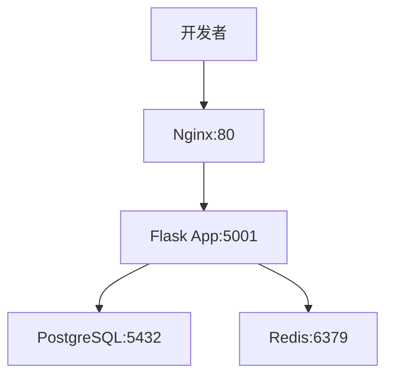
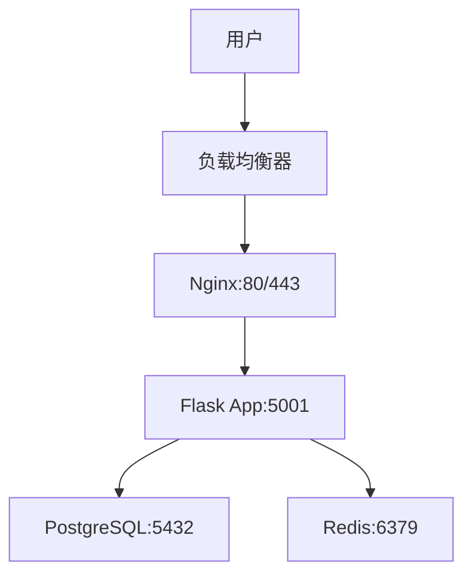

# 🐟 鲸落项目部署指南

## 📋 概述

鲸落项目支持开发环境和生产环境的Docker容器化部署，本文档提供完整的部署、配置和运维指南。

## 🏗️ 架构设计

### 开发环境架构


### 生产环境架构


## 🚀 快速开始

### 开发环境
```bash
# 1. 克隆项目
git clone https://github.com/your-org/TaifishingV4.git
cd TaifishingV4

# 2. 配置环境变量
cp env.development .env

# 3. 启动开发环境
make dev start

# 4. 访问应用
open http://localhost
```

### 生产环境
```bash
# 1. 配置生产环境
cp env.production .env

# 2. 部署生产环境
make prod deploy

# 3. 验证部署
make prod health

# 4. 访问应用
open http://localhost
```

## 🔧 配置说明

### 环境变量
| 环境 | 配置文件 | 说明 |
|------|----------|------|
| 开发环境 | `env.development` | 开发环境配置 |
| 生产环境 | `env.production` | 生产环境配置 |

### 服务组件
| 服务 | 版本 | 端口 | 功能 |
|------|------|------|------|
| Nginx | 1.18+ | 80, 443 | 反向代理、静态文件服务 |
| Flask | 3.1.2 | 5001 | Web应用服务 |
| PostgreSQL | 15-alpine | 5432 | 主数据库 |
| Redis | 7.4.0 | 6379 | 缓存和会话存储 |
| APScheduler | 3.11.0 | - | 定时任务调度器 |

## 🛠️ 运维命令

### 开发环境
```bash
make dev start      # 启动开发环境
make dev stop       # 停止开发环境
make dev restart    # 重启开发环境
make dev status     # 查看服务状态
make dev logs       # 查看所有日志
make dev health     # 健康检查
```

### 生产环境
```bash
make prod deploy    # 部署生产环境
make prod start     # 启动生产环境
make prod stop      # 停止生产环境
make prod restart   # 重启生产环境
make prod status    # 查看服务状态
make prod logs      # 查看所有日志
make prod health    # 健康检查
make prod backup    # 备份数据
```

## 🔒 安全配置

- 使用防火墙限制端口访问
- 配置HTTPS证书（推荐）
- 使用强密码和密钥
- 定期更新依赖包
- 数据库连接加密
- 定期备份数据

## 📈 监控和运维

### 健康检查
```bash
curl -f http://localhost/health
```

### 日志管理
| 服务 | 日志文件 | 说明 |
|------|----------|------|
| Nginx | `/var/log/nginx/whalefall_access.log` | 访问日志 |
| Flask | `/app/userdata/logs/whalefall.log` | 应用日志 |

### 性能监控
| 指标 | 阈值 | 说明 |
|------|------|------|
| CPU使用率 | < 80% | 避免过载 |
| 内存使用率 | < 85% | 防止OOM |
| 响应时间 | < 2s | 用户体验 |

## 🛠️ 故障排除

### 常见问题
1. **容器启动失败** - 检查容器日志: `docker logs container_name`
2. **数据库连接失败** - 检查数据库状态: `docker-compose exec postgres pg_isready`
3. **应用无法访问** - 检查端口映射: `docker port container_name`

## 📚 参考资源

- [Docker官方文档](https://docs.docker.com/)
- [Nginx配置指南](https://nginx.org/en/docs/)
- [PostgreSQL文档](https://www.postgresql.org/docs/)
- [Redis文档](https://redis.io/documentation)

---

**注意**: 本文档会随着项目发展持续更新，请定期查看最新版本。
