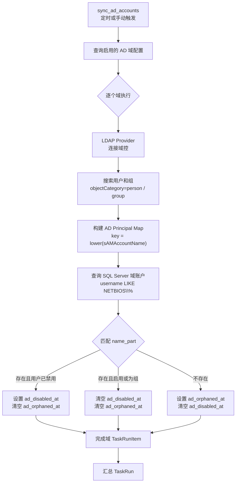

# AD 域账户同步设计

> 状态: Draft
> 负责人: WhaleFall Team
> 创建: 2026-05-21
> 更新: 2026-05-21
> 范围: AD 域账户状态同步、SQL Server 账户台账风险标记
> 关联: `docs/Obsidian/standards/backend/README.md`, `docs/Obsidian/standards/doc/guide/documentation.md`, `docs/Obsidian/reference/service/accounts-sync-overview.md`

## 1. 背景与目标

WhaleFall 已经可以同步 SQL Server 登录账户，并在 `InstanceAccount` / `AccountPermission` 中维护账户台账、权限与活跃状态。实际运维中还需要识别一类风险：SQL Server 中仍存在的 Windows 域用户或域组，在 Active Directory 中已经被停用或删除。

本设计新增 AD 域账户同步能力，用定时任务从 Active Directory 拉取域用户/域组状态，与 SQL Server 账户台账中的 Windows 登录名匹配，并给本地账户打上只读风险标记，供 DBA 人工确认处理。

核心原则:

- 只读标记，不自动禁用、删除或修改 SQL Server login。
- AD 同步失败时不清除旧标记，避免把域控临时故障误判成账户恢复。
- 成功同步某个域时，该域内已恢复正常的账户可以清除旧的 AD 风险标记。
- v1 优先服务 SQL Server 域账户风险识别，暂不扩展到 MySQL、Oracle、PostgreSQL。

## 2. v1 范围

### 2.1 包含

- AD 域配置管理: 域名、NetBIOS、域控、Base DN、LDAP 凭据、SSL 校验、启停状态。
- LDAP/LDAPS 全量同步: 拉取用户和组的 `sAMAccountName`、`userAccountControl`、`objectClass` 等必要属性。
- SQL Server 账户匹配: 匹配 `NETBIOS\name` 形式的 Windows login，覆盖普通实例账户和 SQL Server contained AG 账户。
- 本地风险标记: 在 `InstanceAccount` 记录 `ad_domain_config_id`、`ad_disabled_at`、`ad_orphaned_at`。
- 任务可观测性: 使用 `TaskRun` / `TaskRunItem` 记录按域同步结果。
- 账户台账展示: 支持按 AD 状态筛选和展示标签。

### 2.2 不包含

- 自动禁用 SQL Server login。
- 自动删除本地账户或权限记录。
- 写回 Active Directory。
- AD 增量同步、缓存、多域控负载均衡策略。
- 对非 SQL Server 数据库账户做 AD 匹配。

## 3. 整体流程



同步粒度:

- 每次任务对每个启用域做一次全量 LDAP 查询。
- 每个域只匹配该域 `netbios_name` 前缀的 SQL Server 账户。
- 单个域同步成功后，允许清除该域账户旧的 `ad_disabled_at` / `ad_orphaned_at` 标记。
- 单个域同步失败时，不更新该域任何账户标记，只写入域配置和任务运行错误。

## 4. 数据模型

### 4.1 `AdDomainConfig`

新增模型 `app/models/ad_domain_config.py`:

```python
class AdDomainConfig(db.Model):
    """AD 域同步配置."""

    __tablename__ = "ad_domain_configs"

    id = db.Column(db.Integer, primary_key=True)
    name = db.Column(db.String(255), nullable=False, unique=True, comment="DNS 域名, 如 corp.example.com")
    netbios_name = db.Column(db.String(64), nullable=False, index=True, comment="NetBIOS 名称, 如 CORP")
    domain_controllers = db.Column(db.JSON, nullable=False, default=list, comment="域控主机列表")
    ldap_port = db.Column(db.Integer, nullable=False, default=636)
    use_ssl = db.Column(db.Boolean, nullable=False, default=True, comment="是否使用 LDAPS")
    verify_ssl = db.Column(db.Boolean, nullable=True, comment="是否校验证书; NULL 表示使用默认配置")
    base_dn = db.Column(db.String(512), nullable=False, comment="搜索根 DN")
    credential_id = db.Column(db.Integer, db.ForeignKey("credentials.id"), nullable=False)
    is_enabled = db.Column(db.Boolean, nullable=False, default=True)
    description = db.Column(db.Text, nullable=True)
    last_sync_at = db.Column(db.DateTime(timezone=True), nullable=True)
    last_sync_status = db.Column(db.String(32), nullable=True)
    last_sync_run_id = db.Column(db.String(64), nullable=True)
    last_error = db.Column(db.Text, nullable=True)
    created_at = db.Column(db.DateTime(timezone=True), nullable=False, default=time_utils.now)
    updated_at = db.Column(db.DateTime(timezone=True), nullable=False, default=time_utils.now, onupdate=time_utils.now)

    credential = db.relationship("Credential")
```

约束:

- `name` 唯一，用于避免同一 DNS 域重复配置。
- `netbios_name` 不做唯一约束，但 service 层新增/更新时应阻止两个启用配置使用同一个 NetBIOS，避免同一账户前缀被多个域同时处理。
- `domain_controllers` 使用列表，而不是逗号分隔字符串，便于后续连接测试、故障转移和 UI 编辑。
- `credential_id` 必填，且只能绑定启用中的 `ldap` 类型凭据。

### 4.2 `InstanceAccount` 新增字段

在 `app/models/instance_account.py` 追加:

```python
ad_domain_config_id = db.Column(
    db.Integer,
    db.ForeignKey("ad_domain_configs.id"),
    nullable=True,
    index=True,
    comment="匹配到的 AD 域配置 ID",
)
ad_disabled_at = db.Column(
    db.DateTime(timezone=True),
    nullable=True,
    comment="AD 中用户停用时间; 非空表示域用户已禁用",
)
ad_orphaned_at = db.Column(
    db.DateTime(timezone=True),
    nullable=True,
    comment="AD 孤账户标记时间; 非空表示 AD 中未找到该用户或组",
)
```

字段语义:

- `ad_disabled_at` 和 `ad_orphaned_at` 互斥。
- 账户首次进入某状态时写入当前时间；状态持续时保持原时间不变。
- 账户恢复正常后清空两个状态字段，但保留 `ad_domain_config_id` 作为最近一次匹配域。
- `is_active` 仍表示 SQL Server 同步视角下该 login 是否还存在，不被 AD 同步修改。

建议索引:

```python
db.Index(
    "ix_instance_accounts_ad_status",
    "ad_domain_config_id",
    "ad_disabled_at",
    "ad_orphaned_at",
)
```

### 4.3 凭据校验

`app/schemas/credentials.py` 已支持 `ldap` 类型，但当前 `_validate_username` 对非 `veeam` 用户名不允许反斜杠。AD 凭据 v1 必须支持:

- `DOMAIN\svc_whalefall`
- `svc_whalefall@example.com`
- `svc_whalefall`

实现时应为 `credential_type == "ldap"` 增加专用用户名正则，允许字母、数字、下划线、连字符、点、反斜杠和 `@`。

## 5. LDAP 同步设计

### 5.1 Provider 接口

新增 `app/services/ad_sync/ldap_provider.py`:

```python
@dataclass(frozen=True)
class AdPrincipal:
    sam_account_name: str
    object_kind: str  # user/group
    is_disabled: bool | None
    attributes: dict[str, object]


class LdapProvider:
    """连接 AD 并拉取可匹配的用户/组主体."""

    def fetch_principals(self, config: AdDomainConfig) -> dict[str, AdPrincipal]:
        """返回 lower(sAMAccountName) -> AdPrincipal."""
```

### 5.2 查询范围

v1 同步两类对象:

| 对象 | LDAP filter | 状态处理 |
|------|-------------|----------|
| 用户 | `(&(objectClass=user)(objectCategory=person))` | 读取 `userAccountControl` 判断是否禁用 |
| 组 | `(objectClass=group)` | 不判断禁用；存在即视为 AD 正常 |

同步属性:

| 属性 | 用途 |
|------|------|
| `sAMAccountName` | 匹配 SQL Server login 的主键 |
| `userAccountControl` | 判断用户是否禁用 |
| `objectClass` | 区分用户与组 |
| `displayName` | 参考信息，可进入 `attributes` |
| `mail` | 参考信息，可进入 `attributes` |
| `whenChanged` | 参考信息，可进入 `attributes` |
| `distinguishedName` | 诊断定位 |

禁用判断:

```python
UF_ACCOUNTDISABLE = 0x0002
is_disabled = bool(user_account_control & UF_ACCOUNTDISABLE)
```

组没有 `UF_ACCOUNTDISABLE` 语义，`is_disabled` 置为 `None`，匹配到组时不写 `ad_disabled_at`。

### 5.3 连接策略

- `domain_controllers` 按配置顺序尝试连接，首个连接成功即执行查询。
- 全部域控失败时，抛出明确错误，由任务层记录失败。
- `use_ssl=True` 默认使用 `ldaps://` 和端口 636。
- `verify_ssl=False` 只应作为显式配置，错误信息需带出当前域控、端口和 SSL 校验状态，便于排查证书问题。

## 6. 匹配与更新规则

### 6.1 匹配输入

匹配服务新增 `app/services/ad_sync/ad_account_match_service.py`:

```python
@dataclass(frozen=True)
class AdDomainMatchResult:
    total: int
    normal: int
    disabled: int
    orphaned: int
    updated: int


class AdAccountMatchService:
    def match_and_update(
        self,
        *,
        domain_config: AdDomainConfig,
        principals: dict[str, AdPrincipal],
    ) -> AdDomainMatchResult:
        ...
```

### 6.2 查询 SQL Server 域账户

匹配目标为 `InstanceAccount`:

- `db_type == "sqlserver"`
- `username` 以 `"{NETBIOS}\\"` 开头
- `owner_type` 允许 `instance` 和 `sqlserver_ag`

不能只处理普通实例账户。当前仓库已经支持 SQL Server contained AG 账户，相关账户同样写入 `InstanceAccount`，并通过 `owner_type="sqlserver_ag"` 区分归属。

### 6.3 账号归一

匹配键:

```python
prefix = f"{domain_config.netbios_name}\\"
name_part = username.split("\\", 1)[1]
ad_key = name_part.strip().lower()
```

约定:

- `netbios_name` 比较不区分大小写。
- `sAMAccountName` 比较不区分大小写。
- 不处理 UPN 形式的 SQL Server login；v1 仅匹配 `NETBIOS\name`。

### 6.4 状态转移

| 当前 AD 结果 | 更新行为 |
|--------------|----------|
| 用户存在且启用 | 清空 `ad_disabled_at`、`ad_orphaned_at` |
| 用户存在且禁用 | 若 `ad_disabled_at` 为空则写 `now`; 清空 `ad_orphaned_at` |
| 组存在 | 清空 `ad_disabled_at`、`ad_orphaned_at` |
| AD 不存在 | 若 `ad_orphaned_at` 为空则写 `now`; 清空 `ad_disabled_at` |

写入规则:

- 只有字段值变化时才 flush，减少无意义写入。
- 同一域所有匹配更新在一个事务内完成。
- 匹配服务不 commit，由 task/service 编排层统一提交或回滚。

## 7. 任务与调度

### 7.1 任务函数

新增 `app/tasks/ad_sync_tasks.py`:

```python
def sync_ad_accounts(
    *,
    manual_run: bool = False,
    created_by: int | None = None,
    run_id: str | None = None,
    session_id: str | None = None,
    **_: object,
) -> None:
    """同步 AD 域账户状态并标记 SQL Server 域账户风险."""
```

任务必须在 Flask `app.app_context()` 内运行。实现可以参考 `accounts_sync_tasks.py` 和 `veeam_backup_sync_tasks.py` 的 `TaskRunsWriteService` 用法。

### 7.2 Scheduler 注册

新增任务必须同时更新:

- `app/scheduler.py`: `TASK_FUNCTIONS["sync_ad_accounts"]`
- `app/core/constants/scheduler_jobs.py`: `BUILTIN_TASK_IDS`
- `app/config/scheduler_tasks.yaml`: 默认任务配置

默认调度建议放在账户同步后、统计前:

```yaml
- id: sync_ad_accounts
  name: AD 域账户同步
  function: sync_ad_accounts
  trigger_type: cron
  trigger_params:
    second: 0
    minute: 30
    hour: 1
  description: 每日同步 AD 域账户状态并标记 SQL Server 域账户风险
```

原因:

- `sync_accounts` 默认 01:00 执行，AD 标记应基于最新 SQL Server 账户台账。
- `calculate_account` 默认 02:00 执行，后续如把 AD 状态纳入统计，可直接读取最新标记。

### 7.3 TaskRun 口径

| 阶段 | 口径 |
|------|------|
| `start_run` | `task_key="sync_ad_accounts"`, `task_name="AD 域账户同步"`, `task_category="ad_sync"` |
| `init_items` | 每个启用域一个 `TaskRunItemInit(item_type="ad_domain", item_key=str(domain.id), item_name=domain.name)` |
| 域开始 | `start_item(run_id, "ad_domain", str(domain.id))` |
| 域成功 | `complete_item(..., metrics={"total": n, "normal": n, "disabled": d, "orphaned": o, "updated": u})` |
| 域失败 | `fail_item(...)`，同时写 `AdDomainConfig.last_sync_status="failed"` |
| 总任务 | 全成功为 completed，部分失败为 completed_with_errors，全部失败为 failed |

`summary_json` 至少包含:

```json
{
  "type": "sync_ad_accounts",
  "domains_total": 2,
  "domains_successful": 1,
  "domains_failed": 1,
  "accounts_total": 120,
  "accounts_disabled": 3,
  "accounts_orphaned": 4,
  "accounts_updated": 7
}
```

## 8. API 与 UI 设计

### 8.1 域配置 API

建议新增 `app/routes/api/ad_domain_configs.py`:

| 方法 | 路径 | 用途 |
|------|------|------|
| `GET` | `/api/v1/ad-domain-configs` | 列出域配置 |
| `POST` | `/api/v1/ad-domain-configs` | 新增域配置 |
| `PUT` | `/api/v1/ad-domain-configs/{id}` | 更新域配置 |
| `POST` | `/api/v1/ad-domain-configs/{id}/actions/set-enabled` | 启用/停用 |
| `POST` | `/api/v1/ad-domain-configs/{id}/actions/test-connection` | 测试连接 |
| `POST` | `/api/v1/ad-domain-configs/actions/sync` | 手动触发 AD 同步 |

所有写操作遵循现有 API 封套、CSRF 和管理员权限规则。

### 8.2 账户台账展示

账户列表读模型需返回:

```json
{
  "ad_status": "disabled",
  "ad_domain": "CORP",
  "ad_disabled_at": "2026-05-21T01:30:00+08:00",
  "ad_orphaned_at": null
}
```

`ad_status` 取值:

| 值 | 条件 |
|----|------|
| `normal` | 有 `ad_domain_config_id`，且两个状态字段均为空 |
| `disabled` | `ad_disabled_at` 非空 |
| `orphaned` | `ad_orphaned_at` 非空 |
| `unknown` | 没有匹配过 AD 域 |

UI v1:

- 在账户台账增加 AD 状态筛选: 全部、正常、已停用、孤账户、未匹配。
- 账户行展示 AD 状态标签、域名、状态时间。
- 不提供批量自动处理按钮；人工处理动作后可通过后续功能提供“清除 AD 标记”。

## 9. 异常处理

| 场景 | 行为 |
|------|------|
| 单个域控连接失败但后续域控成功 | 记录 warning，继续同步该域 |
| 某域全部域控不可达 | 该域 TaskRunItem 失败，不更新该域账户标记 |
| LDAP 凭据无效 | 该域失败，写 `last_error` |
| LDAP 查询超时 | 该域失败，写 `last_error` |
| 某域匹配更新 DB 失败 | 回滚该域事务，标记该域失败 |
| 部分域失败 | 其他域继续执行，总任务 `completed_with_errors` |
| 全部域失败 | 总任务 `failed` |

错误信息必须保留域名、域控、端口、SSL/证书校验状态和原始异常摘要。不要把所有 LDAP/LDAPS 问题都泛化成“网络失败”。

## 10. 数据库迁移

新增迁移 `migrations/versions/YYYYMMDDHHMMSS_add_ad_domain_sync_fields.py`，只新增新表和字段，禁止修改历史迁移。

DDL 参考:

```sql
CREATE TABLE ad_domain_configs (
    id SERIAL PRIMARY KEY,
    name VARCHAR(255) NOT NULL UNIQUE,
    netbios_name VARCHAR(64) NOT NULL,
    domain_controllers JSON NOT NULL,
    ldap_port INTEGER NOT NULL DEFAULT 636,
    use_ssl BOOLEAN NOT NULL DEFAULT TRUE,
    verify_ssl BOOLEAN,
    base_dn VARCHAR(512) NOT NULL,
    credential_id INTEGER NOT NULL REFERENCES credentials(id),
    is_enabled BOOLEAN NOT NULL DEFAULT TRUE,
    description TEXT,
    last_sync_at TIMESTAMPTZ,
    last_sync_status VARCHAR(32),
    last_sync_run_id VARCHAR(64),
    last_error TEXT,
    created_at TIMESTAMPTZ NOT NULL DEFAULT NOW(),
    updated_at TIMESTAMPTZ NOT NULL DEFAULT NOW()
);

ALTER TABLE instance_accounts
    ADD COLUMN ad_domain_config_id INTEGER REFERENCES ad_domain_configs(id),
    ADD COLUMN ad_disabled_at TIMESTAMPTZ,
    ADD COLUMN ad_orphaned_at TIMESTAMPTZ;

CREATE INDEX ix_ad_domain_configs_netbios_name
    ON ad_domain_configs (netbios_name);

CREATE INDEX ix_instance_accounts_ad_status
    ON instance_accounts (ad_domain_config_id, ad_disabled_at, ad_orphaned_at);
```

PostgreSQL 可使用 `JSONB` variant；SQLite 本地开发保持 SQLAlchemy JSON 兼容即可。

## 11. 变更清单

| 类型 | 文件 | 说明 |
|------|------|------|
| 新增 | `app/models/ad_domain_config.py` | AD 域配置模型 |
| 修改 | `app/models/instance_account.py` | 增加 AD 状态字段 |
| 修改 | `app/models/__init__.py` | 注册模型 |
| 修改 | `app/schemas/credentials.py` | `ldap` 凭据用户名支持域格式 |
| 新增 | `app/services/ad_sync/ldap_provider.py` | LDAP 拉取 |
| 新增 | `app/services/ad_sync/ad_account_match_service.py` | 匹配与更新 |
| 新增 | `app/services/ad_sync/ad_domain_config_service.py` | 域配置管理 |
| 新增 | `app/repositories/ad_domain_config_repository.py` | 域配置读写 |
| 新增 | `app/tasks/ad_sync_tasks.py` | 定时任务入口 |
| 修改 | `app/scheduler.py` | 注册任务函数 |
| 修改 | `app/core/constants/scheduler_jobs.py` | 注册内置任务 ID |
| 修改 | `app/config/scheduler_tasks.yaml` | 默认调度配置 |
| 修改 | `app/core/types/accounts_ledgers.py` | 账户筛选/展示增加 AD 状态字段 |
| 修改 | `app/schemas/accounts_query.py` | 增加 `ad_status` 筛选 |
| 修改 | `app/repositories/ledgers/accounts_ledger_repository.py` | 查询与 eager load AD 字段 |
| 新增 | `migrations/versions/YYYYMMDDHHMMSS_add_ad_domain_sync_fields.py` | 数据库迁移 |
| 修改 | `pyproject.toml` / `uv.lock` / `requirements.txt` | 新增 `ldap3` 依赖 |

## 12. 测试计划

单元测试:

- `ldap` 凭据用户名支持 `DOMAIN\svc`、`svc@example.com`、`svc`。
- `userAccountControl` 包含 `0x0002` 时识别为禁用。
- LDAP 组存在时不写 `ad_disabled_at`。
- 用户存在且启用时清空旧的 `ad_disabled_at` / `ad_orphaned_at`。
- 用户不存在时写入 `ad_orphaned_at`，并且状态持续时不刷新时间。
- 匹配服务覆盖 `owner_type="instance"` 和 `owner_type="sqlserver_ag"`。
- 域同步失败时不更新该域账户标记。
- 部分域失败时任务汇总为 `completed_with_errors`。
- scheduler 三处注册缺一时相关配置测试失败。

集成/契约测试:

- 域配置 CRUD API 校验凭据类型、NetBIOS 冲突、域控列表为空。
- 手动同步 API 创建 TaskRun，并按域生成 TaskRunItem。
- 账户台账 `ad_status` 筛选返回正确结果。
- 账户台账序列化返回 `ad_status`、`ad_domain`、`ad_disabled_at`、`ad_orphaned_at`。

手工验证:

- 使用测试 AD 域配置执行连接测试。
- 手动触发同步，检查 TaskRun、域配置 `last_sync_*`、账户台账标签。
- 模拟域控不可达，确认旧标记不被清除。

## 13. 后续扩展

- 增量同步: 基于 `uSNChanged` 或 `whenChanged` 降低大域全量查询压力。
- 多域控策略: 增加健康状态、失败冷却和显式优先级。
- AD 属性快照: 如需要审计，可单独建 `ad_principal_snapshots`，不要把大量属性塞进 `InstanceAccount`。
- 人工处理闭环: 增加“已确认/已处理”字段或操作记录，区分 AD 风险发现与 DBA 处置状态。
- 告警规则: 将 AD 停用/孤账户接入现有邮件或飞书告警管道。
