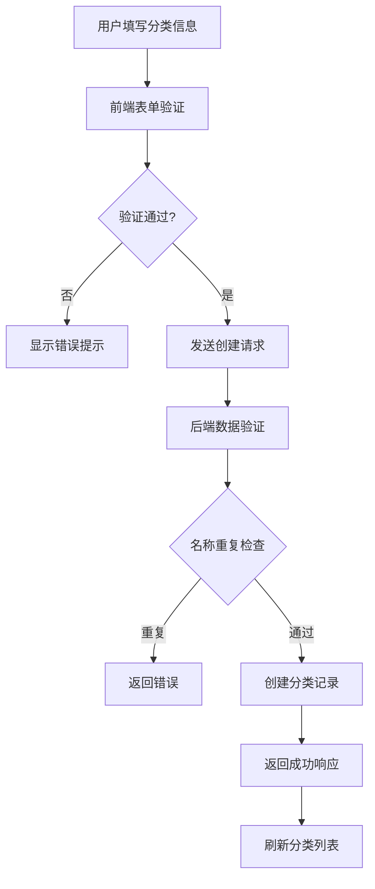
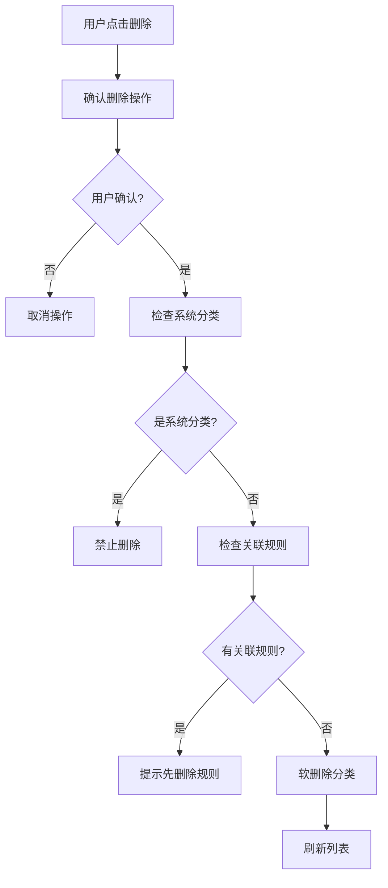

# 账户分类管理功能技术文档

## 1. 功能概述

### 1.1 功能描述
账户分类管理功能是鲸落系统的核心模块，专注于**分类的定义、管理和展示**。该功能提供了完整的账户分类生命周期管理，包括分类的创建、编辑、删除、查看和统计展示。

### 1.2 主要特性
- **分类CRUD操作**：创建、查看、编辑、删除账户分类
- **分类属性管理**：名称、描述、风险等级、颜色、图标、优先级
- **系统分类保护**：系统预定义分类不可删除
- **分类统计**：显示每个分类关联的规则数量和账户数量
- **响应式界面**：支持桌面和移动端访问
- **权限控制**：管理员可编辑，普通用户只读

### 1.3 技术特点
- 基于Flask的RESTful API设计
- 前后端分离架构
- Bootstrap响应式界面
- SQLAlchemy ORM数据模型
- 实时数据统计和展示

## 2. 技术架构

### 2.1 整体架构
```
┌─────────────────┐    ┌─────────────────┐    ┌─────────────────┐
│   前端展示层    │    │   后端服务层    │    │   数据存储层    │
│                 │    │                 │    │                 │
│ - 分类列表      │◄──►│ - Flask路由     │◄──►│ - account_classifications│
│ - 分类表单      │    │ - 分类服务      │    │ - 分类统计视图  │
│ - 分类统计      │    │ - 数据验证      │    │ - 关联数据      │
│ - 响应式UI      │    │ - 权限控制      │    │                 │
└─────────────────┘    └─────────────────┘    └─────────────────┘
```

### 2.2 核心组件
- **前端组件**：分类列表展示、分类表单管理、统计信息显示
- **后端服务**：分类CRUD接口、数据验证、权限控制
- **数据模型**：AccountClassification模型及其关联关系

## 3. 前端实现

### 3.1 页面结构
- **主页面**：`app/templates/account_classification/management.html`
- **样式文件**：`app/static/css/pages/account_classification/account_classification.css`
- **脚本文件**：`app/static/js/pages/account_classification/account_classification.js`

### 3.2 核心组件

#### 3.2.1 分类列表组件
```html
<div class="col-md-4">
    <div class="card">
        <div class="card-header">
            <div class="d-flex justify-content-between align-items-center">
                <h5 class="mb-0">
                    <i class="fas fa-list me-2"></i>账户分类
                </h5>
                
                <button class="btn btn-primary btn-sm" data-bs-toggle="modal" data-bs-target="#createClassificationModal">
                    <i class="fas fa-plus me-1"></i>新建分类
                </button>
                
            </div>
        </div>
        <div class="card-body">
            <div id="classificationsList">
                <!-- 分类列表动态加载 -->
            </div>
        </div>
    </div>
</div>
```

#### 3.2.2 分类表单组件
```html
<div class="modal fade" id="createClassificationModal">
    <div class="modal-dialog">
        <div class="modal-content">
            <div class="modal-header">
                <h5 class="modal-title">
                    <i class="fas fa-plus me-2"></i>新建账户分类
                </h5>
            </div>
            <div class="modal-body">
                <form id="createClassificationForm">
                    <div class="mb-3">
                        <label for="classificationName" class="form-label">分类名称 <span class="text-danger">*</span></label>
                        <input type="text" class="form-control" id="classificationName" required>
                    </div>
                    <div class="mb-3">
                        <label for="classificationDescription" class="form-label">描述</label>
                        <textarea class="form-control" id="classificationDescription" rows="3"></textarea>
                    </div>
                    <!-- 风险等级、颜色、图标、优先级选择 -->
                </form>
            </div>
        </div>
    </div>
</div>
```

### 3.3 关键JavaScript函数

#### 3.3.1 分类管理函数
```javascript
// 加载分类列表
function loadClassifications() {
    fetch('/account-classification/classifications')
    .then(response => response.json())
    .then(data => {
        if (data.success) {
            displayClassifications(data.classifications);
        } else {
            showAlert('danger', '加载分类失败: ' + data.error);
        }
    });
}

// 创建分类
function createClassification() {
    const data = {
        name: document.getElementById('classificationName').value,
        description: document.getElementById('classificationDescription').value,
        risk_level: document.getElementById('riskLevel').value,
        color: document.getElementById('classificationColor').value,
        priority: parseInt(document.getElementById('priority').value),
        icon_name: document.querySelector('input[name="classificationIcon"]:checked').value
    };

    fetch('/account-classification/classifications', {
        method: 'POST',
        headers: { 'Content-Type': 'application/json' },
        body: JSON.stringify(data)
    })
    .then(response => response.json())
    .then(data => {
        if (data.success) {
            showAlert('success', '分类创建成功');
            loadClassifications();
        }
    });
}
```

#### 3.3.2 分类展示函数
```javascript
// 显示分类列表
function displayClassifications(classifications) {
    const container = document.getElementById('classificationsList');
    
    let html = '';
    classifications.forEach(classification => {
        const riskLevelClass = {
            'low': 'success',
            'medium': 'warning', 
            'high': 'danger',
            'critical': 'dark'
        }[classification.risk_level] || 'secondary';

        html += `
            <div class="card mb-2 classification-item" data-id="${classification.id}">
                <div class="card-body py-2">
                    <div class="d-flex justify-content-between align-items-center">
                        <div class="d-flex align-items-center">
                            <div class="me-2">
                                ${getClassificationIcon(classification.icon_name, classification.color)}
                            </div>
                            <span class="badge bg-${riskLevelClass} me-2">
                                ${classification.name}
                            </span>
                            <small class="text-muted">
                                ${classification.rules_count > 0 ? classification.rules_count + ' 规则' : '无规则'}
                            </small>
                        </div>
                        <div class="btn-group btn-group-sm">
                            ${renderActionButtons(classification)}
                        </div>
                    </div>
                </div>
            </div>
        `;
    });
    
    container.innerHTML = html;
}
```

## 4. 后端实现

### 4.1 路由控制器
**文件**：`app/routes/account_classification.py`

#### 4.1.1 主要路由
```python
@account_classification_bp.route("/")
@login_required
@view_required
def index() -> str:
    """账户分类管理首页"""
    return render_template("account_classification/management.html")
```

#### 4.1.2 分类管理API
```python
@account_classification_bp.route("/classifications")
@login_required
@view_required
def get_classifications() -> "Response":
    """获取所有账户分类"""
    try:
        classifications = (
            AccountClassification.query.filter_by(is_active=True)
            .order_by(
                AccountClassification.priority.desc(),
                AccountClassification.created_at.desc(),
            )
            .all()
        )

        result = []
        for classification in classifications:
            # 计算该分类的规则数量
            rules_count = ClassificationRule.query.filter_by(
                classification_id=classification.id, is_active=True
            ).count()

            result.append({
                "id": classification.id,
                "name": classification.name,
                "description": classification.description,
                "risk_level": classification.risk_level,
                "color": classification.color,
                "icon_name": classification.icon_name,
                "priority": classification.priority,
                "is_system": classification.is_system,
                "rules_count": rules_count,
                "created_at": classification.created_at.isoformat() if classification.created_at else None,
                "updated_at": classification.updated_at.isoformat() if classification.updated_at else None,
            })

        return jsonify({"success": True, "classifications": result})
    except Exception as e:
        log_error(f"获取账户分类失败: {e}", module="account_classification")
        return jsonify({"success": False, "error": str(e)})

@account_classification_bp.route("/classifications", methods=["POST"])
@login_required
@create_required
def create_classification() -> "Response":
    """创建账户分类"""
    try:
        data = request.get_json()

        classification = AccountClassification(
            name=data["name"],
            description=data.get("description", ""),
            risk_level=data.get("risk_level", "medium"),
            color=data.get("color", "#6c757d"),
            icon_name=data.get("icon_name", "fa-tag"),
            priority=data.get("priority", 0),
            is_system=False,
        )

        db.session.add(classification)
        db.session.commit()

        return jsonify({
            "success": True,
            "classification": {
                "id": classification.id,
                "name": classification.name,
                "description": classification.description,
                "risk_level": classification.risk_level,
                "color": classification.color,
                "icon_name": classification.icon_name,
                "priority": classification.priority,
                "is_system": classification.is_system,
            },
        })
    except Exception as e:
        db.session.rollback()
        log_error(f"创建账户分类失败: {e}", module="account_classification")
        return jsonify({"success": False, "error": str(e)})
```

### 4.2 数据模型

#### 4.2.1 账户分类模型
```python
class AccountClassification(db.Model):
    """账户分类模型"""

    __tablename__ = "account_classifications"

    id = db.Column(db.Integer, primary_key=True)
    name = db.Column(db.String(100), nullable=False, unique=True)  # 特权账户、高风险账户等
    description = db.Column(db.Text, nullable=True)  # 分类描述
    risk_level = db.Column(db.String(20), nullable=False, default="medium")  # low, medium, high, critical
    color = db.Column(db.String(20), nullable=True)  # 显示颜色
    icon_name = db.Column(db.String(50), nullable=True, default="fa-tag")  # 图标名称
    priority = db.Column(db.Integer, default=0)  # 优先级，数字越大优先级越高
    is_system = db.Column(db.Boolean, default=False, nullable=False)  # 是否为系统分类
    is_active = db.Column(db.Boolean, default=True, nullable=False)
    created_at = db.Column(db.DateTime(timezone=True), default=now)
    updated_at = db.Column(db.DateTime(timezone=True), default=now, onupdate=now)

    # 关联关系
    rules = db.relationship(
        "ClassificationRule",
        backref="classification",
        lazy="dynamic",
        cascade="all, delete-orphan",
    )
    account_assignments = db.relationship(
        "AccountClassificationAssignment",
        backref="classification",
        lazy="dynamic",
        cascade="all, delete-orphan",
    )

    def to_dict(self) -> dict:
        """转换为字典"""
        return {
            "id": self.id,
            "name": self.name,
            "description": self.description,
            "risk_level": self.risk_level,
            "color": self.color,
            "icon_name": self.icon_name,
            "priority": self.priority,  
            "is_system": self.is_system,
            "is_active": self.is_active,
            "created_at": self.created_at.isoformat(),
            "updated_at": self.updated_at.isoformat(),
            "rules_count": self.rules.count(),
            "assignments_count": self.account_assignments.filter_by(is_active=True).count(),
        }
```

## 5. 数据库设计

### 5.1 主分类表结构
```sql
CREATE TABLE account_classifications (
    id SERIAL PRIMARY KEY,
    name VARCHAR(100) NOT NULL UNIQUE,
    description TEXT,
    risk_level VARCHAR(20) NOT NULL DEFAULT 'medium',
    color VARCHAR(20),
    icon_name VARCHAR(50) DEFAULT 'fa-tag',
    priority INTEGER DEFAULT 0,
    is_system BOOLEAN DEFAULT FALSE,
    is_active BOOLEAN DEFAULT TRUE,
    created_at TIMESTAMP WITH TIME ZONE DEFAULT NOW(),
    updated_at TIMESTAMP WITH TIME ZONE DEFAULT NOW()
);

-- 索引设计
CREATE INDEX idx_account_classifications_name ON account_classifications(name);
CREATE INDEX idx_account_classifications_active ON account_classifications(is_active);
CREATE INDEX idx_account_classifications_priority ON account_classifications(priority DESC);
```

## 6. 核心功能流程

### 6.1 分类创建流程


### 6.2 分类删除流程


## 7. 特色功能

### 7.1 图标选择系统
支持多种预定义图标：
- 皇冠（fa-crown）：特权账户
- 盾牌（fa-shield-alt）：安全账户
- 警告（fa-exclamation-triangle）：风险账户
- 用户（fa-user）：普通账户
- 眼睛（fa-eye）：只读账户
- 标签（fa-tag）：默认分类

### 7.2 风险等级管理
四个风险等级：
- **低风险**（low）：绿色显示
- **中风险**（medium）：黄色显示
- **高风险**（high）：红色显示
- **极高风险**（critical）：深色显示

### 7.3 系统分类保护
- 系统预定义分类标记为`is_system=True`
- 系统分类不允许删除操作
- 界面上对系统分类显示锁定图标

## 8. 权限控制

### 8.1 角色权限
- **管理员**：完整的CRUD权限
- **普通用户**：仅查看权限，显示锁定状态

### 8.2 操作权限检查
```python
@login_required
@create_required  # 创建权限
def create_classification():
    pass

@login_required  
@update_required  # 更新权限
def update_classification():
    pass

@login_required
@delete_required  # 删除权限  
def delete_classification():
    pass
```

## 9. 错误处理

### 9.1 前端错误处理
```javascript
function handleError(error, defaultMessage) {
    console.error('Error:', error);
    let message = defaultMessage;
    
    if (error.response && error.response.data && error.response.data.message) {
        message = error.response.data.message;
    }
    
    showAlert('danger', message);
}
```

### 9.2 后端错误处理
```python
try:
    # 分类操作
    pass
except Exception as e:
    db.session.rollback()
    log_error(f"分类操作失败: {e}", module="account_classification")
    return jsonify({"success": False, "error": str(e)})
```

## 10. 监控和维护

### 10.1 关键指标
- 分类总数和活跃数量
- 各风险等级分类分布
- 分类使用频率统计
- 分类操作成功率

### 10.2 日志记录
- 分类创建、更新、删除操作
- 用户权限检查记录
- 系统错误和异常记录

---

**文档版本**：1.0.0  
**最后更新**：2025-01-28  
**维护人员**：开发团队