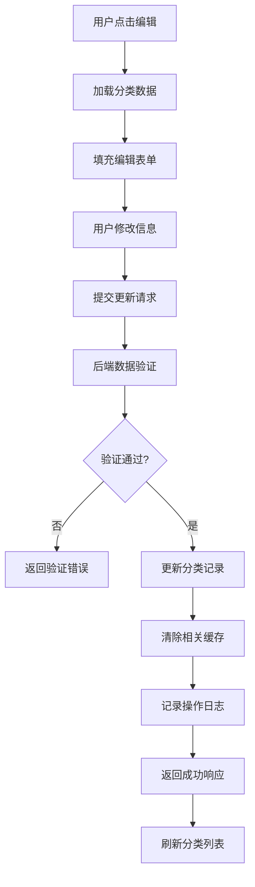
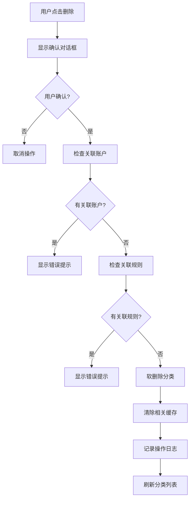

# 账户分类管理功能技术文档

## 1. 功能概述

### 1.1 功能描述
账户分类管理功能是鲸落系统的核心模块，专注于**分类的定义、管理和展示**。该功能提供了完整的账户分类生命周期管理，包括分类的创建、编辑、删除、查看和统计展示。

### 1.2 主要特性
- **分类CRUD操作**：创建、查看、编辑、删除账户分类
- **分类属性管理**：名称、描述、风险等级、颜色、图标、优先级
- **系统分类保护**：系统预定义分类不可删除
- **分类统计**：显示每个分类关联的规则数量和账户数量
- **响应式界面**：支持桌面和移动端访问
- **权限控制**：管理员可编辑，普通用户只读

### 1.3 技术特点
- 基于Flask的RESTful API设计
- 前后端分离架构
- Bootstrap响应式界面
- SQLAlchemy ORM数据模型
- 实时数据统计和展示

## 2. 技术架构

### 2.1 整体架构
```
┌─────────────────┐    ┌─────────────────┐    ┌─────────────────┐
│   前端界面      │    │   后端API       │    │   数据库        │
│                 │    │                 │    │                 │
│ - 分类列表      │◄──►│ - 分类控制器    │◄──►│ - account_classifications│
│ - 分类卡片      │    │ - 分类服务      │    │ - 分类统计视图   │
│ - 分类表单      │    │ - 数据验证      │    │ - 分类索引      │
│ - 分类搜索      │    │ - 缓存管理      │    │                 │
└─────────────────┘    └─────────────────┘    └─────────────────┘
```

### 2.2 模块关系
- **前端模块**：分类管理界面、分类表单组件、分类展示组件
- **后端模块**：分类服务、分类验证、分类缓存
- **数据模块**：分类模型、分类统计、分类关联

## 3. 前端实现

### 3.1 页面结构
- **主页面**：`app/templates/account_classification/management.html`
- **样式文件**：`app/static/css/pages/account_classification/account_classification.css`
- **脚本文件**：`app/static/js/pages/account_classification/account_classification.js`

### 3.2 核心组件

#### 3.2.1 分类列表组件
```html
<!-- 分类列表 -->
<div class="classification-container">
    <div class="card">
        <div class="card-header d-flex justify-content-between align-items-center">
            <h5 class="mb-0">
                <i class="fas fa-tags me-2"></i>账户分类管理
            </h5>
            <div class="d-flex gap-2">
                <input type="text" class="form-control form-control-sm" id="searchClassifications" 
                       placeholder="搜索分类..." style="width: 200px;">
                <button class="btn btn-primary btn-sm" onclick="showCreateClassificationModal()">
                    <i class="fas fa-plus me-1"></i>新建分类
                </button>
            </div>
        </div>
        <div class="card-body" id="classificationsList">
            <!-- 分类卡片列表 -->
        </div>
    </div>
</div>
```

#### 3.2.2 分类卡片组件
```html
<!-- 分类卡片模板 -->
<div class="classification-card" data-id="{id}">
    <div class="classification-header">
        <div class="classification-icon" style="background-color: {color}">
            <i class="{icon_name}"></i>
        </div>
        <div class="classification-info">
            <h6 class="classification-name">{name}</h6>
            <span class="classification-risk risk-{risk_level}">{risk_level_text}</span>
        </div>
        <div class="classification-actions">
            <button class="btn btn-sm btn-outline-primary" onclick="editClassification({id})">
                <i class="fas fa-edit"></i>
            </button>
            <button class="btn btn-sm btn-outline-danger" onclick="deleteClassification({id})">
                <i class="fas fa-trash"></i>
            </button>
        </div>
    </div>
    <div class="classification-body">
        <p class="classification-description">{description}</p>
        <div class="classification-stats">
            <small class="text-muted">账户数量: <span class="account-count">{account_count}</span></small>
        </div>
    </div>
</div>
```

### 3.3 关键JavaScript函数

#### 3.3.1 分类管理函数
```javascript
// 加载分类列表
function loadClassifications() {
    fetch('/account-classification/api/classifications')
        .then(response => response.json())
        .then(data => {
            if (data.success) {
                renderClassifications(data.data);
            } else {
                showAlert('加载分类失败: ' + data.message, 'danger');
            }
        })
        .catch(error => {
            console.error('Error:', error);
            showAlert('加载分类失败', 'danger');
        });
}

// 创建分类
function createClassification() {
    const formData = new FormData(document.getElementById('classificationForm'));
    
    fetch('/account-classification/api/classifications', {
        method: 'POST',
        body: formData
    })
    .then(response => response.json())
    .then(data => {
        if (data.success) {
            showAlert('分类创建成功', 'success');
            $('#createClassificationModal').modal('hide');
            loadClassifications();
        } else {
            showAlert('创建失败: ' + data.message, 'danger');
        }
    })
    .catch(error => {
        console.error('Error:', error);
        showAlert('创建失败', 'danger');
    });
}

// 编辑分类
function editClassification(id) {
    fetch(`/account-classification/api/classifications/${id}`)
        .then(response => response.json())
        .then(data => {
            if (data.success) {
                populateClassificationForm(data.data);
                $('#editClassificationModal').modal('show');
            } else {
                showAlert('加载分类失败: ' + data.message, 'danger');
            }
        })
        .catch(error => {
            console.error('Error:', error);
            showAlert('加载分类失败', 'danger');
        });
}

// 删除分类
function deleteClassification(id) {
    if (!confirm('确定要删除这个分类吗？注意：这将影响所有使用该分类的账户。')) {
        return;
    }
    
    fetch(`/account-classification/api/classifications/${id}`, {
        method: 'DELETE'
    })
    .then(response => response.json())
    .then(data => {
        if (data.success) {
            showAlert('分类删除成功', 'success');
            loadClassifications();
        } else {
            showAlert('删除失败: ' + data.message, 'danger');
        }
    })
    .catch(error => {
        console.error('Error:', error);
        showAlert('删除失败', 'danger');
    });
}
```

#### 3.3.2 分类渲染函数
```javascript
// 渲染分类列表
function renderClassifications(classifications) {
    const container = document.getElementById('classificationsList');
    
    if (classifications.length === 0) {
        container.innerHTML = `
            <div class="text-center py-4">
                <i class="fas fa-tags fa-3x text-muted mb-3"></i>
                <p class="text-muted">暂无分类，请点击上方按钮新建分类</p>
            </div>
        `;
        return;
    }
    
    container.innerHTML = classifications.map(classification => 
        renderClassificationCard(classification)
    ).join('');
}

// 渲染单个分类卡片
function renderClassificationCard(classification) {
    const riskLevelText = {
        'low': '低风险',
        'medium': '中风险',
        'high': '高风险',
        'critical': '严重风险'
    };
    
    return `
        <div class="classification-card mb-3" data-id="${classification.id}">
            <div class="classification-header d-flex align-items-center">
                <div class="classification-icon me-3" style="background-color: ${classification.color}">
                    <i class="${classification.icon_name || 'fas fa-tag'}"></i>
                </div>
                <div class="classification-info flex-grow-1">
                    <h6 class="classification-name mb-1">${classification.name}</h6>
                    <span class="badge classification-risk risk-${classification.risk_level}">
                        ${riskLevelText[classification.risk_level] || classification.risk_level}
                    </span>
                </div>
                <div class="classification-actions">
                    <button class="btn btn-sm btn-outline-primary me-1" 
                            onclick="editClassification(${classification.id})" 
                            title="编辑">
                        <i class="fas fa-edit"></i>
                    </button>
                    <button class="btn btn-sm btn-outline-danger" 
                            onclick="deleteClassification(${classification.id})" 
                            title="删除">
                        <i class="fas fa-trash"></i>
                    </button>
                </div>
            </div>
            <div class="classification-body mt-2">
                <p class="classification-description text-muted small mb-1">
                    ${classification.description || '暂无描述'}
                </p>
                <div class="classification-stats">
                    <small class="text-muted">
                        创建时间: ${new Date(classification.created_at).toLocaleDateString('zh-CN')}
                        | 账户数量: <span class="text-primary fw-bold">${classification.account_count || 0}</span>
                    </small>
                </div>
            </div>
        </div>
    `;
}
```

#### 3.3.3 分类搜索函数
```javascript
// 搜索分类
function searchClassifications() {
    const searchTerm = document.getElementById('searchClassifications').value.toLowerCase();
    const classificationCards = document.querySelectorAll('.classification-card');
    
    classificationCards.forEach(card => {
        const name = card.querySelector('.classification-name').textContent.toLowerCase();
        const description = card.querySelector('.classification-description').textContent.toLowerCase();
        
        if (name.includes(searchTerm) || description.includes(searchTerm)) {
            card.style.display = 'block';
        } else {
            card.style.display = 'none';
        }
    });
}

// 搜索防抖
let searchTimeout;
document.getElementById('searchClassifications').addEventListener('input', function() {
    clearTimeout(searchTimeout);
    searchTimeout = setTimeout(searchClassifications, 300);
});
```

### 3.4 样式设计

#### 3.4.1 分类卡片样式
```
.classification-card {
    transition: all 0.3s ease;
    border: 1px solid #e9ecef;
    border-radius: 12px;
    background: #fff;
    padding: 1rem;
    position: relative;
    overflow: hidden;
    cursor: pointer;
}

.classification-card:hover {
    box-shadow: 0 4px 20px rgba(0, 0, 0, 0.1);
    transform: translateY(-2px);
    border-color: var(--bs-primary);
}

.classification-icon {
    width: 40px;
    height: 40px;
    border-radius: 50%;
    display: flex;
    align-items: center;
    justify-content: center;
    color: white;
    font-size: 1.2rem;
}

.classification-name {
    font-weight: 600;
    margin: 0;
    color: #333;
}

.classification-risk {
    font-size: 0.75rem;
    padding: 0.25rem 0.5rem;
    border-radius: 12px;
}

.risk-low { background-color: #d1ecf1; color: #0c5460; }
.risk-medium { background-color: #fff3cd; color: #856404; }
.risk-high { background-color: #f8d7da; color: #721c24; }
.risk-critical { background-color: #f5c6cb; color: #491217; }

.classification-actions {
    opacity: 0;
    transition: opacity 0.3s ease;
}

.classification-card:hover .classification-actions {
    opacity: 1;
}
```

#### 3.4.2 分类列表样式
```
.classification-container {
    max-width: 100%;
}

.classification-list {
    display: grid;
    grid-template-columns: repeat(auto-fill, minmax(300px, 1fr));
    gap: 1rem;
    padding: 0;
}

@media (max-width: 768px) {
    .classification-list {
        grid-template-columns: 1fr;
    }
}

.classification-stats {
    border-top: 1px solid #f0f0f0;
    padding-top: 0.5rem;
    margin-top: 0.5rem;
}

.account-count {
    font-weight: 600;
    color: var(--bs-primary);
}
```

## 4. 后端实现

### 4.1 路由控制器
**文件**：`app/routes/account_classification.py`

#### 4.1.1 主要路由
```python
@account_classification_bp.route("/")
@login_required
@view_required
def index() -> str:
    """账户分类管理首页"""
    return render_template("account_classification/management.html")

@account_classification_bp.route("/rules-page")
@login_required
@view_required
def rules() -> str:
    """规则管理页面"""
    return render_template("account_classification/rules_management.html")
```

#### 4.1.2 分类管理API
```python
@account_classification_bp.route("/api/classifications", methods=["GET"])
@login_required
@view_required
def get_classifications() -> Response:
    """获取分类列表"""
    try:
        page = request.args.get('page', 1, type=int)
        per_page = request.args.get('per_page', 20, type=int)
        search = request.args.get('search', '')
        
        query = AccountClassification.query.filter_by(is_active=True)
        
        if search:
            query = query.filter(
                or_(
                    AccountClassification.name.ilike(f'%{search}%'),
                    AccountClassification.description.ilike(f'%{search}%')
                )
            )
        
        classifications = query.order_by(
            AccountClassification.priority.desc(),
            AccountClassification.name
        ).paginate(
            page=page, per_page=per_page, error_out=False
        )
        
        # 获取每个分类的账户统计
        classification_data = []
        for classification in classifications.items:
            data = classification.to_dict()
            data['account_count'] = classification.get_account_count()
            classification_data.append(data)
        
        return jsonify({
            "success": True,
            "data": classification_data,
            "pagination": {
                "page": classifications.page,
                "pages": classifications.pages,
                "per_page": classifications.per_page,
                "total": classifications.total
            }
        })
    except Exception as e:
        logger.error(f"获取分类列表失败: {str(e)}")
        return jsonify({
            "success": False,
            "message": "获取分类列表失败"
        }), 500

@account_classification_bp.route("/api/classifications", methods=["POST"])
@login_required
@admin_required
def create_classification() -> Response:
    """创建分类"""
    try:
        data = request.get_json()
        
        # 验证必填字段
        if not data.get('name'):
            return jsonify({
                "success": False,
                "message": "分类名称不能为空"
            }), 400
        
        # 检查名称是否重复
        existing = AccountClassification.query.filter_by(
            name=data.get('name'), is_active=True
        ).first()
        if existing:
            return jsonify({
                "success": False,
                "message": "分类名称已存在"
            }), 400
        
        classification = AccountClassification(
            name=data.get('name'),
            description=data.get('description'),
            risk_level=data.get('risk_level', 'medium'),
            color=data.get('color', '#007bff'),
            icon_name=data.get('icon_name', 'fas fa-tag'),
            priority=data.get('priority', 0)
        )
        
        db.session.add(classification)
        db.session.commit()
        
        log_info(f"创建分类成功: {classification.name}", module="account_classification")
        
        return jsonify({
            "success": True,
            "data": classification.to_dict(),
            "message": "分类创建成功"
        })
    except Exception as e:
        db.session.rollback()
        logger.error(f"创建分类失败: {str(e)}")
        return jsonify({
            "success": False,
            "message": "创建分类失败"
        }), 500

@account_classification_bp.route("/api/classifications/<int:classification_id>", methods=["PUT"])
@login_required
@admin_required
def update_classification(classification_id: int) -> Response:
    """更新分类"""
    try:
        classification = AccountClassification.query.get_or_404(classification_id)
        data = request.get_json()
        
        # 检查名称重复（排除自己）
        if data.get('name') and data.get('name') != classification.name:
            existing = AccountClassification.query.filter(
                AccountClassification.name == data.get('name'),
                AccountClassification.id != classification_id,
                AccountClassification.is_active == True
            ).first()
            if existing:
                return jsonify({
                    "success": False,
                    "message": "分类名称已存在"
                }), 400
        
        # 更新字段
        for field in ['name', 'description', 'risk_level', 'color', 'icon_name', 'priority']:
            if field in data:
                setattr(classification, field, data[field])
        
        classification.updated_at = now()
        db.session.commit()
        
        log_info(f"更新分类成功: {classification.name}", module="account_classification")
        
        return jsonify({
            "success": True,
            "data": classification.to_dict(),
            "message": "分类更新成功"
        })
    except Exception as e:
        db.session.rollback()
        logger.error(f"更新分类失败: {str(e)}")
        return jsonify({
            "success": False,
            "message": "更新分类失败"
        }), 500

@account_classification_bp.route("/api/classifications/<int:classification_id>", methods=["DELETE"])
@login_required
@admin_required
def delete_classification(classification_id: int) -> Response:
    """删除分类"""
    try:
        classification = AccountClassification.query.get_or_404(classification_id)
        
        # 检查是否有关联的账户
        account_count = classification.get_account_count()
        if account_count > 0:
            return jsonify({
                "success": False,
                "message": f"无法删除分类，还有 {account_count} 个账户使用该分类"
            }), 400
        
        # 检查是否有关联的规则
        rule_count = classification.rules.filter_by(is_active=True).count()
        if rule_count > 0:
            return jsonify({
                "success": False,
                "message": f"无法删除分类，还有 {rule_count} 个规则使用该分类"
            }), 400
        
        classification.is_active = False
        classification.updated_at = now()
        db.session.commit()
        
        log_info(f"删除分类成功: {classification.name}", module="account_classification")
        
        return jsonify({
            "success": True,
            "message": "分类删除成功"
        })
    except Exception as e:
        db.session.rollback()
        logger.error(f"删除分类失败: {str(e)}")
        return jsonify({
            "success": False,
            "message": "删除分类失败"
        }), 500
```

#### 4.1.3 规则管理API
```python
@account_classification_bp.route("/api/rules", methods=["GET"])
@login_required
@view_required
def get_rules() -> Response:
    """获取规则列表"""
    try:
        rules = rule_service.get_all_rules()
        return jsonify({
            "success": True,
            "data": [rule.to_dict() for rule in rules]
        })
    except Exception as e:
        logger.error(f"获取规则列表失败: {str(e)}")
        return jsonify({
            "success": False,
            "message": "获取规则列表失败"
        }), 500

@account_classification_bp.route("/api/rules", methods=["POST"])
@login_required
@admin_required
def create_rule() -> Response:
    """创建规则"""
    try:
        data = request.get_json()
        rule = rule_service.create_rule(
            name=data.get('name'),
            description=data.get('description'),
            classification_id=data.get('classification_id'),
            db_type=data.get('db_type'),
            conditions=data.get('conditions', {}),
            priority=data.get('priority', 0)
        )
        return jsonify({
            "success": True,
            "data": rule.to_dict(),
            "message": "规则创建成功"
        })
    except Exception as e:
        logger.error(f"创建规则失败: {str(e)}")
        return jsonify({
            "success": False,
            "message": "创建规则失败"
        }), 500
```

#### 4.1.4 权限配置API
```python
@account_classification_bp.route("/api/rules/<int:rule_id>/permissions", methods=["GET"])
@login_required
@view_required
def get_rule_permissions(rule_id: int) -> Response:
    """获取规则权限配置"""
    try:
        db_type = request.args.get('db_type')
        permissions = rule_service.get_rule_permissions(rule_id, db_type)
        return jsonify({
            "success": True,
            "data": permissions
        })
    except Exception as e:
        logger.error(f"获取规则权限配置失败: {str(e)}")
        return jsonify({
            "success": False,
            "message": "获取规则权限配置失败"
        }), 500

@account_classification_bp.route("/api/rules/<int:rule_id>/permissions", methods=["POST"])
@login_required
@admin_required
def save_rule_permissions(rule_id: int) -> Response:
    """保存规则权限配置"""
    try:
        data = request.get_json()
        rule_service.save_rule_permissions(rule_id, data)
        return jsonify({
            "success": True,
            "message": "权限配置保存成功"
        })
    except Exception as e:
        logger.error(f"保存规则权限配置失败: {str(e)}")
        return jsonify({
            "success": False,
            "message": "保存规则权限配置失败"
        }), 500
```

#### 4.1.5 自动分类API
```python
@account_classification_bp.route("/api/auto-classify", methods=["POST"])
@login_required
@admin_required
def auto_classify() -> Response:
    """执行自动分类"""
    try:
        result = auto_classification_service.classify_all_accounts()
        return jsonify({
            "success": True,
            "data": result,
            "message": "自动分类完成"
        })
    except Exception as e:
        logger.error(f"自动分类失败: {str(e)}")
        return jsonify({
            "success": False,
            "message": "自动分类失败"
        }), 500
```

### 4.2 数据模型

### 4.2 分类数据模型

#### 4.2.1 账户分类模型
```python
class AccountClassification(db.Model):
    """账户分类模型"""
    __tablename__ = "account_classifications"
    
    id = db.Column(db.Integer, primary_key=True)
    name = db.Column(db.String(100), nullable=False, unique=True)
    description = db.Column(db.Text)
    risk_level = db.Column(db.String(20), nullable=False, default='medium')  # low, medium, high, critical
    color = db.Column(db.String(20), default="#007bff")  # 分类颜色
    icon_name = db.Column(db.String(50), default='fas fa-tag')  # 图标名称
    priority = db.Column(db.Integer, default=0)  # 优先级
    is_system = db.Column(db.Boolean, default=False)  # 是否系统分类
    is_active = db.Column(db.Boolean, default=True)
    created_at = db.Column(db.DateTime(timezone=True), default=now)
    updated_at = db.Column(db.DateTime(timezone=True), default=now, onupdate=now)
    
    # 关系
    rules = db.relationship("ClassificationRule", backref="classification", lazy="dynamic")
    
    def __repr__(self) -> str:
        return f"<AccountClassification {self.name}>"
    
    def to_dict(self) -> dict:
        """转换为字典"""
        return {
            "id": self.id,
            "name": self.name,
            "description": self.description,
            "risk_level": self.risk_level,
            "color": self.color,
            "icon_name": self.icon_name,
            "priority": self.priority,
            "is_system": self.is_system,
            "is_active": self.is_active,
            "created_at": self.created_at.isoformat() if self.created_at else None,
            "updated_at": self.updated_at.isoformat() if self.updated_at else None
        }
    
    def get_account_count(self) -> int:
        """获取该分类下的账户数量"""
        from app.models.current_account_sync_data import CurrentAccountSyncData
        return CurrentAccountSyncData.query.filter_by(
            classification_id=self.id
        ).count()
    
    def get_active_rules_count(self) -> int:
        """获取该分类下的活跃规则数量"""
        return self.rules.filter_by(is_active=True).count()
    
    def can_delete(self) -> tuple[bool, str]:
        """检查是否可以删除"""
        if self.is_system:
            return False, "系统分类不能删除"
        
        account_count = self.get_account_count()
        if account_count > 0:
            return False, f"还有 {account_count} 个账户使用该分类"
        
        rule_count = self.get_active_rules_count()
        if rule_count > 0:
            return False, f"还有 {rule_count} 个规则使用该分类"
        
        return True, ""
    
    @classmethod
    def get_default_classification(cls):
        """获取默认分类"""
        return cls.query.filter_by(
            name="未分类",
            is_system=True,
            is_active=True
        ).first()
    
    @classmethod
    def create_default_classifications(cls):
        """创建默认分类"""
        default_classifications = [
            {
                "name": "未分类",
                "description": "未进行分类的账户",
                "risk_level": "medium",
                "color": "#6c757d",
                "icon_name": "fas fa-question",
                "priority": 0,
                "is_system": True
            },
            {
                "name": "管理员账户",
                "description": "具有管理员权限的账户",
                "risk_level": "high",
                "color": "#dc3545",
                "icon_name": "fas fa-user-shield",
                "priority": 100,
                "is_system": True
            },
            {
                "name": "应用账户",
                "description": "应用程序使用的账户",
                "risk_level": "medium",
                "color": "#007bff",
                "icon_name": "fas fa-cogs",
                "priority": 50,
                "is_system": True
            },
            {
                "name": "只读账户",
                "description": "仅具有只读权限的账户",
                "risk_level": "low",
                "color": "#28a745",
                "icon_name": "fas fa-eye",
                "priority": 20,
                "is_system": True
            }
        ]
        
        for classification_data in default_classifications:
            existing = cls.query.filter_by(
                name=classification_data["name"],
                is_system=True
            ).first()
            
            if not existing:
                classification = cls(**classification_data)
                db.session.add(classification)
        
        db.session.commit()
```

#### 4.2.2 规则模型
```python
class Rule(db.Model):
    """分类规则模型"""
    __tablename__ = "rules"
    
    id = db.Column(db.Integer, primary_key=True)
    name = db.Column(db.String(200), nullable=False)
    description = db.Column(db.Text)
    classification_id = db.Column(db.Integer, db.ForeignKey("classifications.id"), nullable=False)
    db_type = db.Column(db.String(50), nullable=False)
    conditions = db.Column(db.JSON)
    priority = db.Column(db.Integer, default=0)
    is_active = db.Column(db.Boolean, default=True)
    created_at = db.Column(db.DateTime, default=datetime.utcnow)
    updated_at = db.Column(db.DateTime, default=datetime.utcnow, onupdate=datetime.utcnow)
    
    def to_dict(self):
        return {
            "id": self.id,
            "name": self.name,
            "description": self.description,
            "classification_id": self.classification_id,
            "db_type": self.db_type,
            "conditions": self.conditions,
            "priority": self.priority,
            "is_active": self.is_active,
            "created_at": self.created_at.isoformat() if self.created_at else None,
            "updated_at": self.updated_at.isoformat() if self.updated_at else None
        }
```

### 4.3 服务层

### 4.3 分类服务层

#### 4.3.1 分类管理服务
```python
class ClassificationService:
    """分类管理服务"""
    
    def __init__(self):
        self.logger = get_logger(__name__)
        self.cache_manager = cache_manager
    
    def get_all_classifications(self, include_stats: bool = False) -> List[AccountClassification]:
        """获取所有分类"""
        classifications = AccountClassification.query.filter_by(
            is_active=True
        ).order_by(
            AccountClassification.priority.desc(),
            AccountClassification.name
        ).all()
        
        if include_stats:
            for classification in classifications:
                classification._account_count = classification.get_account_count()
                classification._rule_count = classification.get_active_rules_count()
        
        return classifications
    
    def create_classification(self, name: str, description: str = None, 
                            risk_level: str = 'medium', color: str = '#007bff',
                            icon_name: str = 'fas fa-tag', priority: int = 0) -> AccountClassification:
        """创建分类"""
        # 检查名称是否重复
        existing = AccountClassification.query.filter_by(
            name=name, is_active=True
        ).first()
        if existing:
            raise ValueError(f"分类名称 '{name}' 已存在")
        
        classification = AccountClassification(
            name=name,
            description=description,
            risk_level=risk_level,
            color=color,
            icon_name=icon_name,
            priority=priority
        )
        
        db.session.add(classification)
        db.session.commit()
        
        # 清除相关缓存
        self.cache_manager.clear_classification_cache()
        
        self.logger.info(f"创建分类成功: {name}")
        return classification
    
    def update_classification(self, classification_id: int, **kwargs) -> AccountClassification:
        """更新分类"""
        classification = AccountClassification.query.get_or_404(classification_id)
        
        # 检查名称重复
        if 'name' in kwargs and kwargs['name'] != classification.name:
            existing = AccountClassification.query.filter(
                AccountClassification.name == kwargs['name'],
                AccountClassification.id != classification_id,
                AccountClassification.is_active == True
            ).first()
            if existing:
                raise ValueError(f"分类名称 '{kwargs['name']}' 已存在")
        
        # 更新字段
        for key, value in kwargs.items():
            if hasattr(classification, key):
                setattr(classification, key, value)
        
        classification.updated_at = now()
        db.session.commit()
        
        # 清除相关缓存
        self.cache_manager.clear_classification_cache()
        
        self.logger.info(f"更新分类成功: {classification.name}")
        return classification
    
    def delete_classification(self, classification_id: int) -> bool:
        """删除分类"""
        classification = AccountClassification.query.get_or_404(classification_id)
        
        # 检查是否可以删除
        can_delete, reason = classification.can_delete()
        if not can_delete:
            raise ValueError(reason)
        
        classification.is_active = False
        classification.updated_at = now()
        db.session.commit()
        
        # 清除相关缓存
        self.cache_manager.clear_classification_cache()
        
        self.logger.info(f"删除分类成功: {classification.name}")
        return True
    
    def get_classification_stats(self) -> dict:
        """获取分类统计信息"""
        stats = {
            "total_classifications": 0,
            "active_classifications": 0,
            "system_classifications": 0,
            "risk_level_distribution": {},
            "top_classifications": []
        }
        
        classifications = AccountClassification.query.all()
        stats["total_classifications"] = len(classifications)
        
        active_classifications = [c for c in classifications if c.is_active]
        stats["active_classifications"] = len(active_classifications)
        
        stats["system_classifications"] = len([
            c for c in active_classifications if c.is_system
        ])
        
        # 风险等级分布
        risk_levels = {}
        for classification in active_classifications:
            risk_level = classification.risk_level
            if risk_level not in risk_levels:
                risk_levels[risk_level] = 0
            risk_levels[risk_level] += 1
        stats["risk_level_distribution"] = risk_levels
        
        # 获取账户数量最多的分类
        classification_counts = []
        for classification in active_classifications:
            account_count = classification.get_account_count()
            classification_counts.append({
                "name": classification.name,
                "account_count": account_count,
                "color": classification.color
            })
        
        stats["top_classifications"] = sorted(
            classification_counts, 
            key=lambda x: x["account_count"], 
            reverse=True
        )[:10]
        
        return stats
```

#### 4.3.2 规则服务
```python
class RuleService:
    """规则服务"""
    
    def __init__(self):
        self.logger = get_logger(__name__)
    
    def get_all_rules(self) -> List[Rule]:
        """获取所有规则"""
        return Rule.query.filter_by(is_active=True).order_by(Rule.priority.desc(), Rule.name).all()
    
    def create_rule(self, name: str, description: str, classification_id: int, 
                   db_type: str, conditions: dict, priority: int = 0) -> Rule:
        """创建规则"""
        rule = Rule(
            name=name,
            description=description,
            classification_id=classification_id,
            db_type=db_type,
            conditions=conditions,
            priority=priority
        )
        db.session.add(rule)
        db.session.commit()
        return rule
    
    def get_rule_permissions(self, rule_id: int, db_type: str) -> dict:
        """获取规则权限配置"""
        rule = Rule.query.get_or_404(rule_id)
        # 根据数据库类型返回相应的权限配置
        return self._get_permissions_by_db_type(db_type)
    
    def save_rule_permissions(self, rule_id: int, permissions: dict) -> bool:
        """保存规则权限配置"""
        rule = Rule.query.get_or_404(rule_id)
        # 保存权限配置到数据库
        rule.permissions = permissions
        rule.updated_at = datetime.utcnow()
        db.session.commit()
        return True
```

## 5. 数据库设计

### 5.1 账户分类表结构

#### 5.1.1 主分类表 (account_classifications)
```sql
CREATE TABLE account_classifications (
    id SERIAL PRIMARY KEY,
    name VARCHAR(100) NOT NULL UNIQUE,
    description TEXT,
    risk_level VARCHAR(20) NOT NULL DEFAULT 'medium',
    color VARCHAR(20) DEFAULT '#007bff',
    icon_name VARCHAR(50) DEFAULT 'fas fa-tag',
    priority INTEGER DEFAULT 0,
    is_system BOOLEAN DEFAULT FALSE,
    is_active BOOLEAN DEFAULT TRUE,
    created_at TIMESTAMP WITH TIME ZONE DEFAULT NOW(),
    updated_at TIMESTAMP WITH TIME ZONE DEFAULT NOW()
);

-- 索引设计
CREATE INDEX idx_account_classifications_name ON account_classifications(name);
CREATE INDEX idx_account_classifications_active ON account_classifications(is_active);
CREATE INDEX idx_account_classifications_priority ON account_classifications(priority DESC);
CREATE INDEX idx_account_classifications_risk_level ON account_classifications(risk_level);
```

#### 5.1.2 分类历史表 (classification_history)
```sql
CREATE TABLE classification_history (
    id SERIAL PRIMARY KEY,
    account_id INTEGER NOT NULL,
    old_classification_id INTEGER REFERENCES account_classifications(id),
    new_classification_id INTEGER REFERENCES account_classifications(id),
    change_reason VARCHAR(100),
    changed_by INTEGER REFERENCES users(id),
    changed_at TIMESTAMP WITH TIME ZONE DEFAULT NOW()
);

-- 索引设计
CREATE INDEX idx_classification_history_account_id ON classification_history(account_id);
CREATE INDEX idx_classification_history_changed_at ON classification_history(changed_at);
```

### 5.2 视图设计

#### 5.2.1 分类统计视图
```sql
CREATE OR REPLACE VIEW classification_stats AS
SELECT 
    ac.id,
    ac.name,
    ac.description,
    ac.risk_level,
    ac.color,
    ac.priority,
    COUNT(casd.id) as account_count,
    COUNT(cr.id) as rule_count
FROM account_classifications ac
LEFT JOIN current_account_sync_data casd ON casd.classification_id = ac.id
LEFT JOIN classification_rules cr ON cr.classification_id = ac.id AND cr.is_active = TRUE
WHERE ac.is_active = TRUE
GROUP BY ac.id, ac.name, ac.description, ac.risk_level, ac.color, ac.priority
ORDER BY ac.priority DESC, ac.name;
```

## 6. 核心功能流程

### 6.1 分类创建流程
``mermaid
graph TD
    A[用户输入分类信息] --> B[前端验证表单]
    B --> C{验证通过?}
    C -->|否| D[显示错误信息]
    C -->|是| E[发送创建请求]
    E --> F[后端验证数据]
    F --> G{名称重复检查}
    G -->|重复| H[返回错误]
    G -->|通过| I[创建分类记录]
    I --> J[清除相关缓存]
    J --> K[返回成功响应]
    K --> L[更新前端显示]
```

### 6.2 分类编辑流程


### 6.3 分类删除流程


## 7. 性能优化策略

### 7.1 缓存策略
```python
class ClassificationCacheManager:
    """分类缓存管理器"""
    
    def __init__(self, cache_instance):
        self.cache = cache_instance
        self.ttl = 3600  # 1小时
    
    def get_all_classifications(self) -> Optional[List[dict]]:
        """获取所有分类缓存"""
        return self.cache.get('all_classifications')
    
    def set_all_classifications(self, classifications: List[dict]):
        """设置所有分类缓存"""
        self.cache.set('all_classifications', classifications, timeout=self.ttl)
    
    def get_classification_stats(self) -> Optional[dict]:
        """获取分类统计缓存"""
        return self.cache.get('classification_stats')
    
    def set_classification_stats(self, stats: dict):
        """设置分类统计缓存"""
        self.cache.set('classification_stats', stats, timeout=self.ttl)
    
    def clear_classification_cache(self):
        """清除所有分类相关缓存"""
        self.cache.delete('all_classifications')
        self.cache.delete('classification_stats')
```

### 7.2 数据库优化
- 使用索引优化查询性能
- 分页查询避免大量数据加载
- 使用数据库视图预计算统计信息
- 定期维护数据库统计信息

### 7.3 前端优化
- 虚拟滚动处理大量分类数据
- 搜索防抖减少请求频率
- 组件懒加载提升页面性能
- 图标和颜色预加载

## 8. 安全考虑

### 8.1 权限控制
- 分类查看权限：所有登录用户
- 分类创建权限：管理员用户
- 分类编辑权限：管理员用户
- 分类删除权限：超级管理员

### 8.2 数据验证
- 分类名称长度限制和字符验证
- 颜色值格式验证
- 风险等级枚举值验证
- XSS防护和SQL注入防护

### 8.3 操作审计
- 记录所有分类操作日志
- 跟踪分类变更历史
- 监控异常操作行为
- 定期审计分类使用情况

## 9. 监控和告警

### 9.1 关键指标
- 分类数量变化趋势
- 分类使用频率统计
- 分类操作成功率
- 缓存命中率

### 9.2 告警规则
- 分类操作失败率超过阈值
- 未分类账户比例过高
- 分类数量异常增长
- 系统分类被误删除

## 10. 扩展功能

### 10.1 分类导入导出
```python
class ClassificationImportExport:
    """分类导入导出功能"""
    
    def export_classifications(self) -> dict:
        """导出分类配置"""
        classifications = AccountClassification.query.filter_by(is_active=True).all()
        return {
            "version": "1.0",
            "export_time": datetime.now().isoformat(),
            "classifications": [c.to_dict() for c in classifications]
        }
    
    def import_classifications(self, data: dict) -> dict:
        """导入分类配置"""
        results = {"success": 0, "failed": 0, "errors": []}
        
        for item in data.get("classifications", []):
            try:
                self._import_single_classification(item)
                results["success"] += 1
            except Exception as e:
                results["failed"] += 1
                results["errors"].append(str(e))
        
        return results
```

### 10.2 分类模板
- 预定义常用分类模板
- 行业标准分类导入
- 自定义分类模板保存
- 分类最佳实践推荐

---

**文档版本**：1.0.0  
**最后更新**：2025-01-28  
**维护人员**：开发团队
