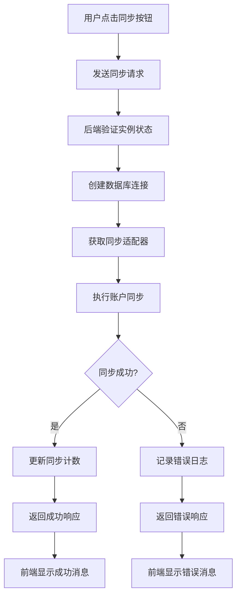
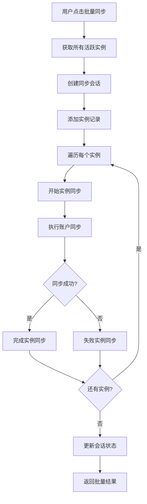

# 账户同步功能技术文档

## 1. 功能概述

### 1.1 功能描述
账户同步功能是鲸落系统的核心功能之一，用于从各种数据库实例中同步账户信息。该功能支持多种同步模式，包括单实例同步、批量同步、定时同步等，并提供完整的同步记录管理和监控。

### 1.2 主要特性
- **多数据库支持**：支持MySQL、SQL Server、PostgreSQL、Oracle
- **多种同步模式**：单实例同步、批量同步、定时同步、手动任务同步
- **会话管理**：完整的同步会话跟踪和状态管理
- **同步记录**：详细的同步历史记录和统计信息
- **错误处理**：完善的错误处理和重试机制
- **实时监控**：同步进度和状态实时监控

### 1.3 技术特点
- 基于适配器模式的数据库连接
- 统一的同步服务接口
- 会话管理和状态跟踪
- 异步批量处理
- 详细的日志记录

## 2. 技术架构

### 2.1 整体架构
```
┌─────────────────┐    ┌─────────────────┐    ┌─────────────────┐
│   前端界面      │    │   后端API       │    │   数据库        │
│                 │    │                 │    │                 │
│ - 同步记录      │◄──►│ - 路由控制器    │◄──►│ - sync_sessions │
│ - 同步操作      │    │ - 同步服务      │    │ - sync_instance_records│
│ - 状态监控      │    │ - 适配器层      │    │ - current_account_sync_data│
└─────────────────┘    └─────────────────┘    └─────────────────┘
```

### 2.2 模块关系
- **前端模块**：同步记录页面、同步操作界面、状态监控界面
- **后端模块**：同步服务、适配器服务、会话管理服务
- **数据模块**：同步会话模型、实例记录模型、账户数据模型

## 3. 前端实现

### 3.1 页面结构
- **主页面**：`app/templates/accounts/sync_records.html`
- **样式文件**：`app/static/css/pages/accounts/sync_records.css`
- **脚本文件**：`app/static/js/pages/accounts/sync_records.js`

### 3.2 核心组件

#### 3.2.1 同步记录列表组件
```html
<!-- 同步记录表格 -->
<div class="table-responsive">
    <table class="table table-hover">
        <thead>
            <tr>
                <th>开始时间</th>
                <th>结束时间</th>
                <th>耗时</th>
                <th>同步类型</th>
                <th>状态</th>
                <th>同步数量</th>
                <th>新增</th>
                <th>删除</th>
                <th>修改</th>
                <th>消息</th>
                <th>操作</th>
            </tr>
        </thead>
        <tbody>
            <!-- 同步记录行 -->
        </tbody>
    </table>
</div>
```

#### 3.2.2 同步类型徽章组件
```html
<!-- 同步类型显示 -->

<span class="badge bg-info">
    <i class="fas fa-hand-pointer me-1"></i>MANUAL_SINGLE
</span>

<span class="badge bg-primary">
    <i class="fas fa-tasks me-1"></i>MANUAL_BATCH
</span>

<span class="badge bg-warning">
    <i class="fas fa-play me-1"></i>MANUAL_TASK
</span>

<span class="badge bg-success">
    <i class="fas fa-clock me-1"></i>SCHEDULED_TASK
</span>

```

#### 3.2.3 批量详情模态框组件
```html
<!-- 批量同步详情模态框 -->
<div class="modal fade" id="batchDetailsModal" tabindex="-1">
    <div class="modal-dialog modal-lg">
        <div class="modal-content">
            <div class="modal-header">
                <h5 class="modal-title">
                    <i class="fas fa-list me-2"></i>批量同步详情
                </h5>
                <button type="button" class="btn-close" data-bs-dismiss="modal"></button>
            </div>
            <div class="modal-body">
                <!-- 统计信息 -->
                <div class="row mb-3">
                    <div class="col-md-3">
                        <div class="card bg-success text-white">
                            <div class="card-body text-center">
                                <h4 id="successCount">0</h4>
                                <small>成功实例</small>
                            </div>
                        </div>
                    </div>
                    <!-- 其他统计卡片 -->
                </div>
                <!-- 详情表格 -->
                <div class="table-responsive">
                    <table class="table table-sm">
                        <thead>
                            <tr>
                                <th>实例名称</th>
                                <th>状态</th>
                                <th>同步数量</th>
                                <th>消息</th>
                            </tr>
                        </thead>
                        <tbody id="detailsTableBody">
                            <!-- 详情行 -->
                        </tbody>
                    </table>
                </div>
            </div>
        </div>
    </div>
</div>
```

### 3.3 关键JavaScript函数

#### 3.3.1 同步记录管理函数
```javascript
// 查看详情
function viewDetails(recordId) {
    const detailsContent = document.getElementById('detailsContent');
    if (detailsContent) {
        detailsContent.innerHTML = `
            <div class="text-center">
                <i class="fas fa-spinner fa-spin fa-2x mb-3"></i>
                <p>加载详情中...</p>
            </div>
        `;
    }
    
    const detailsModal = document.getElementById('detailsModal');
    if (detailsModal) {
        new bootstrap.Modal(detailsModal).show();
    }
    
    // 模拟加载详情
    setTimeout(() => {
        if (detailsContent) {
            detailsContent.innerHTML = `
                <div class="alert alert-info">
                    <i class="fas fa-info-circle me-2"></i>
                    详情功能开发中，记录ID: ${recordId}
                </div>
            `;
        }
    }, 1000);
}

// 重试同步
function retrySync(instanceId) {
    if (confirm('确定要重试同步此实例吗？')) {
        const btn = event.target.closest('button');
        const originalHtml = btn.innerHTML;
        
        btn.innerHTML = '<i class="fas fa-spinner fa-spin"></i>';
        btn.disabled = true;
        
        fetch(`/accounts/sync/${instanceId}`, {
            method: 'POST',
            headers: {
                'Content-Type': 'application/json',
            }
        })
        .then(response => response.json())
        .then(data => {
            if (data.message) {
                showAlert('success', data.message);
                setTimeout(() => location.reload(), 2000);
            } else if (data.error) {
                showAlert('danger', data.error);
            }
        })
        .catch(error => {
            showAlert('danger', '重试同步失败');
        })
        .finally(() => {
            btn.innerHTML = originalHtml;
            btn.disabled = false;
        });
    }
}
```

#### 3.3.2 批量详情查看函数
```javascript
// 查看批量同步详情
function viewBatchDetails(recordIds) {
    try {
        if (!recordIds || !Array.isArray(recordIds) || recordIds.length === 0) {
            showAlert('danger', '没有提供记录ID');
            return;
        }
        
        const recordIdsStr = recordIds.join(',');
        const url = `/account-sync/sync-details-batch?record_ids=${encodeURIComponent(recordIdsStr)}`;
        
        fetch(url, {
            method: 'GET',
            headers: {
                'Content-Type': 'application/json'
            }
        })
        .then(response => {
            if (!response.ok) {
                throw new Error(`HTTP错误: ${response.status} ${response.statusText}`);
            }
            return response.json();
        })
        .then(data => {
            if (data.success) {
                showBatchDetailsModal(data.details);
            } else {
                showAlert('danger', data.error || '获取详情失败');
            }
        })
        .catch(error => {
            console.error('Error:', error);
            showAlert('danger', `获取详情失败: ${error.message}`);
        });
    } catch (error) {
        console.error('JavaScript错误:', error);
        showAlert('danger', `操作失败: ${error.message}`);
    }
}

// 显示批量详情模态框
function showBatchDetailsModal(details) {
    if (!details || details.length === 0) {
        showAlert('warning', '该同步任务没有实例记录，可能是早期失败的任务或数据不完整');
        return;
    }
    
    // 计算统计信息
    const successCount = details.filter(d => d.status === 'completed').length;
    const failedCount = details.filter(d => d.status === 'failed').length;
    const totalAccounts = details.reduce((sum, d) => sum + (d.synced_count || 0), 0);
    const totalInstances = details.length;
    
    const modalHtml = createBatchDetailsModalHtml(successCount, failedCount, totalAccounts, totalInstances, details);
    
    // 移除已存在的模态框
    const existingModal = document.getElementById('batchDetailsModal');
    if (existingModal) {
        existingModal.remove();
    }
    
    // 添加新模态框
    document.body.insertAdjacentHTML('beforeend', modalHtml);
    
    // 显示模态框
    const modal = new bootstrap.Modal(document.getElementById('batchDetailsModal'));
    modal.show();
}
```

#### 3.3.3 统一搜索组件函数
```javascript
// 初始化统一搜索组件
function initUnifiedSearch() {
    if (typeof UnifiedSearch !== 'undefined') {
        const searchForm = document.querySelector('.unified-search-form');
        
        if (searchForm) {
            const unifiedSearch = new UnifiedSearch(searchForm);
            
            // 重写搜索方法
            unifiedSearch.handleSubmit = function(e) {
                e.preventDefault();
                applyFilters();
            };
            
            // 重写清除方法
            unifiedSearch.clearForm = function() {
                // 清除所有筛选条件
                const inputs = this.form.querySelectorAll('.unified-input');
                inputs.forEach(input => {
                    input.value = '';
                });

                const selects = this.form.querySelectorAll('.unified-select');
                selects.forEach(select => {
                    select.selectedIndex = 0;
                });

                // 刷新页面，清除所有筛选条件
                window.location.href = window.location.pathname;
            };
        }
    } else {
        // 如果统一搜索组件未加载，使用传统方式
        setTimeout(initUnifiedSearch, 100);
    }
}

// 应用筛选条件
function applyFilters() {
    const form = document.querySelector('.unified-search-form');
    if (!form) {
        return;
    }
    
    const formData = new FormData(form);
    const params = new URLSearchParams();
    
    // 获取筛选条件
    const syncType = formData.get('sync_type') || '';
    const status = formData.get('status') || '';
    
    // 构建URL参数
    if (syncType) params.append('sync_type', syncType);
    if (status) params.append('status', status);
    
    // 跳转到筛选后的页面
    const url = new URL(window.location);
    url.search = params.toString();
    window.location.href = url.toString();
}
```

### 3.4 样式设计

#### 3.4.1 同步记录表格样式
```css
.sync-records-table {
    background: white;
    border-radius: 0.5rem;
    box-shadow: 0 2px 4px rgba(0,0,0,0.1);
    overflow: hidden;
}

.sync-records-table .table th {
    background-color: #f8f9fa;
    border-top: none;
    font-weight: 600;
    color: #495057;
    white-space: nowrap;
}

.sync-records-table .table td {
    vertical-align: middle;
    white-space: nowrap;
}
```

#### 3.4.2 状态徽章样式
```css
.status-badge {
    font-size: 0.8em;
    padding: 0.4em 0.8em;
    border-radius: 0.25rem;
}

.status-badge.completed {
    background-color: #28a745;
    color: white;
}

.status-badge.failed {
    background-color: #dc3545;
    color: white;
}

.status-badge.cancelled {
    background-color: #6c757d;
    color: white;
}

.status-badge.running {
    background-color: #007bff;
    color: white;
}
```

#### 3.4.3 同步类型徽章样式
```css
.sync-type-badge {
    font-size: 0.8em;
    padding: 0.4em 0.8em;
    border-radius: 0.25rem;
}

.sync-type-badge.manual_single {
    background-color: #17a2b8;
    color: white;
}

.sync-type-badge.manual_batch {
    background-color: #6f42c1;
    color: white;
}

.sync-type-badge.manual_task {
    background-color: #fd7e14;
    color: white;
}

.sync-type-badge.scheduled_task {
    background-color: #20c997;
    color: white;
}
```

## 4. 后端实现

### 4.1 路由控制器
**文件**：`app/routes/account_sync.py`

#### 4.1.1 同步记录管理API
```python
@account_sync_bp.route("/")
@login_required
@view_required
def sync_records() -> str | Response:
    """统一的同步记录页面"""
    try:
        # 获取查询参数
        page = request.args.get("page", 1, type=int)
        sync_type = request.args.get("sync_type", "")
        status = request.args.get("status", "")
        date_range = request.args.get("date_range", "")
        
        # 构建查询
        query = SyncSession.query
        
        # 应用筛选条件
        if sync_type:
            query = query.filter(SyncSession.sync_type == sync_type)
        if status:
            query = query.filter(SyncSession.status == status)
        if date_range:
            # 处理日期范围筛选
            pass
        
        # 分页查询
        pagination = query.order_by(SyncSession.started_at.desc()).paginate(
            page=page, per_page=20, error_out=False
        )
        
        return render_template(
            "accounts/sync_records.html",
            sync_records=pagination,
            sync_type=sync_type,
            status=status,
            date_range=date_range
        )
    except Exception as e:
        log_error(f"加载同步记录失败: {str(e)}", module="account_sync")
        return render_template(
            "accounts/sync_records.html",
            error_message=f"加载同步记录失败: {str(e)}"
        )
```

#### 4.1.2 批量同步API
```python
@account_sync_bp.route("/sync-all", methods=["POST"])
@login_required
@update_required
def sync_all_accounts() -> str | Response | tuple[Response, int]:
    """同步所有实例的账户（使用新的会话管理架构）"""
    from app.services.sync_session_service import sync_session_service

    try:
        log_info("开始同步所有账户", module="account_sync", user_id=current_user.id)

        # 获取所有活跃实例
        instances = Instance.query.filter_by(is_active=True).all()

        if not instances:
            log_warning(
                "没有找到活跃的数据库实例",
                module="account_sync",
                user_id=current_user.id,
            )
            return jsonify({"success": False, "error": "没有找到活跃的数据库实例"}), 400

        # 创建同步会话
        session = sync_session_service.create_session(
            sync_type="manual_batch",
            sync_category="account",
            created_by=current_user.id,
        )

        log_info(
            "创建手动批量同步会话",
            module="account_sync",
            session_id=session.session_id,
            user_id=current_user.id,
            instance_count=len(instances),
        )

        # 添加实例记录
        instance_ids = [inst.id for inst in instances]
        records = sync_session_service.add_instance_records(session.session_id, instance_ids)
        session.total_instances = len(instances)

        success_count = 0
        failed_count = 0
        results = []

        for instance in instances:
            # 找到对应的记录
            record = next((r for r in records if r.instance_id == instance.id), None)
            if not record:
                continue

            try:
                # 开始实例同步
                sync_session_service.start_instance_sync(record.id)
                
                # 执行同步
                result = account_sync_service.sync_accounts(
                    instance, 
                    sync_type="manual_batch", 
                    session_id=session.session_id
                )
                
                if result["success"]:
                    # 完成实例同步
                    sync_session_service.complete_instance_sync(
                        record.id,
                        accounts_synced=result.get("synced_count", 0),
                        accounts_created=result.get("added_count", 0),
                        accounts_updated=result.get("modified_count", 0),
                        accounts_deleted=result.get("removed_count", 0),
                        sync_details=result.get("details", {})
                    )
                    success_count += 1
                else:
                    # 失败实例同步
                    sync_session_service.fail_instance_sync(
                        record.id,
                        error_message=result.get("error", "同步失败")
                    )
                    failed_count += 1
                
                results.append({
                    "instance_id": instance.id,
                    "instance_name": instance.name,
                    "success": result["success"],
                    "message": result.get("message", ""),
                    "error": result.get("error", "")
                })
                
            except Exception as e:
                log_error(f"同步实例失败: {instance.name}", module="account_sync", error=str(e))
                sync_session_service.fail_instance_sync(record.id, error_message=str(e))
                failed_count += 1
                results.append({
                    "instance_id": instance.id,
                    "instance_name": instance.name,
                    "success": False,
                    "error": str(e)
                })

        # 更新会话状态
        if failed_count == 0:
            sync_session_service.complete_session(session.session_id)
        else:
            sync_session_service.fail_session(session.session_id)

        return jsonify({
            "success": True,
            "message": f"批量同步完成，成功: {success_count}, 失败: {failed_count}",
            "results": results
        })

    except Exception as e:
        log_error(f"批量同步失败: {str(e)}", module="account_sync")
        return jsonify({"success": False, "error": f"批量同步失败: {str(e)}"}), 500
```

#### 4.1.3 单实例同步API
```python
@instances_bp.route("/<int:instance_id>/sync", methods=["POST"])
@login_required
@update_required
def sync_accounts(instance_id: int) -> str | Response | tuple[Response, int]:
    """同步账户信息"""
    instance = Instance.query.get_or_404(instance_id)

    try:
        # 记录操作开始日志
        log_info(
            "开始同步账户",
            module="instances",
            user_id=current_user.id,
            instance_id=instance.id,
            instance_name=instance.name,
            db_type=instance.db_type,
            host=instance.host,
        )

        # 使用数据库服务同步账户
        result = account_sync_service.sync_accounts(instance, sync_type="manual_single")

        if result["success"]:
            # 增加同步次数计数
            instance.sync_count = (instance.sync_count or 0) + 1
            db.session.commit()

            if request.is_json:
                return jsonify({"message": "账户同步成功", "result": result})

            flash("账户同步成功！", "success")
        else:
            # 记录操作失败日志
            log_error(
                "账户同步失败",
                module="instances",
                user_id=current_user.id,
                instance_id=instance.id,
                instance_name=instance.name,
                db_type=instance.db_type,
                host=instance.host,
                error=result.get("error", "未知错误"),
            )

            if request.is_json:
                return jsonify({"error": "账户同步失败", "result": result}), 400

            flash(f"账户同步失败: {result.get('error', '未知错误')}", "error")

    except Exception as e:
        log_error(f"同步账户异常: {str(e)}", module="instances", instance_id=instance_id)
        if request.is_json:
            return jsonify({"error": f"同步失败: {str(e)}"}), 500
        flash(f"同步失败: {str(e)}", "error")

    return redirect(url_for("instances.detail", instance_id=instance_id))
```

### 4.2 服务层

#### 4.2.1 账户同步服务
**文件**：`app/services/account_sync_service.py`

```python
class AccountSyncService:
    """账户同步服务"""
    
    def __init__(self) -> None:
        self.sync_logger = get_api_logger("account_sync_unified")
        self.connection_factory = ConnectionFactory()

    def sync_accounts(
        self,
        instance: Instance,
        sync_type: str = "manual_single",
        session_id: str | None = None,
        created_by: int | None = None,
    ) -> dict[str, Any]:
        """
        统一账户同步入口

        Args:
            instance: 数据库实例
            sync_type: 同步类型 ('manual_single', 'manual_batch', 'manual_task', 'scheduled_task')
            session_id: 同步会话ID（batch类型需要）
            created_by: 创建者ID（手动同步需要）

        Returns:
            Dict: 同步结果
        """
        try:
            self.sync_logger.info(
                "开始账户同步",
                module="account_sync_unified",
                instance_name=instance.name,
                db_type=instance.db_type,
                sync_type=sync_type,
                session_id=session_id,
            )

            # 根据同步类型决定是否需要会话管理
            if sync_type == "manual_single":
                # 单实例同步不需要会话
                return self._sync_single_instance(instance)
            elif sync_type in ["manual_batch", "manual_task", "scheduled_task"]:
                if session_id:
                    # 已有会话ID的批量同步
                    return self._sync_with_existing_session(instance, session_id)
                else:
                    # 批量同步类型需要会话管理
                    return self._sync_with_session(instance, sync_type, created_by)
            else:
                # 未知同步类型，默认使用单实例同步
                return self._sync_single_instance(instance)

        except Exception as e:
            # 分类异常处理，提供更详细的错误信息
            error_msg = self._classify_error(e)
            self.sync_logger.error(
                f"账户同步失败: {error_msg}",
                module="account_sync_unified",
                instance_name=instance.name,
                db_type=instance.db_type,
                sync_type=sync_type,
                error=str(e),
            )
            return {"success": False, "error": error_msg}

    def _sync_single_instance(self, instance: Instance) -> dict[str, Any]:
        """单实例同步（无会话管理）"""
        try:
            # 创建数据库连接
            connection = self.connection_factory.create_connection(instance)
            
            # 获取同步适配器
            adapter = self.connection_factory.get_sync_adapter(instance.db_type)
            
            # 执行同步
            result = adapter.sync_accounts(connection, instance)
            
            return {
                "success": True,
                "message": "同步成功",
                "synced_count": result.get("synced_count", 0),
                "added_count": result.get("added_count", 0),
                "modified_count": result.get("modified_count", 0),
                "removed_count": result.get("removed_count", 0),
                "details": result.get("details", {})
            }
            
        except Exception as e:
            return {
                "success": False,
                "error": f"同步失败: {str(e)}"
            }

    def _sync_with_session(self, instance: Instance, sync_type: str, created_by: int) -> dict[str, Any]:
        """带会话管理的同步"""
        try:
            from app.services.sync_session_service import sync_session_service
            
            # 创建同步会话
            session = sync_session_service.create_session(
                sync_type=sync_type,
                sync_category="account",
                created_by=created_by
            )
            
            # 添加实例记录
            records = sync_session_service.add_instance_records(session.session_id, [instance.id])
            record = records[0] if records else None
            
            if not record:
                return {"success": False, "error": "创建实例记录失败"}
            
            # 开始实例同步
            sync_session_service.start_instance_sync(record.id)
            
            # 执行同步
            result = self._sync_single_instance(instance)
            
            if result["success"]:
                # 完成实例同步
                sync_session_service.complete_instance_sync(
                    record.id,
                    accounts_synced=result.get("synced_count", 0),
                    accounts_created=result.get("added_count", 0),
                    accounts_updated=result.get("modified_count", 0),
                    accounts_deleted=result.get("removed_count", 0),
                    sync_details=result.get("details", {})
                )
            else:
                # 失败实例同步
                sync_session_service.fail_instance_sync(
                    record.id,
                    error_message=result.get("error", "同步失败")
                )
            
            return result
            
        except Exception as e:
            return {
                "success": False,
                "error": f"会话同步失败: {str(e)}"
            }
```

### 4.3 数据模型

#### 4.3.1 同步会话模型
```python
class SyncSession(db.Model):
    """同步会话模型"""
    
    __tablename__ = "sync_sessions"
    
    id = db.Column(db.Integer, primary_key=True)
    session_id = db.Column(db.String(36), nullable=False, unique=True)
    sync_type = db.Column(db.String(20), nullable=False)
    sync_category = db.Column(db.String(20), nullable=False, default="account")
    status = db.Column(db.String(20), nullable=False, default="running")
    started_at = db.Column(db.DateTime(timezone=True), default=now)
    completed_at = db.Column(db.DateTime(timezone=True))
    total_instances = db.Column(db.Integer, default=0)
    successful_instances = db.Column(db.Integer, default=0)
    failed_instances = db.Column(db.Integer, default=0)
    created_by = db.Column(db.Integer, db.ForeignKey("users.id"))
    created_at = db.Column(db.DateTime(timezone=True), default=now)
    updated_at = db.Column(db.DateTime(timezone=True), default=now, onupdate=now)
    
    def to_dict(self):
        return {
            "id": self.id,
            "session_id": self.session_id,
            "sync_type": self.sync_type,
            "sync_category": self.sync_category,
            "status": self.status,
            "started_at": self.started_at.isoformat() if self.started_at else None,
            "completed_at": self.completed_at.isoformat() if self.completed_at else None,
            "total_instances": self.total_instances,
            "successful_instances": self.successful_instances,
            "failed_instances": self.failed_instances,
            "created_by": self.created_by,
            "created_at": self.created_at.isoformat() if self.created_at else None,
            "updated_at": self.updated_at.isoformat() if self.updated_at else None
        }
```

## 5. 数据库设计

### 5.1 表结构

#### 5.1.1 同步会话表 (sync_sessions)
```sql
CREATE TABLE sync_sessions (
    id SERIAL PRIMARY KEY,
    session_id VARCHAR(36) NOT NULL UNIQUE,
    sync_type VARCHAR(20) NOT NULL,
    sync_category VARCHAR(20) NOT NULL DEFAULT 'account',
    status VARCHAR(20) NOT NULL DEFAULT 'running',
    started_at TIMESTAMP WITH TIME ZONE DEFAULT NOW(),
    completed_at TIMESTAMP WITH TIME ZONE,
    total_instances INTEGER DEFAULT 0,
    successful_instances INTEGER DEFAULT 0,
    failed_instances INTEGER DEFAULT 0,
    created_by INTEGER REFERENCES users(id),
    created_at TIMESTAMP WITH TIME ZONE DEFAULT NOW(),
    updated_at TIMESTAMP WITH TIME ZONE DEFAULT NOW()
);
```

#### 5.1.2 同步实例记录表 (sync_instance_records)
```sql
CREATE TABLE sync_instance_records (
    id SERIAL PRIMARY KEY,
    session_id VARCHAR(36) NOT NULL REFERENCES sync_sessions(session_id),
    instance_id INTEGER NOT NULL REFERENCES instances(id),
    sync_category VARCHAR(20) NOT NULL DEFAULT 'account',
    status VARCHAR(20) NOT NULL DEFAULT 'pending',
    started_at TIMESTAMP WITH TIME ZONE,
    completed_at TIMESTAMP WITH TIME ZONE,
    accounts_synced INTEGER DEFAULT 0,
    accounts_created INTEGER DEFAULT 0,
    accounts_updated INTEGER DEFAULT 0,
    accounts_deleted INTEGER DEFAULT 0,
    sync_details JSONB,
    error_message TEXT,
    created_at TIMESTAMP WITH TIME ZONE DEFAULT NOW(),
    updated_at TIMESTAMP WITH TIME ZONE DEFAULT NOW()
);
```

### 5.2 索引设计
```sql
-- 同步会话表索引
CREATE INDEX idx_sync_sessions_session_id ON sync_sessions(session_id);
CREATE INDEX idx_sync_sessions_sync_type ON sync_sessions(sync_type);
CREATE INDEX idx_sync_sessions_status ON sync_sessions(status);
CREATE INDEX idx_sync_sessions_started_at ON sync_sessions(started_at);

-- 同步实例记录表索引
CREATE INDEX idx_sync_instance_records_session_id ON sync_instance_records(session_id);
CREATE INDEX idx_sync_instance_records_instance_id ON sync_instance_records(instance_id);
CREATE INDEX idx_sync_instance_records_status ON sync_instance_records(status);
```

## 6. 核心功能流程

### 6.1 单实例同步流程


### 6.2 批量同步流程


## 7. 关键函数说明

### 7.1 前端关键函数
- `viewDetails(recordId)`: 查看同步详情
- `retrySync(instanceId)`: 重试同步
- `viewBatchDetails(recordIds)`: 查看批量同步详情
- `showBatchDetailsModal(details)`: 显示批量详情模态框
- `initUnifiedSearch()`: 初始化统一搜索组件
- `applyFilters()`: 应用筛选条件

### 7.2 后端关键函数
- `sync_records()`: 获取同步记录列表
- `sync_all_accounts()`: 批量同步所有账户
- `sync_accounts(instance_id)`: 同步单个实例账户
- `sync_accounts()`: 统一账户同步入口
- `_sync_single_instance()`: 单实例同步
- `_sync_with_session()`: 带会话管理的同步

## 8. 错误处理

### 8.1 前端错误处理
```javascript
function handleSyncError(error, defaultMessage) {
    console.error('Sync Error:', error);
    let message = defaultMessage;
    
    if (error.response && error.response.data && error.response.data.error) {
        message = error.response.data.error;
    } else if (error.message) {
        message = error.message;
    }
    
    showAlert('danger', message);
}
```

### 8.2 后端错误处理
```python
def _classify_error(self, error: Exception) -> str:
    """分类异常并提供用户友好的错误信息"""
    if isinstance(error, ConnectionError):
        return "数据库连接失败，请检查网络连接和实例状态"
    elif isinstance(error, TimeoutError):
        return "同步超时，请稍后重试"
    elif isinstance(error, PermissionError):
        return "权限不足，请检查数据库用户权限"
    elif isinstance(error, ValueError):
        return "数据格式错误，请检查实例配置"
    else:
        return f"同步失败: {str(error)}"
```

## 9. 性能优化

### 9.1 数据库优化
- 同步会话表索引优化
- 分页查询支持
- 批量操作优化

### 9.2 缓存优化
- 实例连接缓存
- 同步结果缓存
- 会话状态缓存

### 9.3 前端优化
- 同步记录懒加载
- 批量详情异步加载
- 状态实时更新

## 10. 调试指南

### 10.1 同步失败调试
1. 检查数据库连接状态
2. 验证实例配置信息
3. 查看同步日志记录
4. 检查权限和网络

### 10.2 性能调试
1. 监控同步耗时
2. 分析数据库查询性能
3. 检查内存使用情况
4. 优化批量操作

### 10.3 常见问题排查
- 数据库连接超时
- 权限不足错误
- 数据格式不匹配
- 会话状态异常

---

**文档版本**：1.0.0  
**最后更新**：2025-01-28  
**维护人员**：开发团队
