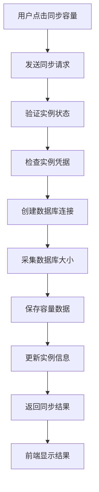
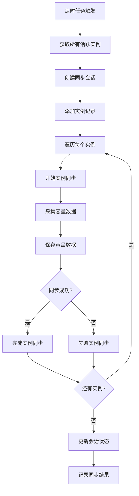

# 容量同步功能技术文档

## 1. 功能概述

### 1.1 功能描述
容量同步功能是鲸落系统的重要功能之一，用于从各种数据库实例中采集和同步数据库大小信息。该功能支持多种数据库类型，提供定时同步和手动同步两种模式，并集成到会话管理系统中进行统一跟踪。

### 1.2 主要特性
- **多数据库支持**：支持MySQL、SQL Server、PostgreSQL、Oracle
- **定时同步**：每日自动采集所有实例的容量信息
- **手动同步**：支持单个实例的即时容量同步
- **会话管理**：集成到统一的同步会话管理系统
- **软删除机制**：支持数据库的软删除和恢复
- **详细统计**：提供容量统计和趋势分析

### 1.3 技术特点
- 基于连接工厂的数据库连接管理
- 统一的容量采集服务接口
- 软删除机制保证数据完整性
- 会话管理和状态跟踪
- 详细的日志记录和错误处理

## 2. 技术架构

### 2.1 整体架构
```
┌─────────────────┐    ┌─────────────────┐    ┌─────────────────┐
│   前端界面      │    │   后端API       │    │   数据库        │
│                 │    │                 │    │                 │
│ - 容量同步      │◄──►│ - 路由控制器    │◄──►│ - database_size_stats│
│ - 容量统计      │    │ - 采集服务      │    │ - sync_sessions │
│ - 容量监控      │    │ - 定时任务      │    │ - instances     │
└─────────────────┘    └─────────────────┘    └─────────────────┘
```

### 2.2 模块关系
- **前端模块**：实例管理页面、容量同步操作、容量统计显示
- **后端模块**：容量采集服务、定时任务调度、会话管理服务
- **数据模块**：容量统计模型、同步会话模型、实例模型

## 3. 前端实现

### 3.1 页面结构
- **主页面**：`app/templates/instances/list.html`（包含容量同步按钮）
- **详情页面**：`app/templates/instances/detail.html`（包含容量同步功能）
- **样式文件**：`app/static/css/pages/instances/list.css`、`app/static/css/pages/instances/detail.css`
- **脚本文件**：`app/static/js/pages/instances/list.js`、`app/static/js/pages/instances/detail.js`

### 3.2 核心组件

#### 3.2.1 容量同步按钮组件
```html
<!-- 实例列表中的容量同步按钮 -->
<button class="btn btn-outline-info btn-sm" 
        onclick="syncCapacity({{ instance.id }}, '{{ instance.name }}')"
        title="同步容量">
    <i class="fas fa-database me-1"></i>同步容量
</button>
```

#### 3.2.2 容量统计显示组件
```html
<!-- 容量统计信息 -->
<div class="col-md-3">
    <div class="card bg-info text-white">
        <div class="card-body">
            <div class="d-flex justify-content-between">
                <div>
                    <h4 class="mb-0">{{ instance.total_size_mb or 0 }}</h4>
                    <small>总容量 (MB)</small>
                </div>
                <div class="align-self-center">
                    <i class="fas fa-database fa-2x"></i>
                </div>
            </div>
        </div>
    </div>
</div>
```

### 3.3 关键JavaScript函数

#### 3.3.1 容量同步函数
```javascript
// 同步容量
function syncCapacity(instanceId, instanceName) {
    const btn = event.target.closest('button');
    const originalHtml = btn.innerHTML;

    btn.innerHTML = '<i class="fas fa-spinner fa-spin"></i>';
    btn.disabled = true;

    // 获取CSRF token
    const csrfToken = getCSRFToken();

    const headers = {
        'Content-Type': 'application/json',
    };

    if (csrfToken) {
        headers['X-CSRFToken'] = csrfToken;
    }

    // 记录操作开始日志
    logUserAction('开始同步实例容量', {
        operation: 'sync_instance_capacity',
        instance_id: instanceId,
        instance_name: instanceName
    });

    fetch(`/database-sizes/instances/${instanceId}/sync-capacity`, {
        method: 'POST',
        headers: headers
    })
    .then(response => response.json())
    .then(data => {
        if (data.success) {
            // 记录成功日志
            logUserAction('同步实例容量成功', {
                operation: 'sync_instance_capacity',
                instance_id: instanceId,
                instance_name: instanceName,
                result: 'success',
                message: data.message,
                data: data.data
            });
            
            showAlert('success', data.message);
            
            // 刷新页面以更新容量显示
            setTimeout(() => {
                location.reload();
            }, 1500);
        } else {
            // 记录失败日志
            logError('同步实例容量失败', {
                operation: 'sync_instance_capacity',
                instance_id: instanceId,
                instance_name: instanceName,
                result: 'failed',
                error: data.error
            });
            showAlert('danger', data.error);
        }
    })
    .catch(error => {
        // 记录异常日志
        logErrorWithContext('同步实例容量异常', {
            operation: 'sync_instance_capacity',
            instance_id: instanceId,
            instance_name: instanceName,
            error: error.message
        });
        showAlert('danger', '同步容量失败');
    })
    .finally(() => {
        btn.innerHTML = originalHtml;
        btn.disabled = false;
    });
}
```

#### 3.3.2 容量统计加载函数
```javascript
// 加载实例总容量
function loadInstanceTotalSizes() {
    fetch('/instances/api/instances/total-sizes')
        .then(response => response.json())
        .then(data => {
            if (data.success) {
                updateInstanceSizeDisplays(data.data);
            }
        })
        .catch(error => {
            console.error('加载容量统计失败:', error);
        });
}

// 更新容量显示
function updateInstanceSizeDisplays(sizeData) {
    sizeData.forEach(instance => {
        const sizeElement = document.querySelector(`[data-instance-id="${instance.instance_id}"] .instance-size`);
        if (sizeElement) {
            sizeElement.textContent = `${instance.total_size_mb} MB`;
        }
    });
}
```

### 3.4 样式设计

#### 3.4.1 容量同步按钮样式
```css
.btn-sync-capacity {
    background-color: #17a2b8;
    border-color: #17a2b8;
    color: white;
    transition: all 0.3s ease;
}

.btn-sync-capacity:hover {
    background-color: #138496;
    border-color: #117a8b;
    transform: translateY(-1px);
    box-shadow: 0 2px 4px rgba(0,0,0,0.2);
}

.btn-sync-capacity:disabled {
    background-color: #6c757d;
    border-color: #6c757d;
    cursor: not-allowed;
}
```

#### 3.4.2 容量统计卡片样式
```css
.capacity-stats-card {
    background: linear-gradient(135deg, #17a2b8 0%, #6f42c1 100%);
    color: white;
    border: none;
    border-radius: 0.5rem;
    box-shadow: 0 4px 6px rgba(0,0,0,0.1);
    transition: all 0.3s ease;
}

.capacity-stats-card:hover {
    transform: translateY(-2px);
    box-shadow: 0 6px 12px rgba(0,0,0,0.15);
}

.capacity-stats-card .card-body {
    padding: 1.5rem;
}

.capacity-stats-number {
    font-size: 2rem;
    font-weight: bold;
    margin-bottom: 0.5rem;
}

.capacity-stats-label {
    font-size: 0.9rem;
    opacity: 0.9;
}
```

## 4. 后端实现

### 4.1 路由控制器
**文件**：`app/routes/instances.py`

#### 4.1.1 单实例容量同步API
```python
@database_sizes_bp.route("/instances/<int:instance_id>/sync-capacity", methods=['POST'])
@login_required
@update_required
def sync_instance_capacity(instance_id: int) -> Response:
    """
    同步指定实例的数据库容量信息
    
    Args:
        instance_id: 实例ID
        
    Returns:
        JSON: 同步结果
    """
    
    try:
        # 获取实例信息
        instance = Instance.query.get_or_404(instance_id)
        
        if not instance.is_active:
            log_error(f"实例 {instance.name} 已禁用，无法同步容量信息", module="instances", instance_id=instance_id)
            return jsonify({
                'success': False, 
                'error': '实例已禁用，无法同步容量信息'
            }), 400
        
        # 检查实例是否有凭据
        if not instance.credential:
            log_error(f"实例 {instance.name} 缺少连接凭据，无法同步容量信息", module="instances", instance_id=instance_id)
            return jsonify({
                'success': False, 
                'error': '实例缺少连接凭据，无法同步容量信息'
            }), 400
        
        log_info(f"开始同步实例容量信息", module="instances", instance_id=instance_id, instance_name=instance.name)
        
        # 调用数据库大小采集服务
        from app.services.database_size_collector_service import DatabaseSizeCollectorService
        
        collector = DatabaseSizeCollectorService(instance)
        
        # 建立连接
        if not collector.connect():
            error_msg = f"无法连接到实例 {instance.name} (类型: {instance.db_type})"
            log_error(error_msg, module="instances", instance_id=instance_id, 
                     instance_name=instance.name, db_type=instance.db_type)
            return jsonify({
                'success': False, 
                'error': error_msg
            }), 400
        
        try:
            # 采集数据库大小数据
            data = collector.collect_database_sizes()
            
            # 保存数据
            saved_count = collector.save_collected_data(data)
            total_size_mb = sum(item.get('size_mb', 0) for item in data)
            
            # 更新实例的最后连接时间
            from app.utils.timezone import now
            instance.last_connected = now()
            db.session.commit()
            
            log_info(f"实例 {instance.name} 容量同步成功", module="instances", 
                    instance_id=instance_id, instance_name=instance.name,
                    databases_count=len(data), saved_count=saved_count, total_size_mb=total_size_mb)
            
            return jsonify({
                'success': True,
                'message': f'容量同步成功，采集了 {saved_count} 条记录',
                'data': {
                    'saved_count': saved_count,
                    'databases_count': len(data),
                    'total_size_mb': total_size_mb,
                    'instance_id': instance_id,
                    'instance_name': instance.name
                }
            })
            
        finally:
            # 确保断开连接
            collector.disconnect()
            
    except Exception as e:
        log_error(f"同步实例 {instance_id} 容量失败: {str(e)}", module="instances", 
                 instance_id=instance_id, error=str(e), exc_info=True)
        return jsonify({
            'success': False,
            'error': f'同步容量失败: {str(e)}'
        }), 500
```

### 4.2 服务层

#### 4.2.1 数据库大小采集服务
**文件**：`app/services/database_size_collector_service.py`

```python
class DatabaseSizeCollectorService:
    """数据库大小采集服务"""
    
    def __init__(self, instance: Instance):
        """
        初始化采集服务
        
        Args:
            instance: 数据库实例对象
        """
        self.instance = instance
        self.db_connection = None
        self.logger = logger
    
    def connect(self) -> bool:
        """
        连接到数据库实例
        
        Returns:
            bool: 连接是否成功
        """
        try:
            # 使用连接工厂创建连接
            self.db_connection = ConnectionFactory.create_connection(self.instance)
            if not self.db_connection:
                raise ValueError(f"不支持的数据库类型: {self.instance.db_type}")
            
            # 建立连接
            success = self.db_connection.connect()
            if success:
                self.logger.info(f"成功连接到实例 {self.instance.name} ({self.instance.db_type})")
            else:
                self.logger.error(f"连接实例 {self.instance.name} 失败")
            
            return success
            
        except Exception as e:
            self.logger.error(f"连接实例 {self.instance.name} 失败: {str(e)}")
            return False
    
    def collect_database_sizes(self) -> List[Dict[str, Any]]:
        """
        采集数据库大小数据
        
        Returns:
            List[Dict[str, Any]]: 采集到的数据列表
        """
        if not self.db_connection or not self.db_connection.is_connected:
            raise RuntimeError("数据库连接未建立")
        
        try:
            if self.instance.db_type.lower() == 'mysql':
                return self._collect_mysql_sizes()
            elif self.instance.db_type.lower() == 'sqlserver':
                return self._collect_sqlserver_sizes()
            elif self.instance.db_type.lower() == 'postgresql':
                return self._collect_postgresql_sizes()
            elif self.instance.db_type.lower() == 'oracle':
                return self._collect_oracle_sizes()
            else:
                raise ValueError(f"不支持的数据库类型: {self.instance.db_type}")
                
        except Exception as e:
            self.logger.error(f"采集实例 {self.instance.name} 数据库大小时出错: {str(e)}")
            raise
    
    def _collect_mysql_sizes(self) -> List[Dict[str, Any]]:
        """采集 MySQL 数据库大小"""
        try:
            # 首先测试权限
            test_query = "SELECT COUNT(*) FROM information_schema.SCHEMATA"
            test_result = self.db_connection.execute_query(test_query)
            if not test_result:
                self.logger.error("MySQL 权限测试失败：无法访问 information_schema.SCHEMATA")
                return []
            
            self.logger.info(f"MySQL 权限测试通过，发现 {test_result[0][0]} 个数据库")
            
            # 使用统计表方式查询所有数据库大小
            query = """
                SELECT
                    s.SCHEMA_NAME AS database_name,
                    COALESCE(ROUND(SUM(COALESCE(t.data_length, 0) + COALESCE(t.index_length, 0)) / 1024 / 1024, 2), 0) AS total_size_mb,
                    COALESCE(ROUND(SUM(COALESCE(t.data_length, 0)) / 1024 / 1024, 2), 0) AS data_size_mb,
                    COALESCE(ROUND(SUM(COALESCE(t.index_length, 0)) / 1024 / 1024, 2), 0) AS index_size_mb
                FROM
                    information_schema.SCHEMATA s
                LEFT JOIN
                    information_schema.tables t ON s.SCHEMA_NAME = t.table_schema
                GROUP BY
                    s.SCHEMA_NAME
                ORDER BY
                    total_size_mb DESC
            """
            
            result = self.db_connection.execute_query(query)
            self.logger.info(f"MySQL 查询结果: {len(result) if result else 0} 行数据")
            
            if not result:
                error_msg = "MySQL 未查询到任何数据库大小数据"
                self.logger.error(error_msg)
                raise ValueError(error_msg)
            
            data = []
            for row in result:
                db_name = row[0]
                total_size = float(row[1] or 0)  # 总大小 = 数据大小 + 索引大小
                data_size = float(row[2] or 0)   # 数据大小
                index_size = float(row[3] or 0)  # 索引大小
                
                # 判断是否为系统数据库
                is_system_db = db_name in ('information_schema', 'performance_schema', 'mysql', 'sys')
                db_type = "系统数据库" if is_system_db else "用户数据库"
                
                data.append({
                    'database_name': db_name,
                    'size_mb': int(total_size),
                    'data_size_mb': int(data_size),
                    'log_size_mb': None,  # MySQL 没有单独的日志文件大小
                    'collected_date': date.today(),
                    'collected_at': datetime.utcnow(),
                    'is_system': is_system_db
                })
                
                self.logger.info(f"{db_type} {db_name}: 总大小 {total_size:.2f}MB, 数据 {data_size:.2f}MB, 索引 {index_size:.2f}MB")
            
            self.logger.info(f"MySQL 实例 {self.instance.name} 采集到 {len(data)} 个数据库")
            return data
            
        except Exception as e:
            self.logger.error(f"MySQL 数据库大小采集失败: {str(e)}", exc_info=True)
            raise ValueError(f"MySQL 采集失败: {str(e)}")
    
    def save_collected_data(self, data: List[Dict[str, Any]]) -> int:
        """
        保存采集到的数据，实现软删除机制
        
        Args:
            data: 采集到的数据列表
            
        Returns:
            int: 保存的记录数量
        """
        if not data:
            return 0
        
        # 获取当前采集到的数据库名称列表
        current_databases = {item['database_name'] for item in data}
        
        # 获取今天已存在的所有数据库记录
        today = date.today()
        existing_records = DatabaseSizeStat.query.filter_by(
            instance_id=self.instance.id,
            collected_date=today
        ).all()
        
        # 标记已删除的数据库
        deleted_count = 0
        for record in existing_records:
            if record.database_name not in current_databases and not record.is_deleted:
                record.is_deleted = True
                record.deleted_at = datetime.utcnow()
                deleted_count += 1
                self.logger.info(f"标记数据库 {record.database_name} 为已删除")
        
        # 保存或更新当前采集的数据
        saved_count = 0
        for item in data:
            try:
                # 检查是否已存在相同日期的记录
                existing = DatabaseSizeStat.query.filter_by(
                    instance_id=self.instance.id,
                    database_name=item['database_name'],
                    collected_date=item['collected_date']
                ).first()
                
                if existing:
                    # 更新现有记录
                    existing.size_mb = item['size_mb']
                    existing.data_size_mb = item['data_size_mb']
                    existing.log_size_mb = item['log_size_mb']
                    existing.collected_at = item['collected_at']
                    # 如果之前被标记为删除，现在恢复
                    if existing.is_deleted:
                        existing.is_deleted = False
                        existing.deleted_at = None
                        self.logger.info(f"恢复数据库 {item['database_name']} 为在线状态")
                else:
                    # 创建新记录
                    new_stat = DatabaseSizeStat(
                        instance_id=self.instance.id,
                        database_name=item['database_name'],
                        size_mb=item['size_mb'],
                        data_size_mb=item['data_size_mb'],
                        log_size_mb=item['log_size_mb'],
                        collected_date=item['collected_date'],
                        collected_at=item['collected_at'],
                        is_deleted=False
                    )
                    db.session.add(new_stat)
                
                saved_count += 1
                
            except Exception as e:
                self.logger.error(f"保存数据库大小数据失败: {str(e)}")
                continue
        
        try:
            db.session.commit()
            self.logger.info(f"成功保存 {saved_count} 条数据库大小记录，标记 {deleted_count} 个数据库为已删除")
        except Exception as e:
            db.session.rollback()
            self.logger.error(f"提交数据库大小数据失败: {str(e)}")
            raise
        
        return saved_count
```

### 4.3 定时任务

#### 4.3.1 容量同步定时任务
**文件**：`app/tasks/database_size_collection_tasks.py`

```python
def collect_database_sizes():
    """
    容量同步定时任务
    每天凌晨3点执行，同步所有活跃实例的数据库容量信息
    """
    from app.services.sync_session_service import sync_session_service
    from app.utils.timezone import now
    from app.utils.structlog_config import get_sync_logger
    
    sync_logger = get_sync_logger()
    
    try:
        sync_logger.info("开始容量同步任务", module="capacity_sync")
        
        # 获取所有活跃的实例
        active_instances = Instance.query.filter_by(is_active=True).all()
        
        if not active_instances:
            sync_logger.warning("没有找到活跃的数据库实例", module="capacity_sync")
            return {
                'success': True,
                'message': '没有活跃的数据库实例需要同步',
                'instances_processed': 0,
                'total_size_mb': 0
            }
        
        sync_logger.info(
            "找到活跃实例，开始容量同步",
            module="capacity_sync",
            instance_count=len(active_instances)
        )
        
        # 创建同步会话
        session = sync_session_service.create_session(
            sync_type="scheduled_task",
            sync_category="capacity",
            created_by=None  # 定时任务没有创建者
        )
        
        sync_logger.info(
            "创建容量同步会话",
            module="capacity_sync",
            session_id=session.session_id,
            instance_count=len(active_instances)
        )
        
        # 添加实例记录
        instance_ids = [inst.id for inst in active_instances]
        records = sync_session_service.add_instance_records(session.session_id, instance_ids)
        session.total_instances = len(active_instances)
        
        total_synced = 0
        total_failed = 0
        total_size_mb = 0
        results = []
        
        for i, instance in enumerate(active_instances):
            # 找到对应的记录
            record = records[i] if i < len(records) else None
            if not record:
                continue
            
            try:
                # 开始实例同步
                sync_session_service.start_instance_sync(record.id)
                
                sync_logger.info(
                    f"开始同步实例容量: {instance.name}",
                    module="capacity_sync",
                    session_id=session.session_id,
                    instance_id=instance.id,
                    instance_name=instance.name,
                    db_type=instance.db_type
                )
                
                # 调用数据库大小采集服务
                from app.services.database_size_collector_service import DatabaseSizeCollectorService
                
                collector = DatabaseSizeCollectorService(instance)
                
                # 建立连接
                if not collector.connect():
                    error_msg = f"无法连接到实例 {instance.name}"
                    sync_logger.error(
                        error_msg,
                        module="capacity_sync",
                        session_id=session.session_id,
                        instance_id=instance.id,
                        instance_name=instance.name
                    )
                    sync_session_service.fail_instance_sync(record.id, error_msg)
                    total_failed += 1
                    results.append({
                        'instance_id': instance.id,
                        'instance_name': instance.name,
                        'success': False,
                        'error': error_msg
                    })
                    continue
                
                try:
                    # 采集数据库大小数据
                    data = collector.collect_database_sizes()
                    
                    # 保存数据
                    saved_count = collector.save_collected_data(data)
                    instance_size_mb = sum(item.get('size_mb', 0) for item in data)
                    total_size_mb += instance_size_mb
                    
                    # 更新实例的最后连接时间
                    instance.last_connected = now()
                    
                    # 完成实例同步
                    sync_session_service.complete_instance_sync(
                        record.id,
                        accounts_synced=len(data),  # 使用数据库数量作为同步数量
                        accounts_created=saved_count,  # 新创建的记录数
                        accounts_updated=0,  # 容量同步没有更新概念
                        accounts_deleted=0,  # 容量同步没有删除概念
                        sync_details={
                            'databases_count': len(data),
                            'saved_count': saved_count,
                            'total_size_mb': instance_size_mb
                        }
                    )
                    
                    total_synced += 1
                    results.append({
                        'instance_id': instance.id,
                        'instance_name': instance.name,
                        'success': True,
                        'databases_count': len(data),
                        'saved_count': saved_count,
                        'total_size_mb': instance_size_mb
                    })
                    
                    sync_logger.info(
                        f"实例 {instance.name} 容量同步完成",
                        module="capacity_sync",
                        session_id=session.session_id,
                        instance_id=instance.id,
                        instance_name=instance.name,
                        databases_count=len(data),
                        saved_count=saved_count,
                        total_size_mb=instance_size_mb
                    )
                    
                finally:
                    # 确保断开连接
                    collector.disconnect()
                    
            except Exception as e:
                total_failed += 1
                sync_logger.error(
                    f"实例 {instance.name} 容量同步失败",
                    module="capacity_sync",
                    session_id=session.session_id,
                    instance_id=instance.id,
                    instance_name=instance.name,
                    error=str(e),
                    exc_info=True
                )
                
                # 标记实例同步失败
                if 'record' in locals() and record:
                    sync_session_service.fail_instance_sync(record.id, str(e))
                
                results.append({
                    'instance_id': instance.id,
                    'instance_name': instance.name,
                    'success': False,
                    'error': str(e)
                })
        
        # 更新会话状态
        session.successful_instances = total_synced
        session.failed_instances = total_failed
        session.status = "completed" if total_failed == 0 else "failed"
        session.completed_at = now()
        db.session.commit()
        
        result = {
            'success': total_failed == 0,
            'message': f'容量同步完成: 成功 {total_synced} 个，失败 {total_failed} 个',
            'instances_processed': total_synced,
            'total_size_mb': total_size_mb,
            'session_id': session.session_id,
            'details': results
        }
        
        sync_logger.info(
            "容量同步任务完成",
            module="capacity_sync",
            session_id=session.session_id,
            total_instances=len(active_instances),
            successful_instances=total_synced,
            failed_instances=total_failed,
            total_size_mb=total_size_mb
        )
        
        return result
        
    except Exception as e:
        sync_logger.error(
            "容量同步任务执行失败",
            module="capacity_sync",
            error=str(e),
            exc_info=True
        )
        
        # 更新会话状态为失败
        if 'session' in locals() and session:
            session.status = "failed"
            session.completed_at = now()
            session.failed_instances = len(active_instances) if 'active_instances' in locals() else 0
            db.session.commit()
        
        return {
            'success': False,
            'message': f'容量同步任务执行失败: {str(e)}',
            'error': str(e)
        }
```

## 5. 数据库设计

### 5.1 表结构

#### 5.1.1 数据库大小统计表 (database_size_stats)
```sql
CREATE TABLE database_size_stats (
    id SERIAL PRIMARY KEY,
    instance_id INTEGER NOT NULL REFERENCES instances(id),
    database_name VARCHAR(255) NOT NULL,
    size_mb INTEGER NOT NULL DEFAULT 0,
    data_size_mb INTEGER DEFAULT 0,
    log_size_mb INTEGER DEFAULT 0,
    collected_date DATE NOT NULL,
    collected_at TIMESTAMP WITH TIME ZONE DEFAULT NOW(),
    is_deleted BOOLEAN DEFAULT FALSE,
    deleted_at TIMESTAMP WITH TIME ZONE,
    created_at TIMESTAMP WITH TIME ZONE DEFAULT NOW(),
    updated_at TIMESTAMP WITH TIME ZONE DEFAULT NOW()
);
```

#### 5.1.2 实例表 (instances)
```sql
CREATE TABLE instances (
    id SERIAL PRIMARY KEY,
    name VARCHAR(255) NOT NULL UNIQUE,
    db_type VARCHAR(50) NOT NULL,
    host VARCHAR(255) NOT NULL,
    port INTEGER,
    is_active BOOLEAN DEFAULT TRUE,
    last_connected TIMESTAMP WITH TIME ZONE,
    total_size_mb INTEGER DEFAULT 0,
    created_at TIMESTAMP WITH TIME ZONE DEFAULT NOW(),
    updated_at TIMESTAMP WITH TIME ZONE DEFAULT NOW()
);
```

### 5.2 索引设计
```sql
-- 数据库大小统计表索引
CREATE INDEX idx_database_size_stats_instance_id ON database_size_stats(instance_id);
CREATE INDEX idx_database_size_stats_collected_date ON database_size_stats(collected_date);
CREATE INDEX idx_database_size_stats_database_name ON database_size_stats(database_name);
CREATE INDEX idx_database_size_stats_is_deleted ON database_size_stats(is_deleted);

-- 实例表索引
CREATE INDEX idx_instances_db_type ON instances(db_type);
CREATE INDEX idx_instances_is_active ON instances(is_active);
CREATE INDEX idx_instances_last_connected ON instances(last_connected);
```

## 6. 核心功能流程

### 6.1 单实例容量同步流程


### 6.2 定时容量同步流程


## 7. 关键函数说明

### 7.1 前端关键函数
- `syncCapacity(instanceId, instanceName)`: 同步实例容量
- `loadInstanceTotalSizes()`: 加载实例总容量
- `updateInstanceSizeDisplays(sizeData)`: 更新容量显示
- `showAlert(type, message)`: 显示提示信息

### 7.2 后端关键函数
- `sync_instance_capacity(instance_id)`: 同步单个实例容量
- `collect_database_sizes()`: 定时容量同步任务
- `collect_database_sizes()`: 采集数据库大小数据
- `save_collected_data(data)`: 保存采集的数据
- `_collect_mysql_sizes()`: 采集MySQL容量
- `_collect_sqlserver_sizes()`: 采集SQL Server容量
- `_collect_postgresql_sizes()`: 采集PostgreSQL容量
- `_collect_oracle_sizes()`: 采集Oracle容量

## 8. 错误处理

### 8.1 前端错误处理
```javascript
function handleCapacitySyncError(error, defaultMessage) {
    console.error('Capacity Sync Error:', error);
    let message = defaultMessage;
    
    if (error.response && error.response.data && error.response.data.error) {
        message = error.response.data.error;
    } else if (error.message) {
        message = error.message;
    }
    
    showAlert('danger', message);
}
```

### 8.2 后端错误处理
```python
def handle_capacity_sync_error(self, error: Exception) -> str:
    """处理容量同步错误"""
    if isinstance(error, ConnectionError):
        return "数据库连接失败，请检查网络连接和实例状态"
    elif isinstance(error, TimeoutError):
        return "容量同步超时，请稍后重试"
    elif isinstance(error, PermissionError):
        return "权限不足，请检查数据库用户权限"
    elif isinstance(error, ValueError):
        return "数据格式错误，请检查实例配置"
    else:
        return f"容量同步失败: {str(error)}"
```

## 9. 性能优化

### 9.1 数据库优化
- 容量统计表索引优化
- 软删除机制减少数据量
- 批量操作优化

### 9.2 采集优化
- 连接池管理
- 超时控制
- 错误重试机制

### 9.3 前端优化
- 容量数据缓存
- 异步加载
- 实时更新

## 10. 调试指南

### 10.1 容量同步失败调试
1. 检查数据库连接状态
2. 验证实例配置信息
3. 查看容量同步日志
4. 检查权限和网络

### 10.2 数据采集调试
1. 监控采集耗时
2. 分析数据库查询性能
3. 检查数据格式
4. 验证软删除机制

### 10.3 常见问题排查
- 数据库连接超时
- 权限不足错误
- 数据格式不匹配
- 软删除状态异常

---

**文档版本**：1.0.0  
**最后更新**：2025-01-28  
**维护人员**：开发团队
